# Basic2 pentesting

## 1.寻找靶机

```
nmap -sn 192.168.174.0/24
```

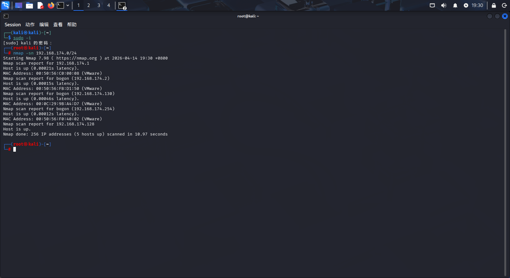


## 2.进行初步扫描

```
nmap -sT -sV -sC -O -p- --min-rate 10000 192.168.174.130
```

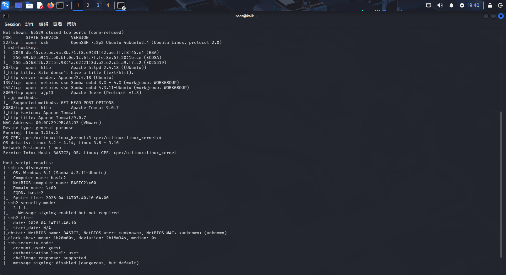

得到端口22，80，139，445，8009，8080开放

## 3.进行分析，初步渗透

- 139&445端口

版本是Samba4.3.11（永恒之蓝的linux表兄弟SambaCry）.并且根据默认脚本分析

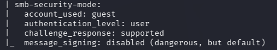

系统允许了guest账号，这说明他不需要密码就能访问共享，SambaCry的利用条件之一是：需要一个可写的共享文件夹，说明可以触发漏洞

- 8009端口

服务是ajp13；

AJP是Apache和Tomcat之间的内部通信协议，正常架构是：用户 -> Apache (80) -> AJP (8009) -> Tomcat (8080)

- 8080端口

爆破目录，可以作为没有特别明显思路的第二选择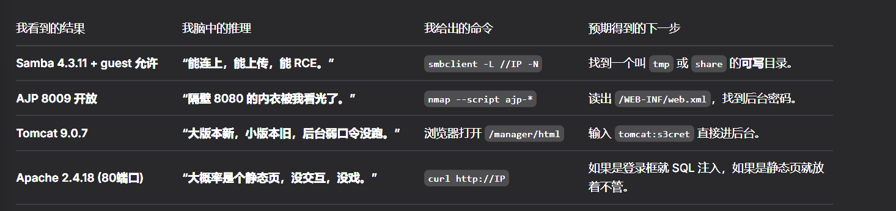

## 4.开始攻击

我先尝试访问共享文件夹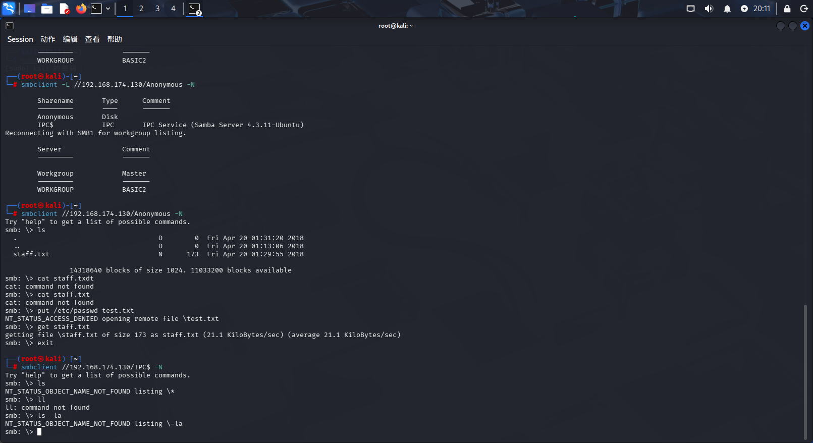

```
smbclient -L //192.168.174.130 -N
```

发现里面有两个

```
smbclient //192.168.174.130/Anonymous -N
```

发现staff.txt

```
get staff.txt
```

内容是“请不要将与工作无关的内容上传到此共享。我知道这都是开玩笑，但错误就是这样发生的。（这也包括你，Jan！）”，无用，知道两个用户名，Kay和Jan

用enum4linux从目标中提取与 SMB 相关的信息。

```
enum4linux 192.168.174.130
```

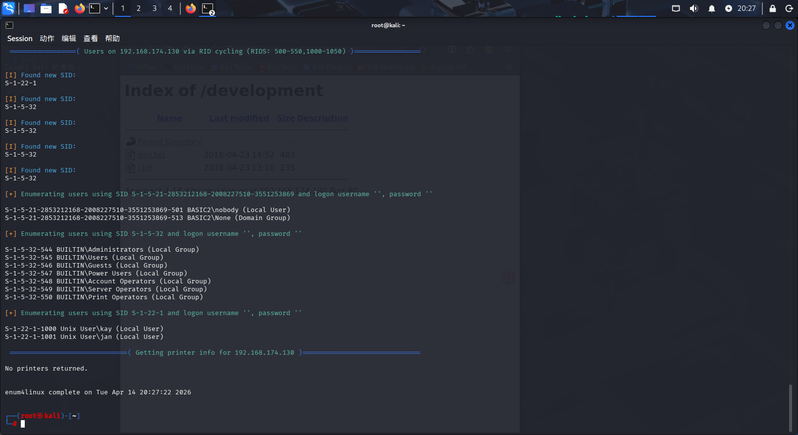

得到以下信息，jan和kay

- 进行目录爆破

```
gobuster dir -u http://102.168.174.130 -w /usr/share/wordlists/dirbuster/directory-list-2.3-medium.txt
```

发现了http://192.168.174.130/development

目录下两个文件，dev.txt和j.txt，从内容可以得知，Jan的密码较弱很容易破解哈希值，Kay比较谨慎，所以先尝试拿下Jan的账户

- 拿Jan的账户

```
hydra -l jan -P /usr/share/wordlists/rockyou.txt ssh://192.168.174.130
```

可以爆破出jan的ssh连接密码

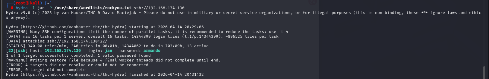

即armando

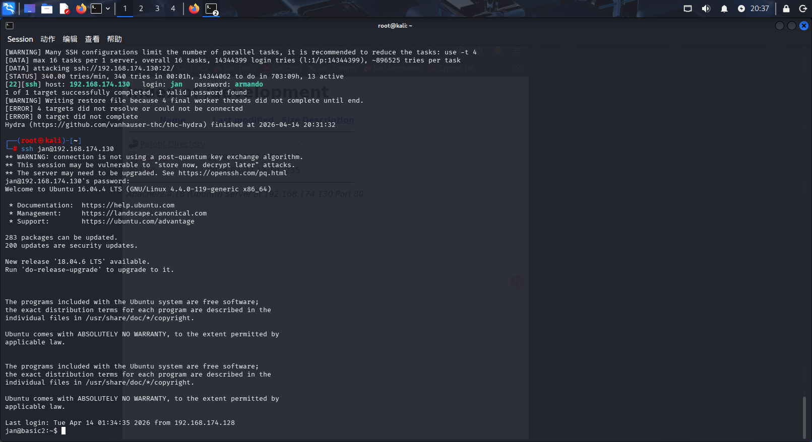

登陆成功！

发现密码什么都没有权限，/home下的kay用户有一个有趣的文件pass.bak，但是没有权限访问

使用命令

```
ls -la
```

在kay的文件找到许多隐藏文件

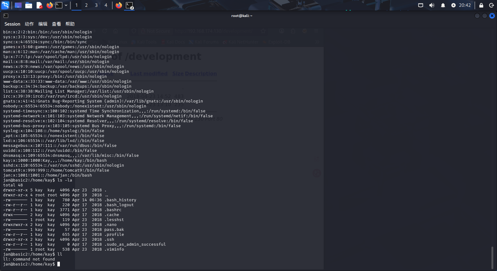

在.ssh文件夹下找到关键文件

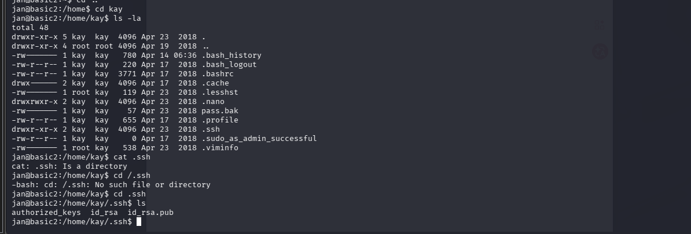

很明显，id_rsa是私钥，id_rsa.pub是公钥,authorized_keys是授权公钥列表

接下来，讲id_rsa的内容移入sshkey

用命令

```
ssh2john sshkey > hashedssh
```

用于将这个加密私钥里的哈希提取出来，变为John可以识别的哈希格式，进行下一步破解

用命令

```
john --wordlist=/usr/share/wordlists/rockyou.txt hashedssh
```

```
john --show hashedssh
```

查看爆破结果，得到密码

```
ssh -i hashedssh kay@192.168.174.130
```

进行连接

但是连接一直说“权限被拒”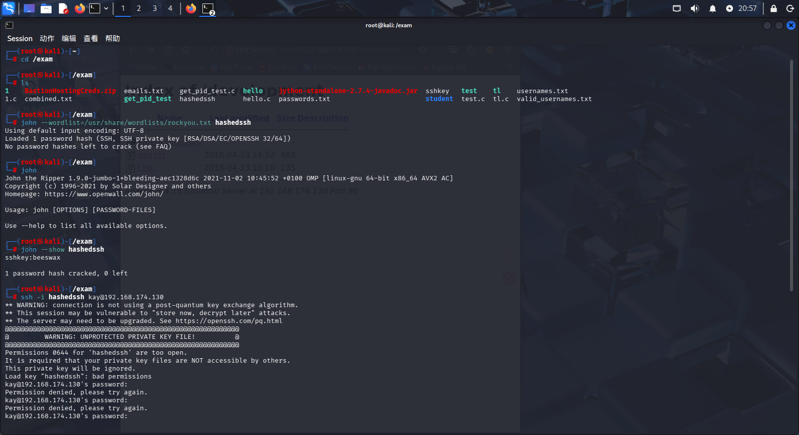

后来知道私钥有个特性，只有用户/所有者必须拥有读写权限，其他人不行，所以用命令

```
chmod 600 sshkey
```

再次进行连接

```
ssh -i sshkey kay@192.168.174.130
```

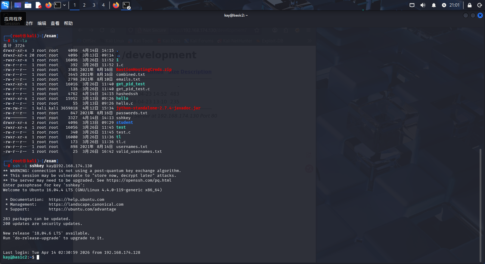

成功登录kay！

可以查看pass.bak了

```
sudo -i
```

提权，密码直接复制，成功！

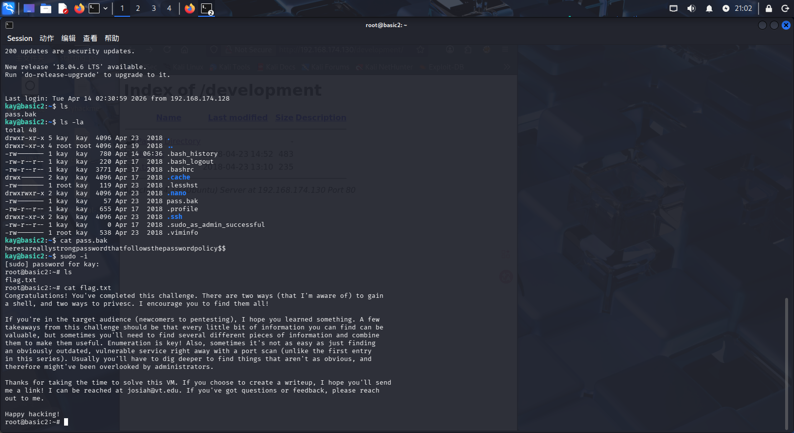