先进行端口扫描

```
nmap -p- --min-rate 10000 192.168.174.142
```

得到端口后

```
nmap -sT -sC -sV -O -p21,80,111,2049,7822,37763,44843,45117,45241 192.168.174.142 -oA /nmapscan/tcp
```

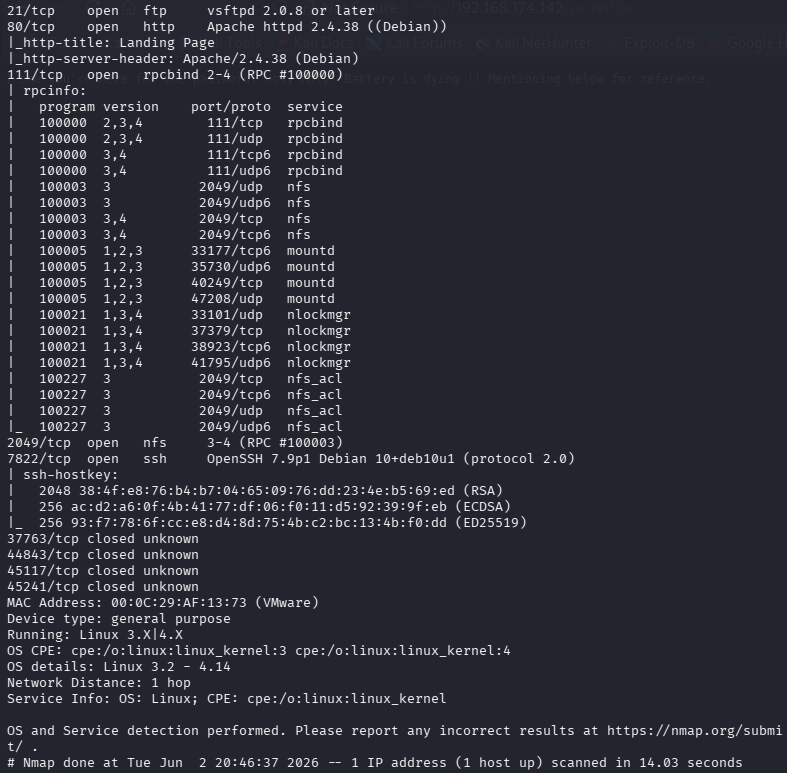

```
nmap --script=vuln -p21,80,111,2049,7822,37763,44843,45117,45241 192.168.174.142
```

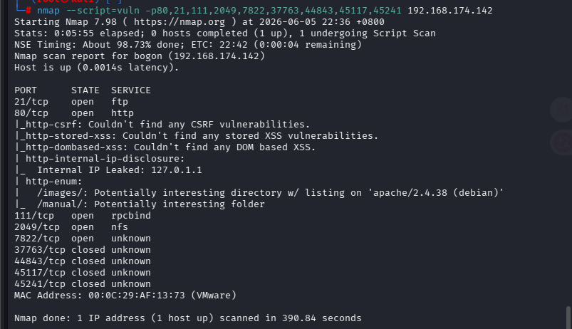

只看有两个目录，分别是/images,/manual

```
nmap -sU --min-rate 10000 --top-ports=100 192.168.174.142
```

没有什么重要信息

因为开放了21和2049端口，说明挂载可能有信息可以查看

```
show mount -e 192.168.174.144
```

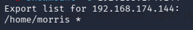

```
mount -t nfs 192.168.174.144:/home/morris /mnt/target
```

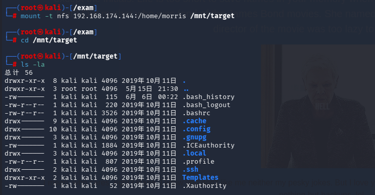

可以查看morris用户的共享文件信息

其中.ssh明显值得注意

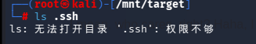

但是权限不够其他的文件也一样，只要后几位没有r权限的都无法查看

```
umount /mnt/target
```

要及时取消挂载，不然会卡死

------

80端口查看网页

这个是大概的翻译

#### 扩展下关于ftp命令的知识（21端口）

- FTP binary(二进制模式)，在使用ftp时发现有非txt文件，比如exe,zip,rar,iso,图片等等，不用binary会文件损坏，大小不一致，打不开

- ascill（默认文本模式）只传（txt,html,php,conf纯文本文件）

- 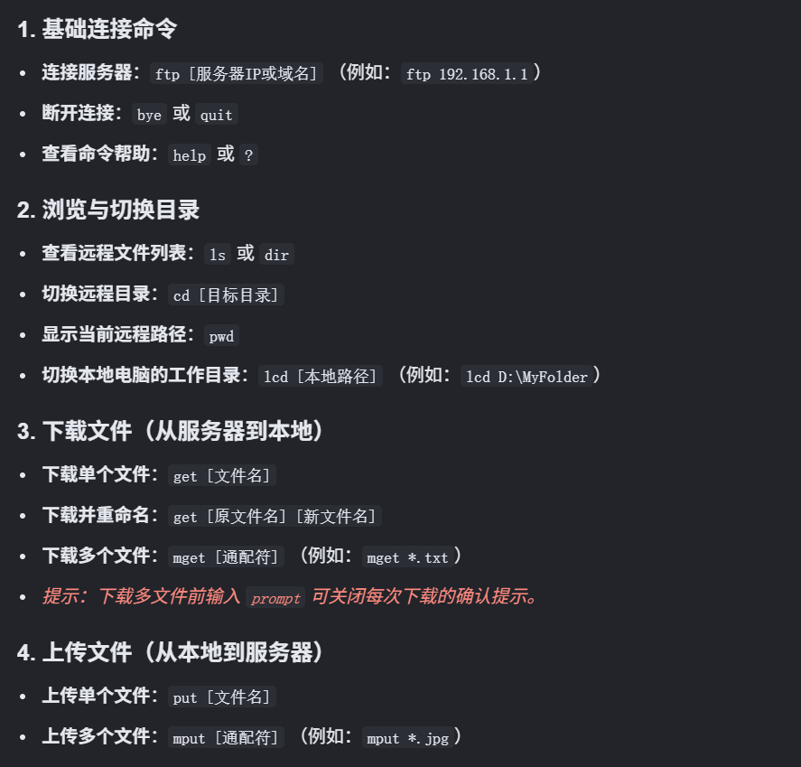

- 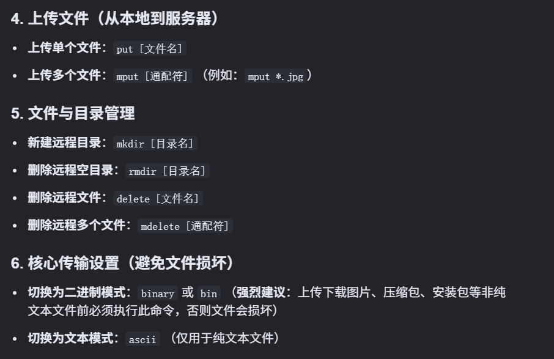

  ------

  再爆破一下目录

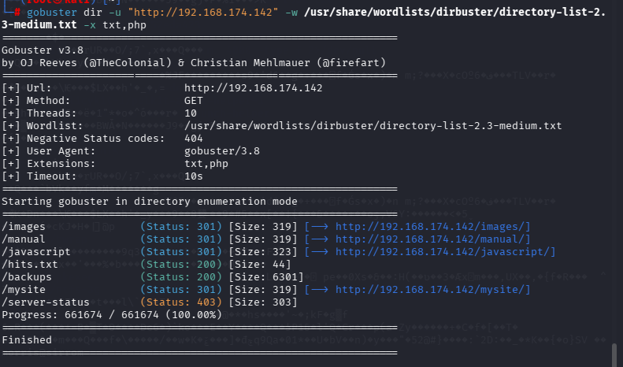

先查看hits.txt和backups

#### hits.txt

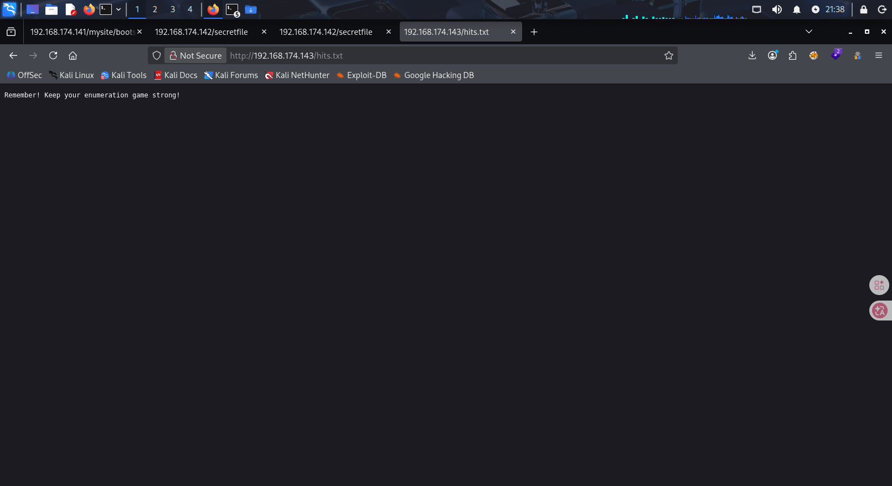

大概意思是不要放过任何一个目录

#### backups

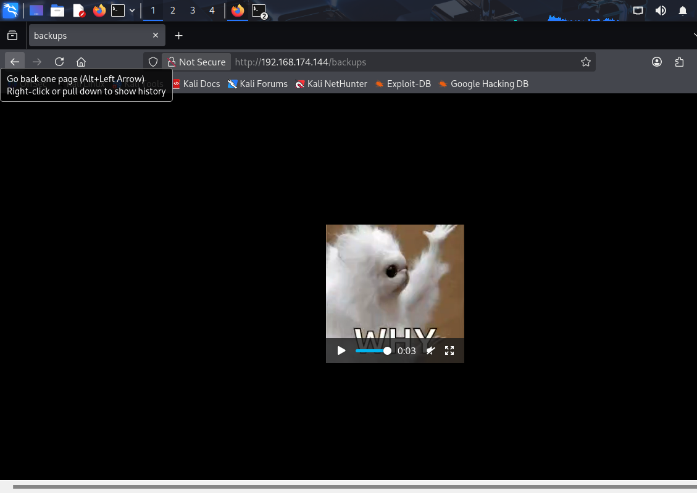

一个意义不明的视频，没有什么重要信息

接下来查看manual，images（这两个也是nmap扫描出来的目录）以及mysite

#### manual

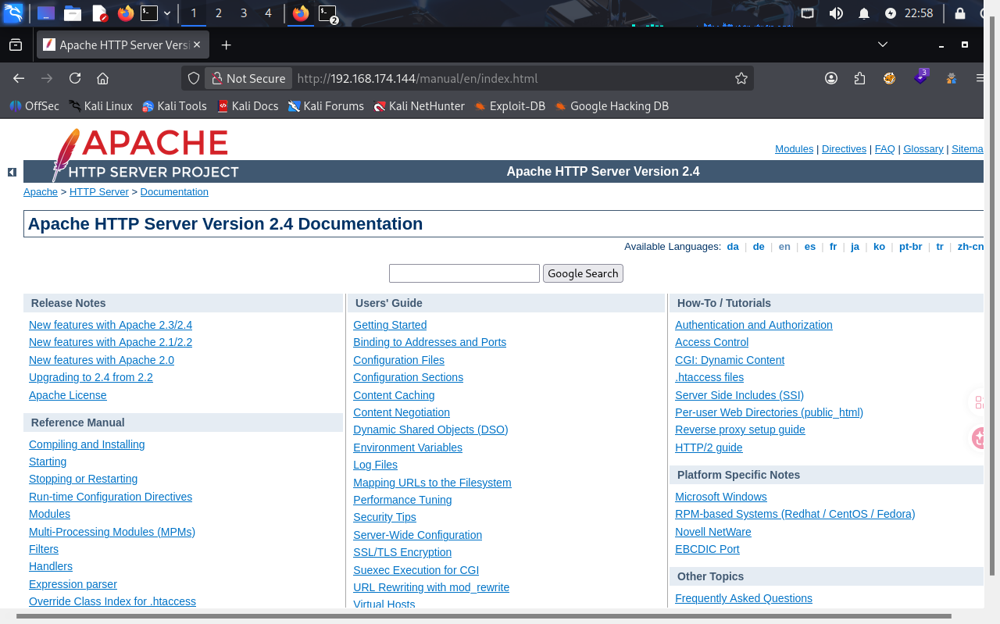

源代码中没有有用的东西，也不存在SQL注入

#### images

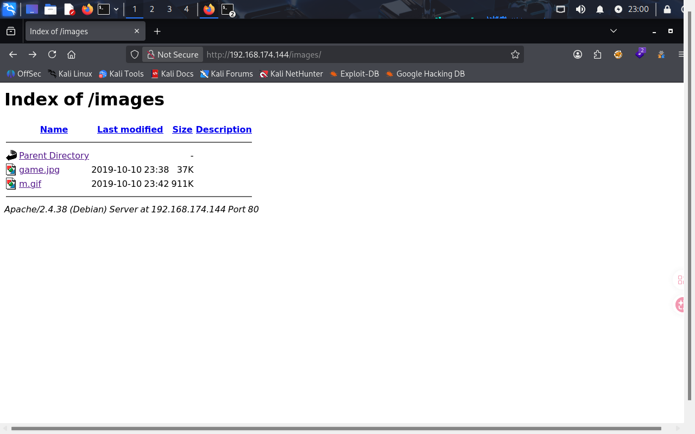

这个目录下的图片提取出来后，使用strings，exiftool都没有发现什么重要信息

#### mysite

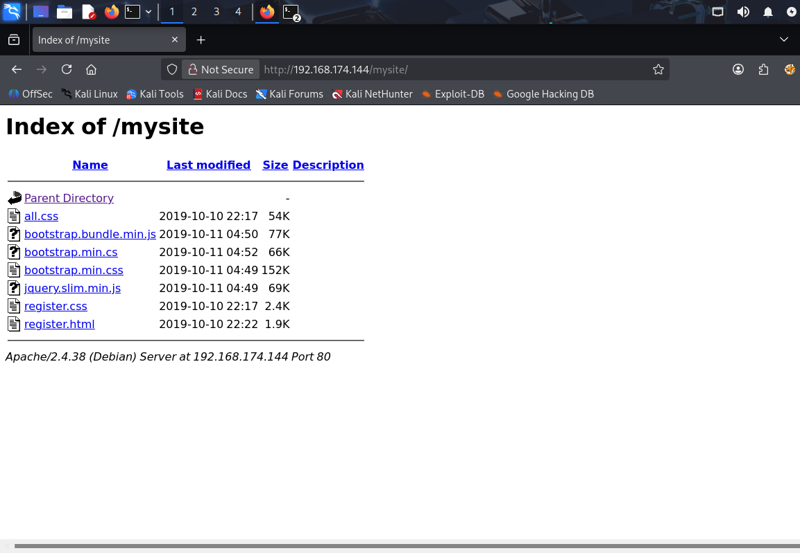

这里边有一个.cs的后缀没见过(.cs是C#源代码文件后缀)

还有一个注册网页，在注册网页没有任何可利用的地方

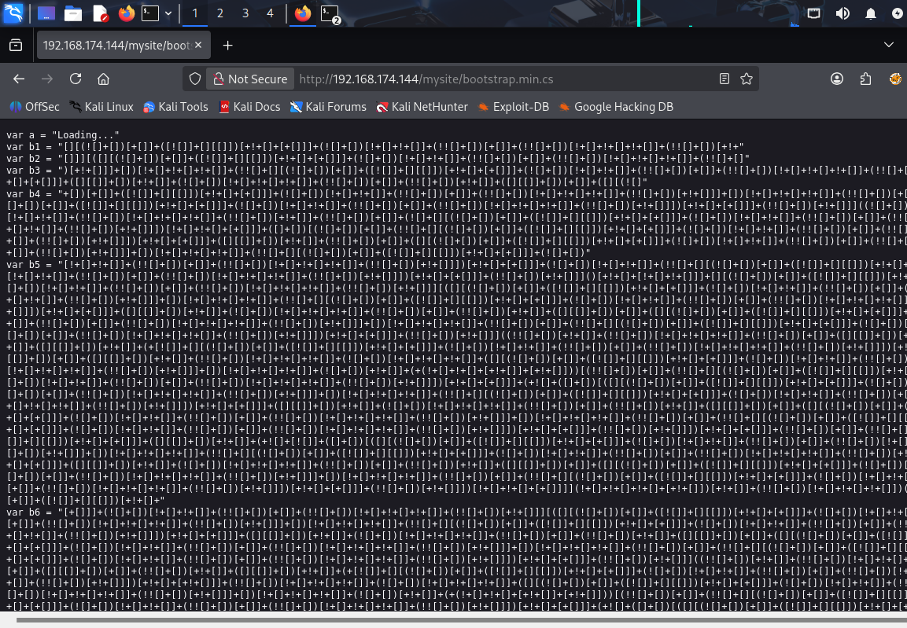

在.cs后缀这个文件中，有大量这种符号，这是JsFuck编码

- JSFuck 是一种基于 JavaScript 的深奥和教育性编程风格，它仅使用六个不同的字符来编写和执行代码。这六个字符分别是：*(*、*)*、*+*、*[*、*]* 和 *!*。JSFuck 的灵感来源于另一种编程语言 Brainfuck，它使用八种特定符号来编写代码。

- 研究 JSFuck 有以下几个意义：了解 JavaScript 语言的基本语法和词法。对代码进行伪加密，提高解码难度。防止 XSS 代码注入，因为 JSFuck 仅使用六个特定字符，很多系统不会过滤这些字符。JSFuck 是一种有趣且具有挑战性的编程风格，通过研究它可以加深对 JavaScript 的理解，并提高编码技巧。

这种编码可以通过在线工具JSFuck来进行解密

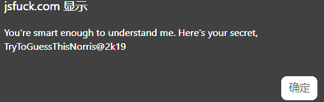

运行后会跳出这个弹窗

根据字面意思，第二行这个是我得到的信息，猜测这可能是个密码

------

根据当前我们知道的信息，有一个名为morris的用户名，有root，根据网页的内容还能推测出可能存在一个叫norris的用户，而且密码中也包含Norris，那就三个都尝试一下

```
ssh norris@192.168.174.144 -p 7822
```

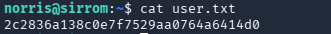

成功登录，并且拿到第一个flag

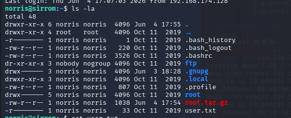

（两个root是后来得到的，这里忽略）在这个用户的目录下可以看到有一个ftp目录

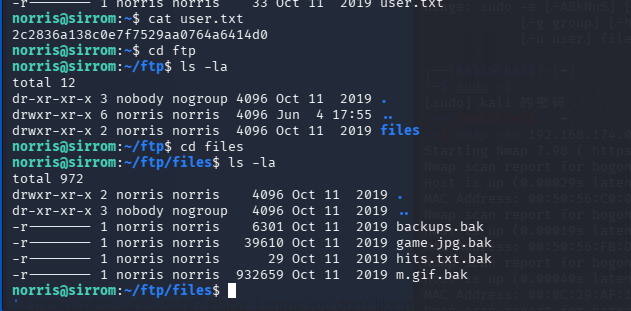

最终得到几个备份文件

现在想办法下载这些文件，因为21端口开启，可以利用

```
ftp 192.168.174.144
```

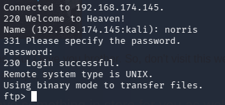

```
mget * /exam/
```

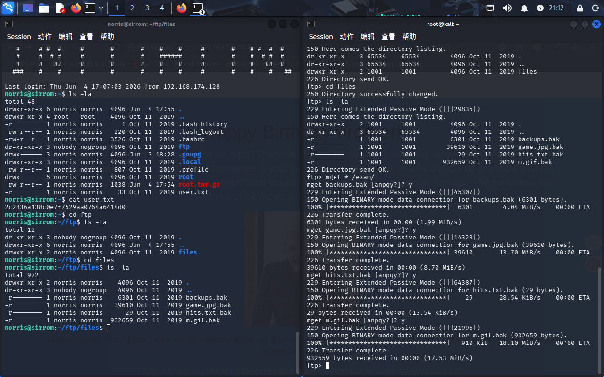

- 注意！我这里忘记了使用binary，通常下载非文本文件时要转换为binary模式（这里搞错了，应该攻击机器先切换到自己想要下载到的目录，然后再使用ftp，这样可以不用指定目录，也就是mget *）

- 使用strings发现game.jpg.bak如下

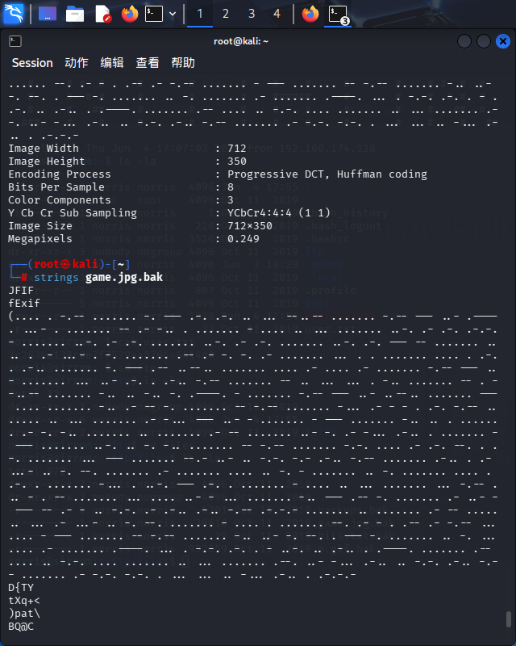

strings hits.txt.bak如下

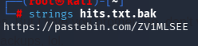

第二个查看网址，里面只有一句话，意思还是说要仔细分析每一个信息，第一个显而易见是摩斯密码

```
exiftool hits.txt.bak
```

```
exiftool game.jpg.bak
```

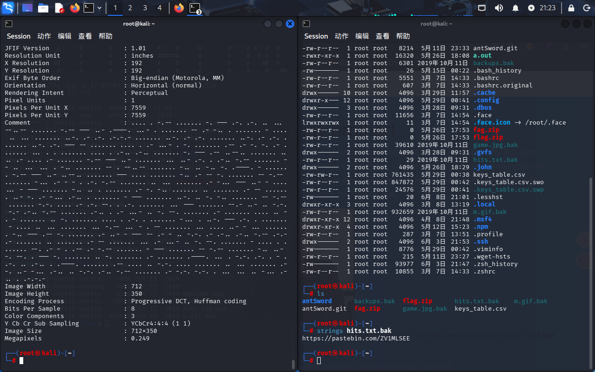

使用exiftool依然可以从评论中得到这一信息

使用在线工具进行解密

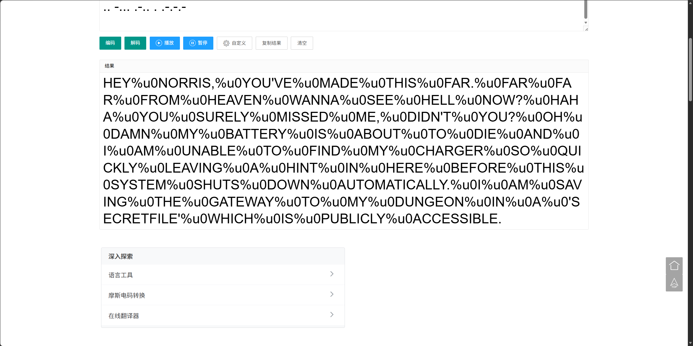

翻译的意思大概是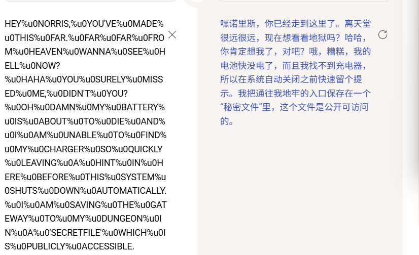

有一个secretfile文件，并且是公开可访问的，指的应该就是/var/www/html目录，当然我们不知道的话也可以进行搜索

```
find / -iname secretfile 2>/dev/null
```

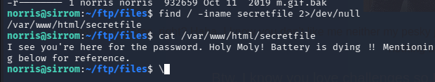

意思是没电，然后告诉我们参考如下，明显少了些信息，先下载过来查看

可是在ftp中我们没办法切换目录，但是因为在/var/www/html，我们也可以在网页下载

```
wget http://192.168.174.144/secretfile
```

- （这里我大意了，没有去仔细查看/var/www/html这个目录，里面还有一个文件.secretfile.swp）

```
wget http://192.168.174.144/.secretfile.swp
```

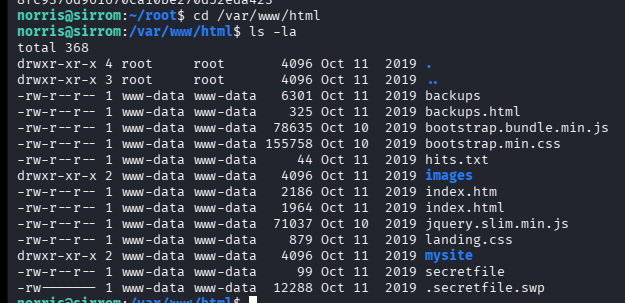

关于.swp后缀

- 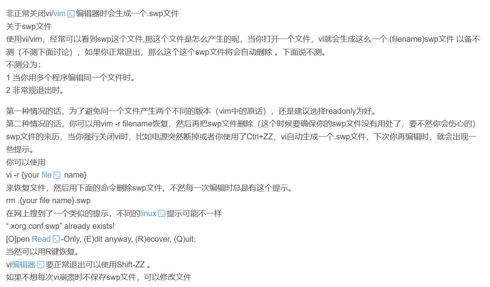

```
cat .secretfile.swp
```

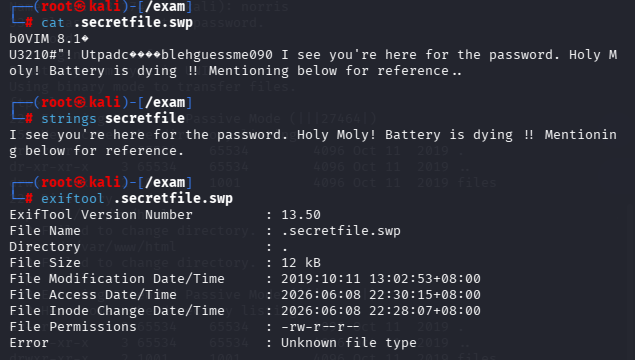

发现有乱码，再根据上面的.swp知识点，很可能是vi非常规退出，导致vi崩溃，可以尝试修复并查看

```
vim -r .secretfile.swp
```

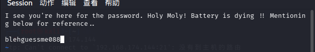

这应该就是一个用户密码了，尝试root用户和morris用户（文件里我误触了，最后的数字应该是090）

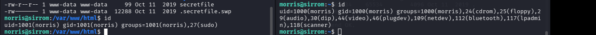

成功登录morris用户，但是morris用户没有什么乐意利用的信息，唯一的ssh也是他自己的私钥

通过sudo -l也得不到信息

寻找suid文件也没有

```
find / -writable -type f 2>/dev/null | grep -v proc | grep -v sys
```

都没有用的信息

这里就涉及到关于提权的一个新的知识点getcap

------

在 Linux 提权枚举中，`find / -perm -4000` 是找 SUID 文件的“常规武器”，而 **`getcap`** 则是发现另一种高风险配置——**文件能力（Capabilities）**——的“精准探测器”

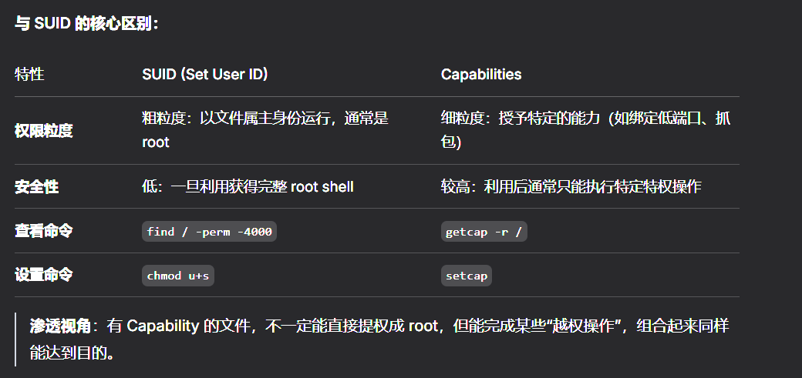

------

在实际的靶机中，我会遇到这种情况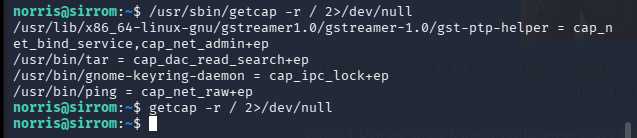

这种的话就先

```
whereis getcap
```

查找一下这个命令的位置，然后直接

```
/usr/sbin/getcap -r / 2>/dev/null
```

就可以正常使用了

可以看到tar命令拥有绕过文件读及目录遍历权限

------


- 这里解释一下各输出格式解析

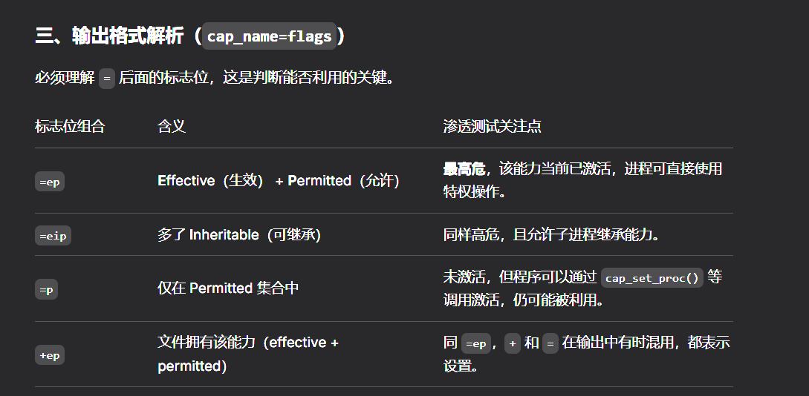

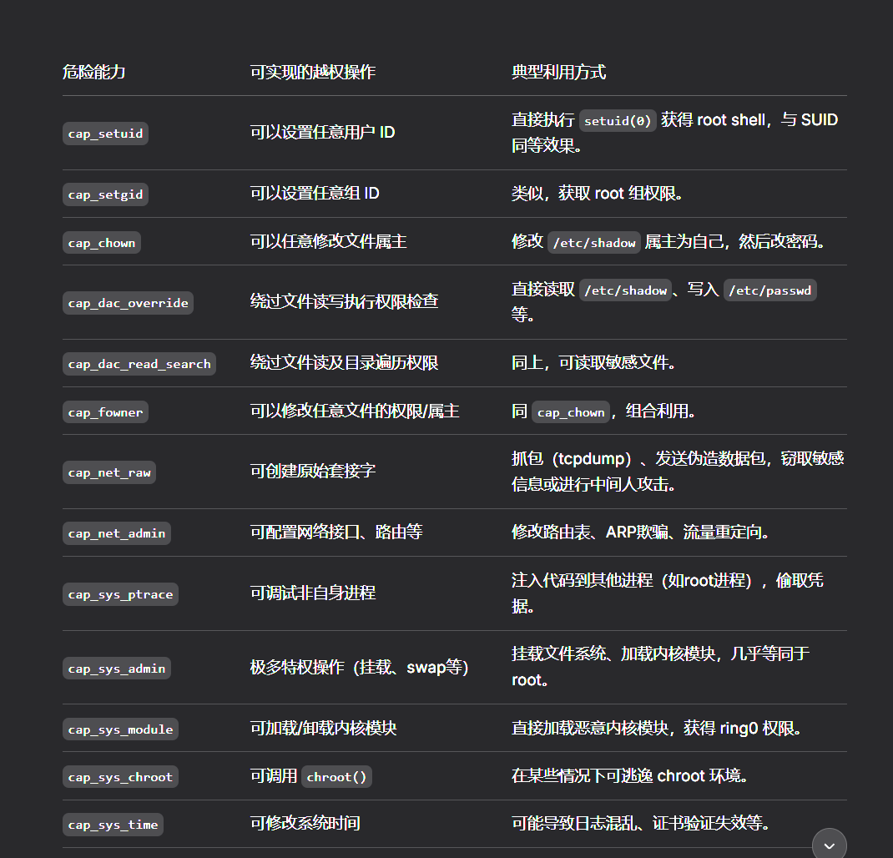

经常会两两结合

------

