[TOC]


## 信息收集

```
arp-scan -l
nmap -p- --min-rate 10000 192.168.174.161
```

得到端口号80,7744

分别进行tcp详细扫描和漏洞扫描

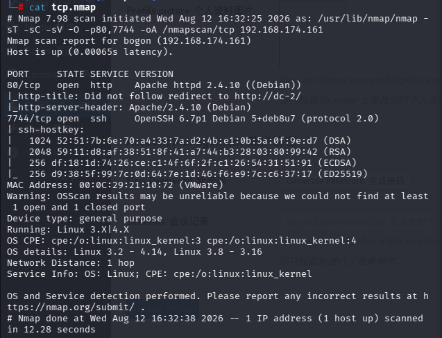

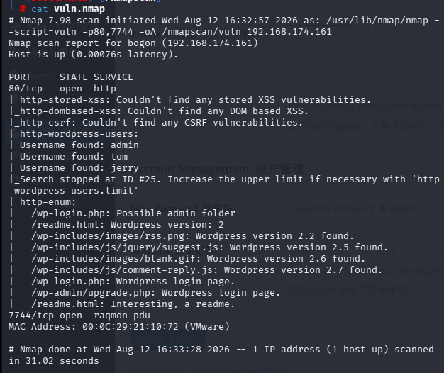

- 从tcp详细扫描结果可以得知7744是ssh服务

- 从漏洞扫描结果得知可能和wordpress有关，有大量关于wordpress的信息，并且枚举出了一些目录和可能的wordpress用户名

## 分析80端口

直接输入url，发现192.168.174.161直接访问无法访问，且发现我们输入的ip地址自动转化为了域名，我们想到dc-2这个域名解析失败，我们需要更改hosts文件，添加一个ip域名指向

```
nano /etc/hosts
```

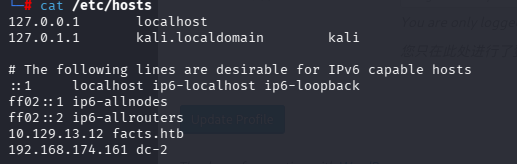

按这种格式添加

这时在访问就有正常页面了，发现页面有个FLAG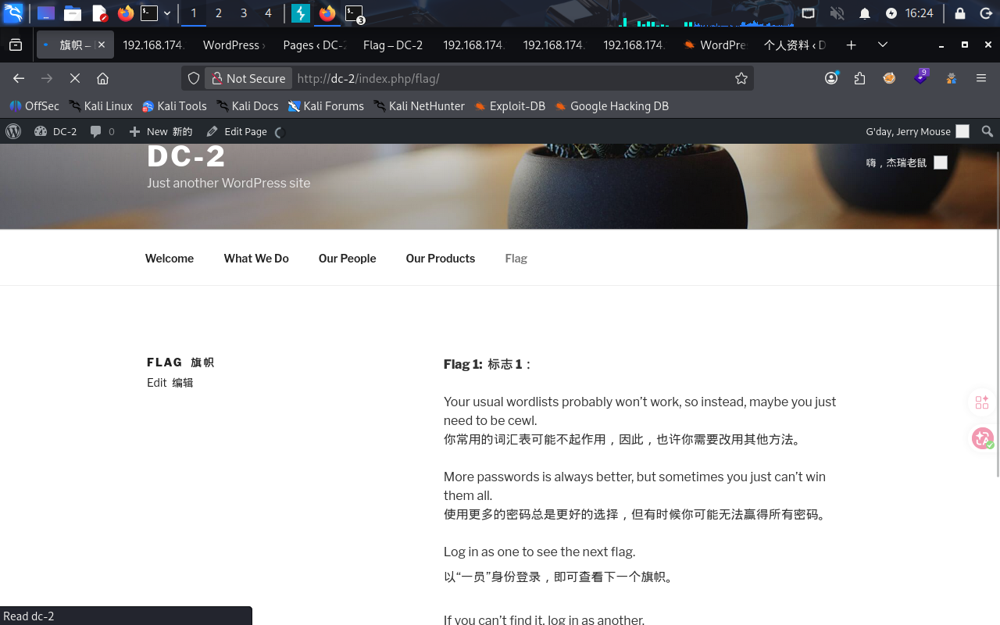

意思是一般的词汇表可能没有用，大概要用生成出来的，也提示了使用cewl，再者就是尝试登录不同用户，查看flag

- 这里简单介绍一下cewl

  ------

  - ## cewl

  - **全称**：Custom Word List Generator

  - **语言**：Ruby

  - **预装**：Kali Linux 默认集成

  - **核心功能**：爬取指定的网站，抓取网页文本，提取单词，生成密码字典

  - **适用场景**：目标密码可能基于公司名、产品名、员工名、行业术语等，CeWL 能自动收集这些词汇

  **简单理解**：CeWL 就是一个“爬虫 + 单词提取器”，它把目标网站上的文字变成你的密码猜测列表。

  很多组织使用与自身业务相关的词汇作为密码（比如公司名 + 年份、产品名 + 数字）。通用字典（如 rockyou.txt）虽然大，但可能缺乏这些针对性词汇。CeWL 生成的字典更小、更精准，能显著提高爆破效率，同时减少触发账户锁定的风险。

  **典型利用链**：

  1. 用 CeWL 爬取目标官网，生成定制字典。

  2. 用该字典对目标的企业邮箱、VPN、SSH、WordPress 等登录入口进行爆破。

  3. 密码命中率大幅提升。

     ```
     cewl <目标URL> -w <输出文件>
     ```

| 选项                 | 功能                                     | 示例                     |
| :------------------- | :--------------------------------------- | :----------------------- |
| `-d <深度>`          | 爬取深度，默认 2，表示跟随链接层数       | `-d 3`                   |
| `-m <最小长度>`      | 只提取长度 ≥ 该值的单词，默认 3          | `-m 5`                   |
| `-w <文件>`          | 输出字典保存路径                         | `-w dict.txt`            |
| `--with-numbers`     | 生成单词+数字的组合（如 admin2024）      | `--with-numbers`         |
| `--lowercase`        | 全部转为小写                             | `--lowercase`            |
| `--offsite`          | 允许爬取外部链接（可能抓取更多相关网站） | `--offsite`              |
| `-e` / `--email`     | 同时提取网站中的邮箱地址                 | `-e`                     |
| `--ua <用户代理>`    | 自定义 User-Agent，躲避简单封锁          | `--ua "Mozilla/5.0"`     |
| `--proxy <代理>`     | 使用 HTTP 代理                           | `--proxy 127.0.0.1:8080` |
| `--auth_type <类型>` | 认证类型（basic/digest）                 | `--auth_type basic`      |
| `--auth_user <用户>` | 认证用户名                               | `--auth_user admin`      |
| `--auth_pass <密码>` | 认证密码                                 | `--auth_pass 123456`     |
| `-v`                 | 显示详细信息                             | `-v`                     |

------

接着分析80端口，得到了上述信息后先爆破一下目录

```
gobuster dir -u "http://192.168.174.161" -w /usr/share/wordlists/dirbuster/directory-list-2.3-medium.txt -x php,txt,zip
```

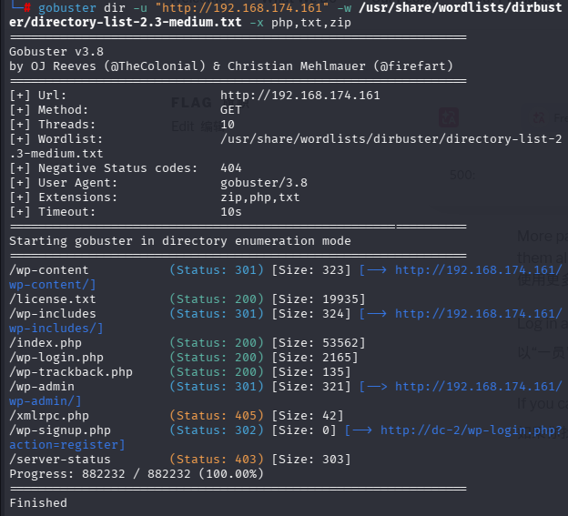

/xmlrpc.php要使用POST方式，但是使用POST也没有重要信息，其他的基本没有重要信息，接下来使用wpscan探测wordpress站点，它会自动枚举wordpress特征路径，文件，插件，主题，用户

```
wpscan --url http://dc-2
```

(这里直接将ip解析的域名作为url，因为之前就是这样情况，再者就是直接输入ip会报错，添加参数--ignore-main-redirect也不行)

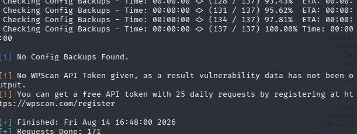

提示了版本过时以及需要api-token，可以直接在wpscan官网上注册一个，我就用我自己的了

```
wpscan --url http://dc-2 --api-token 1cGUkN2Pxs73xaaWxT2S1SphbfmV4Es03pFYhH5m5aw  -e vt,vp,u
```

（u：用户，vp：插件漏洞，vt：主题漏洞）

没有找到插件漏洞和主题漏洞，枚举用户有结果

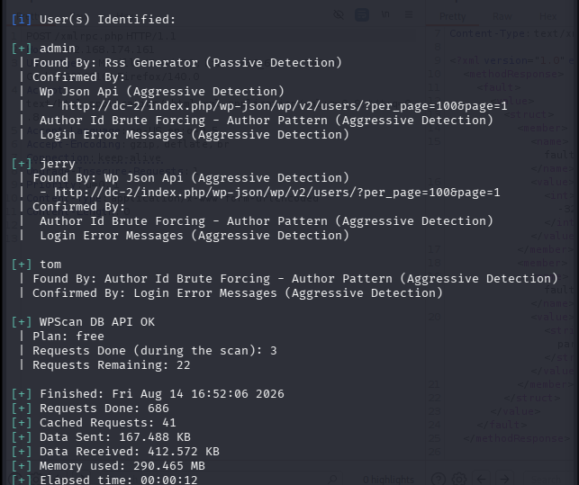

分别是admin,jerry,tom

```
cewl http://dc-2 -w password.txt
```

生成适配的字典password.txt

```
wpscan --url http://dc-2 --passwords password.txt
```

进行对账号的密码爆破（这里没有指定--usernames的参数是因为上述三个账户都是由wpscan枚举出来的，因此不用指定用户名字典也可以，如果要自己做的话要一行一个用户名）

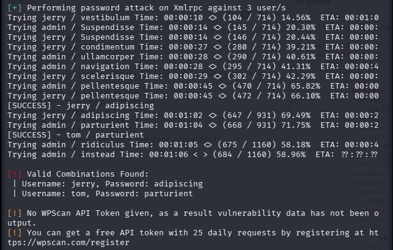

爆破出了两个密码

```
jerry:adipiscing
tom:parturient
```

登录wp-login.php网页，两个都可以登陆进去

两个页面的信息差不多一样，在开发者工具中也没有看到可以切换用户的漏洞，都有一个flag2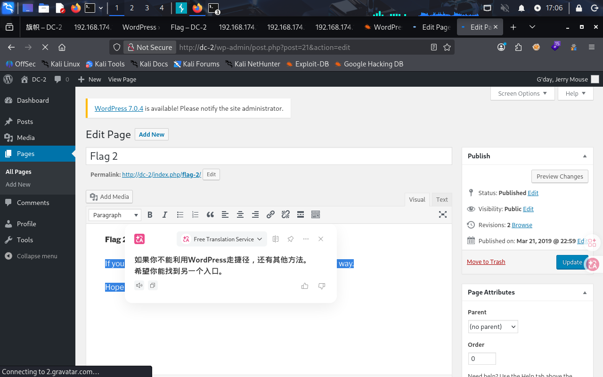

意思是让我们尝试找另一个入口

## ssh连接

- 尝试用这些账号密码进行ssh连接

```
ssh tom@192.168.174.161 -p7744
```

这里使用jerry不能直接连ssh，tom可以，可能是内部配置原因

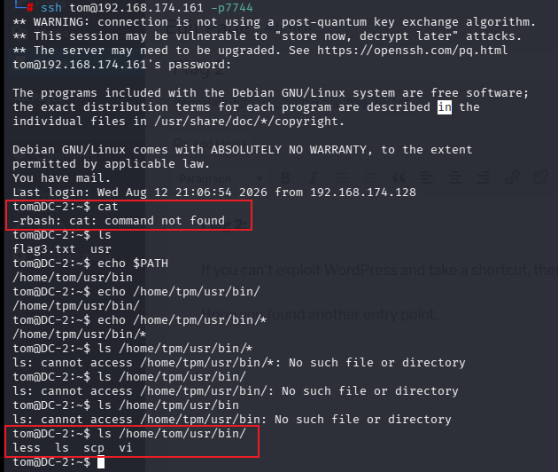

进入tom的shell后发现由于rbash的限制许多命令不能使用

```
echo $PATH
```

发现我们只能使用/home/tom/usr/bin/下的命令

通过ls查看，就是ls，less，scp，vi

```
vi flag3.txt
```

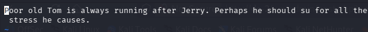

提示我们使用su命令，也许是提权，也许是切换用户

接下来我们用ls命令查看信息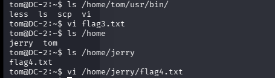

查看flag4.txt

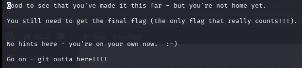

虽然说着没有提示，但是这个git我不知道算不算，不过我们后续肯定能自己看出来

## 提权

对于rbash（受限bash），我们可以利用Bash内部机制绕过rbash对命令执行和PATH的限制

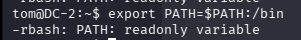

尝试在PATH中导入新路径，提示“只读变量”

```
BASH_CMDS[a]=/bin/bash;a
```

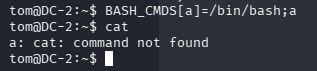

发现我们成功进入到一个新的shell

```
export PATH=$PATH:/usr/bin
export PATH=$PATH:/bin
```

这时我们就可以使用其他命令了

```
su jerry
```


成功切换到jerry用户

```
sudo -l
```

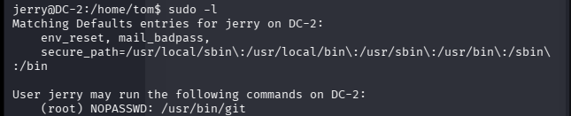

发现我们可以以root的身份运行git命令，在GTFOBins查找关于git

```
sudo git branch --help config
!/bin/bash
```

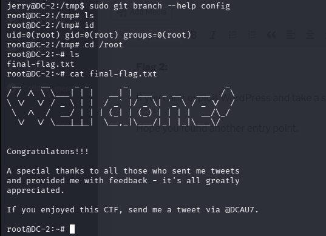

成功拿到root

（其实那个rbash我还尝试过vi逃逸

```
vi
:set shell=/bin/bash
:shell
```

但是除了解锁部分命令以外还是不能达到我们的需求，不能解锁su命令）