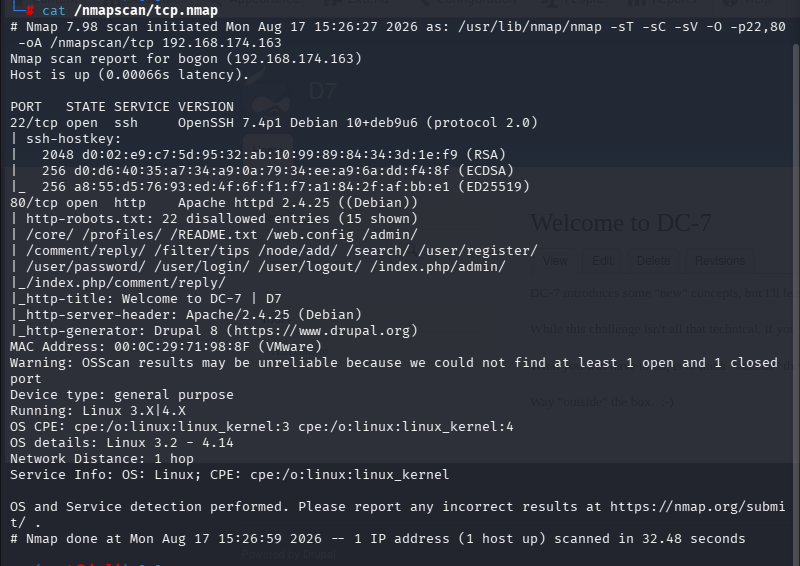
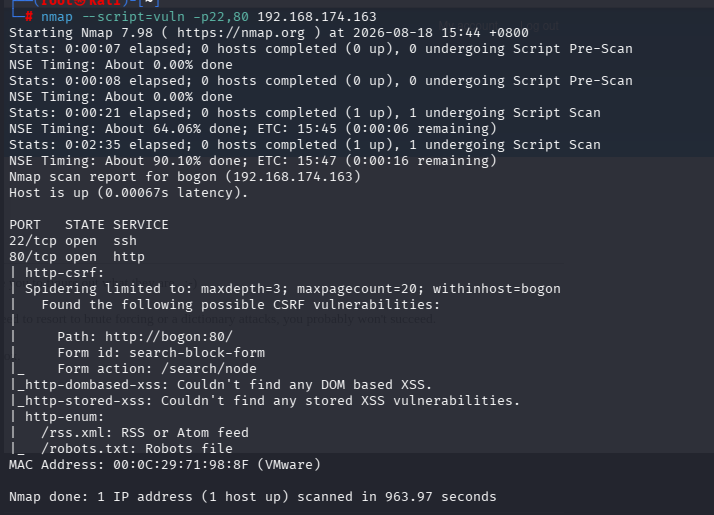
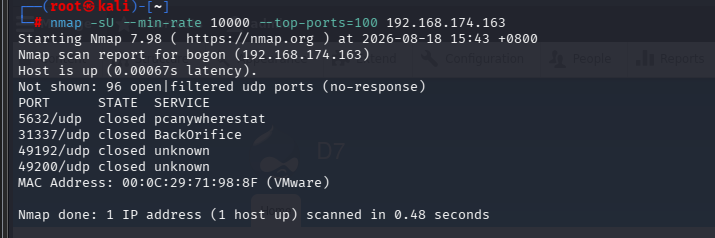
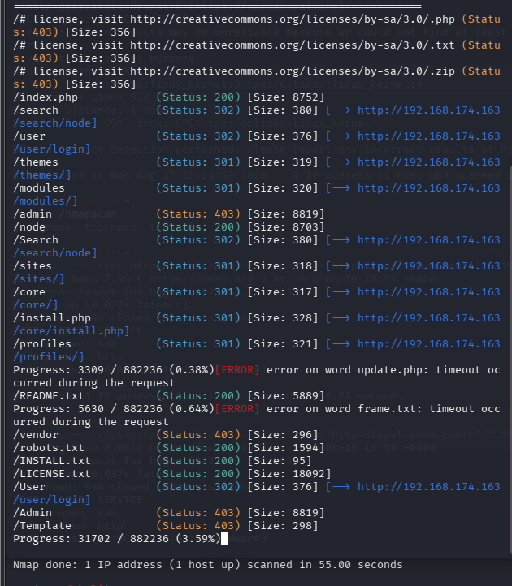
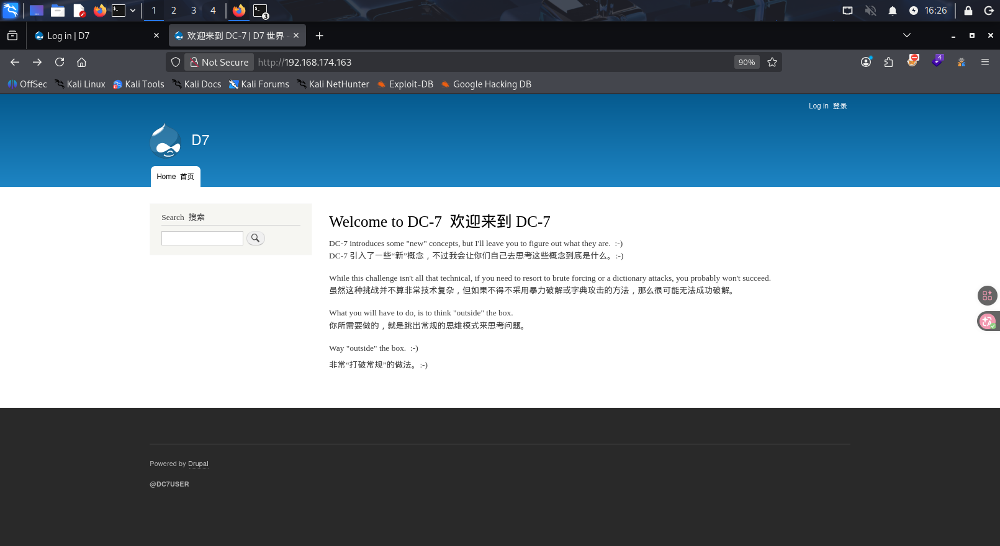
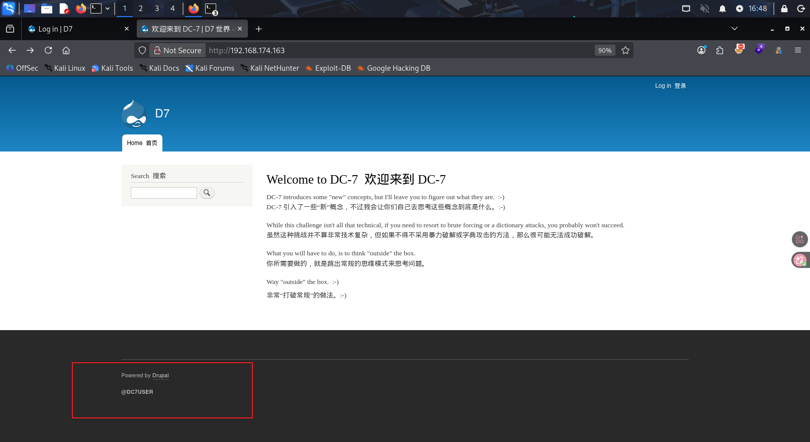
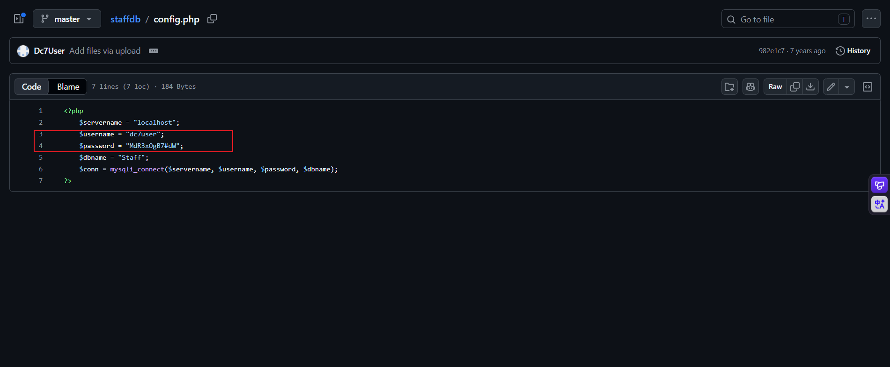

[TOC]

## 信息收集

```
arp-scan -l
nmap -p- --min-rate 10000 192.168.174.163
```

开放了两个端口，分别是22，80

22端口我们先跳过，重点查看80端口

- 分别进行tcp详细扫描，漏洞扫描和udp扫描







我们可以得知靶机的80网页用的是Drupal的CMS框架，版本是8

## 80端口分析

先进行目录爆破

```
gobuster dir -u "http://192.168.174.163" -w /usr/share/wordlists/dirbuster/directory-list-2.3-medium.txt -x php,txt,zip
```

爆破出的目录大部分都是Drupal的目录框架，介绍一下Drupal

------

## Drupal

- **官网**：[drupal.org](https://drupal.org/)
- **语言**：PHP，数据库常用 MySQL/PostgreSQL
- **特点**：模块化、企业级、安全性相对较好（但历史漏洞多）
- **版本**：7.x、8.x、9.x、10.x（目前 7 已停止支持，但很多老站仍在使用）
- **后台入口**：`/user/login`（登录页面）；管理后台通常为 `/admin`（需登录且具有管理权限）
- **关键目录/文件**：
  - `sites/default/settings.php`：核心配置文件，含数据库凭据、盐值等
  - `sites/default/files/`：上传目录（常被用于写 Webshell）
  - `modules/`：核心及第三方模块
  - `themes/`：主题
  - `profiles/`：安装配置文件

**与 Joomla/WordPress 的区别**：

- 后台路径不同：Joomla `/administrator`，WordPress `/wp-admin`，Drupal `/user/login`
- Drupal 使用模块（Module）而非插件（Plugin），功能更底层，安全风险常出在自定义模块和核心 API。

### Drupal 常见攻击面与漏洞类型

| 攻击面                   | 漏洞类型                   | 说明                                                   |
| :----------------------- | :------------------------- | :----------------------------------------------------- |
| **核心漏洞**             | SQL注入、RCE、反序列化     | 最著名的是 Drupalgeddon 系列，影响极广                 |
| **第三方模块**           | RCE、XSS、SQL注入          | 模块质量参差不齐，如 `webform`, `views`, `ckeditor` 等 |
| **REST API**             | 未授权访问、信息泄露、RCE  | Drupal 8+ 默认启用 JSON:API/REST，配置不当导致数据泄露 |
| **后台登录**             | 弱口令、暴力破解、用户枚举 | 登录页无验证码，可爆破                                 |
| **配置文件**             | 信息泄露                   | `settings.php` 备份、`.git` 泄露等                     |
| **文件上传**             | 上传绕过、任意文件写入     | 结合模块漏洞实现 Webshell                              |
| **用户注册/枚举**        | 用户名枚举、权限配置错误   | 注册页面可能暴露有效用户名                             |
| **跨站请求伪造（CSRF）** | 配置错误                   | Drupal 自身有令牌，但某些模块可能缺失                  |

和wordpress，joomal一样，都有其专属的扫描器，Drupal用的是droopescan，但是我的配置导致我不能用，不过也可以用nmap，利用脚本nmap --script=http-drupal-enum --script-args http-drupal-enum.root="/" <target>,也可以使用，不会的话可以在nmap官网上查询

------

接下来依次查看爆破出的目录，看看有没有信息

- 查看默认页面



告诉我们不要暴力破解，要跳出常规的思维模式来思考问题，其他的目录基本也没什么信息，经过很长时间的尝试，想找一下CMS版本，插件（模板），主题的漏洞，或者用专用工具扫描，都没有什么作用，没办法只能借鉴一下大佬的wp，然后才知道

这个@DC7USER直接在搜索引擎搜索，可以直接搜索出github上的一个用户，然后进去发现包含许多源码的文件，这就是利用了社工信息收集，确实挺新颖的哈

在config.php中发现了用于连接mysql的php内置函数，里面有用户名和密码，尝试一下能不能登录Drupal