[TOC]

## 信息收集

```
arp-scan -l
nmap -p- --min-rate 10000 192.168.174.163
```

开放了两个端口，分别是22，80

22端口我们先跳过，重点查看80端口

- 分别进行tcp详细扫描，漏洞扫描和udp扫描


我们可以得知靶机的80网页用的是Drupal的CMS框架，版本是8

## 80端口分析

先进行目录爆破

```
gobuster dir -u "http://192.168.174.163" -w /usr/share/wordlists/dirbuster/directory-list-2.3-medium.txt -x php,txt,zip
```

爆破出的目录大部分都是Drupal的目录框架，介绍一下Drupal

------

## Drupal

- **官网**：[drupal.org](https://drupal.org/)
- **语言**：PHP，数据库常用 MySQL/PostgreSQL
- **特点**：模块化、企业级、安全性相对较好（但历史漏洞多）
- **版本**：7.x、8.x、9.x、10.x（目前 7 已停止支持，但很多老站仍在使用）
- **后台入口**：`/user/login`（登录页面）；管理后台通常为 `/admin`（需登录且具有管理权限）
- **关键目录/文件**：
  - `sites/default/settings.php`：核心配置文件，含数据库凭据、盐值等
  - `sites/default/files/`：上传目录（常被用于写 Webshell）
  - `modules/`：核心及第三方模块
  - `themes/`：主题
  - `profiles/`：安装配置文件

**与 Joomla/WordPress 的区别**：

- 后台路径不同：Joomla `/administrator`，WordPress `/wp-admin`，Drupal `/user/login`
- Drupal 使用模块（Module）而非插件（Plugin），功能更底层，安全风险常出在自定义模块和核心 API。

### Drupal 常见攻击面与漏洞类型

| 攻击面                   | 漏洞类型                   | 说明                                                   |
| :----------------------- | :------------------------- | :----------------------------------------------------- |
| **核心漏洞**             | SQL注入、RCE、反序列化     | 最著名的是 Drupalgeddon 系列，影响极广                 |
| **第三方模块**           | RCE、XSS、SQL注入          | 模块质量参差不齐，如 `webform`, `views`, `ckeditor` 等 |
| **REST API**             | 未授权访问、信息泄露、RCE  | Drupal 8+ 默认启用 JSON:API/REST，配置不当导致数据泄露 |
| **后台登录**             | 弱口令、暴力破解、用户枚举 | 登录页无验证码，可爆破                                 |
| **配置文件**             | 信息泄露                   | `settings.php` 备份、`.git` 泄露等                     |
| **文件上传**             | 上传绕过、任意文件写入     | 结合模块漏洞实现 Webshell                              |
| **用户注册/枚举**        | 用户名枚举、权限配置错误   | 注册页面可能暴露有效用户名                             |
| **跨站请求伪造（CSRF）** | 配置错误                   | Drupal 自身有令牌，但某些模块可能缺失                  |

和wordpress，joomal一样，都有其专属的扫描器，Drupal用的是droopescan，但是我的配置导致我不能用，不过也可以用nmap，利用脚本nmap --script=http-drupal-enum --script-args http-drupal-enum.root="/" <target>,也可以使用，不会的话可以在nmap官网上查询

------

接下来依次查看爆破出的目录，看看有没有信息

- 查看默认页面


告诉我们不要暴力破解，要跳出常规的思维模式来思考问题，其他的目录基本也没什么信息，经过很长时间的尝试，想找一下CMS版本，插件（模板），主题的漏洞，或者用专用工具扫描，都没有什么作用，没办法只能借鉴一下大佬的wp，然后才知道

这个@DC7USER直接在搜索引擎搜索，可以直接搜索出github上的一个用户，然后进去发现包含许多源码的文件，这就是利用了社工信息收集，确实挺新颖的哈

在config.php中发现了用于连接mysql的php内置函数，里面有用户名和密码，尝试一下能不能登录Drupal或者连接ssh

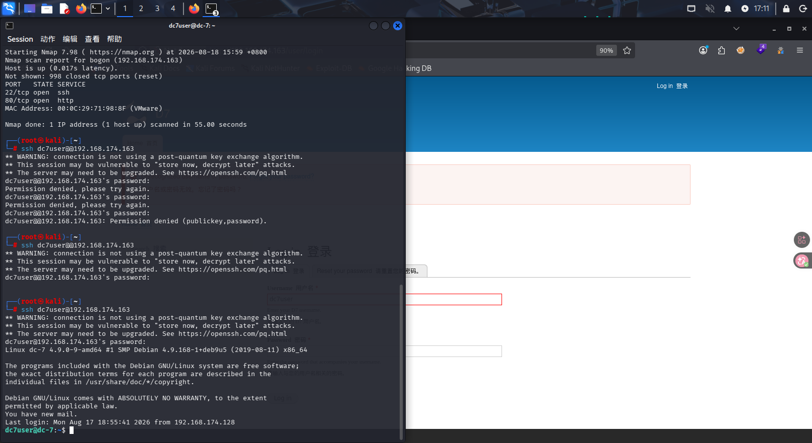

成功进入，进行了一系列的信息收集，没有可以利用的地方，然后开始查看我们当前用户有权限的文件，以及去/home等目录查找更多利于提权的信息

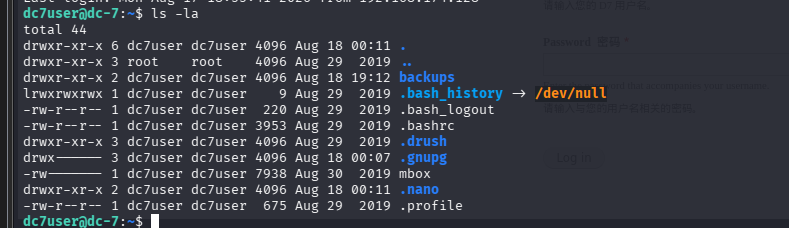

发现未知文件mbox和backups目录

- 查看mbox文件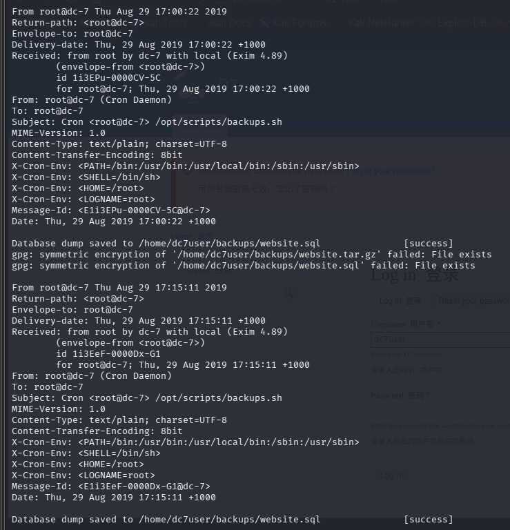

发现这是一个邮件，由于第一次遇到这个种靶机，我要区别一下怎么看出这是一个原始邮件（EML格式），而且他是定时的

------

## mail

### 1. 标准的“邮件头”格式（最核心标志）

邮件头是一系列以**“字段名: 值”**形式出现的关键信息，位于文本最顶部。截图里包含这些：

- **`From: root@dc-7 (Cron Daemon)`** → 明确说明发件人是谁。
- **`To: root@dc-7`** → 明确说明收件人是谁。
- **`Subject: Cron <root@dc-7> /opt/scripts/backups.sh`** → 这是邮件主题。
- **`Date: Thu, 29 Aug 2019 17:00:22 +1000`** → 发送时间。

普通日志（比如 `/var/log/syslog`）通常是以时间戳开头，不会有这种 `From:`、`To:`、`Subject:` 这种标准的邮件头。

### ✅ 2. 路由追踪信息（Received 字段）

文件中间有几行以 `Received: from` 开头的部分，这是记录邮件经过的服务器路径。例如：
`Received: from root by dc-7 with local (Exim 4.89)`
这表示邮件是由 `root` 用户通过本地的 Exim 邮件服务（本地投递）生成的。这是内部邮件投递的典型特征。

### ✅ 3. 邮件正文与头部的“空行分隔”

仔细观察，你会发现邮件头和正文之间有一个**空行**。
头部是：

text

```
Subject: Cron <root@dc-7> /opt/scripts/backups.sh
MIME-Version: 1.0
...
Message-Id: <E113EPu-0000CV-5C@dc-7>
Date: Thu, 29 Aug 2019 17:00:22 +1000
```

接着空一行，然后是正文：

text

```
Database dump saved to /home/dc7user/backups/website.sql    [success]
gpg: symmetric encryption ... failed: File exists
```

这个**空行**是标准的邮件协议（RFC 822）规定的，用于区分控制信息和内容。

- 然后我们也可以执行mail命令来查看邮件

  ------

  1. **扫一眼开头两行**：看有没有 `From` 或 `Return-path`。
  2. **找 `Subject` 行**：如果有，说明有人或系统定时任务（Cron）发了一封主题为执行备份脚本的邮件。
  3. **看收件人**：如果都是发给 `root@dc-7`，说明这是系统产生的通知，通常保存在收件箱里。

我们可以通过这三个步骤快速判断

- 仔细观察的话我们是可以从Subject这一行发现干了什么的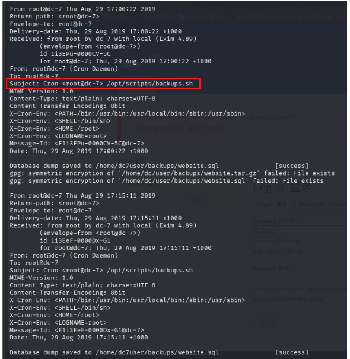

定时执行了/opt/scripts/backups.sh脚本

- 因为这个邮件的发送人和接收人都是自己，所以我们也可以直接查看收件箱，直接执行命令mail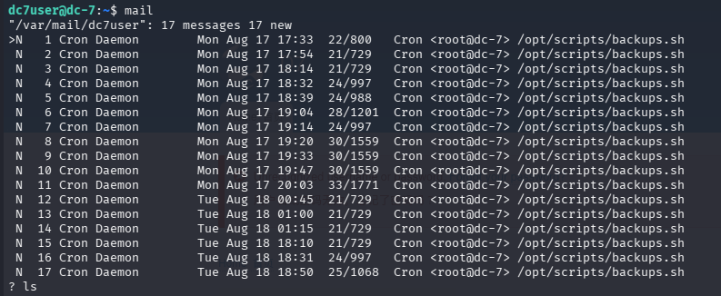

（我们在/etc/crontab种没有看到这个任务，说明他有可能是root用户的定时任务）

- 查看/opt/scripts/backups.sh

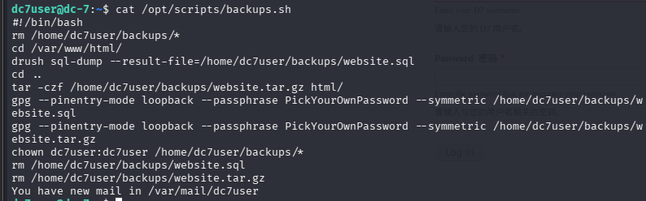

这里面有两个新命令了解一下，gpg和drush，chown适用于改变文件或文件夹的文件所有者或文件所属用户组

------

## gpg

GPG（GNU Privacy Guard）是 OpenPGP 标准的开源实现，用于**加密、解密、数字签名和密钥管理**。它既可以进行非对称加密（公钥/私钥），也支持对称加密（密码加密）。在渗透测试中，GPG 常用于保护传输中的敏感数据、解密目标上的加密文件、以及破解弱密码保护的私钥。

核心命令：

- 生成密钥：`gpg --full-generate-key`
- 加密（非对称）：`gpg --encrypt --recipient user file`
- 解密：`gpg --decrypt file.gpg`
- 对称加密：`gpg --symmetric file`
- 破解私钥密码：`gpg2john private.key > hash && john hash`

在这个靶机中有个另外的参数--pinentry-mode loopback --passphrase PickYourOwnPassword，意思是不需要交互式输入密码，直接在命令行中输入

------

## drush

**Drush** 是 Drupal 的命令行管理工具，全称 **Drush = Drupal Shell**。它允许管理员通过终端执行各种管理任务，比如更新模块、清除缓存、管理用户、导出配置等。在渗透测试中，一旦你获得了目标服务器的 shell 或数据库访问权限，Drush 可以成为高效后渗透和提权的利器。

在遇到drush中我们可以

1. **获得目标服务器 Shell 后**：检查 Drupal 根目录是否存在 `vendor/bin/drush` 或 `drush` 可执行文件。
2. **发现目标系统已经安装了 Drush**：可能在 `/usr/local/bin/drush` 或 `/usr/bin/drush`。
3. **利用 Web 漏洞执行系统命令**：通过 Webshell 调用 `drush` 命令。

| `drush status`                                       | 显示 Drupal 状态、版本、数据库信息 | 信息收集                    |
| ---------------------------------------------------- | ---------------------------------- | --------------------------- |
| `drush user-password <用户名> --password="<新密码>"` | 重置指定用户的密码                 | 快速获取管理员权限          |
| `drush sql-connect`                                  | 显示数据库连接信息                 | 获取数据库凭据              |
| `drush sql-query "<SQL>"`                            | 执行任意 SQL 查询                  | 绕过数据库权限限制          |
| `drush php-eval "<PHP代码>"`                         | 执行任意 PHP 代码                  | 获取 Webshell、执行系统命令 |
| `drush php-script <文件名>`                          | 执行一个 PHP 脚本文件              | 执行自定义脚本              |
| `drush pm-list`                                      | 列出所有模块及其状态               | 发现禁用模块或潜在漏洞      |
| `drush pm-enable <模块>`                             | 启用模块                           | 可能启用存在漏洞的模块      |
| `drush pm-uninstall <模块>`                          | 卸载模块                           | 破坏目标环境（慎用）        |
| `drush cache-rebuild`                                | 清除所有缓存                       | 解决修改后不生效的问题      |
| `drush sql-dump`                                     | 导出数据库备份                     | 窃取数据                    |
| `drush config-get <配置名>`                          | 获取配置项                         | 读取敏感配置                |
| `drush config-set <配置名> <值>`                     | 修改配置项                         | 修改权限、开启危险功能      |
| `drush cr`                                           | 重建缓存（通常用于 Drupal 8+）     | 清缓存                      |

要运行drush命令的前提是一定要定位Drupal根目录，找到drush可执行文件，比如vendor/bin/drush，/var/www/html,可以尝试运行

```
drush status
```

查看站点版本和数据库，也能验证是否可以运行命令

------

因为backups.sh是root用户发送和接受的，所以我推测这个邮件的运行在root用户的定时任务中，而且很可能是以root身份运行的，所以下一步的思路是尝试修改backups.sh的内容，因为是定时任务，我们用反弹shell，然后在本地开启监听，等待拿到root

- ```
  ls -la /opt/scripts
  ```

  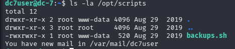

发现只有root和www-data组有权限修改，我们当前权限只能查看和执行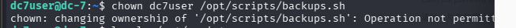

用chown尝试修改文件所属，我们没有权限，这也更加证明了backups.sh中执行的chown命令是以root权限执行的

- 接下来我们要进入用户组，就要考虑从网页上传一个反弹shell，这样再拿到新的shell时就是www-data组了

- 由于drush可以更改密码，因此我们可以执行

```
drush user-password admin --password="123"
```

就可以把admin用户的密码改动，然后我们就可以直接在网站上登录了（其实我不知道为什么改admin，毕竟我自己做的时候从来没见过这个用户，但是看别人的wp都是这样，也许是像wordpress这样的流行CMS默认管理员用户都是admin，所以才有这样的做法吧）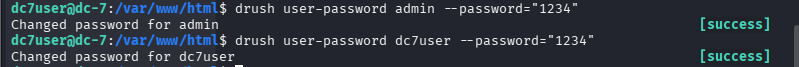

dc7user用户的密码也可以用drush进行更改，有时可能会报错连接不上（无法初始化）数据库的问题，可以尝试看下数据库的状态，或者重启

```
drush sql-connect(测试Drush能否连接数据库)
mysql -u dc7user -p -h localhost（直接测试mysql连接）
systemctl status mysql（检查mysql服务状态）
systemctl restart mysql（重启mysql，不加re是启动）
```

- 进入admin的网页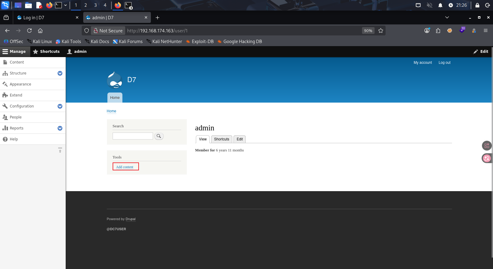

很明显这里有一个可以上传文件的地方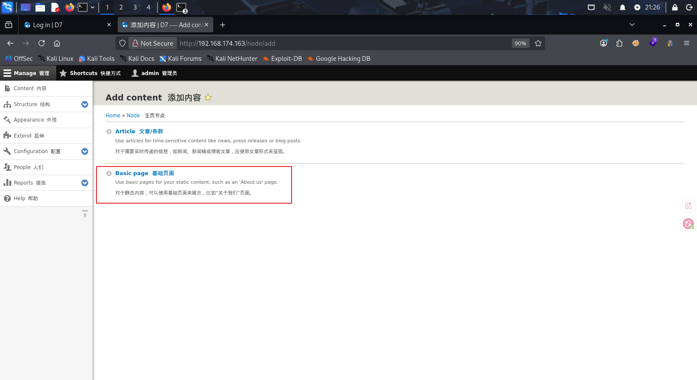

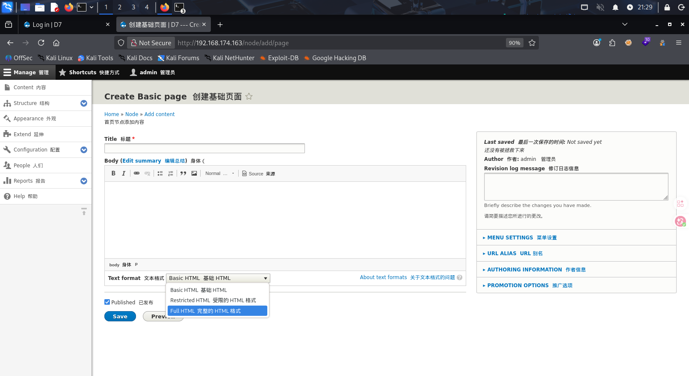

这种CMS框架都是可以装插件的，找找有没有可以上传php文件的插件