[TOC]

这个靶机有非常多的解法，我在这只列举我自己做出来的一种

其余的在[kali渗透综合靶机(九)--Typhoon靶机 - 雨中落叶 - 博客园](https://www.cnblogs.com/yuzly/p/10835932.html)或

[kali渗透综合靶机(九)--Typhoon靶机_kali windows 靶机 下载-CSDN博客](https://blog.csdn.net/weixin_40412037/article/details/104931561)

也可以直接搜索，基本上每个端口都有拿到root的方法

## 信息收集

```
nmap -p- --min-rate 10000 192.168.174.157
```

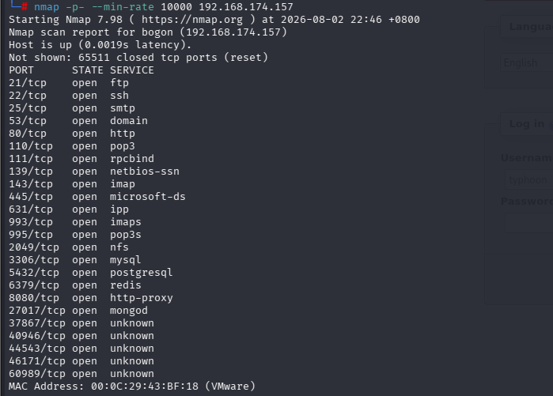

这里面的端口基本每个都有漏洞，我做的是从80端口

分别进行tcp详细扫描和端口扫描

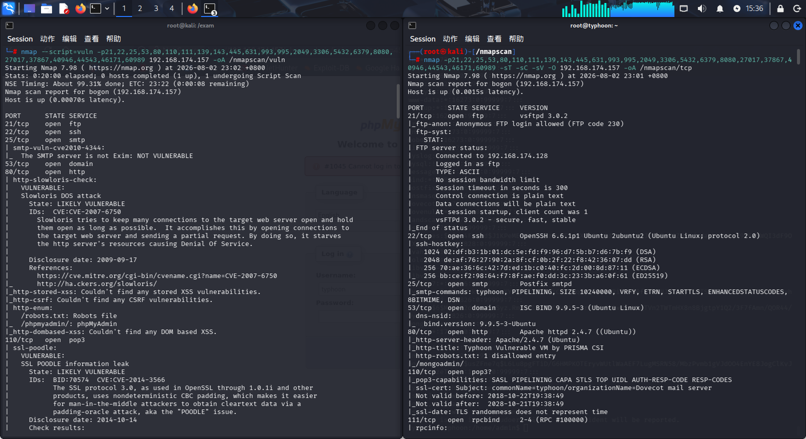

共列举出robots.txt和phpmyadmin，mongoadmin三个目录

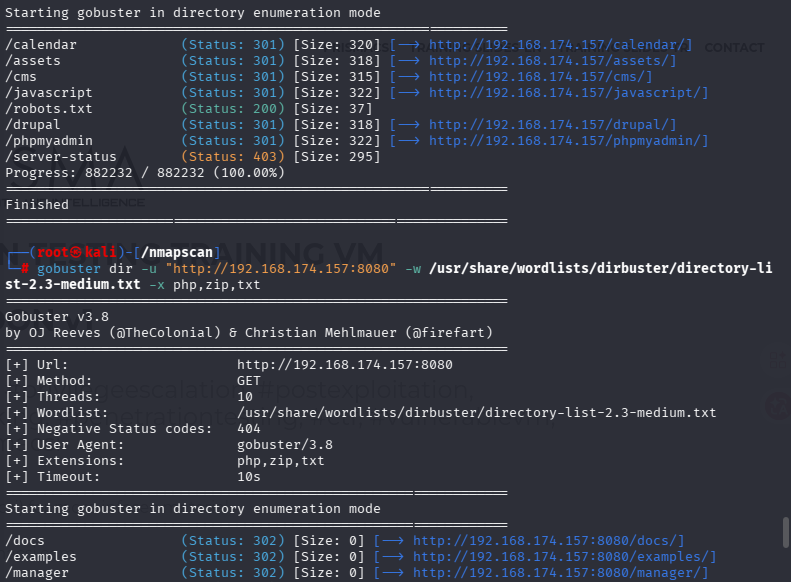

这里分别枚举的是80端口和8080端口的目录

先查看robots.txt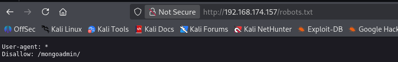

也指向了mongoadmin目录

```
mongoadmin
```

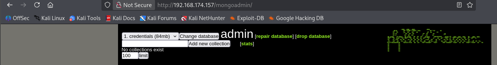

这是一个**MongoDB 的 Web 管理界面**，基于Node.js

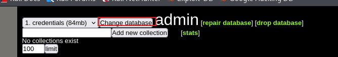

红框旁边的用于切换数据库

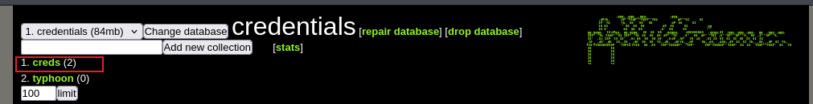

这歌应该是个人凭据的意思，点开后

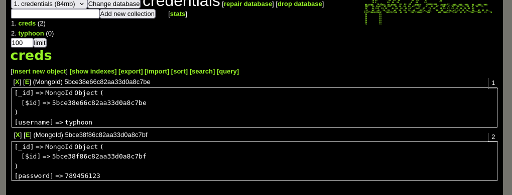

得到账户密码typhoon：789456123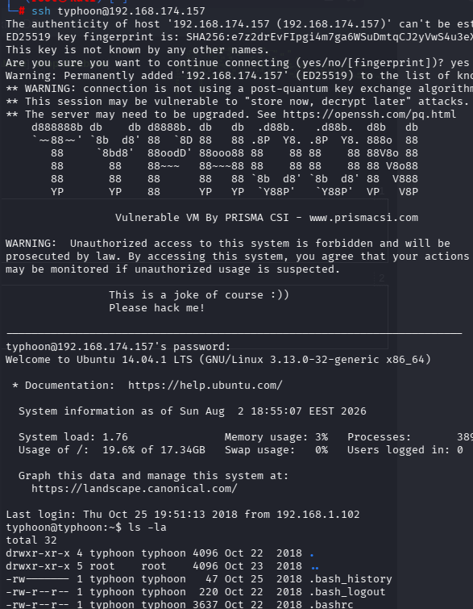

通过ssh成功登录用户typhoon

在/home目录中发现3个用户，分别是typhoon，admin，postfixuser

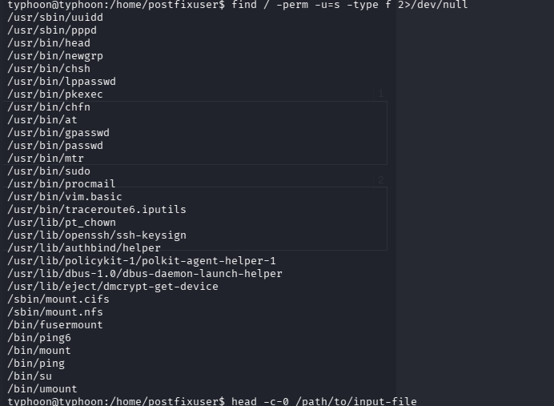

查找suid权限文件，发现了head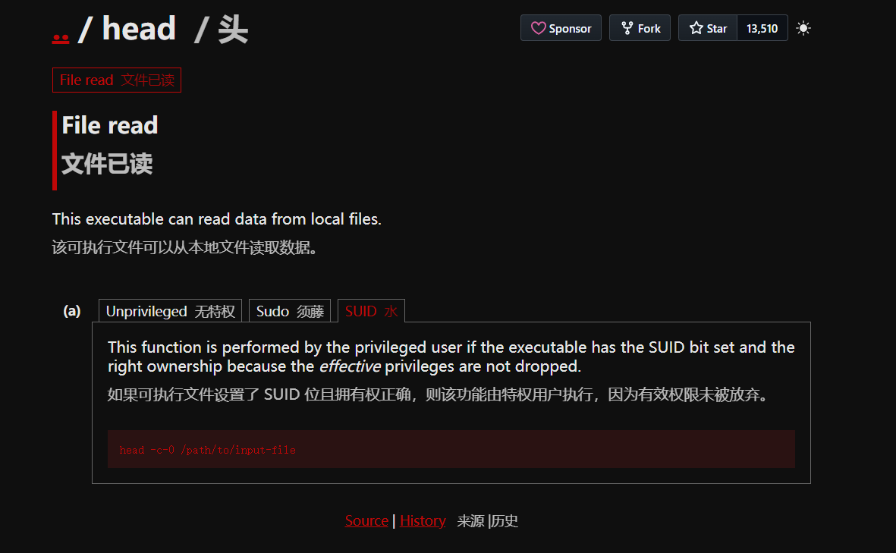

也就是说我们可以读取任意已知文件

```
head -c-0 /etc/password
head -c-0 /etc/shadow
```

看看是否能拿到明文

```
unshadow 1.txt 2.txt > hash.txt(1.txt和2.txt就是password和shadow)
```

John the Ripper 工具集里的 `unshadow` 命令，能将 `/etc/passwd`（用户信息）和 `/etc/shadow`（密码哈希）合并成一个专门用于破解的文件

```
john --wordlist=/usr/share/wordlists/rockyou.txt hash.txt
```

后续可以通过john --show hash.txt查看爆破内容

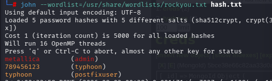

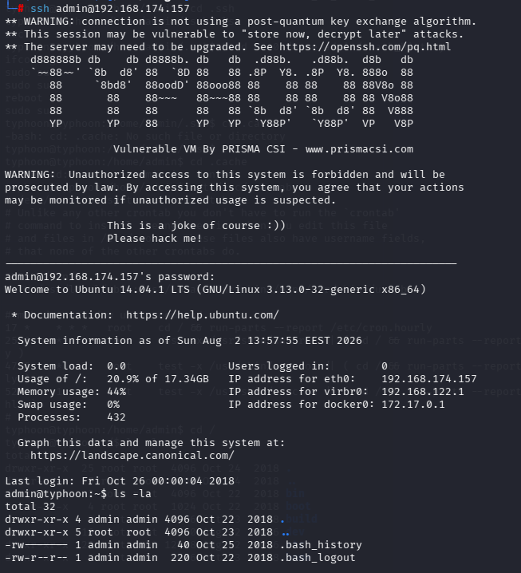

通过ssh成功登录admin用户

通过sudo -l命令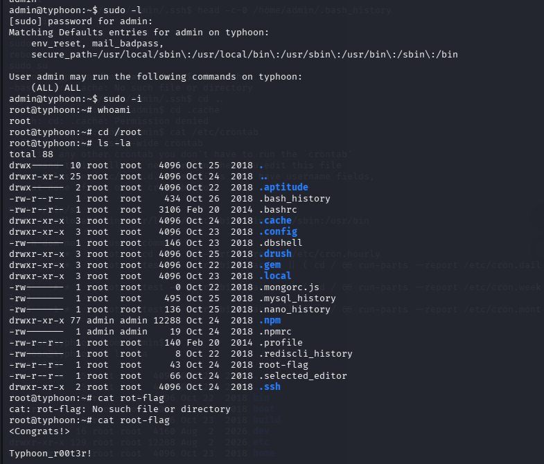

发现我们可以执行任意命令在这个用户上

直接

```
sudo -i
```

成功拿到root

## 总结

1.信息收集、目录扫描、漏洞分析与利用

2.getshell方法

　　1.ssh爆破

　　2.lotus cms漏洞利用

　　3.Drupal cms漏洞利用

　　4.mongoadmin 数据库管理web页面查看用户名、密码

　　5.tomcat tomcat_mgr_upload漏洞

　　6.PostgreSQL未授权访问　

3.提权方法

　　1.sudo提权

　　2.内核版本提权

　　3.利用配置不当进行提权