[TOC]

## 网卡配置

**Ubuntu 18.04 及更高版本**，系统默认使用 **Netplan** 来管理网络。它的配置文件是 YAML 格式，统一存放在 **`/etc/netplan/`** 目录下

其他可能位置：

- **传统的 `/etc/network/interfaces`**：这是 **Debian/Ubuntu 旧版本**（17.10 之前）的配置文件。如果你的系统很老，或 Netplan 配置中引用了它，就可能在这里。
- **NetworkManager**：如果桌面环境使用 NetworkManager，连接配置通常存储在 **`/etc/NetworkManager/system-connections/`** 目录下。
- **Cloud-init**：在云服务器（如 AWS、Azure）上，初始网络配置常由 cloud-init 生成，文件也可能在 `/etc/netplan/` 下，如 `50-cloud-init.yaml`。

在这个靶机中，由于是Ubuntu系统，自然考虑其对应的解决方式

- 长按shift再按e

- 将ro（后面的内容也要删）改为rw single init=/bin/bash

- 查看/etc/network/interfaces，发现和ip addr的结果一样

- 查看/etc/netplan下的.yml后缀文件，修改其中的错误名称

- ```
  /etc/init.d/networking start
  ```

  此时可以看到ip，再重启靶机，才能扫到端口

## 信息收集

```
nmap -p- --min-rate 10000 192.168.174.155
nmap -sT -sC -sV -O -p22,80,8080,8999,9000 192.168.174.155 -oA /nmapscan/tcp
```

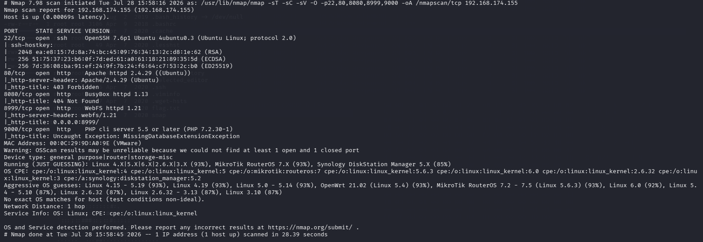

发现除了22是ssh服务，80，8080，8999，9000都是http服务

```
nmap -p22，80，8080，8999，9000 --script=vuln 192.168.174.155 -oA /nmapscan/vuln
```

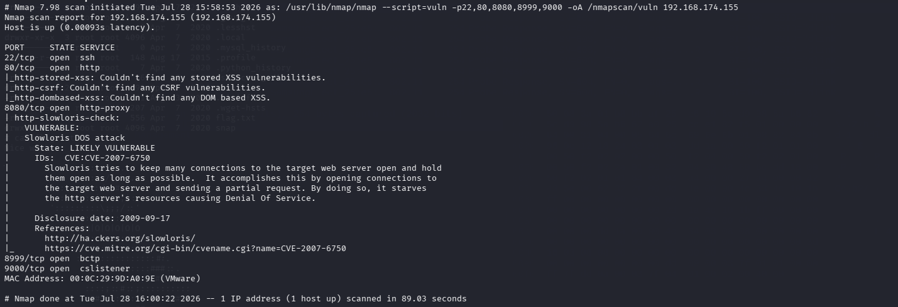

漏洞扫描似乎没什么信息

## 测试

由于都是http服务，就分析每个网页

#### 80端口

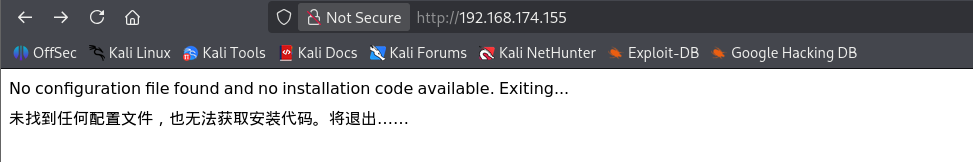

源代码也没有关键信息

```
gobuster dir -u "http://192.168.174.155" -w /usr/share/wordlists/dirbuster/directory-list-2.3-medium.txt -x php,txt,zip
```

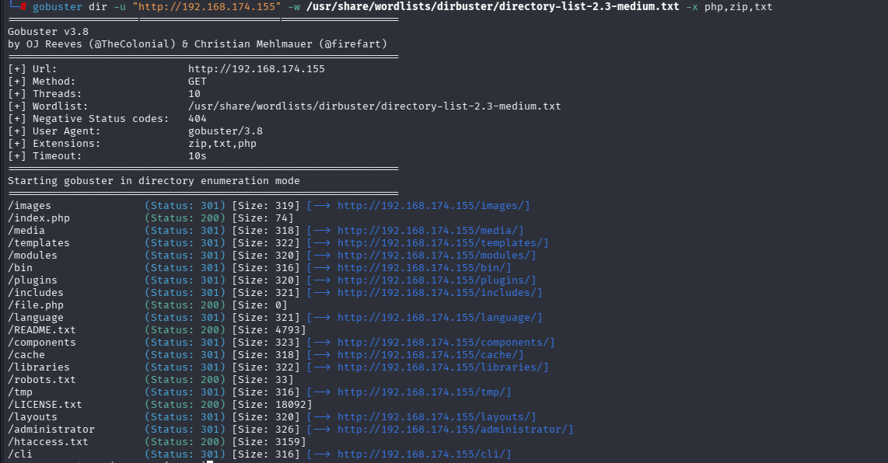

robots.txt:

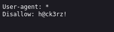

我以为这是一个密码，尝试了root没有用，直到最后也没有用上，我忘记了这也可能是一个目录，之前的靶机也有这样的，虽然我没考虑到，但这个也确实不是目录，只是提一下，因为我忘记了这一点

- 其他的目录，如/htaccess.txt,/LICENSE.txt,/README.txt,/file.php,/index.php信息很多，但都没有用处

#### 8080端口

```
http://192.168.174.155:8080
```

直接进去是404

```
gobuster dir -u "http://192.168.174.155:8080" -w /usr/share/wordlists/dirbuster/directory-list-2.3-medium.txt -x php,txt,zip
```

爆破一下目录。只有file.php和passwords.txt两个文件

file.php可下载

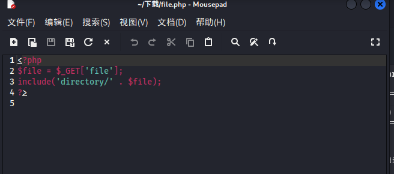

不过应该是没用

passwords.txt

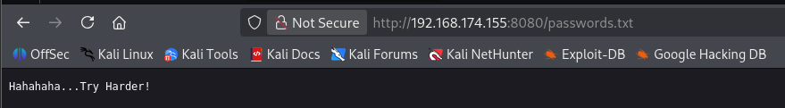

意思让我们再努努力，hh，没招了

8999端口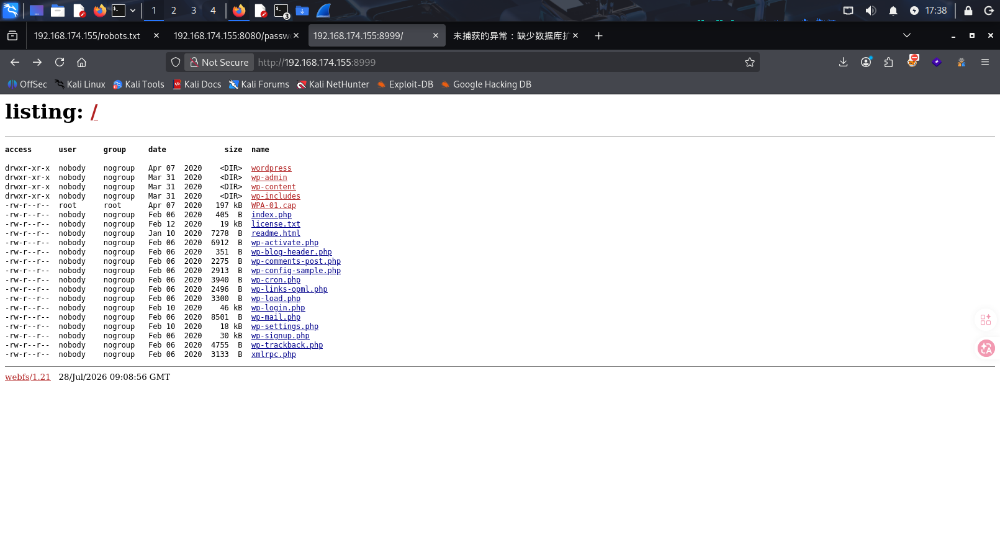

这个可以直接看到目录文件，依次点开查看，点击过程中下载了文件WPA-01.cap

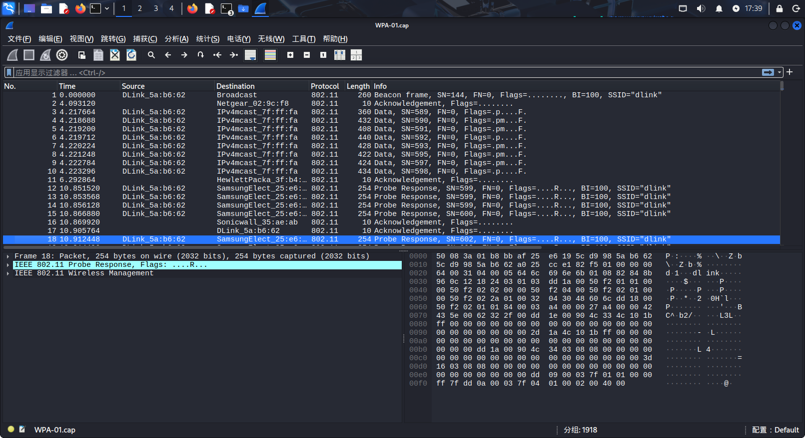

在wireshark中查看，发现协议都为802.11

------

这里讲一下

- 802.11是Wi-Fi的链路层协议，就像有线网络的 Ethernet II。
- 当你使用监听模式（Monitor Mode）抓包时，网卡会将空中全部 Wi-Fi 帧原封不动地交给操作系统，包括管理帧（Beacon、Probe、Auth）、控制帧（RTS、CTS、ACK）以及加密数据帧。
- Wireshark 无法自动解密加密的 Wi-Fi 数据帧，因此这些帧只能显示为 802.11，而不会解析出其内部包含的 TCP/IP。

**简单类比**：这就像你拿到了一个加密的 ZIP 包，Wireshark 只能告诉你“这是个 ZIP 文件”，但打不开看不到里面的 Word 文档，直到你提供密码。

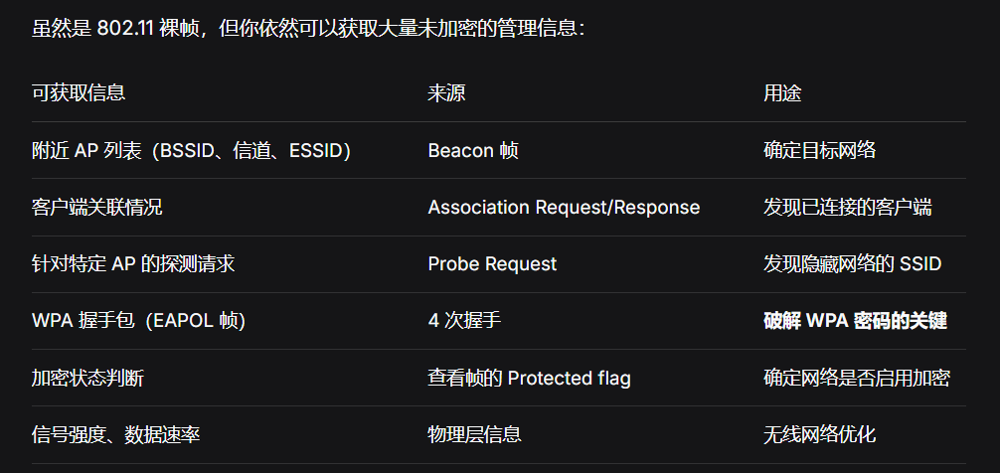

要想让 Wireshark 解析出 TCP、HTTP 等协议，你需要**提供解密密钥**，对加密数据帧进行解密。

#### 条件

- 你已捕获有效的 **4 次握手包（EAPOL 4-way handshake）**。
- 你已通过 aircrack-ng 等工具破解出 **WPA/WPA2-PSK 密码**（即 Wi-Fi 密码）。

#### 解密步骤（Wireshark 中操作）

1. 打开 Wireshark，进入 `Edit` → `首选项` → `Protocols` → `IEEE 802.11`。
2. 在右侧 `Decryption Keys` 区域，点击 `Edit...`。
3. 添加解密密钥，格式为：wpa-pwd:password:SSID

`password`：你破解出的 Wi-Fi 密码

`SSID`：目标网络名称（区分大小写）

4.确认后，Wireshark 会重新解析，此时 **Protocol 列将出现解密后的协议**，如 `TCP`、`HTTP`、`DNS`，你就可以分析明文流量了。

**替代方法**：使用 `airdecap-ng` 命令行工具先解密再分析。

```
airdecap-ng -p <password> -e <SSID> capture.cap -o decrypted.cap
```

------

- 其中essid是info一栏的的SSID，指网络名称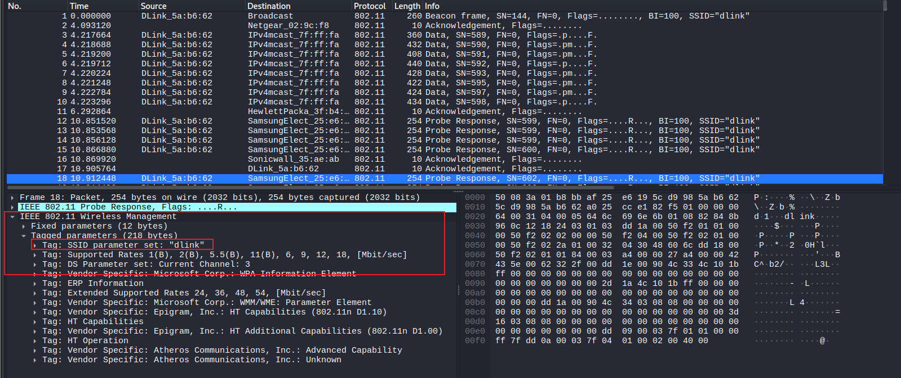

也可以在这里看，也就是dlink

- 而bssid是Wi-Fi接入点（AP）的MAC地址

接下来要破解这个wireshark包含的原始数据帧，用到了aircrack-ng这个工具

```
aircrack-ng -e dlink -w /usr/share/wordlists/rockyou.txt WPA-01.cap
```

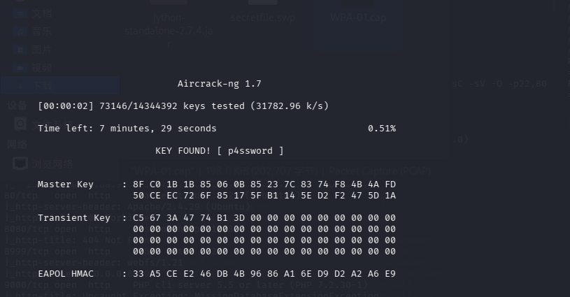

得到密码p4ssword

（这里其实我有一个疑惑，就是我既然知道了Wifi密码和网络名称，就想尝试能不能把这个wireshark原始数据包帧给破解了，但一直没有用，等日后我看看官方文档）

这里不是我自己做出来的，参考了一下别人的博客才知道，直接把dlink当作作用，以及这个Wifi名称对应的密码p4ssword尝试登录ssh

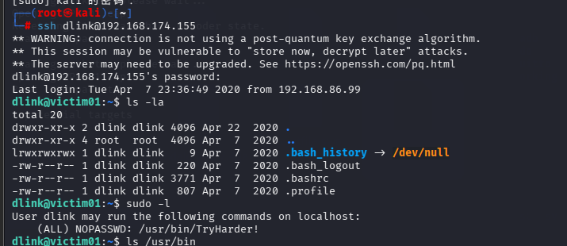

结果就是成功登录

```
find / -perm -u=s -type f 2>/dev/null
```

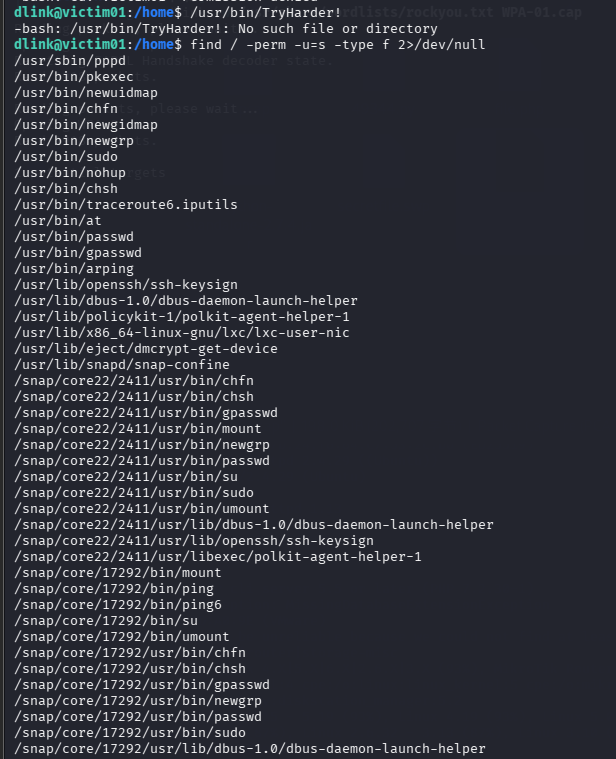

查找左右suid权限的命令，看到nohup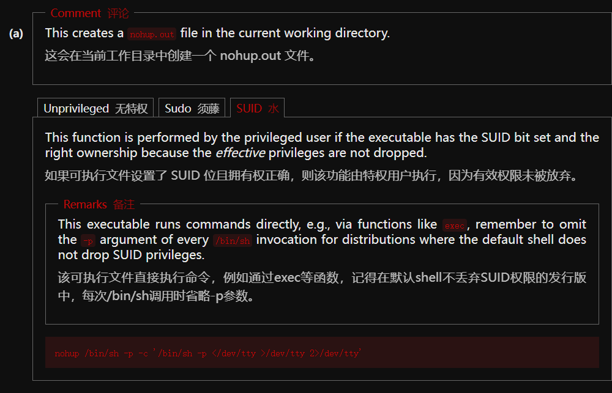

在GTFObins上找到对应的提权方式

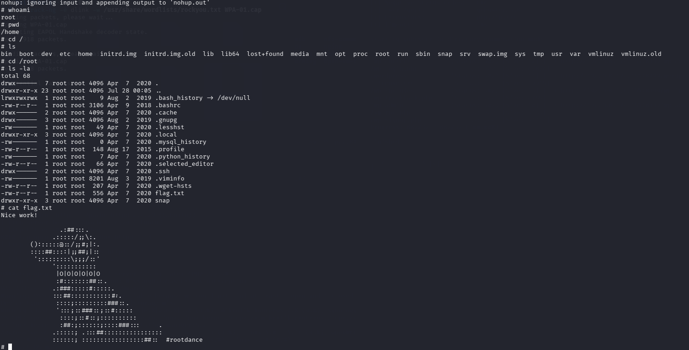

成功拿到root