### 信息收集

```
nmap -sn 192.168.174.0/24
```

确定主机ip 192.168.174.151

```
nmap -p- --min-rate 10000 192.168.174.151
```

得到端口号22，80，139，445

```
nmap -sT -sC -sV -O -p22,80,139,445 192.168.174.151 -oA /nmapscan/tcp
```

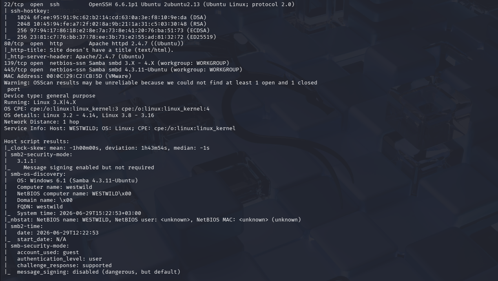

```
nmap --script=vuln -p22,80,139,445 192.168.174.151 -oA /nmapscan/vuln
```

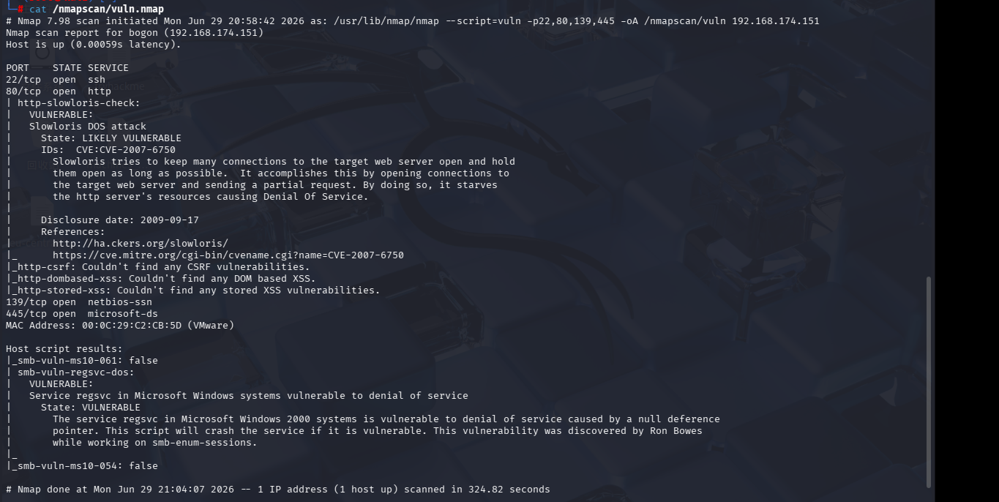

#### 22端口

```
hydra -L /usr/share/wordlists/rockyou.txt -P /usr/share/wordlists/rockyou.txt ssh://192.168.174.151 
```

放个爆破直接过了，反正也是最后考虑的

#### 80端口

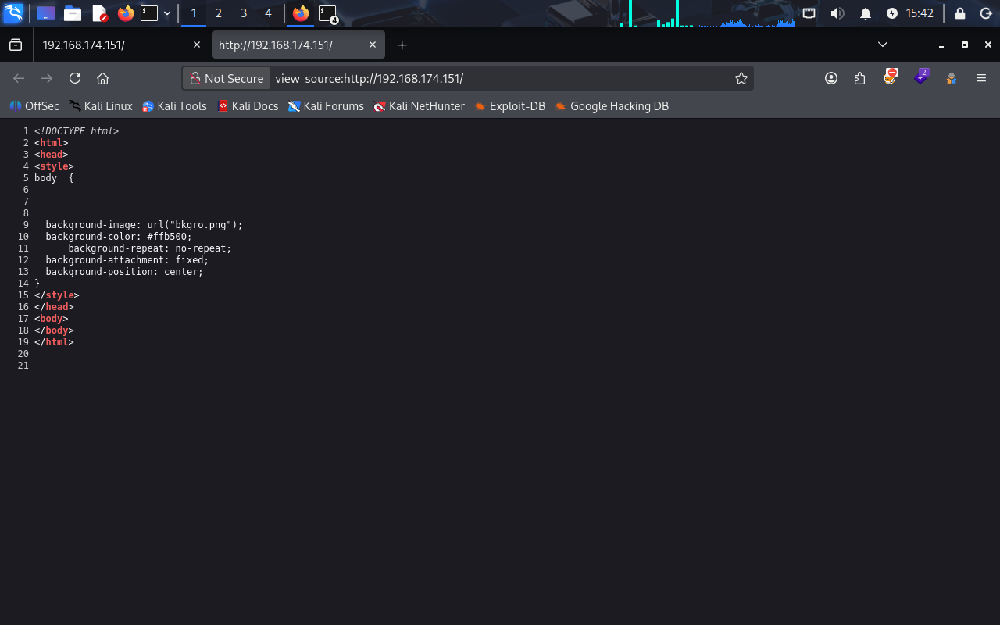

除了一张图片没其他信息

```
gobuster -u http://192.168.174.151 -w /usr/share/wordlists/dirbuster/directory-list-2.3-medium.txt -x php,txt,zip
```

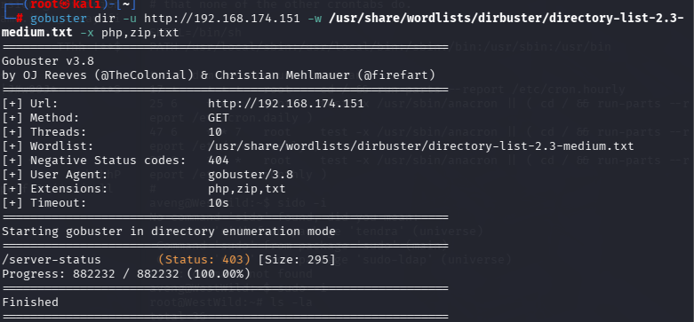

也没有什么有用信息，nmap的扫描结果关于80端口没有关键信息

#### 139，445端口


Samba协议默认使用端口445/tcp（以及旧的139/tcp NetBIOS）

nmap的扫描结果也指示都是Samba服务

那就先针对Samba进行渗透

- ```
  smbmap -H 192.168.174.151
  ```

  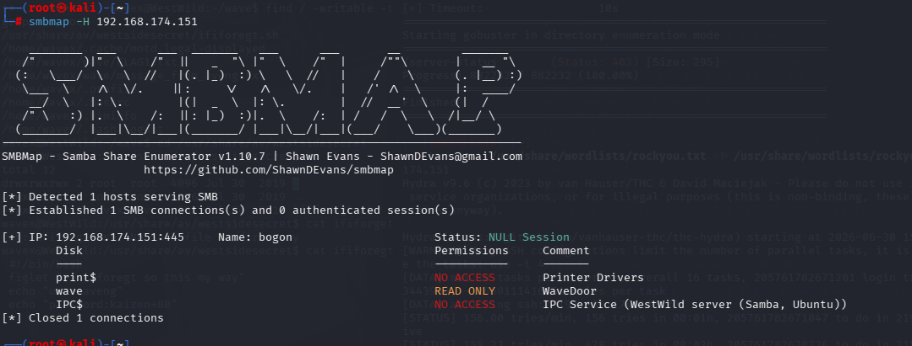

存在一个只能读的wave目录

- ```
  enum4linux -a 192.168.174.151
  ```

  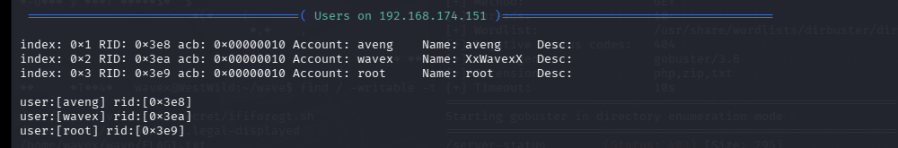

得到三个用户，分别是root，aveng，wavex

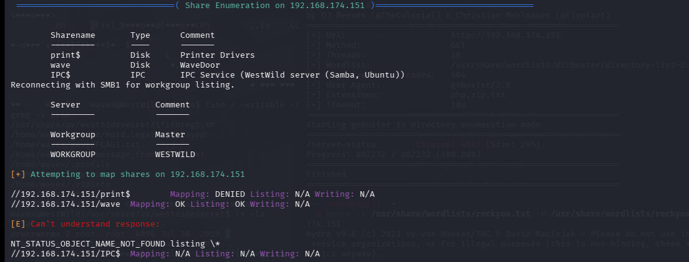

 这里显示的/wave目录有监听，写入权限（这个mapping我不知道是啥）

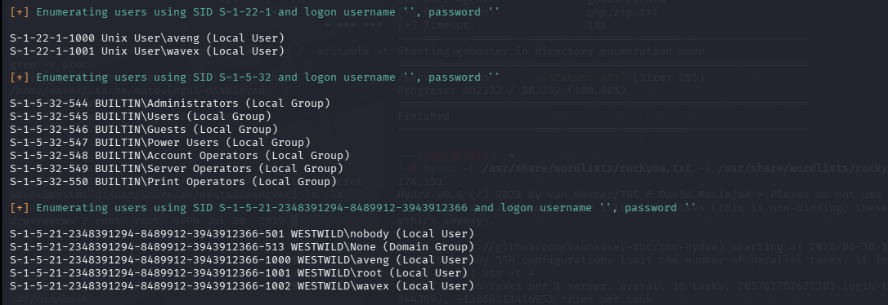

这是总信息

- ```
  smbclient //192.168.174.151/wave
  ```

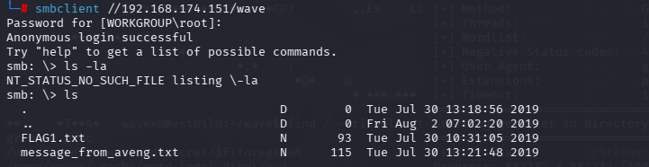

将两个文件下载下来（可以用get，也可以用mget，区别是mget可以多选）

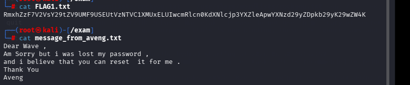

查看两个文件，第一个明显是加密后的，第二个大致意思是aveng忘记了自己的密码，那我们后续的任何可能与aveng也有关

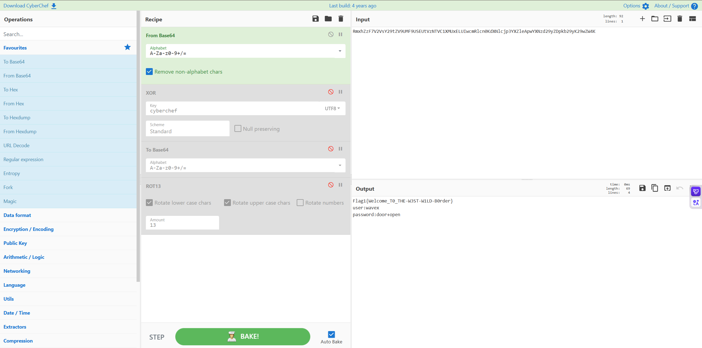

通过base64解密得到用户和密码，以及第一个flag

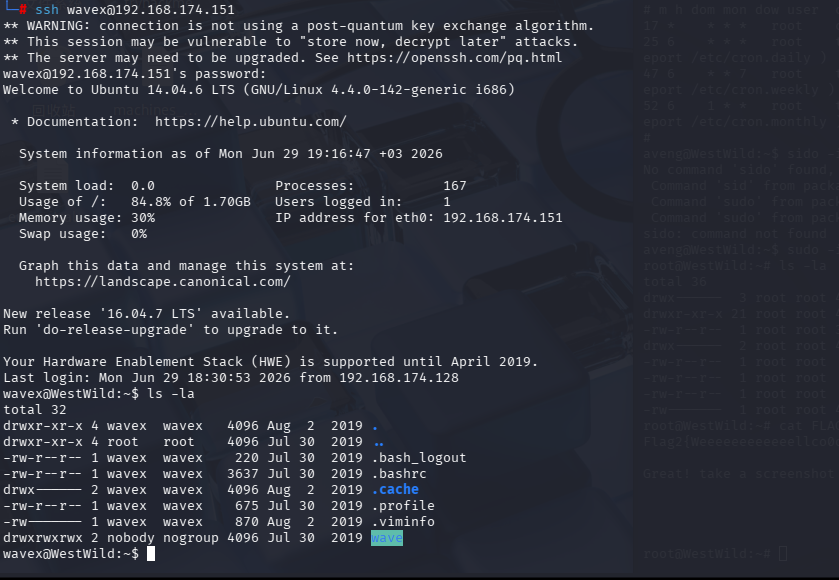

成功登录

接下来收集wavex用户的信息

也就是尝试

- find /-perm -u=s -type f 2>/dev/null 
- find / -writable -type f 2>/dev/null | grep -v sys | grep -v proc
- sudo -l
- cat /etc/crontab
- getcap -r / 2>/dev/null(whereis getcap)

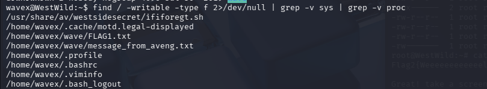

在查找可写文件时，有一个目录包含了secret这个关键单词（我自己在进行这个机器时差点忽略）

```
cat /usr/share/av/westsidesecret/ififoregt.sh
```

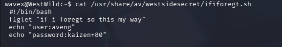

得到aveng的密码

```
su aveng
```

切换用户

```
sudo -l
```

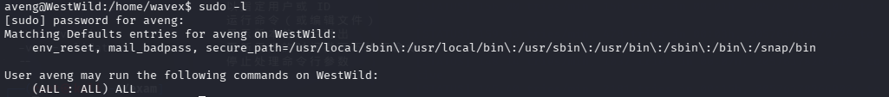

从这里的信息我们知道可以直接切换成root

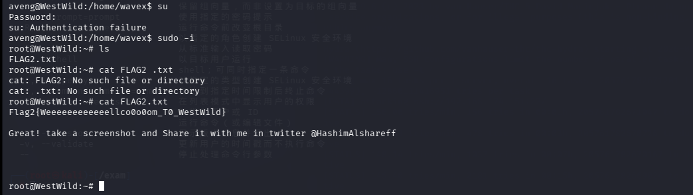

成功提权

------

这里补充一个知识点

sudoers 权限语法  (用户:组) 允许命令  完整拆解

语法模板：
 用户名  主机=(可切换用户:可切换用户组)  可执行命令列表 

三个ALL分别对应3个位置，作用完全独立

1. 第一个 ALL： (ALL : xxx)  → 括号左半，可切换目标用户

- 含义：执行 sudo -u 用户名 时，能切换到哪个系统用户
- 取值示例：
-  (ALL) ：可以切换系统里任何用户（root、www-data、mysql等）
-  (root) ：仅能切换root，不能切其他普通用户
-  (www-data) ：只能切换网站服务用户，拿不到root

2. 第二个 ALL： (xxx : ALL)  → 括号右半，可切换目标用户组

- 含义：执行 sudo -g 用户组 时，能切换到哪个用户组
- 取值示例：
-  (:ALL) ：可以切换系统任意用户组（root组、docker组等）
-  (:root) ：仅能切换root组
-  (:docker) ：仅能切换docker组

3. 末尾的 ALL：命令段，允许执行的程序

- 含义：当前用户能sudo运行哪些命令
- 取值示例：
-  ALL ：无限制，系统所有二进制程序都能sudo执行
-  /usr/bin/cat ：仅允许sudo cat，其他命令无权
-  !/usr/bin/su, ALL ：允许所有命令，但禁止sudo su切换root

 

替换不同值的典型场景对比

场景1：你截图里完整权限  aveng ALL=(ALL:ALL) ALL 

1. 能切任意用户、任意组；
2. 能执行所有命令；
3. 输入 sudo -i 直接拿root，完全无限制。

场景2：限制仅切root，所有命令  aveng ALL=(root) ALL 

- 只能sudo到root，不能切换www-data等其他用户；
- 依然能执行任何root权限命令，还是能提权。

场景3：仅允许执行指定命令  aveng ALL=(root) /usr/bin/cat 

- 只能 sudo cat 文件 ，不能sudo su、sudo bash；
- 只能读取文件，无法完整获取shell，提权难度极高。

场景4：限制组、限制命令  aveng ALL=(root:docker) /usr/bin/docker 

- 只能切root用户、docker组；
- 仅能sudo docker，可通过docker镜像挂载宿主机目录逃逸root。

场景5：仅切换普通用户，无root权限  aveng ALL=(www-data) ALL 

- 只能切网站用户，无法切换root，不存在提权到管理员的可能。

 

补充渗透测试重点考点

1. 只要括号第一个参数包含  root ，且命令段是  ALL ，基本都能直接拿到root shell；
2. 命令段如果只给单一程序（如vim、find、less），可查GTFOBins利用该程序逃逸root；
3. 第二个组参数日常渗透很少用到，绝大多数提权只关注可切换用户和允许命令。