[TOC]

## 信息收集

```
arp-scan -l
nmap -p- --min-rate 10000 192.168.174.166
```

开放了80和22端口

- 分别进行tcp详细扫描，漏洞扫描和udp扫描

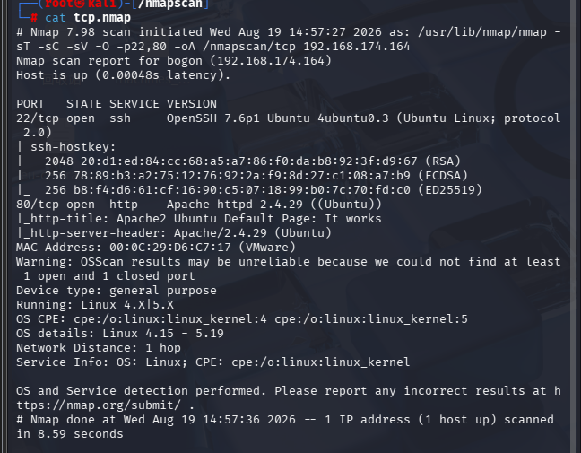

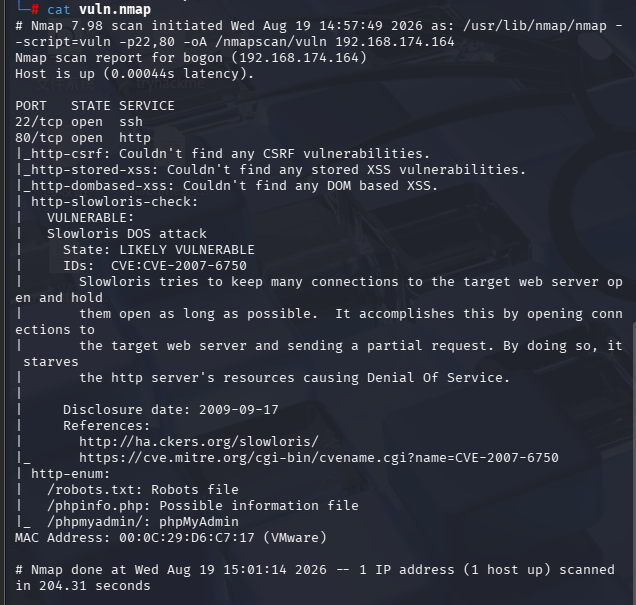

漏洞扫描中发现存在dos漏洞，这个我们不考虑，其次枚举出了robots.txt,phpinfo.php,phpmyadmin三个目录

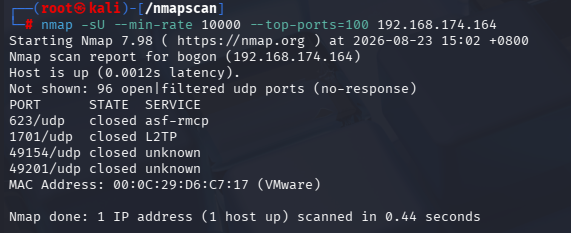

udp扫描没有什么有用的端口

## 80端口分析

初步扫描没有结果就重点分析80端口

- 先进行目录枚举（以后还是建议用gobuster和dirb两个工具，这个靶机又是因为我只用了gobuster导致关键目录没有找出来）,gobuster枚举的都是一级目录，dirb枚举的目录层级更高

- ```
  gobuster dir -u "http://192.168.174.166" -w /usr/share/wordlists/dirbuster/directory-list-2.3-medium.txt -x php,txt,zip
  ```

  

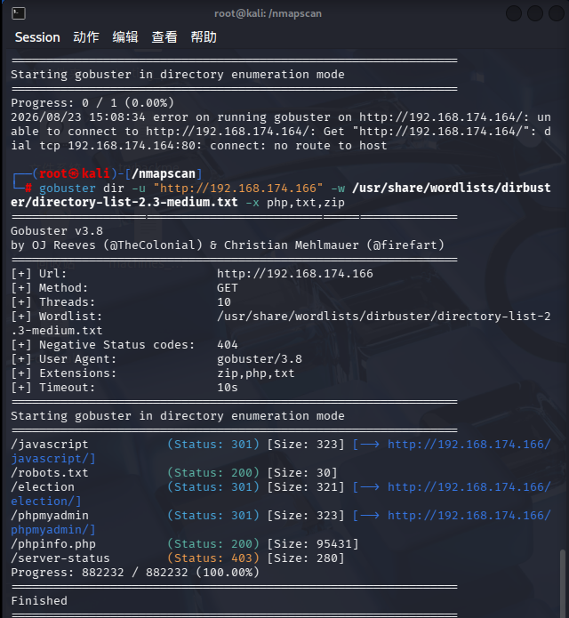

- ```
  dirb http://192.168.174.166 /usr/share/wordlists/dirb/big.txt
  ```

  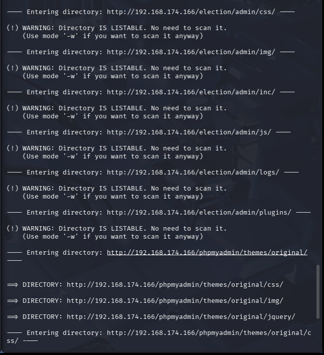

- gobuster枚举的目录中robots.txt有一些类似用户名的东西，但没什么用，phpmyadmin是一个数据库管理登陆页面，/election是一个投票目录

- dirb枚举的目录信息非常多，不过有一个目录非常明显

  ```
  http://192.168.174.166/election/admin/logs/
  ```

  很明显是一个日志

查看一下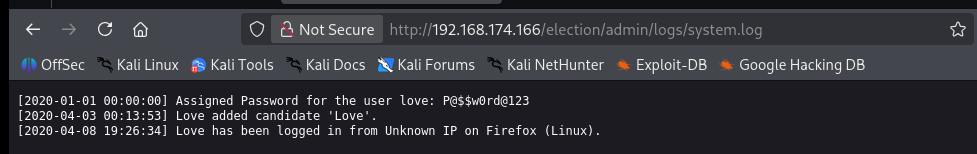

发现了账号love的密码

- 尝试登录数据库或者连接ssh

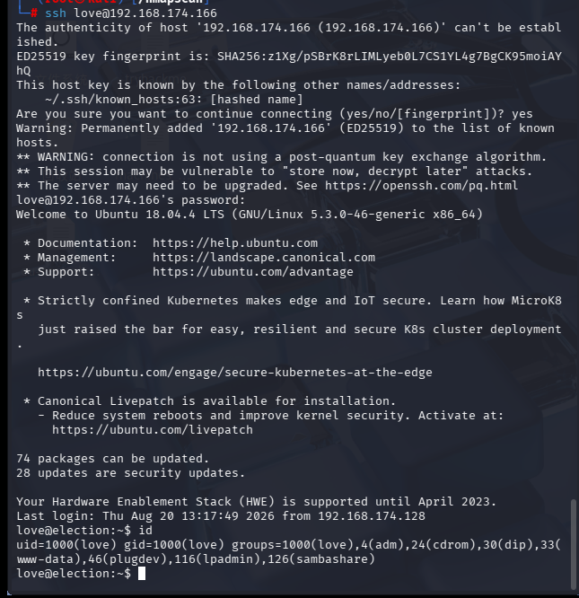

成功登录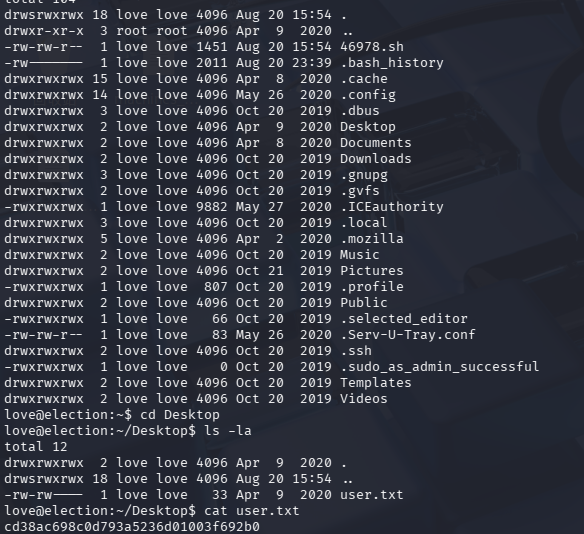

查看用户下的文件，在Desktop目录下发现一个user.txt

## 实践思路

这里讲一下我自己做的思路，先进行一系列的信息收集

```
uname -a
cat /proc/version
cat /etc/issue
find / -perm -u=s -type f 2>/dev/null
find / -writable -type f 2>/dev/null | grep -v sys | grep -v proc
getcap -r 2>/dev/null
cat /etc/crontab
```

我自己没有发现什么重要信息（实际上重要线索在搜索suid权限的过程中），接下来查看home目录和/var/www/html下的文件，寻找线索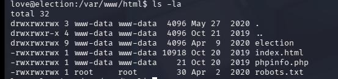

在/var/www/html下的目录文件都是网站上的信息，因为我们在默认网页上有许多未知的信息，所以我觉得应该有线索

- 由于文件信息过多，我实际过程没有找到有效信息，参考大佬的wp发现这个文件有重要信息

  ```
  /var/www/html/election/admin/inc
  ```

  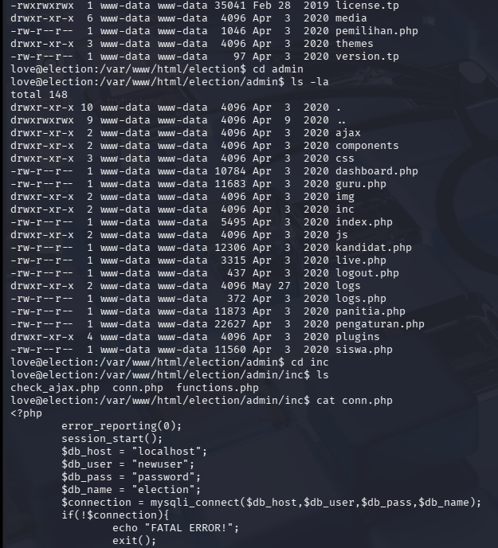

发现里面包含了数据库的用户名和密码

```
newuser:password
```

我们可以选择在phpmyadmin上直接登录，也可以

```
mysql -u newuser -p
```

在love用户的shell中直接连接数据库

```
show databases;
```

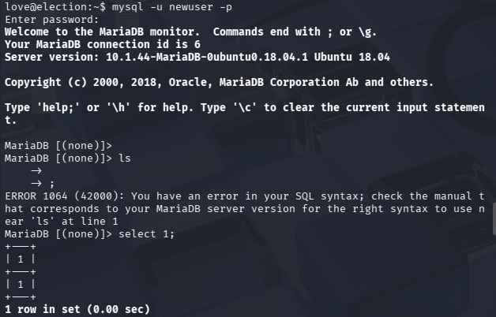

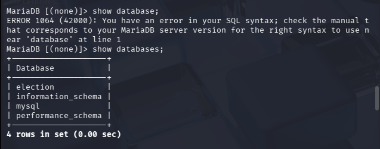

```
use mysql
```

转换到mysql数据库

```
show tables;
```

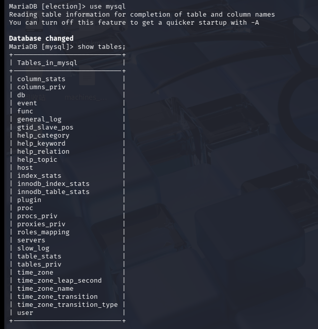

发现有一个user表

```
select * from user;
```

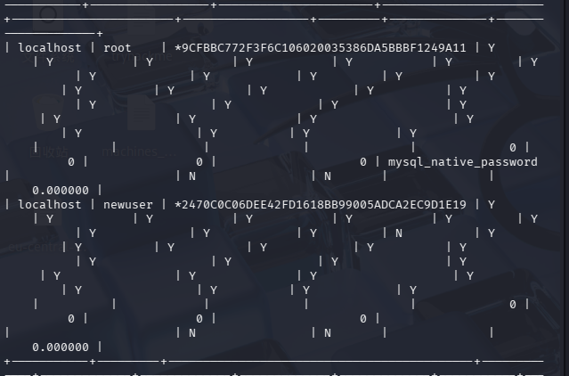

f发现了root的加密密码，经过破解后是明文toor

- 不过也到此为止了，因为即使拿到root的密码也无法登录，数据库可以，但是ssh不能，love用户有没有直接提升权限的功能

## 正确思路

```
find / -perm -u=s -type f 2>/dev/null
```

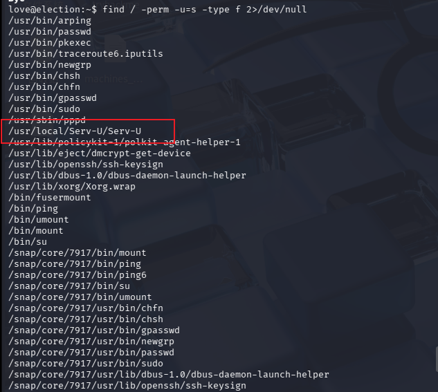

发现一个特殊的文件（虽然我并不知道为啥特殊哈），查看这个目录下的文件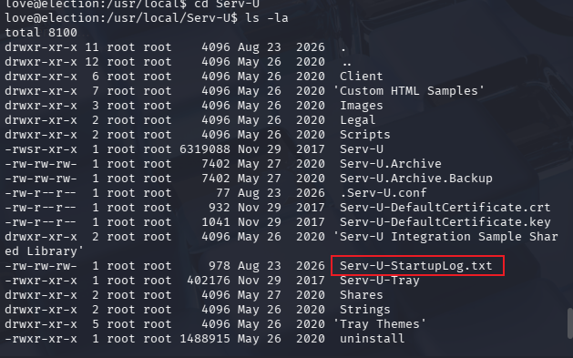

发现一个txt文件，查看一下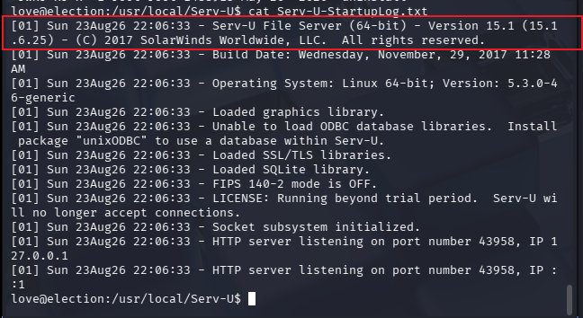

这个玩意有一个版本号，是15.1，搜索一下

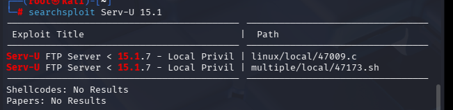

结果还真有对应的本地提权漏洞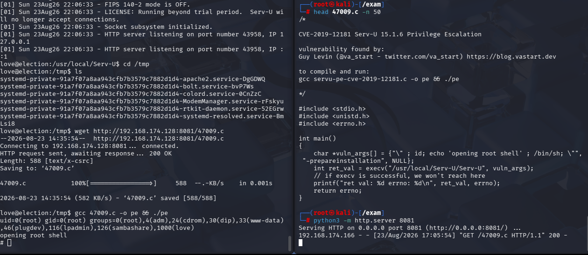

下载到本地后查看一下怎么使用，然后打开本地http服务，love用户切换到/tmp目录，方便下载

```
gcc 47009.c -o pe && ./pe
```

直接运行，成功提权

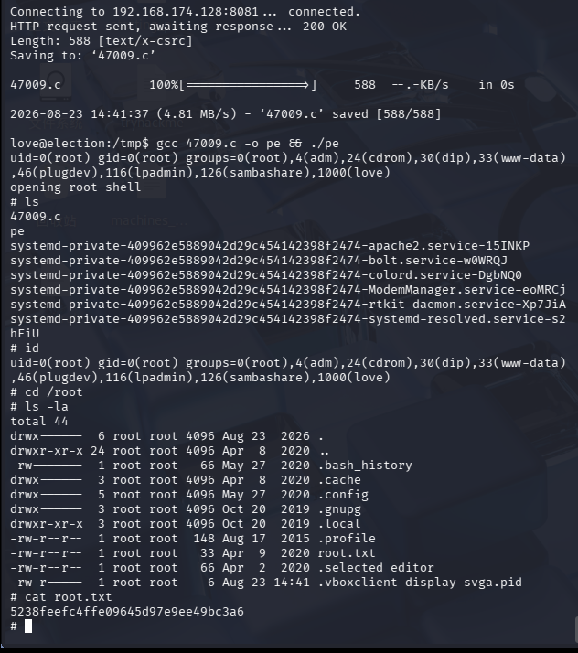

成功拿到flag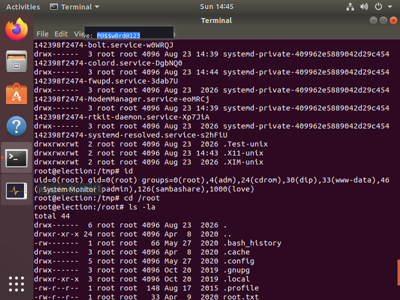

顺便去靶机里玩一会
