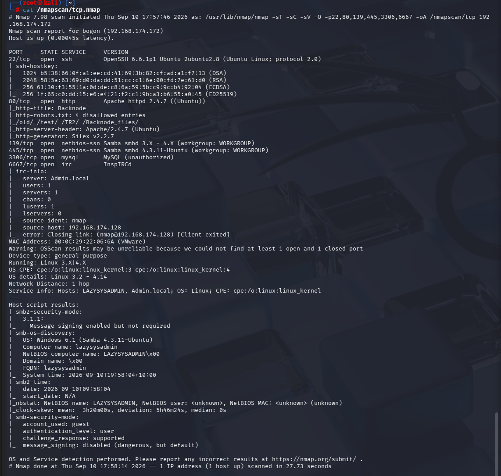
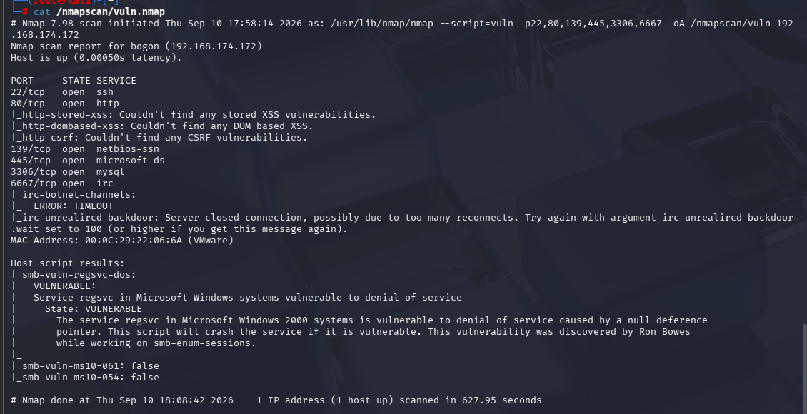
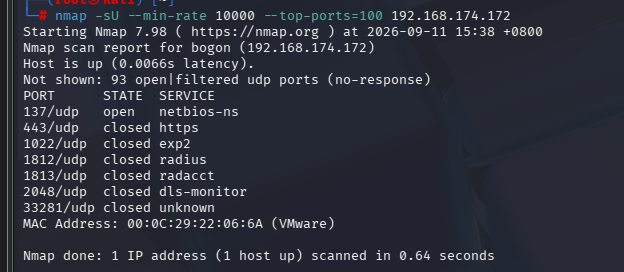
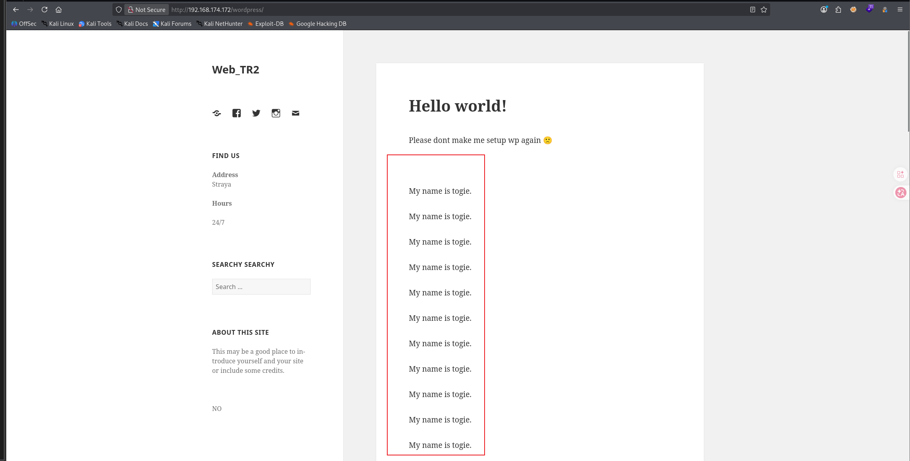
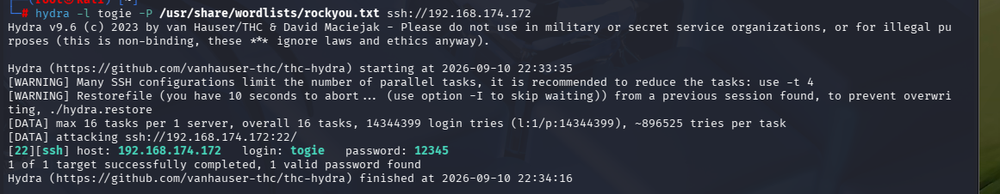
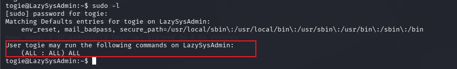
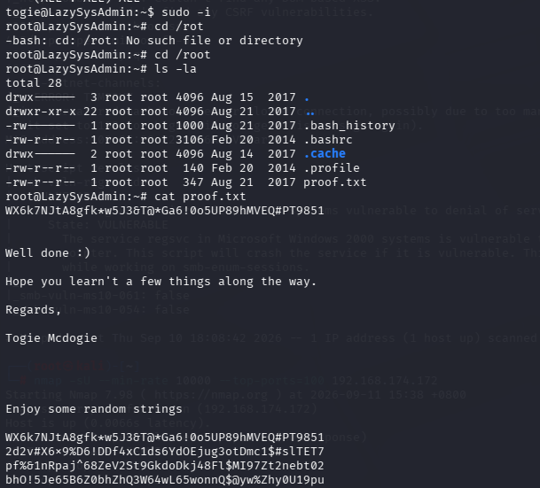

[TOC]

这个靶机总体简单，感觉有点不符合水平

# 信息收集

```
arp-scan -l
```

得到ip：192.168.174.172

```
nmap -p- --min-rate 10000 192.168.174.172 | awk -F ' ' '{print$1}' | awk -F '/' '{print$1}' | tr '\n' ','
```

得到结果22,80,139,445,3306,6667

分别进行tcp详细扫描，漏洞扫描和udp扫描

## TCP详细扫描



- 139和445端口开放，可以从samba协议考虑
- 80端口枚举了robots.txt文件
- 3306mysql端口开放，可以尝试爆破

## 漏洞扫描



没有有效信息

## UDP扫描



没有效信息

# 80端口分析

这个靶机就是很奇怪，我尝试了enum4linux分析没有结果，/robots.txt的四个目录也没什么用，只有gobuster或者dirb枚举出的目录有一个/wordpress,访问一下



我尝试过社工信息收集，各种访问源代码，枚举目录，不过没想到只是因为togie这个名字一直在重复，所以可以把他作为一个用于爆破的用户名

- 爆破mysql和ssh

```
hydra -l togie -P /usr/share/wordlists/rockyou.txt ssh://192.168.174.172
```



# ssh连接

拿到用户shell也是非常简单啊

直接

```
sudo -l
```



- 可以运行任意命令，可以成为任何组，任何用户

```
sudo -i
```



拿到root