在开始打靶机之前就先遇到了一个问题，我发现很多靶机都这样，这里同一总结一下关于靶机找不到ip，端口扫不出的问题

### 网卡配置

靶机开机后按住shift，出现界面如图，按e键进入安全模式：

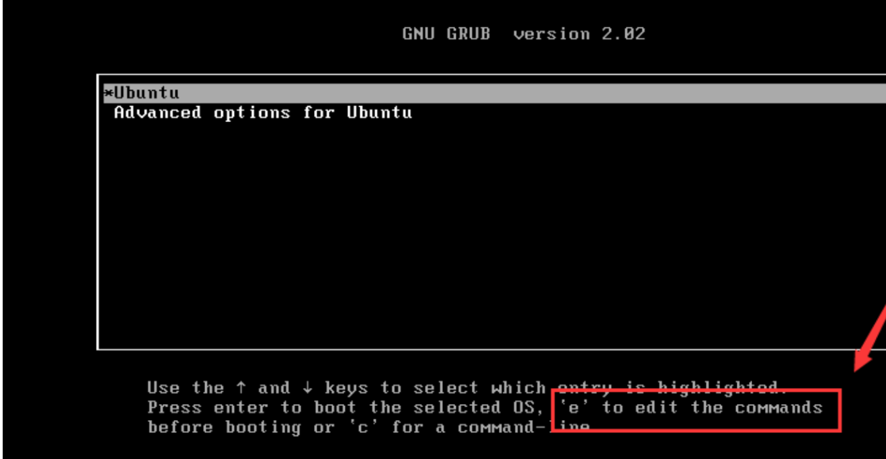

**找到ro，删除该行后边内容，并将ro 。。。修改为：** `rw signie init=/bin/bash`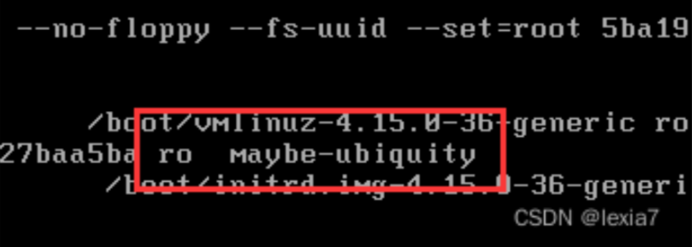

替换后

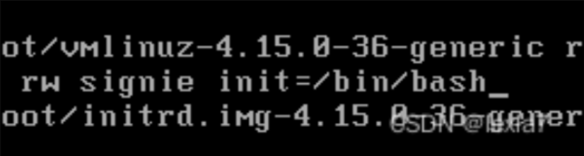

按`ctrl+x`进入bash

输入指令`ip a`查看当前网卡，除lo外的，记住名字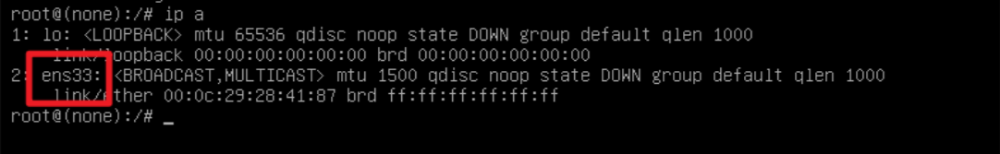

首先查看/etc/network/文件目录下是否有interfacers文件

如果没有interfaces文件或者文件内容为：

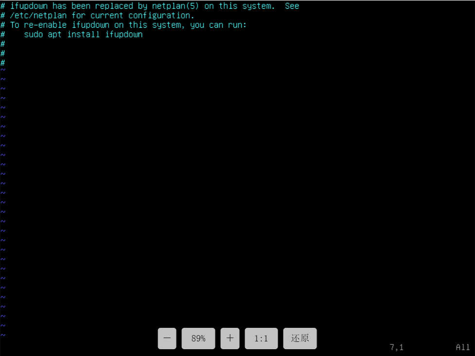

退出编译，查看/etc/netplan的内容：

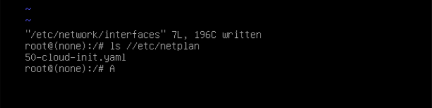

看到`.yaml`文件，对其进行编辑，将框内内容改为`ip a`的网卡名称

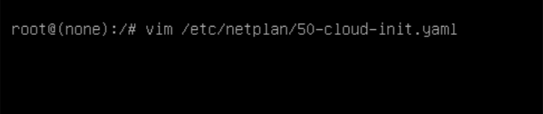

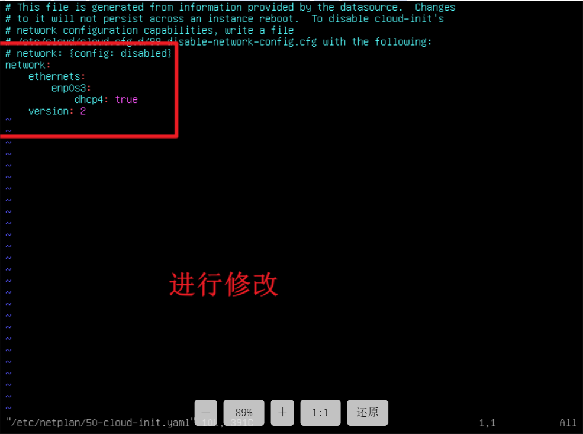

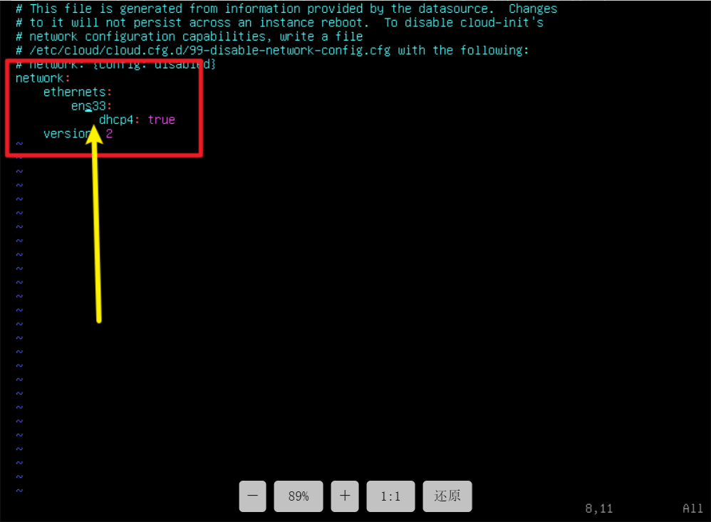

保存之后直接重启系统，大功告成

- 这个流程只根据这个靶机，其他另外总结，流程是这样

### 信息收集

```
nmap -p- --min-rate 10000 192.168.174.152
```

有两个端口，分别为22，80

```
nmap -sT -sC -sV -O -p22,80 192.168.174.152 -oA /nmapscan/tcp
```

```
nmap --script=vuln -p22,80 192.168.174.152 -oA /nmapscan/vuln
```

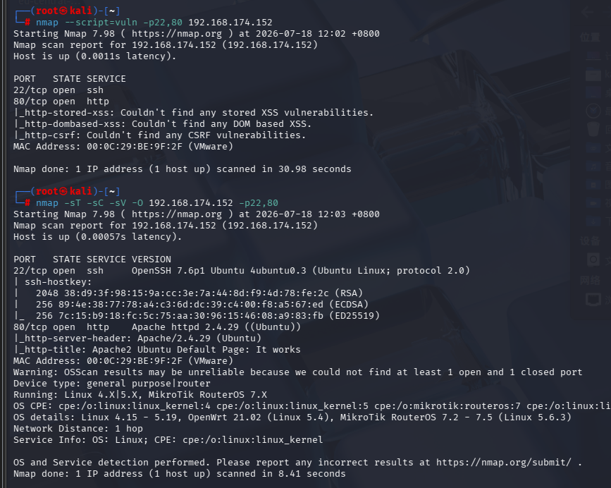

都没有发现什么重要信息

#### 22端口

先不考虑

#### 80端口

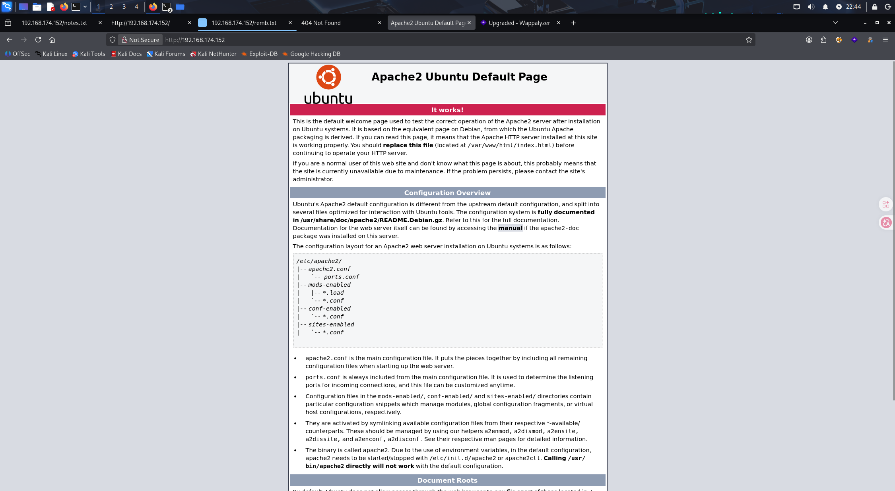

只是一个apache服务页面，没有什么特别信息

- 进行fuzz测试，没有结果

- ```
  gobuster dir -u "http://192.168.174.152" -w /usr/share/wordlists/dirbuster/directory-list-2.3-medium.txt
  ```

  

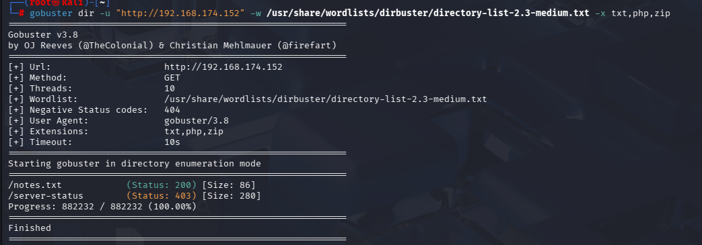

- 查看notes.txt

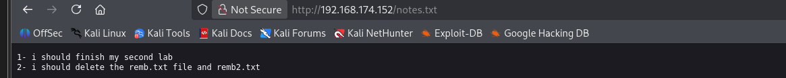

- 查看remb.txt和remb2.txt

#### remb.txt

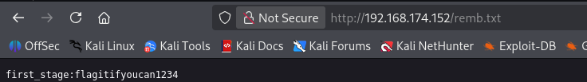

#### remb2.txt

显示404没有

## ssh登录

用从remb.txt中得到的账户密码登录

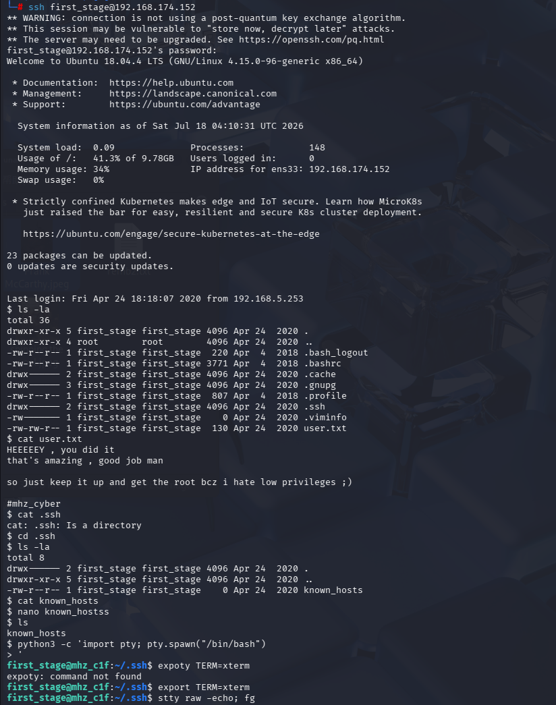

想得到完整终端功能

一般步骤

```
python3 -c 'import pty; pty.spawn("/bin/bash")'
export TERM=xterm
stty raw -echo; fg
```

(这个靶机只用第一条命令就可以正常使用了)

##### 先收集信息

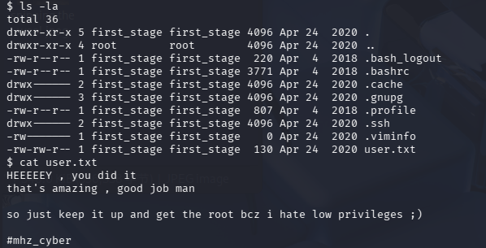

- 得到第一个flag，起初我以为这个最后一行注释是什么密码，但到最后也没用

- 在first_stage用户下的文件依次查看，均没有重要信息

随后按以下步骤依次查看

- sudo -l
- 

- id
- 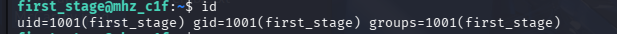

- uname -a
- 

- find / -writable -type f 2>/dev/null | grep -v sys | grep -v proc
- 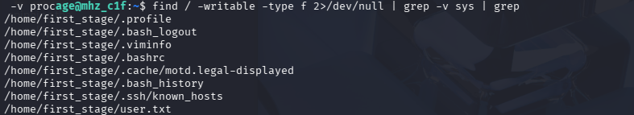
- find / -perm -u=s -type f 2>/dev/null
- 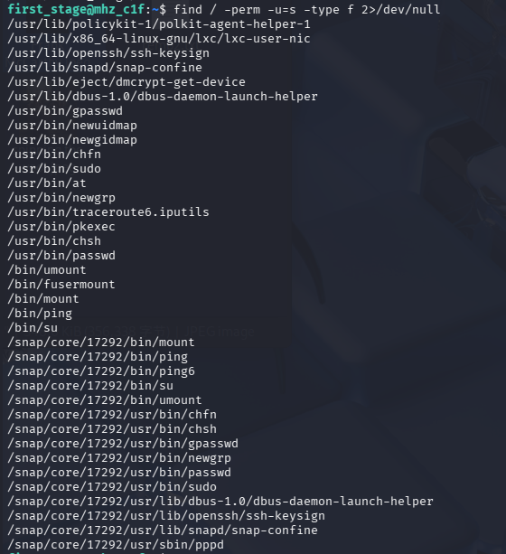
- getcap -r / 2>/dev/null
- 
- cat /etc/crontab
- 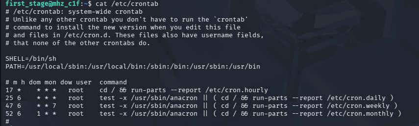

经过以上很多尝试均没有结果

接下来尝试一下直接看其他用户的信息

```
cd /home
ls -la
```

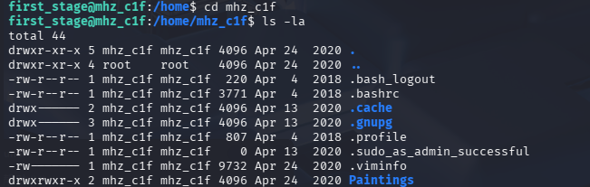

发现可疑文件夹Paintings

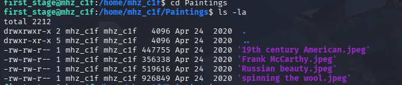

发现里面有四张图片，而且我们有读的权限

```
scp first_stage@192.168.174.152:/home/mhz_c1f/Paintings /exam
```

(这是ssh中下载连接机器文件的命令，前提是我们要有对应文件的读权限)

