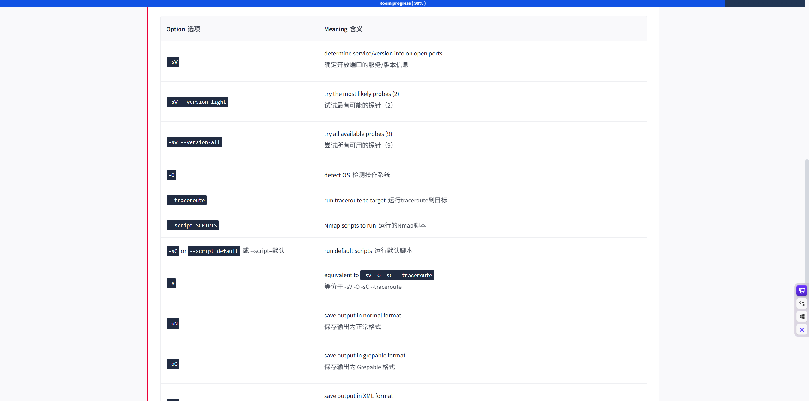
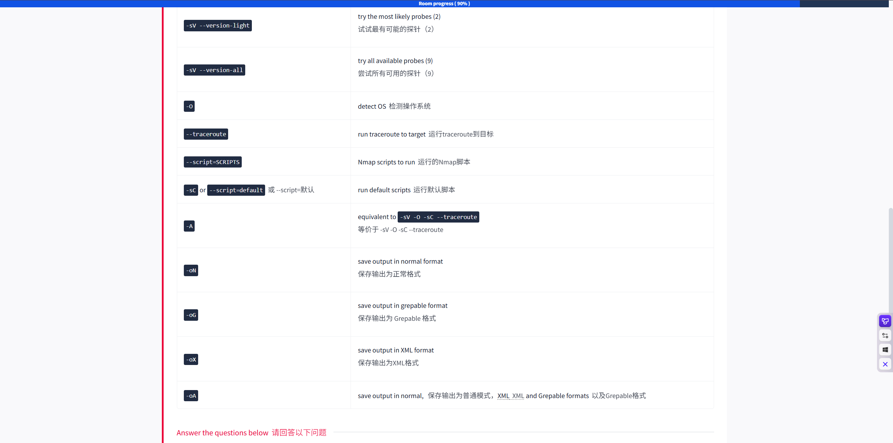

Nmap主要提供三种结构化输出方式（-oN、-oX、-oG），分别针对**人工阅读、程序解析、命令行过滤**三种场景优化 [5.1, 5.3]。

Nmap三种主要输出方式的区别

| 输出类型     | 参数  | 描述                                       | 适用场景                                    |
| :----------- | :---- | :----------------------------------------- | :------------------------------------------ |
| **常规输出** | `-oN` | 类似屏幕显示，信息详尽、格式易读。         | **人工快速查看**、报告记录 [5.1, 5.2]       |
| **XML输出**  | `-oX` | 结构化数据，内容最全面，便于机器解析。     | **自动化脚本解析**、导入 Zenmap [5.1, 5.3]  |
| **Grepable** | `-oG` | 一行一个目标，所有信息拼接，适合grep过滤。 | **Linux命令行快速筛选**主机/端口 [5.1, 5.3] |

------

\1. 常规输出 (-oN)

- **特点：** 生成一个文本文件，内容与在屏幕上看到的交互式输出一致 [5.2]。
- **优点：** 可读性最好，适合安全审计报告。
- **缺点：** 不容易用脚本编程处理。

\2. XML 输出 (-oX)

- **特点：** 使用 XML 格式记录扫描结果，包含详细的技术细节 [5.3]。
- **优点：** 兼容性强，是自动化工具（如 Nessus、Zenmap）读取的标准格式 [5.1]。
- **缺点：** 人工阅读较困难，文件体积相对较大。

\3. Grepable 输出 (-oG)

- **特点：** 每个主机占用一行输出，将该主机的所有开放端口、系统信息等整合在一起。
- **优点：** 极其适合 Linux 命令行下的 `grep`、`awk`、`cut` 等工具进行特定状态的主机查找 [5.3]。
- **缺点：** 格式比较特殊，需要对 grep 操作比较熟悉。

总结与使用建议

- **追求全面：** 使用 `-oX` 或 `-oA`（同时输出三种格式） [5.2]。
- **追求人工查看：** 使用 `-oN`。
- **追求快速过滤：** 使用 `-oG`。