## hostname

```
hostname
```

命令会返回目标机器的主机名。虽然该值可以轻易更改或字符串相对无意义（例如 Ubuntu-3487340239），但在某些情况下，它可以提供目标系统在企业网络中的角色信息（生产 SQL 服务器的 e.g. SQL-PROD-01）。

## uname -a

```
uname -a
```

打印系统信息，提供关于系统所用内核的额外细节。这在寻找可能导致权限升级的潜在内核漏洞时非常有用。

## /proc/version

- proc文件系统（procfs）提供关于目标系统进程的信息。你可以在许多不同的Linux版本中找到proc，使其成为你武器库中不可或缺的工具。

- 查看 /proc/version 可能会获得内核版本和额外信息，比如是否安装了编译器（例如 GCC）。

## /etc/issue

系统也可以通过查看 /etc/issue 文件来识别。该文件通常包含操作系统的一些信息，但可以轻松定制或更改。顺便说一句，任何包含系统信息的文件都可以自定义或更改。为了更清楚地理解系统，最好全部查看这些。

## ps Command

```
ps
```

ps命令是查看Linux系统上正在运行进程的有效方式。在终端上输入 ps，可以显示当前 shell 的进程。

ps的输出将显示以下内容

- PID：进程ID（进程唯一）
- TTY：用户使用的终端类型
- Time：进程所占用的CPU时间（这不是该进程运行的时间）
- CMD：命令或可执行文件正在运行（不会显示任何命令行参数）

```
ps -A
```

查看所有正在运行的进程

```
ps axjf
```

查看过程树（请参见下方运行ps axjf前的树状结构）


```
ps aux
```

 aux 选项将显示所有用户的进程（a），显示启动进程的用户（u），并显示未连接到终端的进程（x）。通过查看ps辅助指令的输出，我们可以更好地理解系统和潜在漏洞。

## env

- env命令会显示环境变量。

- PATH变量可能包含编译器或脚本语言（例如Python），可用于在目标系统上运行代码或用于权限升级。

## sudo -l

- 目标系统可以配置为允许用户以root权限运行部分（或全部）命令。sudo -l 命令可以用来列出用户可以用 sudo 执行的所有命令。

## ls

- 在寻找潜在权限提升向量时，请记得始终使用带有-la参数的ls命令。下面的示例展示了如何使用ls或ls -l命令很容易漏掉“secret.txt”文件。

```
ls -la
```

## id

- id 命令将提供用户权限级别和组成员身份的总体概览。
- 值得记住的是，id 命令也可以用来为其他用户获取相同信息，如下所示。

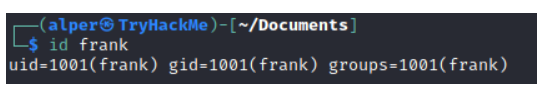

## /etc/passwd

虽然输出可能较长且略显威慑，但可以轻松切割并转换为用于暴力破解的实用列表。

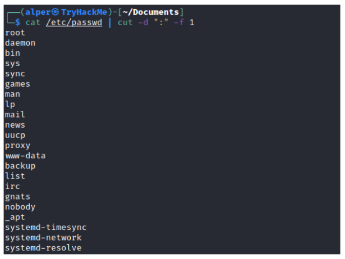

请记住，这将返回所有用户，其中一些是系统或服务用户，这些用户并不太有用。另一种方法是用grep表示“home”，因为真实用户的文件夹很可能都在“home”目录下。

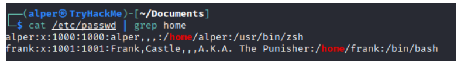

## history

用history命令查看早期命令可以让我们对目标系统有些了解，虽然很少能存储密码或用户名等信息。

## ifconfig

目标系统可能是通往另一个网络的枢轴点。ifconfig 命令会给我们系统网络接口的信息。下面的示例显示目标系统有三个接口（eth0、tun0 和 tun1）。我们的攻击机器能够访问eth0接口，但无法直接访问另外两个网络。

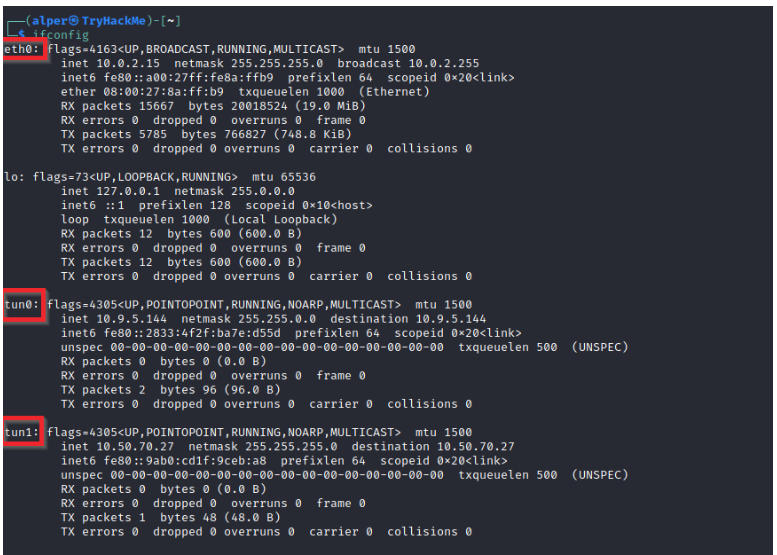

可以通过 ip route 命令确认存在哪些网络路由。

## netstat

```
netstat -a
```

- 显示所有监听端口和已建立的连接。

```
netstat -at
```

or

```
netstat -au
```

- 可用于分别列出 TCP 或 UDP 协议。

```
netstat -l
```

- 将端口列为“监听”模式。这些端口已开放，准备接收来电连接。这可以通过“t”选项只列出使用以下tcp协议(netstat -lt)

```
netstat -s
```

-  列出按协议排列的网络使用统计数据（如下图）这也可以配合 -t 或 -u 选项使用，以限制输出到特定协议。

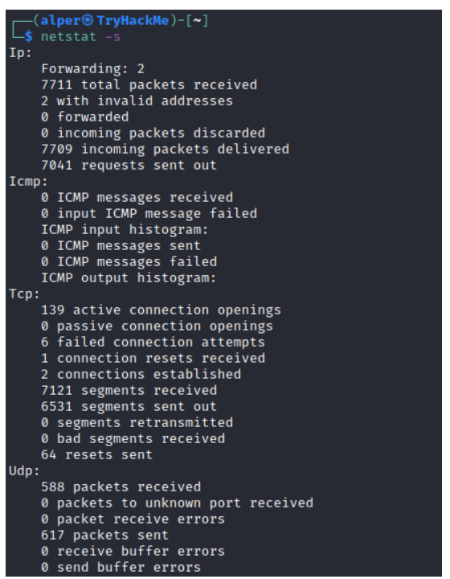

```
netstat -tp
```

- 列出带有服务名称和PID信息的连接

这也可以配合 -l 选项来列出监听端口（见下文）

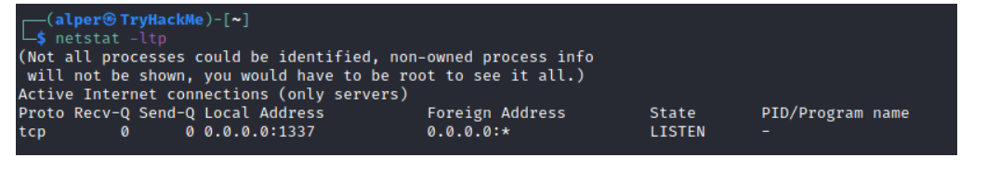

我们可以看到"PID/Program name"列为空，因为该进程由另一用户拥有。

下面是同样的命令，运行root权限，显示为2641/nc（netcat）信息

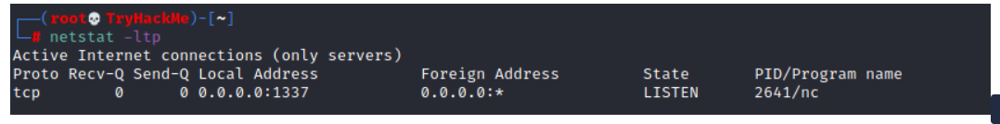

```
netstat -i
```

 显示接口统计数据。我们看到下面“eth0”和“tun0”比“tun1”更活跃。

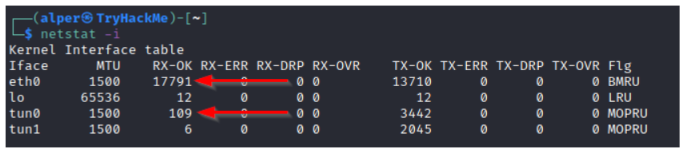

你在博客文章、文章和课程中最常看到的netstat用法是netstat -ano，可以分解如下

- `-a`: Display all sockets ： 显示所有插槽
- `-n`: Do not resolve names ：不要解析名字
- `-o`: Display timers ：显示计时器

## find

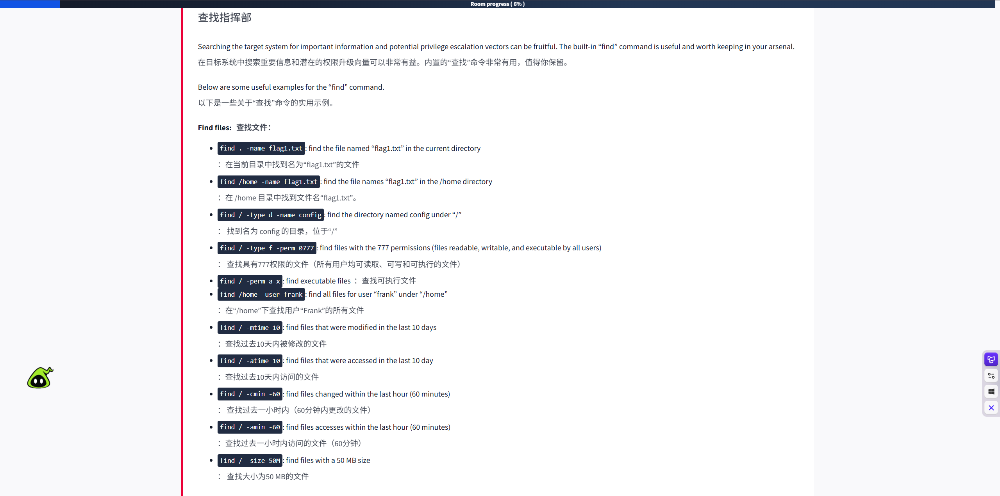

- 该命令也可以配合（+）和（-）符号使用，指定文件大小大于给定大小。

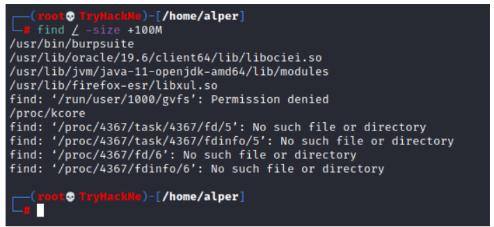

上述示例返回的文件大于100 MB。需要注意的是，“查找”命令往往会产生错误，有时会使输出难以读取。这就是为什么使用带有“-type f 2>/dev/null”的“find”命令将错误重定向到“/dev/null”，并获得更清晰的输出（见下文）。

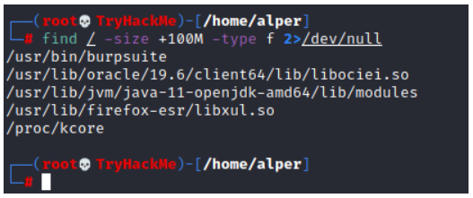

可写入或执行的文件夹和文件：

- `find / -writable -type d 2>/dev/null` : Find world-writeable folders ： 查找可写入的世界文件夹
- `find / -perm -222 -type d 2>/dev/null`: Find world-writeable folders ： 查找可写入的世界文件夹
- `find / -perm -o w -type d 2>/dev/null`: Find world-writeable folders ： 查找可写入的世界文件夹

我们看到三种不同的“查找”命令可能导致相同结果的原因，可以在手册中看到。如下所示，perm参数会影响“查找”的运作方式。

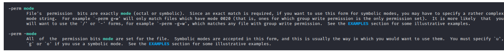

```
find / -perm -o x -type d 2>/dev/null
```

- 查找世界可执行文件夹

查找开发工具和支持的语言：

- `find / -name perl*`
- `find / -name python*`
- `find / -name gcc*`