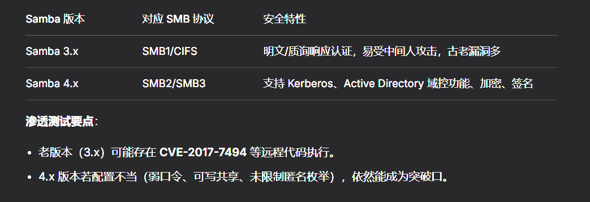
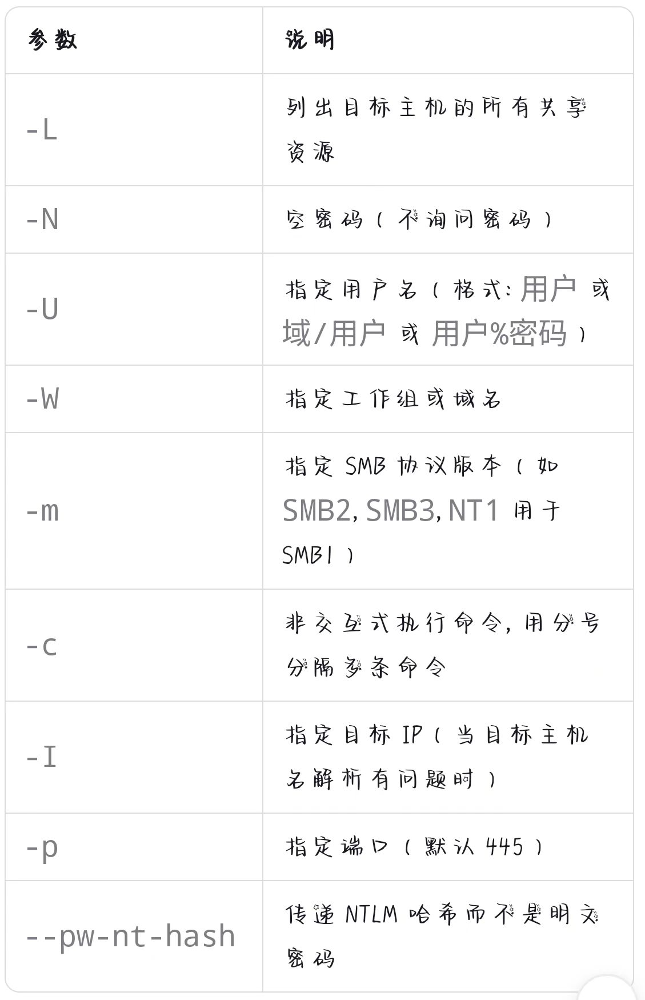
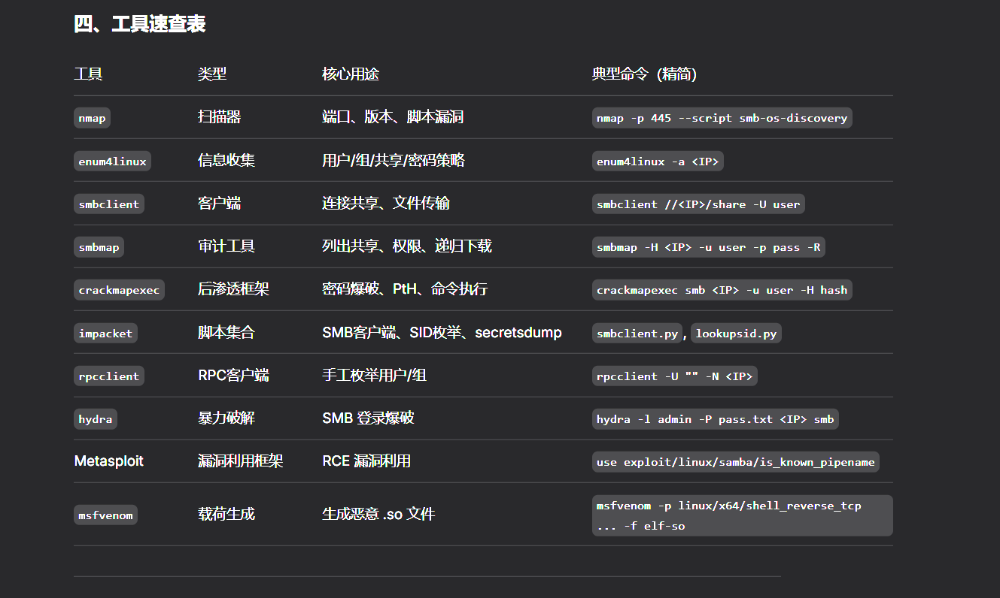
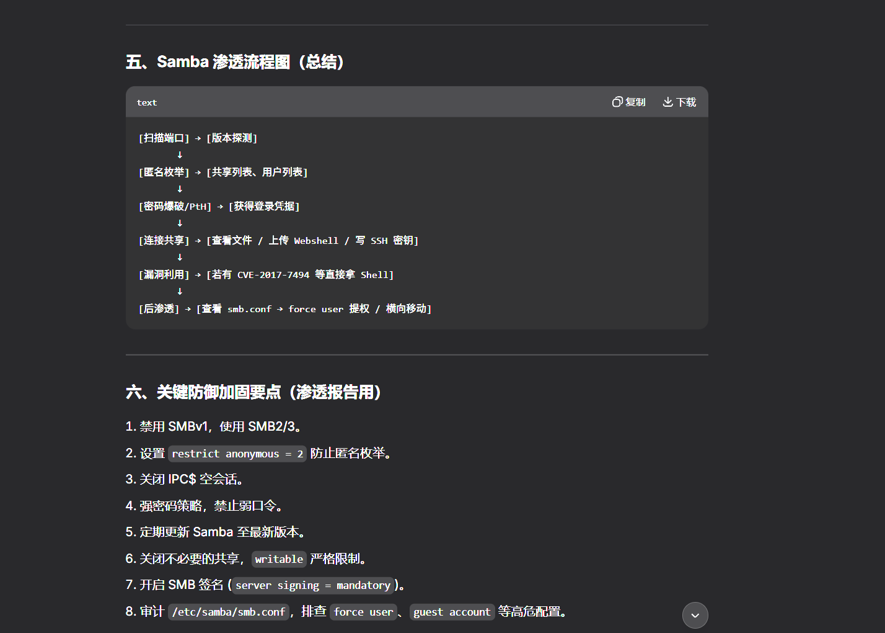

[TOC]

## Samba协议

- Samba是SMB协议的开源实现，运行在Linux/Unix上。SMB（Server Message Block）是Windows文件共享的核心协议
- 默认使用端口445/tcp（以及旧的139/tcp NetBIOS）



- 配置文件：/etc/samba/smb.conf
- 下面给出的命令均是常用命令，具体参数在help界面找

### smbmap

图形化列出共享以及权限

- 可以在解决samba协议时先用来枚举smb共享以及文件列表

```
smbmap -H <目标IP> (-u anonymous -p '')
```

- -u:用户
- -p:密码

这两个参数也可以不写（anonymous是匿名用户，ftp也可以用这种用户）

### enum4linux

- **一站式全枚举**：用户、组、共享、OS、密码策略

  ```
  enum4linux -a <目标IP>
  ```

  - 可以在smbmap后使用，其实二者作用相似，后者的信息收集能力更强，利于详细查看

### smbclient

- 列出目标主机上的所有共享

- 以交互式shell方式连接指定共享

- 可以执行ls,cd,get,put,mkdir,rm,rename等操作

- 支持空会话（也就是匿名，anonymous）登录

- 支持明文密码，NTLM哈希认证

- 可指定SMB协议版本（如SMB1/2/3）

- 非交互式执行命令，方便脚本化

  ```
  smbclient //<目标IP> 
  ```

  

  - 什么参数也没有的话，就是以anonymous登录

## 总结



